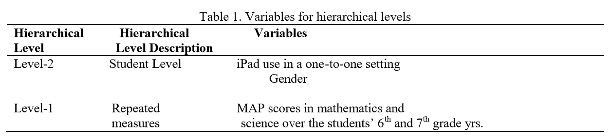

# Example Articles

## Cross-sectional: clustered or hierarchical

### Observed, cross-classified Clusters


```{block type='rmdlink', echo=TRUE}
**Disentangling the Relative Influence of Schools and Neighborhoods on Adolescents’ Risk for Depressive Symptoms**

- [Public link](https://www.ncbi.nlm.nih.gov/pmc/articles/PMC4358201/)
- [USU-full text](https://ajph.aphapublications.org/doi/full/10.2105/AJPH.2014.302374)

```

Dunn, E. C., Milliren, C. E., Evans, C. R., Subramanian, S. V., & Richmond, T. K. (2015). Disentangling the relative influence of schools and neighborhoods on adolescents’ risk for depressive symptoms. American journal of public health, 105(4), 732-740.

> "Our data came from wave 1 of the National Longitudinal Study of Adolescent Health (Add Health), one of the few nationally representative longitudinal surveys of US adolescents that examines health and health-related behaviors and includes information about both school and neighborhood environments."

+----------------+-----------------------------------------------------------------------------------------------------------------------------------------------------------+
| Concept        | Article Details                                                                                                                                           |
+:===============+:==========================================================================================================================================================+
| **Terms**      | cross-classified multilevel modeling (CCMM)                                                                                                              |
+----------------+-----------------------------------------------------------------------------------------------------------------------------------------------------------+
| **Samples**    | -   Level 2a: schools (*n* = 128)  |
|                | -   Level 2b: neighborhoos (*n* = 2,118)                                                                                                                |
|                | -   Level 1: students (*n* = 16,172)                                                                                                                        |+----------------+-----------------------------------------------------------------------------------------------------------------------------------------------------------+
| **Missing**    | excluded: not nationally representative and schools that did not provide demographic data had been eliminated (n = 660)                                  |
|                |           adolescents who were missing data on the outcome measure (n = 38) or predictors and covariates (n = 1404)                                      |
|                |           We restricted our analysis to adolescents who were White, Black, or Hispanic (others too sparce)                                               |
+----------------+-----------------------------------------------------------------------------------------------------------------------------------------------------------+
| **Centering**  | none noted                                                                                                                                                |
+----------------+-----------------------------------------------------------------------------------------------------------------------------------------------------------+
| **Components** | descriptives, MLM, ICC                                                                       |
+----------------+-----------------------------------------------------------------------------------------------------------------------------------------------------------+
| **Results**    | plots of cluster means (by school and by neighborhood), table of parameter estimates |
+----------------+-----------------------------------------------------------------------------------------------------------------------------------------------------------+
| **Software**   | **MLwiN version 2.26**  with Bayesian estimation procedures, implemented via Markov chain Monte Carlo methodology                               |
+----------------+-----------------------------------------------------------------------------------------------------------------------------------------------------------+

* disentangle the effects of schools and neighborhoods on adolescents’ risk for depression
* schools appeared to drive the between-level variance in depressive symptoms more than neighborhoods
* After individual-level (or compositional) characteristics had been taken into account, the school-level random effect was statistically significant and more than 3 times the neighborhood-level random effect
* we found that only student-level factors (i.e., gender, race/ethnicity, age, parental SES) were significantly associated with depressive symptoms


### Non-randomized Intervention

```{block type='rmdlink', echo=TRUE}
**Efficacy Study of Zearn Math in a Large Urban School District**

- [Public link](https://jscholarship.library.jhu.edu/handle/1774.2/62395)
- [USU-full text](https://jscholarship.library.jhu.edu/bitstream/handle/1774.2/62395/Zearn%20Math%20Final%20Report.pdf?sequence=1&isAllowed=y)

```

> Note: The schools chose where to implement the 'treatment' (n = 15) or not (n = 20).

+----------------+-----------------------------------------------------------------------------------------------------------------------------------------------------------+
| Concept        | Article Details                                                                                                                                           |
+:===============+:==========================================================================================================================================================+
| **Terms**      | hierarchical linear modeling (HLM)                                                                                                                        |
+----------------+-----------------------------------------------------------------------------------------------------------------------------------------------------------+
| **Samples**    | -   Level 2: schools (*n* = 35)                                                                                                                           |
|                |                                                                                                                                                           |
|                | -   Level 1: students (*n* = 8718)                                                                                                                        |
+----------------+-----------------------------------------------------------------------------------------------------------------------------------------------------------+
| **Missing**    | none noted                                                                                                                                                |
+----------------+-----------------------------------------------------------------------------------------------------------------------------------------------------------+
| **Centering**  | none noted                                                                                                                                                |
+----------------+-----------------------------------------------------------------------------------------------------------------------------------------------------------+
| **Components** | descriptives, HLM, followup subgroup analysis (seems link only random intercepts)                                                                         |
+----------------+-----------------------------------------------------------------------------------------------------------------------------------------------------------+
| **Results**    | No plots, only tables presenting the main effect (treatment) and excluding covariates and variance components, effect sizes looks like the are Cohen's d? |
+----------------+-----------------------------------------------------------------------------------------------------------------------------------------------------------+
| **Software**   | **Stata**                                                                                                                                                 |
+----------------+-----------------------------------------------------------------------------------------------------------------------------------------------------------+

### Dyadic Design

```{block type='rmdlink', echo=TRUE}
**Parent couples' participation in speech-language therapy for school-age children with autism spectrum disorder in the United States**

-   [Public link](https://journals.sagepub.com/doi/10.1177/1362361319862113)
-   [USU-full text link](https://journals.sagepub.com/doi/pdf/10.1177/1362361319862113?casa_token=0diefubgXBUAAAAA:Fr_CdGdeSdzpo-aCr-zOrSxf59tRZa61TfiFspkjanu6ZsqHammZfVr3UPsgUvx-oe9qA3R5wKAK)
```

+----------------+---------------------------------------------------------------------------------------------------------------------------------+
| Concept        | Article Details                                                                                                                 |
+:===============+:================================================================================================================================+
| **Terms**      | ICC, multilevel models                                                                                                          |
+----------------+---------------------------------------------------------------------------------------------------------------------------------+
| **Samples**    | -   Level 2: child (*n* = 40)                                                                                                   |
|                |                                                                                                                                 |
|                | -   Level 1: parent, mother and father (*n* = 80)                                                                               |
+----------------+---------------------------------------------------------------------------------------------------------------------------------+
| **Missing**    | Only a small proportion of missing data, so composite variables were imputed using the expectation--maximization (EM) algorithm |
+----------------+---------------------------------------------------------------------------------------------------------------------------------+
| **Centering**  | -   Binary variables were entered **uncentered**                                                                                |
|                |                                                                                                                                 |
|                | -   Continuous variables were **grand mean centered**                                                                           |
+----------------+---------------------------------------------------------------------------------------------------------------------------------+
| **Components** | Null for ICC, Random intercepts (no random slopes), residual diagnostics                                                        |
+----------------+---------------------------------------------------------------------------------------------------------------------------------+
| **Results**    | Table with 3 MLM models, discussed moderation                                                                                   |
+----------------+---------------------------------------------------------------------------------------------------------------------------------+
| **Software**   | **HLM** (Version 7.01) using restricted maximum likelihood                                                                      |
+----------------+---------------------------------------------------------------------------------------------------------------------------------+

](https://journals.sagepub.com/na101/home/literatum/publisher/sage/journals/content/auta/2020/auta_24_2/1362361319862113/20200123/images/medium/10.1177_1362361319862113-table6.gif){width="550"}

### Binary Outcome

```{block type='rmdlink', echo=TRUE}
**County-level social factors and schizophrenia: A multilevel study of 1.9 million Chinese adults**

-   [Public link with PDF download](https://www.sciencedirect.com/science/article/pii/S0165178118305316?casa_token=IYd4CsFB7BkAAAAA:w6YBNcdqeqCrLbXiMyC-ut-IbhXud8JwJNWnDS_gHYTpl7UUa13b54R0DY0CbyAO-4cwNXZXgQ)
```

+----------------+------------------------------------------------------------------------------------------------------------------------------------------+
| Concept        | Article Details                                                                                                                          |
+:===============+:=========================================================================================================================================+
| **Terms**      | multilevel logistic regression                                                                                                           |
+----------------+------------------------------------------------------------------------------------------------------------------------------------------+
| **Samples**    | -   Level 2: county (*n* = 734)                                                                                                          |
|                |                                                                                                                                          |
|                | -   Level 1: person (*n* = 1,909,205)                                                                                                    |
|                |                                                                                                                                          |
|                |     *Note: further nesting in 771,797 households, 2980 towns (streets) and 5964 communities (villages) from 31 province was not modeled* |
+----------------+------------------------------------------------------------------------------------------------------------------------------------------+
| **Missing**    | *-not mentioned-*                                                                                                                        |
+----------------+------------------------------------------------------------------------------------------------------------------------------------------+
| **Centering**  | *-not mentioned-*                                                                                                                        |
+----------------+------------------------------------------------------------------------------------------------------------------------------------------+
| **Components** | ICC, adjusted odds ratios from GzLMM, subgroup analysis by gender                                                                        |
+----------------+------------------------------------------------------------------------------------------------------------------------------------------+
| **Results**    | Tables of un-adjusted and adjusted odds ratios                                                                                           |
+----------------+------------------------------------------------------------------------------------------------------------------------------------------+
| **Software**   | **Stata** version 13.0 for Windows                                                                                                       |
+----------------+------------------------------------------------------------------------------------------------------------------------------------------+

{width="588"}

## Repeated Measures: longitudinal (change over time) or conditional (no time component)

### Repeated Measures - linear growth

```{block type='rmdlink', echo=TRUE}
**One-to-one iPad echnology in the Middle School Mathematics and Science Classrooms**

-   [Public link with PDF download](https://www.learntechlib.org/p/207269/)
```

+----------------+-------------------------------------------------------------------------------------------------------------------------------------------------+
| Concept        | Article Details                                                                                                                                 |
+:===============+:================================================================================================================================================+
| **Terms**      | hierarchical linear modeling (HLM)                                                                                                              |
+----------------+-------------------------------------------------------------------------------------------------------------------------------------------------+
| **Samples**    | -   Level 2: students (*n* = 112)                                                                                                               |
|                |                                                                                                                                                 |
|                | -   Level 1: up to 6 observations across 2 years (*n* = 8718)                                                                                   |
|                |                                                                                                                                                 |
|                |     *Note: further nesting among 10 teachers in 3 schools was not modeled*                                                                      |
+----------------+-------------------------------------------------------------------------------------------------------------------------------------------------+
| **Time**       | **Unclear**, but assume time is treated as 6 equally spaced intervals                                                                           |
|                |                                                                                                                                                 |
|                | *(t = numeric: 0, 1, 2, 3, 4, 5)*                                                                                                               |
+----------------+-------------------------------------------------------------------------------------------------------------------------------------------------+
| **Missing**    | Students were not eliminated if they did not have six scores since HLM allows for missing data at the first level (i.e. complete case analysis) |
+----------------+-------------------------------------------------------------------------------------------------------------------------------------------------+
| **Centering**  | grand mean centering for the MAP test scores                                                                                                    |
+----------------+-------------------------------------------------------------------------------------------------------------------------------------------------+
| **Components** | Single-level OLS, Null model HLM, RIAS (random slope for time), add covars                                                                      |
+----------------+-------------------------------------------------------------------------------------------------------------------------------------------------+
| **Results**    | Table showing design, nested equations, several 'final' model tables of results                                                                 |
+----------------+-------------------------------------------------------------------------------------------------------------------------------------------------+
| **Software**   | SPSS                                                                                                                                            |
+----------------+-------------------------------------------------------------------------------------------------------------------------------------------------+

{width="566"}

{width="552"}

### Cohort sequential or accelerated longitudinal design

```{block type='rmdlink', echo=TRUE}
**Examining the Links Between Received Network Support and Marital Quality Among Mothers of Children with ASD: A Longitudinal Mediation Analysis**

-   [Public link](https://link.springer.com/article/10.1007/s10803-019-04330-4)
-   [USU-full text link](https://link.springer.com/article/10.1007/s10803-019-04330-4)
-   [PDF download](https://link.springer.com/content/pdf/10.1007/s10803-019-04330-4.pdf)
```

+----------------+------------------------------------------------------------------------------------------------------------------------------------------------------------------------------------------------------------------------------------------------------------------------------------------------------------------------------------------------------------------------------------------------------------------------------------------------------------------------------------------------------------------------------------------------------------------------------------------------------------------------------+
| Concept        | Article Details                                                                                                                                                                                                                                                                                                                                                                                                                                                                                                                                                                                                              |
+:===============+:=============================================================================================================================================================================================================================================================================================================================================================================================================================================================================================================================================================================================================================+
| **Terms**      | multilevel modeling (MLM), conditional growth model, longitudinal multiple mediation models                                                                                                                                                                                                                                                                                                                                                                                                                                                                                                                                  |
+----------------+------------------------------------------------------------------------------------------------------------------------------------------------------------------------------------------------------------------------------------------------------------------------------------------------------------------------------------------------------------------------------------------------------------------------------------------------------------------------------------------------------------------------------------------------------------------------------------------------------------------------------+
| **Samples**    | -   Level 2 = mother/child (n = 96)                                                                                                                                                                                                                                                                                                                                                                                                                                                                                                                                                                                          |
|                |                                                                                                                                                                                                                                                                                                                                                                                                                                                                                                                                                                                                                              |
|                | -   Level 1 = time point/age (n = 3 x 96 ? )                                                                                                                                                                                                                                                                                                                                                                                                                                                                                                                                                                                 |
+----------------+------------------------------------------------------------------------------------------------------------------------------------------------------------------------------------------------------------------------------------------------------------------------------------------------------------------------------------------------------------------------------------------------------------------------------------------------------------------------------------------------------------------------------------------------------------------------------------------------------------------------------+
| **Time**       | **Unclear**, assume time is measured in years at study years 5, 7, and 9                                                                                                                                                                                                                                                                                                                                                                                                                                                                                                                                                     |
|                |                                                                                                                                                                                                                                                                                                                                                                                                                                                                                                                                                                                                                              |
|                | *(t = numeric age at each observation)*                                                                                                                                                                                                                                                                                                                                                                                                                                                                                                                                                                                      |
+----------------+------------------------------------------------------------------------------------------------------------------------------------------------------------------------------------------------------------------------------------------------------------------------------------------------------------------------------------------------------------------------------------------------------------------------------------------------------------------------------------------------------------------------------------------------------------------------------------------------------------------------------+
| **Missing**    | Assumed data was missing at random, so complete-case analysis                                                                                                                                                                                                                                                                                                                                                                                                                                                                                                                                                                |
+----------------+------------------------------------------------------------------------------------------------------------------------------------------------------------------------------------------------------------------------------------------------------------------------------------------------------------------------------------------------------------------------------------------------------------------------------------------------------------------------------------------------------------------------------------------------------------------------------------------------------------------------------+
| **Centering**  | Time-varying predictors and mediators were **disaggregated** into their constituent within and between-person effects. To assess within-person effects, Level 1 predictors were created by **person-mean centering** each predictor or mediator (i.e., subtracting each mother's cross-time mean score on a predictor from her actual score on that measure). Level 2 predictors were created by first computing a cross-time **mean** score on a predictor for each mother and then **grand-mean centering** that score. Finally, baseline child problem behavior severity was **grand-mean centered** with a mean of zero. |
+----------------+------------------------------------------------------------------------------------------------------------------------------------------------------------------------------------------------------------------------------------------------------------------------------------------------------------------------------------------------------------------------------------------------------------------------------------------------------------------------------------------------------------------------------------------------------------------------------------------------------------------------------+
| **Components** | Bivariate correlation matrix at baseline, Null for ICC, add fixed effects, mediation                                                                                                                                                                                                                                                                                                                                                                                                                                                                                                                                         |
+----------------+------------------------------------------------------------------------------------------------------------------------------------------------------------------------------------------------------------------------------------------------------------------------------------------------------------------------------------------------------------------------------------------------------------------------------------------------------------------------------------------------------------------------------------------------------------------------------------------------------------------------------+
| **Results**    | MLM only reported in text. All tables and figures apply to the mediation                                                                                                                                                                                                                                                                                                                                                                                                                                                                                                                                                     |
+----------------+------------------------------------------------------------------------------------------------------------------------------------------------------------------------------------------------------------------------------------------------------------------------------------------------------------------------------------------------------------------------------------------------------------------------------------------------------------------------------------------------------------------------------------------------------------------------------------------------------------------------------+
| **Software**   | **SPSS** 25.0 with *MLmed*, a macro which tests for mediation and moderated mediation in multilevel data, Restricted maximum likelihood, 95% confidence intervals (CIs) based on Monte Carlo bootstrapping estimates                                                                                                                                                                                                                                                                                                                                                                                                         |
+----------------+------------------------------------------------------------------------------------------------------------------------------------------------------------------------------------------------------------------------------------------------------------------------------------------------------------------------------------------------------------------------------------------------------------------------------------------------------------------------------------------------------------------------------------------------------------------------------------------------------------------------------+

### SEM Framework

```{block type='rmdlink', echo=TRUE}
**Disability multilevel modelling in first episodes of psychosis at 3-year follow-up**

-   [Public link with PDF download](https://www.sciencedirect.com/science/article/pii/S0920996416305886?casa_token=3gH6YZPVq50AAAAA:3i9OBbBbY5TQGX0z5UnGo6j6WXA1_4w2hlsGIQI_VDJOskJQxkvswlHgL59inQrl_qqp-NbmaQ)
```

+----------------+-------------------------------------------------------------------------------------------------------------------------------------------------------------------------------------------------------------------------------------------------+
| Concept        | Article Details                                                                                                                                                                                                                                 |
+:===============+:================================================================================================================================================================================================================================================+
| **Terms**      | multilevel modeling statistical approach to repeated measures data, growth model                                                                                                                                                                |
+----------------+-------------------------------------------------------------------------------------------------------------------------------------------------------------------------------------------------------------------------------------------------+
| **Samples**    | -   Level 2: participants (*n* = 449)                                                                                                                                                                                                           |
|                |                                                                                                                                                                                                                                                 |
|                | -   Level 1: observations = baseline, 1 year, and 3 years later (*n* = 3 x 449 = 1347)                                                                                                                                                          |
+----------------+-------------------------------------------------------------------------------------------------------------------------------------------------------------------------------------------------------------------------------------------------+
| **Time**       | **Very unclear**, but it does include "linear time" in the results                                                                                                                                                                              |
+----------------+-------------------------------------------------------------------------------------------------------------------------------------------------------------------------------------------------------------------------------------------------+
| **Missing**    | Only patients providing data for all the study variables during follow-up, and those who were assessed from the beginning of the study to the 1-year and 3-year follow-up were finally analyzed.                                                |
+----------------+-------------------------------------------------------------------------------------------------------------------------------------------------------------------------------------------------------------------------------------------------+
| **Centering**  | *-not mentioned-*                                                                                                                                                                                                                               |
+----------------+-------------------------------------------------------------------------------------------------------------------------------------------------------------------------------------------------------------------------------------------------+
| **Components** | group comparisons with Cohen's d effect sizes, and decrease in Bayesian Information Criterion adjusted to sample size (SABIC) used to assess significance when comparing models, RIAS: Random intercepts and slope of time, assumption checking |
+----------------+-------------------------------------------------------------------------------------------------------------------------------------------------------------------------------------------------------------------------------------------------+
| **Results**    | Table comparing nested models                                                                                                                                                                                                                   |
+----------------+-------------------------------------------------------------------------------------------------------------------------------------------------------------------------------------------------------------------------------------------------+
| **Software**   | **Mplus 6.11**                                                                                                                                                                                                                                  |
+----------------+-------------------------------------------------------------------------------------------------------------------------------------------------------------------------------------------------------------------------------------------------+


## Both: Hierarchical longitudinal

+---------------------+---------------------------------------------------+
| Concept             | Article Details                                   |
+:====================+:==================================================+
| **Terms**           |                                                   |
+---------------------+---------------------------------------------------+
| **Samples**         | -   Level 2: child (*n* = 40)                     |
|                     |                                                   |
|                     | -   Level 1: parent, mother and father (*n* = 80) |
+---------------------+---------------------------------------------------+
| **Missing**         |                                                   |
+---------------------+---------------------------------------------------+
| **Centering**       |                                                   |
+---------------------+---------------------------------------------------+
| **Components**      |                                                   |
+---------------------+---------------------------------------------------+
| **Results**         |                                                   |
+---------------------+---------------------------------------------------+
| **Software**        |                                                   |
+---------------------+---------------------------------------------------+
