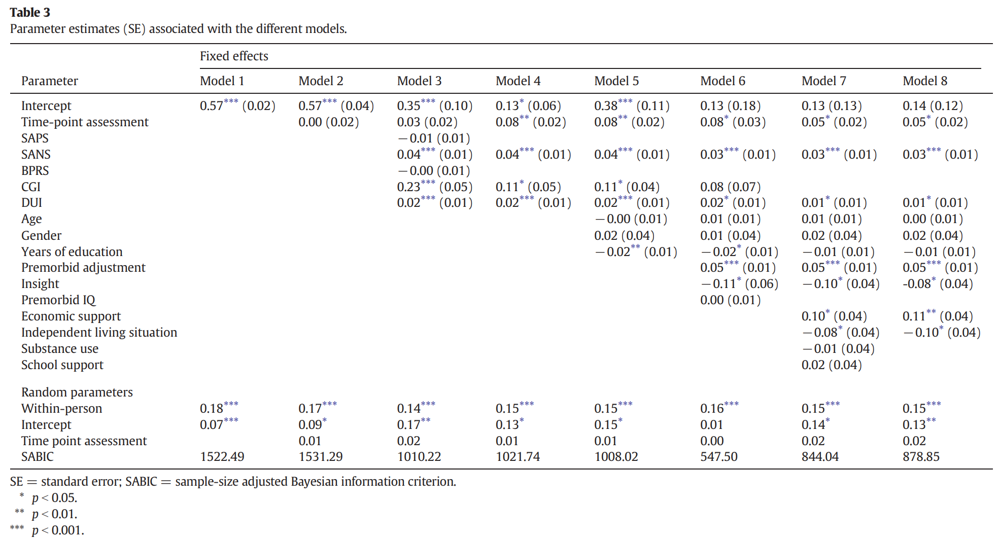

--- 
title: "Encyclopedia of Quantitative Methods in R, vol. 5: Multilevel Models"
author: "Sarah Schwartz & Tyson Barrett"
date: "Last updated: `r Sys.Date()`"
documentclass: book
description: "RM Regression: ICCs, MLM/HLM, and GEEs."
knit: "bookdown::render_book"
cover-image: "EQM_v1_cover.png"
github-repo: cehs-research/eBook_wrangle
site: bookdown::bookdown_site
bibliography: [book.bib, packages.bib]
biblio-style: "apalike"
link-citations: yes
---


# Welcome {-}

Backgroup and links to other volumes of this encyclopedia may be found at the [Encyclopedia's Home Website](https://cehs-research.github.io/eBooks/).


```{r, echo=FALSE, include=FALSE, comment=FALSE, message=FALSE}
library(tidyverse, quietly = TRUE)
library(kableExtra)
```


## Blocked Notes {-}

Thoughout all the eBooks in this encyclopedia, several small secitons will be blocked out in the following ways:

```{block type='rmdconstruct', echo=TRUE}
These blocks denote an area **UNDER CONSTRUCTION**, so check back often.  This massive undertaking started during the summer of 2018 and is far from complete.  The outline of seven volumes is given above despite any one being complete.  Feedback is welcome via either author's email.
```


```{block type='rmdimportant', echo=TRUE}
These blocks denote something **EXTREMELY IMPORTANT**.  Do NOT skip these notes as they will be used very sparingly.
```


```{block type='rmddownload', echo=TRUE}
These blocks denote something to **DOWNLOAD**.  This may include software installations, example datasets, or notebook code files.
```


```{block type='rmdlightbulb', echo=TRUE}
These blocks denote something **INTERESTING**.  These point out information we found of interest or added value.
```


```{block type='rmdlink', echo=TRUE}
These blocks denote **LINKS** to other websites.  This may include instructional video clips, articles, or blog posts.  We are all about NOT re-creating the wheel.  If somebody else has described or illustrated a topic well, we celebrate it!
```


## Code and Output {-}

This is how $R$ code is shown:

```{r, eval=FALSE}
1 + 1
```

This is what the output of the $R$ code above will look:

```{r, echo=FALSE}
# This is a Code Chunk
1 + 1
```


## The Authors {-}


```{r, echo=FALSE}
tribble( ~Sarah, ~Tyson,
      "{width=300px}",
      "{width=300px}",
      "[www.SarahSchwartzStats.com](http://www.sarahschwartzstats.com/) ",
      "[www.TysonBarrett.com](http://tysonbarrett.com/)",
      "Sarah.Schwartz@usu.edu",
      "Tyson.Barrett@usu.edu",
      "[Statistical Consulting Studio](https://cehs.usu.edu/research/statstudio/index)",
      "[Data Science and Discover Unit](https://cehs.usu.edu/research/dsdu/index)",
      "{width=300px}",
      "{width=300px}") %>% 
  data.frame() %>%
  kableExtra::kable(col.names = c("Dr. Sarah Schwartz", 
                                  "Dr. Tyson Barrett"),
                    align = "c") %>% 
  kableExtra::row_spec(row = 0,
                       font_size = 20)
```


### Why choose R ?  {-}


```{block type='rmdlink', echo=TRUE}
**Check it out:** an article from Fall 2016... [No more excuses: R is better than SPSS for psychology undergrads, and students agree](https://datahowler.wordpress.com/2016/09/10/no-more-excuses-r-is-better-than-spss-for-psychology-undergrads-and-students-agree/)
```


### FYI  {-}

This entire encyclopedia is written in $R Markdown$, using $R Studio$ as the text editor and the `bookdown` package to turn a collection of markdown documents into a coherent whole. The book's source code is hosted on GitHub. If you notice typos or other issues, feel free to email either of the authors.

This work is licensed under the [Attribution-NonCommercial-NoDerivatives 4.0 International](https://creativecommons.org/licenses/by-nc-nd/4.0/legalcode) License. 


{width=300px}

<!--chapter:end:index.Rmd-->

# Learning Resources

##  Introduction


```{block type='rmdlink', echo=TRUE}
"Multilevel Modeling for Psychologists" (chapter 11) by John B. Nezlek  

* [Full PDF online](https://jbnezl.people.wm.edu/Reprints/2012-APA-Handbook-MLM.pdf)
```

<!--chapter:end:02-resources.Rmd-->

# Formula Warehouse


```{block type='rmdconstruct', echo=TRUE}
This is the home for notation and formulas used thorugh this eBook.  Most important equations will be located here.
```

## Data Notation

Sample Sizes:

* $n_j$ = number of pupils in class $j$
* $N$   = number of classes


Indicators:

* $i \in (1, 2, \dots, n_j)$  = index for pupil number 
* $j \in (1, 2, \dots, N)$  = index for class number


| Level |     Type of Variable    |  Symbol  |  pupil $i$ in class $j$ |  
|-------|-------------------------|----------|------------|
|   1   | Outcome (Dependent)     |  $Y$     | $Y_{ij}$   |
|   1   | Predictor (Independent) |  $X_1$   | $X_{1ij}$  |
|   1   | Predictor (Independent) |  $X_2$   | $X_{2ij}$  |
|   2   | Predictor (Independent) |  $Z$     | $Z_j$      |  
    
    


## Single-level Regression Analysis

### The Only Equation

Since we are don't have or are ignoring clustering, there is only one level.

```{block type='genericEq', echo=TRUE}
**Single-Level Regression Equation** 
$$
\overbrace{Y_{ij}}^{Outcome} = 
         \underbrace{\beta_{0}}_{\text{Fixed}\atop\text{intercept}}  + 
         \underbrace{\beta_{1}}_{\text{Fixed}\atop\text{slope } X_1} \overbrace{X_{1ij}}^{\text{Predictor 1}}  + 
         \underbrace{\beta_{2}}_{\text{Fixed}\atop\text{slope } X_2} \overbrace{X_{2ij}}^{\text{Predictor 2}} + 
         \underbrace{e_{ij}}_{\text{Random}\atop\text{residuals}} 
\tag{Hox 2.1}
$$

```

### Parameters

|  Type  | Parameter of Interest           | Estimates This |
|--------|:--------------------------------|----------------|
| Fixed  | Intercept                       | $\beta_{0}$    |
| Fixed  | Slope or main effect of $X_1$   | $\beta_{1}$    |
| Fixed  | Slope or main effect of $X_2$   | $\beta_{2}$    |
| Random | Residual Variance $var[e_{ij}]$ | $\sigma^2_{e}$ |


### Assumptions to Check

* The $e_{ij}$'s follow a normal distribution with a mean of $0$
* The $e_{ij}$'s have a constant variance *(homoscedasticity)* 
    
    


## Multi-level Regression Analysis

 
Continue taking into account fixed slopes for two Level 1 variables, $X_1$ and $X_2$.


### Level 1 Regression Equation*

$$
\overbrace{Y_{ij}}^{\text{Level 1}\atop\text{Outcome}} = 
         \underbrace{\beta_{0j}}_{\text{Level 2}\atop\text{intercepts}}  + 
         \underbrace{\beta_{1j}}_{\text{Level 2}\atop\text{slopes}} 
         \overbrace{X_{1ij}}^{\text{Level 1}\atop\text{Predictor 1}}  + 
         \underbrace{\beta_{2j}}_{\text{Level 2}\atop\text{slopes}} 
         \overbrace{X_{2ij}}^{\text{Level 1}\atop\text{Predictor 2}}  + 
         \underbrace{e_{ij}}_{\text{Random}\atop\text{residuals}} 
\tag{Hox 2.1}
$$


Now we take clustering into account and include random intercepts ($\beta_{0j}$) and slopes ($\beta_{1j}, \beta_{2j}$), as well as including a single Level 2 variable, $Z$ that interacts with both Level 1 variables.


### Level 2 Regression Equations

#### Random Intercepts:

$$
\overbrace{\beta_{0j}}^{\text{Level 2}\atop\text{intercepts}} = 
     \underbrace{\gamma_{00}}_{\text{Fixed}\atop\text{intercept}}  + 
     \underbrace{\gamma_{01}}_{\text{Fixed}\atop\text{slope } Z}
     \overbrace{Z_{j}}^{\text{Level 2}\atop\text{Predictor 3}}  + 
     \underbrace{u_{0j}}_{\text{Intercept}\atop\text{residual}} 
\tag{Hox 2.3}
$$


#### Random Slopes

* For the first predictor, $X_1$:

$$
\overbrace{\beta_{1j}}^{\text{Level 2}\atop\text{slopes}} = 
     \underbrace{\gamma_{10}}_{\text{Fixed}\atop\text{Slope  } X_1}  + 
     \underbrace{\gamma_{11}}_{\text{Fixed}\atop X_1 \times Z} 
     \overbrace{Z_{j}}^{\text{Level 2}\atop\text{Predictor 3}} + 
     \underbrace{u_{1j}}_{\text{Slope } X_1\atop\text{residual}} 
\tag{Hox 2.4a}
$$


* For the second predictor, $X_2$:

$$
\overbrace{\beta_{2j}}^{\text{Level 2}\atop\text{slopes}} = 
     \underbrace{\gamma_{20}}_{\text{Fixed}\atop\text{Slope  } X_2}  + 
     \underbrace{\gamma_{21}}_{\text{Fixed}\atop X_2 \times Z} 
     \overbrace{Z_{j}}^{\text{Level 2}\atop\text{Predictor 3}} + 
     \underbrace{u_{2j}}_{\text{Slope } X_2\atop\text{residual}} 
\tag{Hox 2.4a}
$$


#### Merging the Equations

Starting with Level 1 equation (2.1) and allow the $\beta$'s to be varry for each class and plug in the level 2 equations (2.3 and 2.4) into the level 1 equation (2.1) to make the combined equation.
$$
Y_{ij} = \overbrace{(\gamma_{00} + \gamma_{01} Z_{j} + u_{0j})}^{\beta_{0j}} + 
         \overbrace{(\gamma_{10} + \gamma_{11} Z_{j} + u_{1j})}^{\beta_{1j}} X_{1ij} + 
         \overbrace{(\gamma_{20} + \gamma_{21} Z_{j} + u_{2j})}^{\beta_{2j}} X_{2ij} + e_{ij} 
$$


Use the distributive property of multiplication to get rid of the parentheses.
$$
Y_{ij} = \overbrace{\gamma_{00}         + \gamma_{01} Z_{j}         + u_{0j}}^{\beta_{0j}} + 
         \overbrace{\gamma_{10} X_{1ij} + \gamma_{11} Z_{j} X_{1ij} + u_{1j} X_{1ij}}^{\beta_{1j} \times X_{1ij}}  +
         \overbrace{\gamma_{20} X_{2ij} + \gamma_{21} Z_{j} X_{2ij} + u_{2j} X_{2ij}}^{\beta_{2j} \times X_{2ij}}  +
         e_{ij} 
$$


### Combinded, Multilevel Regression Equation

Collect 'like-terms' (i.e. get the $\gamma$'s together and the $u$'s together)

```{block type='genericEq', echo=TRUE}
**Combinded, Multilevel Regression Equation - Generic** 

$$
Y_{ij} = \overbrace{\gamma_{00} + 
                      \gamma_{10} X_{1ij} + 
                      \gamma_{20} X_{2ij} + 
                      \gamma_{01} Z_{j} + 
                      \gamma_{11} Z_{j} X_{1ij} +  
                      \gamma_{21} Z_{j} X_{2ij}}^{\text{Fixed part}\atop\text{Deterministic}} + \\
         \underbrace{u_{0j} + u_{1j} X_{1ij} + u_{2j} X_{2ij} + e_{ij} }_{\text{Random part}\atop\text{Stochastic}}
 \tag{Hox 2.5}
$$

```


### Parameters

|  Type  | Parameter of Interest                       | Estimates This |
|--------|:--------------------------------------------|----------------|
| Fixed  | Intercept                                   | $\gamma_{00}$  |
| Fixed  | Main Effect of $X_1$                        | $\gamma_{10}$  |
| Fixed  | Main Effect of $X_2$                        | $\gamma_{20}$  |
| Fixed  | Main Effect of $Z$                          | $\gamma_{01}$  |
| Fixed  | Cross-Level interaction between $X_1$ and $Z$    | $\gamma_{11}$  |
| Fixed  | Cross-Level interaction between $X_2$ and $Z$    | $\gamma_{21}$  |
| Random | Variance in random intercepts, $var[u_{0j}]$     | $\sigma^2_{u0}$ | 
| Random | Variance in random slope of $X_1$, $var[u_{1j}]$ | $\sigma^2_{u1}$ | 
| Random | Variance in random slope of $X_2$, $var[u_{2j}]$ | $\sigma^2_{u2}$ | 
| Random | Covariance between random intercepts and random slope of $X_1$, $cov[u_{0j}, u_{1j}]$ | $\sigma^2_{u01}$ |
| Random | Covariance between random intercepts and random slope of $X_2$, $cov[u_{0j}, u_{2j}]$ | $\sigma^2_{u02}$ |
| Random | Covariance between random slopes of $X_1$ and $X_2$,  $cov[u_{1j}, u_{2j}]$           | $\sigma^2_{u12}$ | 
| Random | Residual Variance $var[e_{ij}]$                 | $\sigma^2_{e}$ |    


```{block type='rmdimportant', echo=TRUE}
The $u_{1j}$ and $u_{2j}$ terms allow for **heteroscedasticity** by fitting different error terms for different values of $X_1$ and $X_2$.  The HOV assumption is that AFTER accounting for this, the remaining residuals are HOV.
```


## Intraclass Correlation (ICC)

### Two Level Models

```{block type='genericEq', echo=TRUE}
**Combined, Multilevel Model Equation - Null Model, 2 levels**
$$ 
\overbrace{Y_{ij}}^{Outcome} = 
    \underbrace{\gamma_{00}}_{\text{Fixed}\atop\text{intercept}} + 
    \underbrace{u_{0j}}_{\text{Random}\atop\text{intercepts}} + 
    \underbrace{e_{ij}}_{\text{Random}\atop\text{residuals}}
\tag{Hox 2.8}
$$
```


Although the Null model above does not explain any variance in the dependent variable, since there are no independent variables, it does decompose (i.e. divide up) the variance into two pieces.  We can compute the amount of total variance in the outcome that is attribute to the clustering of Level 1 untis *(micro-units)* into clusters of Level 2 units *(macro-units)* verses the total variance.


```{block type='genericEq', echo=TRUE}
**Intraclass Correlation (ICC) Formula, 2 level model**
$$
\overbrace{\rho}^{\text{ICC}} = 
\frac{\overbrace{\sigma^2_{u0}}^{\text{Random Intercept}\atop\text{Variance}}}
     {\underbrace{\sigma^2_{u0}+\sigma^2_{e}}_{\text{Total}\atop\text{Variance}}}
\tag{Hox 2.9}
$$
```


### Three Level Models


Indicators:

* $i$  = index for units in the lowest level (Level 1) 
* $j$  = index for units in the middle level (Level 2) 
* $k$  = index for units in the highest level (Level 3) 


```{block type='genericEq', echo=TRUE}
**Combined, Multilevel Model Equation - Null Model, 3 levels**
$$ 
\overbrace{Y_{ijk}}^{Outcome} = 
    \underbrace{\gamma_{000}}_{\text{Fixed}\atop\text{intercept}} + 
    \underbrace{v_{0k }}_{\text{Random Intercepts}\atop\text{Level 3}} + 
    \underbrace{u_{0jk}}_{\text{Random Intercepts}\atop\text{Level 2}} + 
    \underbrace{e_{ijk}}_{\text{Random}\atop\text{residuals}}
\tag{Hox 2.15}
$$
```

If you are interested in teh decomposition of variance across all levels, use the Davis and Scott method:

```{block type='genericEq', echo=TRUE}
**Intraclass Correlation (ICC) Formula, 3 level model - Davis and Scott Method**
$$
\overbrace{\rho_{mid}}^{\text{ICC}\atop\text{at level 2}} = 
\frac{\overbrace{\sigma^2_{u0}}^{\text{Random Intercept}\atop\text{Variance Level 2}}}
     {\underbrace{\sigma^2_{v0}+\sigma^2_{u0}+\sigma^2_{e}}_{\text{Total}\atop\text{Variance}}}
\tag{Hox 2.16}
$$
$$
\overbrace{\rho_{top}}^{\text{ICC}\atop\text{ at level 3}} = 
\frac{\overbrace{\sigma^2_{u0}}^{\text{Random Intercept}\atop\text{Variance Level 3}}}
     {\underbrace{\sigma^2_{v0}+\sigma^2_{u0}+\sigma^2_{e}}_{\text{Total}\atop\text{Variance}}}
\tag{Hox 2.17}
$$
```


If you would like to estimate the expected (population) correlation between two randomly chosen elements of the same group:

```{block type='genericEq', echo=TRUE}
**Intraclass Correlation (ICC) Formula, 3 level model - Siddiqui Method **
$$
\overbrace{\rho_{mid}}^{\text{ICC}\atop\text{at level 2}} = 
\frac{\overbrace{\sigma^2_{v0}+\sigma^2_{u0}}^{\text{Random variance}\atop\text{at levels 2 & 3}}}
     {\underbrace{\sigma^2_{v0}+\sigma^2_{u0}+\sigma^2_{e}}_{\text{Total}\atop\text{Variance}}}
\tag{Hox 2.18}
$$
$$
\overbrace{\rho_{top}}^{\text{ICC}\atop\text{ at level 3}} = 
\frac{\overbrace{\sigma^2_{u0}}^{\text{Random variance}\atop\text{at only level 3}}}
     {\underbrace{\sigma^2_{v0}+\sigma^2_{u0}+\sigma^2_{e}}_{\text{Total}\atop\text{Variance}}}
\tag{Hox 2.19}
$$
```


## Proporion of Variance Explianed

**See pages 61-63 of @hox2017**

http://journals.sagepub.com/doi/10.1177/1094428114541701 


Analogous to multiple $R^2$ - done seperately by level

* $BL$ = Baseline model (Null)
* $MC$ = Model to Compare to 

### Level 1 Variance Explained 

**MODELS SHOULD NOT INCLUDE ANY RANOM EFFECTS**, OTHER THAN RANDOM INTERCEPTS. 

Different approaches differ in values and meaning.

#### Snijders and Bosker

* Explained variance is a proportion of the total variance, because in principle first-level variables can explain all variation, including the variation at the second level.
* Correction removes the spurious increase in $R^2$ when random slopes are added to a model

```{block type='genericEq', echo=TRUE}
**Snijders and Bosker Formula - Level 1 ** 

Random Intercepts Models Only, *address potential negative $R^2$ issue*
$$
R^2_1 = 1 - \frac{\sigma^2_{e-MC} + \sigma^2_{u0-MC}}
                 {\sigma^2_{e-BL} + \sigma^2_{u0-BL}}
$$
```


#### Raudenbush and Bryk

* Explained variance is a proportion of first-level variance only
* A good option when the multilevel sampling process is is close to two-stage simple random sampling

```{block type='genericEq', echo=TRUE}
**Raudenbush and Bryk Approximate Formula - Level 1 ** *approximate*
$$
approx \;R^2_1 = \frac{\sigma^2_{e-BL} - \sigma^2_{e-MC}}
             {\sigma^2_{e-BL} }
\tag{Hox 4.8}
$$
```


### Level 2 Variance Explined


#### Snijders and Bosker


```{block type='genericEq', echo=TRUE}
**Snijders and Bosker Formula Extended - Level 2 ** 
$$
R^2_2 = 1 - \frac{\frac{\sigma^2_{e-MC}}{B} + \sigma^2_{u0-MC}}
                 {\frac{\sigma^2_{e-BL}}{B} + \sigma^2_{u0-BL}}
$$

$B$ is the average size of the Level 2 units (schools).  Technically, you should use the *harmonic mean*, but unless the clusters differ greatly in size, it doesn't make a huge difference.
```

#### Raudenbush and Bryk

```{block type='genericEq', echo=TRUE}
**Raudenbush and Bryk Approximate Formula - Level 2 ** 
$$
approx \; R^2_s = \frac{\sigma^2_{u0-BL} - \sigma^2_{u0-MC}}
             {\sigma^2_{u0-BL} }
\tag{Hox 4.9}
$$
```


## Using $\LaTeX$ for Equation Typesetting


```{block type='rmdlink', echo=TRUE}
R markdown is a user friendly, simplified language that allows for more complex formating utilizing standard $\LaTeX$ code.  A great resource for learning how to many common tasks in $\LaTeX$ is the [Share\LaTeX website](www.sharelatex.com).  

Specific mathematical equation documentation may be found on the [Mathematical  Expressions](https://www.sharelatex.com/learn/Mathematical_expressions) subpage.

There are also many websites that offer Point-n-click interfaces to build $\LaTeX$ equations, including:
[Host Math](http://www.hostmath.com/), 
[Code Cogs](https://www.codecogs.com/latex/eqneditor.php), 
[LaTeX 4 Technics](https://www.latex4technics.com/), and
[Sci-Weavers](http://www.sciweavers.org/free-online-latex-equation-editor)
```

    
    

<!--chapter:end:03-notation.Rmd-->

# Example Articles

## Cross-sectional: clustered or hierarchical

### Non-randomized Intervention

```{block type='rmdlink', echo=TRUE}
**Efficacy Study of Zearn Math in a Large Urban School District**

- [Public link](https://jscholarship.library.jhu.edu/handle/1774.2/62395)
- [USU-full text](https://jscholarship.library.jhu.edu/bitstream/handle/1774.2/62395/Zearn%20Math%20Final%20Report.pdf?sequence=1&isAllowed=y)

```

> Note: The schools chose where to implement the 'treatment' (n = 15) or not (n = 20).

+----------------+-----------------------------------------------------------------------------------------------------------------------------------------------------------+
| Concept        | Article Details                                                                                                                                           |
+:===============+:==========================================================================================================================================================+
| **Terms**      | hierarchical linear modeling (HLM)                                                                                                                        |
+----------------+-----------------------------------------------------------------------------------------------------------------------------------------------------------+
| **Samples**    | -   Level 2: schools (*n* = 35)                                                                                                                           |
|                |                                                                                                                                                           |
|                | -   Level 1: students (*n* = 8718)                                                                                                                        |
+----------------+-----------------------------------------------------------------------------------------------------------------------------------------------------------+
| **Missing**    | none noted                                                                                                                                                |
+----------------+-----------------------------------------------------------------------------------------------------------------------------------------------------------+
| **Centering**  | none noted                                                                                                                                                |
+----------------+-----------------------------------------------------------------------------------------------------------------------------------------------------------+
| **Components** | descriptives, HLM, followup subgroup analysis (seems link only random intercepts)                                                                         |
+----------------+-----------------------------------------------------------------------------------------------------------------------------------------------------------+
| **Results**    | No plots, only tables presenting the main effect (treatment) and excluding covariates and variance components, effect sizes looks like the are Cohen's d? |
+----------------+-----------------------------------------------------------------------------------------------------------------------------------------------------------+
| **Software**   | **Stata**                                                                                                                                                 |
+----------------+-----------------------------------------------------------------------------------------------------------------------------------------------------------+

### Dyadic Design

```{block type='rmdlink', echo=TRUE}
**Parent couples' participation in speech-language therapy for school-age children with autism spectrum disorder in the United States**

-   [Public link](https://journals.sagepub.com/doi/10.1177/1362361319862113)
-   [USU-full text link](https://journals.sagepub.com/doi/pdf/10.1177/1362361319862113?casa_token=0diefubgXBUAAAAA:Fr_CdGdeSdzpo-aCr-zOrSxf59tRZa61TfiFspkjanu6ZsqHammZfVr3UPsgUvx-oe9qA3R5wKAK)
```

+----------------+---------------------------------------------------------------------------------------------------------------------------------+
| Concept        | Article Details                                                                                                                 |
+:===============+:================================================================================================================================+
| **Terms**      | ICC, multilevel models                                                                                                          |
+----------------+---------------------------------------------------------------------------------------------------------------------------------+
| **Samples**    | -   Level 2: child (*n* = 40)                                                                                                   |
|                |                                                                                                                                 |
|                | -   Level 1: parent, mother and father (*n* = 80)                                                                               |
+----------------+---------------------------------------------------------------------------------------------------------------------------------+
| **Missing**    | Only a small proportion of missing data, so composite variables were imputed using the expectation--maximization (EM) algorithm |
+----------------+---------------------------------------------------------------------------------------------------------------------------------+
| **Centering**  | -   Binary variables were entered **uncentered**                                                                                |
|                |                                                                                                                                 |
|                | -   Continuous variables were **grand mean centered**                                                                           |
+----------------+---------------------------------------------------------------------------------------------------------------------------------+
| **Components** | Null for ICC, Random intercepts (no random slopes), residual diagnostics                                                        |
+----------------+---------------------------------------------------------------------------------------------------------------------------------+
| **Results**    | Table with 3 MLM models, discussed moderation                                                                                   |
+----------------+---------------------------------------------------------------------------------------------------------------------------------+
| **Software**   | **HLM** (Version 7.01) using restricted maximum likelihood                                                                      |
+----------------+---------------------------------------------------------------------------------------------------------------------------------+

](https://journals.sagepub.com/na101/home/literatum/publisher/sage/journals/content/auta/2020/auta_24_2/1362361319862113/20200123/images/medium/10.1177_1362361319862113-table6.gif){width="550"}

### Binary Outcome

```{block type='rmdlink', echo=TRUE}
**County-level social factors and schizophrenia: A multilevel study of 1.9 million Chinese adults**

-   [Public link with PDF download](https://www.sciencedirect.com/science/article/pii/S0165178118305316?casa_token=IYd4CsFB7BkAAAAA:w6YBNcdqeqCrLbXiMyC-ut-IbhXud8JwJNWnDS_gHYTpl7UUa13b54R0DY0CbyAO-4cwNXZXgQ)
```

+----------------+------------------------------------------------------------------------------------------------------------------------------------------+
| Concept        | Article Details                                                                                                                          |
+:===============+:=========================================================================================================================================+
| **Terms**      | multilevel logistic regression                                                                                                           |
+----------------+------------------------------------------------------------------------------------------------------------------------------------------+
| **Samples**    | -   Level 2: county (*n* = 734)                                                                                                          |
|                |                                                                                                                                          |
|                | -   Level 1: person (*n* = 1,909,205)                                                                                                    |
|                |                                                                                                                                          |
|                |     *Note: further nesting in 771,797 households, 2980 towns (streets) and 5964 communities (villages) from 31 province was not modeled* |
+----------------+------------------------------------------------------------------------------------------------------------------------------------------+
| **Missing**    | *-not mentioned-*                                                                                                                        |
+----------------+------------------------------------------------------------------------------------------------------------------------------------------+
| **Centering**  | *-not mentioned-*                                                                                                                        |
+----------------+------------------------------------------------------------------------------------------------------------------------------------------+
| **Components** | ICC, adjusted odds ratios from GzLMM, subgroup analysis by gender                                                                        |
+----------------+------------------------------------------------------------------------------------------------------------------------------------------+
| **Results**    | Tables of un-adjusted and adjusted odds ratios                                                                                           |
+----------------+------------------------------------------------------------------------------------------------------------------------------------------+
| **Software**   | **Stata** version 13.0 for Windows                                                                                                       |
+----------------+------------------------------------------------------------------------------------------------------------------------------------------+

{width="588"}

## Repeated Measures: longitudinal (change over time) or conditional (no time component)

### Repeated Measures - linear growth

```{block type='rmdlink', echo=TRUE}
**One-to-one iPad echnology in the Middle School Mathematics and Science Classrooms**

-   [Public link with PDF download](https://www.learntechlib.org/p/207269/)
```

+----------------+-------------------------------------------------------------------------------------------------------------------------------------------------+
| Concept        | Article Details                                                                                                                                 |
+:===============+:================================================================================================================================================+
| **Terms**      | hierarchical linear modeling (HLM)                                                                                                              |
+----------------+-------------------------------------------------------------------------------------------------------------------------------------------------+
| **Samples**    | -   Level 2: students (*n* = 112)                                                                                                               |
|                |                                                                                                                                                 |
|                | -   Level 1: up to 6 observations across 2 years (*n* = 8718)                                                                                   |
|                |                                                                                                                                                 |
|                |     *Note: further nesting among 10 teachers in 3 schools was not modeled*                                                                      |
+----------------+-------------------------------------------------------------------------------------------------------------------------------------------------+
| **Time**       | **Unclear**, but assume time is treated as 6 equally spaced intervals                                                                           |
|                |                                                                                                                                                 |
|                | *(t = numeric: 0, 1, 2, 3, 4, 5)*                                                                                                               |
+----------------+-------------------------------------------------------------------------------------------------------------------------------------------------+
| **Missing**    | Students were not eliminated if they did not have six scores since HLM allows for missing data at the first level (i.e. complete case analysis) |
+----------------+-------------------------------------------------------------------------------------------------------------------------------------------------+
| **Centering**  | grand mean centering for the MAP test scores                                                                                                    |
+----------------+-------------------------------------------------------------------------------------------------------------------------------------------------+
| **Components** | Single-level OLS, Null model HLM, RIAS (random slope for time), add covars                                                                      |
+----------------+-------------------------------------------------------------------------------------------------------------------------------------------------+
| **Results**    | Table showing design, nested equations, several 'final' model tables of results                                                                 |
+----------------+-------------------------------------------------------------------------------------------------------------------------------------------------+
| **Software**   | SPSS                                                                                                                                            |
+----------------+-------------------------------------------------------------------------------------------------------------------------------------------------+

{width="566"}

{width="552"}

### Cohort sequential or accelerated longitudinal design

```{block type='rmdlink', echo=TRUE}
**Examining the Links Between Received Network Support and Marital Quality Among Mothers of Children with ASD: A Longitudinal Mediation Analysis**

-   [Public link](https://link.springer.com/article/10.1007/s10803-019-04330-4)
-   [USU-full text link](https://link.springer.com/article/10.1007/s10803-019-04330-4)
-   [PDF download](https://link.springer.com/content/pdf/10.1007/s10803-019-04330-4.pdf)
```

+----------------+------------------------------------------------------------------------------------------------------------------------------------------------------------------------------------------------------------------------------------------------------------------------------------------------------------------------------------------------------------------------------------------------------------------------------------------------------------------------------------------------------------------------------------------------------------------------------------------------------------------------------+
| Concept        | Article Details                                                                                                                                                                                                                                                                                                                                                                                                                                                                                                                                                                                                              |
+:===============+:=============================================================================================================================================================================================================================================================================================================================================================================================================================================================================================================================================================================================================================+
| **Terms**      | multilevel modeling (MLM), conditional growth model, longitudinal multiple mediation models                                                                                                                                                                                                                                                                                                                                                                                                                                                                                                                                  |
+----------------+------------------------------------------------------------------------------------------------------------------------------------------------------------------------------------------------------------------------------------------------------------------------------------------------------------------------------------------------------------------------------------------------------------------------------------------------------------------------------------------------------------------------------------------------------------------------------------------------------------------------------+
| **Samples**    | -   Level 2 = mother/child (n = 96)                                                                                                                                                                                                                                                                                                                                                                                                                                                                                                                                                                                          |
|                |                                                                                                                                                                                                                                                                                                                                                                                                                                                                                                                                                                                                                              |
|                | -   Level 1 = time point/age (n = 3 x 96 ? )                                                                                                                                                                                                                                                                                                                                                                                                                                                                                                                                                                                 |
+----------------+------------------------------------------------------------------------------------------------------------------------------------------------------------------------------------------------------------------------------------------------------------------------------------------------------------------------------------------------------------------------------------------------------------------------------------------------------------------------------------------------------------------------------------------------------------------------------------------------------------------------------+
| **Time**       | **Unclear**, assume time is measured in years at study years 5, 7, and 9                                                                                                                                                                                                                                                                                                                                                                                                                                                                                                                                                     |
|                |                                                                                                                                                                                                                                                                                                                                                                                                                                                                                                                                                                                                                              |
|                | *(t = numeric age at each observation)*                                                                                                                                                                                                                                                                                                                                                                                                                                                                                                                                                                                      |
+----------------+------------------------------------------------------------------------------------------------------------------------------------------------------------------------------------------------------------------------------------------------------------------------------------------------------------------------------------------------------------------------------------------------------------------------------------------------------------------------------------------------------------------------------------------------------------------------------------------------------------------------------+
| **Missing**    | Assumed data was missing at random, so complete-case analysis                                                                                                                                                                                                                                                                                                                                                                                                                                                                                                                                                                |
+----------------+------------------------------------------------------------------------------------------------------------------------------------------------------------------------------------------------------------------------------------------------------------------------------------------------------------------------------------------------------------------------------------------------------------------------------------------------------------------------------------------------------------------------------------------------------------------------------------------------------------------------------+
| **Centering**  | Time-varying predictors and mediators were **disaggregated** into their constituent within and between-person effects. To assess within-person effects, Level 1 predictors were created by **person-mean centering** each predictor or mediator (i.e., subtracting each mother's cross-time mean score on a predictor from her actual score on that measure). Level 2 predictors were created by first computing a cross-time **mean** score on a predictor for each mother and then **grand-mean centering** that score. Finally, baseline child problem behavior severity was **grand-mean centered** with a mean of zero. |
+----------------+------------------------------------------------------------------------------------------------------------------------------------------------------------------------------------------------------------------------------------------------------------------------------------------------------------------------------------------------------------------------------------------------------------------------------------------------------------------------------------------------------------------------------------------------------------------------------------------------------------------------------+
| **Components** | Bivariate correlation matrix at baseline, Null for ICC, add fixed effects, mediation                                                                                                                                                                                                                                                                                                                                                                                                                                                                                                                                         |
+----------------+------------------------------------------------------------------------------------------------------------------------------------------------------------------------------------------------------------------------------------------------------------------------------------------------------------------------------------------------------------------------------------------------------------------------------------------------------------------------------------------------------------------------------------------------------------------------------------------------------------------------------+
| **Results**    | MLM only reported in text. All tables and figures apply to the mediation                                                                                                                                                                                                                                                                                                                                                                                                                                                                                                                                                     |
+----------------+------------------------------------------------------------------------------------------------------------------------------------------------------------------------------------------------------------------------------------------------------------------------------------------------------------------------------------------------------------------------------------------------------------------------------------------------------------------------------------------------------------------------------------------------------------------------------------------------------------------------------+
| **Software**   | **SPSS** 25.0 with *MLmed*, a macro which tests for mediation and moderated mediation in multilevel data, Restricted maximum likelihood, 95% confidence intervals (CIs) based on Monte Carlo bootstrapping estimates                                                                                                                                                                                                                                                                                                                                                                                                         |
+----------------+------------------------------------------------------------------------------------------------------------------------------------------------------------------------------------------------------------------------------------------------------------------------------------------------------------------------------------------------------------------------------------------------------------------------------------------------------------------------------------------------------------------------------------------------------------------------------------------------------------------------------+

### SEM Framework

```{block type='rmdlink', echo=TRUE}
**Disability multilevel modelling in first episodes of psychosis at 3-year follow-up**

-   [Public link with PDF download](https://www.sciencedirect.com/science/article/pii/S0920996416305886?casa_token=3gH6YZPVq50AAAAA:3i9OBbBbY5TQGX0z5UnGo6j6WXA1_4w2hlsGIQI_VDJOskJQxkvswlHgL59inQrl_qqp-NbmaQ)
```

+----------------+-------------------------------------------------------------------------------------------------------------------------------------------------------------------------------------------------------------------------------------------------+
| Concept        | Article Details                                                                                                                                                                                                                                 |
+:===============+:================================================================================================================================================================================================================================================+
| **Terms**      | multilevel modeling statistical approach to repeated measures data, growth model                                                                                                                                                                |
+----------------+-------------------------------------------------------------------------------------------------------------------------------------------------------------------------------------------------------------------------------------------------+
| **Samples**    | -   Level 2: participants (*n* = 449)                                                                                                                                                                                                           |
|                |                                                                                                                                                                                                                                                 |
|                | -   Level 1: observations = baseline, 1 year, and 3 years later (*n* = 3 x 449 = 1347)                                                                                                                                                          |
+----------------+-------------------------------------------------------------------------------------------------------------------------------------------------------------------------------------------------------------------------------------------------+
| **Time**       | **Very unclear**, but it does include "linear time" in the results                                                                                                                                                                              |
+----------------+-------------------------------------------------------------------------------------------------------------------------------------------------------------------------------------------------------------------------------------------------+
| **Missing**    | Only patients providing data for all the study variables during follow-up, and those who were assessed from the beginning of the study to the 1-year and 3-year follow-up were finally analyzed.                                                |
+----------------+-------------------------------------------------------------------------------------------------------------------------------------------------------------------------------------------------------------------------------------------------+
| **Centering**  | *-not mentioned-*                                                                                                                                                                                                                               |
+----------------+-------------------------------------------------------------------------------------------------------------------------------------------------------------------------------------------------------------------------------------------------+
| **Components** | group comparisons with Cohen's d effect sizes, and decrease in Bayesian Information Criterion adjusted to sample size (SABIC) used to assess significance when comparing models, RIAS: Random intercepts and slope of time, assumption checking |
+----------------+-------------------------------------------------------------------------------------------------------------------------------------------------------------------------------------------------------------------------------------------------+
| **Results**    | Table comparing nested models                                                                                                                                                                                                                   |
+----------------+-------------------------------------------------------------------------------------------------------------------------------------------------------------------------------------------------------------------------------------------------+
| **Software**   | **Mplus 6.11**                                                                                                                                                                                                                                  |
+----------------+-------------------------------------------------------------------------------------------------------------------------------------------------------------------------------------------------------------------------------------------------+



## Both: Hierarchical longitudinal

+---------------------+---------------------------------------------------+
| Concept             | Article Details                                   |
+:====================+:==================================================+
| **Terms**           |                                                   |
+---------------------+---------------------------------------------------+
| **Samples**         | -   Level 2: child (*n* = 40)                     |
|                     |                                                   |
|                     | -   Level 1: parent, mother and father (*n* = 80) |
+---------------------+---------------------------------------------------+
| **Missing**         |                                                   |
+---------------------+---------------------------------------------------+
| **Centering**       |                                                   |
+---------------------+---------------------------------------------------+
| **Components**      |                                                   |
+---------------------+---------------------------------------------------+
| **Results**         |                                                   |
+---------------------+---------------------------------------------------+
| **Software**        |                                                   |
+---------------------+---------------------------------------------------+

<!--chapter:end:04-articles.Rmd-->

# MLM, 2-levels: Pupil Popularity


```{r, include=FALSE}
knitr::opts_chunk$set(comment     = "",
                      echo        = TRUE, 
                      warning     = FALSE, 
                      message     = FALSE,
                      fig.align   = "center", # center all figures
                      fig.width   = 6,        # set default figure width to 4 inches
                      fig.height  = 4)        # set default figure height to 3 inches
```

Download a new GitHub package

```{r, eval=FALSE}
install.packages("devtools")
devtools::install_github("goodekat/redres")
```


```{r, message=FALSE, error=FALSE}
library(tidyverse)
library(haven)        # read in SPSS dataset
library(furniture)    # nice table1() descriptives
library(stargazer)    # display nice tables: summary & regression
library(texreg)       # Convert Regression Output to LaTeX or HTML Tables
library(gridExtra)    # place ggplots together as one plot
library(psych)        # contains some useful functions, like headTail
library(car)          # Companion to Applied Regression
library(nlme)         # non-linear mixed-effects models
library(lme4)         # Linear, generalized linear, & nonlinear mixed models
library(lmerTest)     # Tests on lmer objects
library(performance)  # icc and r-squared functions **NEWER**
library(interactions) # interaction plots **NEWER**
library(HLMdiag)      # Diagnostic Tools for for MLM
library(redres)       # Diagnosing MLM models
library(sjstats)      # ICC calculations
library(optimx)       # Different optimizers to solve mlm's
```


## Background

```{block type='rmdlink', echo=TRUE}
The text **"Multilevel Analysis: Techniques and Applications, Third Edition"** [@hox2017] has a companion [website](https://multilevel-analysis.sites.uu.nl/) which includes links to all the data files used throughout the book (housed on the [book's GitHub repository](https://github.com/MultiLevelAnalysis)).  
```


The following example is used through out @hox2017's chapater 2.

> From **Appendix E**:  
>
> The popularity data in **popular2.sav** are simulated data for **2000 pupils in 100 schools**. The purpose is to offer a very simple example for multilevel regression analysis.  The main outcome variable is the **pupil popularity**, a popularity rating on a scale of 1-10 derived by a sociometric procedure. Typically, a sociometric procedure asks all pupils in a class to rate all the other pupils, and then assigns the average received popularity rating to each pupil.  Because of the sociometric procedure, group effects as apparent from higher level variance components are rather strong. There is a second outcome variable: **pupil popularity** as rated by their teacher, on a scale from 1-10.  The explanatory variables are **pupil gender** (boy=0, girl=1), **pupil extroversion** (10-point scale) and **teacher experience** in years.  The popularity data have been generated to be a 'nice' well-behaved data set: the sample sizes at both levels are sufficient, the residuals have a normal distribution, and the multilevel effects are strong.


```{r}
data_raw <- haven::read_sav("https://github.com/MultiLevelAnalysis/Datasets-third-edition-Multilevel-book/raw/master/chapter%202/popularity/SPSS/popular2.sav") %>% 
  haven::as_factor()             # retain the labels from SPSS --> factor

tibble::glimpse(data_raw) 
```

### Unique Identifiers

We will restrict ourselves to a few of the variables and create a distinct identifier variable for each student.

```{r}
data_pop <- data_raw %>%   
  dplyr::mutate(id = paste(class, pupil,
                           sep = "_") %>%   # create a unique id for each student (char)
                  factor()) %>%             # declare id is a factor
  dplyr::select(id, pupil:popteach)         # reduce the variables included

tibble::glimpse(data_pop)
```


### Structure and variables

Its a good idea to visually inspect the first few lines in the datast to get a sense of how it is organized.

```{r}
data_pop %>%  
  psych::headTail(top = 25, bottom = 5) %>% 
  pander::pander()
```

Visual inspection reveals that most of the variables are measurements at level 1 and apply to specific pupils (`extrav`, `sex`, `popular`, and `popteach`), while the teacher's years of experiene is a level 2 variable since it applies to the entire `class`.  Notice how the `texp` variable is identical for all pupils in the same class.  This is call **Disaggregated** data.


## Exploratory Data Analysis

### Summarize Descriptive Statistics

#### The `stargazer` package

Most posters, journal articles, and reports start with a table of descriptive statistics.  Since it tends to come first, this type of table is often refered to as *Table 1*.  The `stargazer()` function can be used to create such a table, but only for the entire dataset [@R-stargazer].  I haven't been able to find a way to get it to summarize subsamples and compare them in the standard format.

```{r, include=FALSE}
# Knit to Website: type = "html" 
# Knit to PDF:     type = "latex"
# View on Screen:  type = "text"

data_pop %>% 
  dplyr::select(extrav, texp, popular) %>% 
  data.frame() %>% 
  stargazer::stargazer(title  = "Descriptive statistics, aggregate over entire sample",
                       header = FALSE,
                       type = "text")
```

```{r, results='asis'}
data_pop %>% 
  dplyr::select(extrav, texp, popular) %>% 
  data.frame() %>% 
  stargazer::stargazer(title  = "Descriptive statistics, aggregate over entire sample",
                       header = FALSE,
                       type = "html")
```


#### The `furniture` package

Tyson Barrett's  **furniture** package includes the extremely useful function `table1()` which simplifies the common task of creating a stratified, comparative table of descriptive statistics.  Full documentation can be accessed by executing `?furniture::table1`.    

```{r, eval = FALSE}
# Knit to Website: output = "html" 
# Knit to PDF:     output = "latex2"
# View on Screen:  output = ""text", or "markdown", "html"

data_pop %>% 
  furniture::table1("Pupil's extroversion (10 pt)"   = extrav, 
                     "Teacher's Experience (years)"  = texp, 
                     "Popularity, Sociometric Score" = popular, 
                     "Popularity, Teacher Evaluated" = popteach,
                     splitby    = ~ sex,                                     # divide sample into columns by...
                     test       = TRUE,                                      # test groups different?
                     output     = "markdown",                                # output for lon screen/knitting
                     caption    = "Compare genders on four main variables")  # title
```

```{r, echo=FALSE, results='asis'}
data_pop %>% 
  furniture::table1("Pupil's extroversion (10 pt)"   = extrav, 
                     "Teacher's Experience (years)"  = texp, 
                     "Popularity, Sociometric Score" = popular, 
                     "Popularity, Teacher Evaluated" = popteach,
                     splitby    = ~ sex,                                     # divide sample into columns by...
                     test       = TRUE,                                      # test groups different?
                     output     = "html",                                    # output for latex
                     caption    = "Compare genders on four main variables")  # title
```

### Visualizations of Raw Data

#### Ignore Clustering

##### Scatterplots

For a first look, its useful to plot all the data points on a single scatterplot as displayed in Figure \@ref(fig:scatter).  Due to ganularity in the rating scale, many points end up being plotted on top of each other (*overplotted*), so its a good idea to use `geom_count()` rather than `geom_point()` so the size of the dot can convey the number of points at that location [@R-ggplot2].

```{r scatter, fig.cap="Disaggregate: pupil level only with extroversion treated as an continuous measure."}
# Disaggregate: pupil (level 1) only, ignore level 2's existance
# extroversion treated: continuous measure
data_pop %>% 
  ggplot() +
  aes(x = extrav,                                # x-axis variable
      y = popular) +                             # y-axis variable
  geom_count() +                                 # POINTS w/ SIZE = COUNT
  geom_smooth(method = "lm") +                   # linear regression line
  theme_bw() +                                   # white background  
  labs(x    = "extroversion (10 pt scale)",      # x-axis label
       y    = "Popularity, Sociometric Score",   # y-axis label
       size = "Count") +                         # legend key's title  
  theme(legend.position = c(0.9, 0.2),                          # key at
        legend.background = element_rect(color = "black")) +    # key box 
  scale_x_continuous(breaks = seq(from = 0, to = 10, by = 1)) + # x-ticks
  scale_y_continuous(breaks = seq(from = 0, to = 10, by = 2))   # y-ticks
```

##### Density Plots


When the degree of overplotting as high as it is in Figure \@ref(fig:scatter), it can be useful to represent the data with density contours as seen in Figure \@ref(fig:scatter2d).  I've chosen to leave the points displayed in this redition, but color them much lighter so that they are present, but do not detract from the pattern of association.

```{r scatter2d, fig.cap="Disaggregate: pupil level only with extroversion treated as an continuous measure."}
# visualize all the data - another way
data_pop %>% 
  ggplot() +
  aes(x = extrav,                                # x-axis variable
      y = popular) +                             # y-axis variable
  geom_count(color = "gray") +                   # POINTS w/ SIZE = COUNT
  geom_density2d() +                             # DENSITY CURVES 
  geom_smooth(method = "lm", color = "red") +    # linear regression line
  theme_bw() +                                   # white background  
  labs(x    = "Extroversion (10 pt scale)",      # x-axis label
       y    = "Popularity, Sociometric Score") + # y-axis label 
  guides(size = FALSE)  +                        # don't include a legend
  scale_x_continuous(breaks = seq(from = 0, to = 10, by = 1)) + # x-ticks
  scale_y_continuous(breaks = seq(from = 0, to = 10, by = 2))   # y-ticks
```


##### Hexagonal Heatmap Plots

Divides the x-y plane into regular hexagons, counts the number of cases in each hexagon, and then (by default) maps the number of cases to the hexagon fill.

The argument could be made that the extroversion score should be treated as an ordinal factor instead of as a truly continuous scale since the only valid values are the whole number 1 through 10 and there is no assurance that these category assignments represent a true ratio measurement scale.  However, we must keep in mind that this was an observational study, ans as such, the number of pupils assignment each level of extroversion is not equal.

```{r, results='asis'}
# count the number of pupils in assigned each extroversion value, 1:10
table <- data_pop %>% 
  group_by(extrav) %>% 
  summarise(count = n_distinct(id),
            percent  = 100 * count / 2000)
```


```{r, eval = FALSE}
# Knit to Website: type = "html" 
# Knit to PDF:     type = "latex"
# View on Screen:  type = "text"

table %>% 
  stargazer::stargazer(summary  = FALSE,
                       rownames = FALSE,
                       header   = FALSE,
                       type     = "text",
                       title    = "Distribution of extroversion in pupils")
```

```{r, echo = FALSE, results='asis'}
table %>% 
  stargazer::stargazer(summary  = FALSE,
                       rownames = FALSE,
                       header   = FALSE,
                       type     = "html",
                       title    = "Distribution of extroversion in pupils")
```


##### Boxplots

Figure \@ref(fig:boxes) displays the same data as Figure \@ref(fig:scatter), but uses boxplots for the distribution of scores at each level of extroversion.  On one extreme, the lowest extroversion score possible was a value of "one", but only `r table[1, "count"] %>% unlist` pupils or `r table[1, "percent"] %>% unlist`% of the 2000 pupils recieved this value.  On the other extreme, the middle value of "five" was applied to `r table[5, "count"] %>% unlist` pupils or a wopping `r table[5, "percent"] %>% unlist`%. The option `varwidth=TRUE` in the `geom_boxplot()` function helps reflect such unbalanced sample sizes by allowing the width of the boxes to be proportional to the square-roots of the number of observations each box represents.

```{r boxes, fig.cap="Disaggregate: pupil level only with extroversion treated as an ordinal factor.  The width of the boxes are proportional to the square-roots of the number of observations each box represents."}
# Disaggregate: pupil (level 1) only, ignore level 2's existance
# extroversion treated: ordinal factor
ggplot(data_pop,                        # dataset's name
       aes(x    = factor(extrav),       # x-axis values - make factor!
           y    = popular,              # y-axis values
           fill = factor(extrav))) +    # makes seperate boxes
  geom_boxplot(varwidth = TRUE) +       # draw boxplots instead of points
  theme_bw() +                          # white background  
  guides(fill = FALSE)  +               # don't include a legend
  scale_y_continuous(breaks = seq(from = 0, to = 10, by = 2)) +  # y-ticks
  labs(x = "extroversion (10 pt scale)",                    # x-axis label
       y = "Popularity, Sociometric Score") +               # y-axis label
  scale_fill_brewer(palette = "Spectral", direction = 1)    # select color
```


### Consider Clustering

#### Scatterplots


Up to this point, all investigation of this dataset has been only at the pupil level and any nesting or clustering within classes has been ignored.  Plotting is a good was to start to get an idea of the class-to-class variability.  

```{r scatter3x3, fig.cap="Illustration of the degree of class level variability in the association between extroversion and popularity. Each panel represents a class and each point a pupil in that class.  First nice classes shown."}
# compare the first 9 classrooms becuase all of there are too many at once
data_pop %>% 
  dplyr::filter(class <= 9) %>%                  # select ONLY NINE classes
  ggplot(aes(x = extrav,                         # x-axis values
             y = popular)) +                     # y-axis values
  geom_count() +                                 # POINTS w/ SIZE = COUNT
  geom_smooth(method = "lm", color = "red") +    # linear regression line
  theme_bw() +                                   # white background  
  labs(x    = "extroversion (10 pt scale)",      # x-axis label
       y    = "Popularity, Sociometric Score",   # y-axis label
       size = "Count") +                         # legend key's title  
  guides(size = FALSE)  +                        # don't include a legend
  scale_x_continuous(breaks = seq(from = 0, to = 10, by = 3)) + # x-ticks
  scale_y_continuous(breaks = seq(from = 0, to = 10, by = 3)) + # y-ticks
  facet_wrap(~ class, 
             labeller = label_both) +
  theme(strip.background = element_rect(colour = NA, 
                                        fill   = NA))
```


```{r scatter3x3b, fig.cap="Illustration of the degree of class level variability in the association between extroversion and popularity. Each panel represents a class and each point a pupil in that class.  A set of nine classes was chosen to show a sampling of variability.  The facet labels are not shown as the identification number probably would not be advisable for a general publication."}
# select specific classes by number for illustration purposes
data_pop %>% 
  dplyr::filter(class %in% c(15, 25, 33, 
                             35, 51, 64, 
                             76, 94, 100)) %>% 
  ggplot(aes(x = extrav,                         # x-axis values
             y = popular)) +                     # y-axis values
  geom_count() +                                 # POINTS w/ SIZE = COUNT
  geom_smooth(method = "lm", color = "red") +    # linear regression line
  theme_bw() +                                   # white background  
  labs(x    = "extroversion (10 pt scale)",      # x-axis label
       y    = "Popularity, Sociometric Score",   # y-axis label
       size = "Count") +                         # legend key's title  
  guides(size = FALSE)  +                        # don't include a legend
  scale_x_continuous(breaks = seq(from = 0, to = 10, by = 3)) + # x-ticks
  scale_y_continuous(breaks = seq(from = 0, to = 10, by = 3)) + # y-ticks
  facet_wrap(~ class)  +
  theme(strip.background = element_blank(),
        strip.text       = element_blank())
```

#### Cluster-wise Regression


```{r classLMs, fig.cap="Spaghetti plot of seperate, independent linear models for each of the 100 classes."}
# compare all 100 classrooms via linear model for each
data_pop %>% 
  ggplot(aes(x     = extrav,                      # x-axis values
             y     = popular,                     # y-axis values
             group = class)) +                    # GROUPs for LINES
  geom_smooth(method = "lm",                      # linear regression line
              color  = "gray40",
              size   = 0.4,
              se     = FALSE) + 
  theme_bw() +                                   # white background  
  labs(x    = "extroversion (10 pt scale)",      # x-axis label
       y    = "Popularity, Sociometric Score") + # y-axis label
  scale_x_continuous(breaks = seq(from = 0, to = 10, by = 2)) + # x-ticks
  scale_y_continuous(breaks = seq(from = 0, to = 10, by = 2))   # y-ticks
```


```{block type='rmdlink', echo=TRUE}
A helpful resource for choosing colors to use in plots: [R color cheatsheet](https://www.nceas.ucsb.edu/~frazier/RSpatialGuides/colorPaletteCheatsheet.pdf)
```


```{r classLMs3x2, fig.cap="Spaghetti plot of seperate, independent linear models for each of the 100 classes.  Seperate panels are used to untangle the 'hairball' in the previous figure.  The columns are seperated by the pupils' gender and the rows by the teacher's experince in years."}
# compare all 100 classrooms via independent linear models
data_pop %>% 
  dplyr::mutate(texp3 = cut(texp, 
                            breaks = c(0, 10, 18, 30)) %>% 
                  factor(labels = c("< 10 yrs", 
                                    "10 - 18 yrs", 
                                    "> 18 yrs"))) %>% 
  ggplot(aes(x     = extrav,                     # x-axis values
             y     = popular,                    # y-axis values
             group = class)) +                   # GROUPs for LINES
  geom_smooth(aes(color = sex),
              size   = 0.3,
              method = "lm",                     # linear regression line
              se     = FALSE) + 
  theme_bw() +                                   # white background  
  labs(x    = "extroversion (10 pt scale)",      # x-axis label
       y    = "Popularity, Sociometric Score") + # y-axis label
  guides(color = FALSE) +                        # don't include a legend
  scale_x_continuous(breaks = seq(from = 0, to = 10, by = 3)) + # x-ticks
  scale_y_continuous(breaks = seq(from = 0, to = 10, by = 3)) + # y-ticks
  scale_color_manual(values = c("dodgerblue", "maroon1")) +
  facet_grid(texp3 ~ sex) 
```


## Single-level Regression Analysis


### Null Model

> In a Null, intercept-only, or Empty model, no predictors are included.

#### Equations

```{block type='genericEq', echo=TRUE}
**Single-Level Regression Equation - Null Model**
$$
\overbrace{POP_{ij}}^{Outcome} = 
         \underbrace{\beta_{0}}_{\text{Fixed}\atop\text{intercept}}  + 
         \underbrace{e_{ij}}_{\text{Random}\atop\text{residuals}} 
$$
```

#### Parameters

|  Type  | Parameter of Interest           | Estimates This |
|--------|:--------------------------------|----------------|
| Fixed  | Intercept                       | $\beta_{0}$    |
| Random | Residual Variance $var[e_{ij}]$ | $\sigma^2_{e}$ |


#### Fit the Model

```{r}
pop_lm_0 <- lm(popular ~ 1,        #  The 1 represents the intercept
               data = data_pop) 

summary(pop_lm_0)
```

$\hat{\beta_0}$ = `r coef(pop_lm_0) %>% round(2)` is the grand mean


```{r}
pop_glm_0 <- glm(popular ~ 1,        #  The 1 represents the intercept
               data = data_pop) 

summary(pop_glm_0)
```


#### Model Fit


```{r}
performance::performance(pop_lm_0)
```

```{r}
performance::performance(pop_glm_0)
```


```{r}
performance::compare_performance(pop_lm_0, pop_glm_0)
```


Residual variance:
```{r}
sigma(pop_lm_0)    # standard deviation of the residuals
sigma(pop_lm_0)^2  # variance of the residuals
```

$\hat{\sigma_e^2}$ = `r sigma(pop_lm_0)^2 %>% round(4)` is residual variance (`RMSE` is sigma = `r sigma(pop_lm_0) %>% round(4)`)


Variance Explained:
```{r}
summary(pop_lm_0)$r.squared
```

$R^2$ = `r 0` is the proportion of variance in popularity that is explained by the grand mean alone.

Deviance:
```{r}
-2 * logLik(pop_lm_0)
```


#### Interpretation

The grand average popularity of all pupils in all the classes is `r coef(pop_lm_0) %>% round(2)`, and there is strong evidence that it is statistically significantly different than zero, $p<.0001$.  The mean alone accounts for none of the variance in popularity.  The residual variance is the same as the total variance in popularity, `r sigma(pop_lm_0)^2 %>% round(4)`.


Just to make sure...

```{r}
mean(data_pop$popular)
var(data_pop$popular)
```


### Add Predictors to the Model

#### Equations

> LEVEL 1: Student-specific predictors:    
>
> * $X_1 = GEN$, pupils's gender *(girl vs. boy)*
> * $X_2 = EXT$, pupil's extroversion *(scale: 1-10)*

```{block type='genericEq', echo=TRUE}
**Single-Level Regression Equation** 
$$
\overbrace{POP_{ij}}^{Outcome} = 
         \underbrace{\beta_{0}}_{\text{Fixed}\atop\text{intercept}}  + 
         \underbrace{\beta_{1}}_{\text{Fixed}\atop\text{slope}} \overbrace{GEN_{ij}}^{\text{Predictor 1}}  + 
         \underbrace{\beta_{2}}_{\text{Fixed}\atop\text{slope}} \overbrace{EXT_{ij}}^{\text{Predictor 2}} + 
         \underbrace{e_{ij}}_{\text{Random}\atop\text{residuals}} 
\tag{Hox 2.1}
$$
```

#### Parameters

|  Type  | Parameter of Interest           | Estimates This |
|--------|:--------------------------------|----------------|
| Fixed  | Intercept                       | $\beta_{0}$    |
| Fixed  | Slope or effect of `sex`        | $\beta_{1}$    |
| Fixed  | Slope or effect of `extrav`     | $\beta_{2}$    |
| Random | Residual Variance $var[e_{ij}]$ | $\sigma^2_{e}$ |


#### Fit the Model

```{r}
pop_lm_1 <- lm(popular ~ sex + extrav,    # implies: 1 + sex + extrav
               data = data_pop) 

summary(pop_lm_1)
```

```{r}
pop_glm_1 <- glm(popular ~ sex + extrav,    # implies: 1 + sex + extrav
               data = data_pop) 

summary(pop_glm_1)
```

$\hat{\beta_0}$ = `r coef(pop_lm_1)[1] %>% round(2)` is the extrapolated mean for boys with an extroversion score of 0.   
$\hat{\beta_1}$ = `r coef(pop_lm_1)[2] %>% round(2)` is the mean difference between girls and boys with the same extroversion score.    

$\hat{\beta_2}$ = `r coef(pop_lm_1)[3] %>% round(2)` is the mean difference for pupils of the same gender that differ in extroversion by one point.    

#### Model Fit

Residual variance:
```{r}
sigma(pop_lm_1)    # standard deviation of the residuals
sigma(pop_lm_1)^2  # variance of the residuals
```

$\hat{\sigma_e^2}$ = `r sigma(pop_lm_1)^2 %>% round(4)` is residual variance (`RMSE` is sigma)


Variance Explained:
```{r}
summary(pop_lm_1)$r.squared
```

Deviance:
```{r}
-2 * logLik(pop_lm_1)
```


$R^2$ = `r summary(pop_lm_1)$r.squared %>% round(3)` is the proportion of variance in popularity that is explained by tha pupils gender and extroversion score.


```{r}
performance::performance(pop_lm_1)
```

> Note": `BF` = the Bayes factor 

```{r}
performance::compare_performance(pop_lm_0, 
                                 pop_lm_1, 
                                 rank = TRUE)
```
```{r}
performance::compare_performance(pop_glm_0, 
                                 pop_glm_1, 
                                 rank = TRUE)
```


#### Interpretation

On average, girls were rated `r coef(pop_lm_1)[2] %>% round(2)` points more popular than boys with the same extroversion score, $p<.0001$.  One point higher extroversion scores were associated with `r coef(pop_lm_1)[3] %>% round(2)` points higher popularity, within each gender, $p<.0001$.  Together, these two factors account for `r 100 * summary(pop_lm_1)$r.squared %>% round(4)`% of the variance in populartiy.

### Compare Fixed Effects

#### Compare Nested Models

Create a table to compare the two nested models:

```{r, results='asis'}
texreg::knitreg(list(pop_glm_0, 
                     pop_glm_1),
                custom.model.names = c("Null Model",
                                       "With Predictors"),
                caption            = "Single Level Models: ML with the `glm()` function",
                caption.above      = TRUE,
                single.row         = TRUE,
                bold = TRUE,
                label = "wow")
```


```{r lmtable, results='asis'}
texreg::knitreg(list(pop_glm_0, 
                     pop_glm_1),
                custom.model.names = c("Null Model",
                                       "With Predictors"),
                caption            = "Single Level Models: ML with the `glm()` function",
                caption.above      = TRUE,
                single.row         = TRUE)
```


```{block type='rmdlightbulb', echo=TRUE}
When comparing the fit of two single-level models fit via the `lm()` function, the `anova()` function runs an F-test where the test statistic is the difference in RSS.
```

```{r}
anova(pop_lm_0, pop_lm_1)
```


```{r}
anova(pop_glm_0, pop_glm_1)
```


Obviously the model with predictors fits better than the model with no predictors.


#### Terminology

The following terminology applies to single-level models fit with ordinary least-squared estimation (the `lm()` function in $R$).  Values are calculated below for the NULL model.

* **Mean squared error (MSE)** is the MEAN of the square of the residuals:

```{r}
mse <- mean(residuals(pop_lm_0)^2)
mse
```

*  **Root mean squared error (RMSE)** which is the SQUARE ROOT of MSE:

```{r}
rmse <- sqrt(mse)
rmse
```

* **Residual sum of squares (RSS)** is the SUM of the squared residuals:

```{r}
rss <- sum(residuals(pop_lm_0)^2)
rss
```

* **Residual standard error (RSE)** is the SQUARE ROOT of (RSS / degrees of freedom):

```{r}
rse <- sqrt( sum(residuals(pop_lm_0)^2) / pop_lm_0$df.residual ) 
rse
```

The same calculation, may be simplified with the previously calculated RSS:

```{r}
sqrt(rss / pop_lm_0$df.residual)
```


```{block type='rmdimportant', echo=TRUE}
When the 'deviance()' function is applied to a single-level model fit via 'lm()', the Residual sum of squares (RSS) is returned, not the deviance as defined as twice the negative log likelihood (-2LL).
```

```{r}
deviance(pop_lm_0)  # returns the RSS, not deviance = -2LL
```

```{r}
-2 * logLik(pop_lm_0)  # this is how get deviance = -2LL
```


## Multi-level Regression Analysis


### Intercept-only or Null Model

> In a Null, intercept-only, or Empty model, no predictors are included.


```{block type='rmdlightbulb', echo=TRUE}
 "The intercept-only model is useful as a null-model that serves as a benchmark with which other models are compared." @hox2017, page 13
```


#### Equations


**Level 1 Model Equation:**

$$
\overbrace{Y_{ij}}^{Outcome} = 
         \underbrace{\beta_{0j}}_{\text{Level 2}\atop\text{intercepts}}  + 
         \underbrace{e_{ij}}_{\text{Random}\atop\text{residuals}}
\tag{Hox 2.6}
$$

**Level 2 Model Equation:**    

$$
\overbrace{\beta_{0j}}^{\text{Level 2}\atop\text{intercepts}} = 
      \underbrace{\gamma_{00}}_{\text{Fixed}\atop\text{intercept}} + 
      \underbrace{u_{0j}}_{\text{Random}\atop\text{intercepts}}
\tag{Hox 2.7}
$$


Substitute equation (2.7) into equation (2.6):

```{block type='genericEq', echo=TRUE}
**Combined, Multilevel Model Equation - Null Model**
$$ 
\overbrace{Y_{ij}}^{Outcome} = 
    \underbrace{\gamma_{00}}_{\text{Fixed}\atop\text{intercept}} + 
    \underbrace{u_{0j}}_{\text{Random}\atop\text{intercepts}} + 
    \underbrace{e_{ij}}_{\text{Random}\atop\text{residuals}}
\tag{Hox 2.8}
$$
```


#### Parameters

|  Type  | Parameter of Interest                        | Estimates This  |
|--------|:---------------------------------------------|-----------------|
| Fixed  | Intercept                                    | $\gamma_{00}$   |
| Random | Variance in random intercepts, $var[u_{0j}]$ | $\sigma^2_{u0}$ | 
| Random | Residual Variance $var[e_{ij}]$              | $\sigma^2_{e}$  |    


 
@hox2017 labeled the Null model for this dataset "$M_0$" in chapter 2:


```{block type='genericEq', echo=TRUE}
**Combined, Multilevel Model Equation - Popularity,** Random Intercepts Only!
$$ 
\overbrace{POP_{ij}}^{Outcome} = 
    \underbrace{\gamma_{00}}_{\text{Fixed}\atop\text{intercept}} + 
    \underbrace{u_{0j}}_{\text{Random}\atop\text{intercepts}} + 
    \underbrace{e_{ij}}_{\text{Random}\atop\text{residuals}}
\tag{M0: intercept only}
$$

```


#### Fit the Model

Fit the model to the data.

```{r}
pop_lmer_0_re <- lmerTest::lmer(popular ~ 1 + (1|class),  # include a fixed and random intercept
                                data = data_pop,
                                REML = TRUE)             # fit via REML (the default) for ICC calculations

summary(pop_lmer_0_re)
```


```{block type='rmdimportant', echo=TRUE}
**Estimation Methods**

Multilevel models may be fit by various methods.  The most commonly used (and availabel in 'lme4') optimize various criterions: Maximum Likelihood *(ML)* -or- Restricted Maximum Likelihood *(REML)*.  @hox2017 discusses these and other methods in chapter 3.  At the end of chapter 2, the authors' second note staes that the details of estimation methods are glossed over in the current example in an effort to simplfy the introductory.  Here we follow these guidelines:

* Use **ML** for fitting:
    + nested models that differ only by inclusion/exclusion of FIXED effects, to test parameter significance via a likelihood ratio test   
    
* Use **REML** for fitting: 
    + the NULL model, on which to base ICC calculations
    + nested models that differ only by inclusion/exclusion of RANDOM effects, to test parameter significance via a likelihood ratio test   
    + the FINAL model
    
This often leads to refitting identical models via BOTH estimation methods.    
```

#### Interpretation

The grand average popularity of all students is `r pop_lmer_0_re %>% fixef() %>% round(4)` and the class averages tend to vary by about 0.8333 points above or below that.


### Intraclass Correlation (ICC)

Although the Null model above does not explain any variance in the dependent variable *(popularity)*, since there are no independent variables, it does decompose (i.e. divide up) the variance into two pieces.  We can compute the amount of total variance in popularity that is attribute to the clustering of students in classes verses the residual variance.


```{block type='genericEq', echo=TRUE}
**Intraclass Correlation (ICC) Formula**
$$
\overbrace{\rho}^{\text{ICC}} = 
\frac{\overbrace{\sigma^2_{u0}}^{\text{Random Intercept}\atop\text{Variance}}}
     {\underbrace{\sigma^2_{u0}+\sigma^2_{e}}_{\text{Total}\atop\text{Variance}}}
\tag{Hox 2.9}
$$

```


```{block type='rmdlightbulb', echo=TRUE}
The `VarCorr()` function in the `lme4` package returns the standard deviations, not the variances ($var = SD^2$) for a model fit via the `lme4::lmer()` function.  The `summary()` function reports both the variances and the stadard deviations.
```


```{r}
lme4::VarCorr(pop_lmer_0_re) %>%  # extract random compondent: varrainces and correlations 
  print(comp = c("Variance", "Std.Dev"),
        digits = 3)
```


```{r}
insight::get_variance(pop_lmer_0_re)
```


$$
\begin{align*}
\text{classes}      \rightarrow \; & \sigma^2_{u0} = 0.83792^2 = 0.702\\
\text{pupils within classes}      \rightarrow \; & \sigma^2_{e}  = 1.10535^2 = 1.222\\
\end{align*}
$$

#### By Hand

Calculate the ICC by hand:

$$
\overbrace{\rho}^{\text{ICC}} 
     = 
\frac{\overbrace{\sigma^2_{u0}}^{\text{Random Intercept}\atop\text{Variance}}}
     {\underbrace{\sigma^2_{u0}+\sigma^2_{e}}_{\text{Total}\atop\text{Variance}}} 
     = \frac{0.702}
            {0.702+1.222} 
     = \frac{0.702}
            {1.924}
     = 0.3648649
$$

```{r}
0.702 / (0.702 + 1.222)
```


#### The `performance` package

```{r}
citation("performance")
```


Calculate the **ICC** with the `icc()` function in the `performance` package:

```{r}
performance::icc(pop_lmer_0_re)
```

#### Interpretation

WOW!  36.5% of the variance of the popularity scores is at the group level, which is very high for social science data.  


```{block type='rmdimportant', echo=TRUE}
The ICC should be based on a Null (intercept only) model fit via REML (restricted maximum likelihood) estimation.  This is the default for the 'lme4::lmer()' function.  In chapter 2, @hox2017 presents the numbers based on fitting the model via ML (maximum likelihood) estimation and thus does not match the presentation above exactly *(not just rounding error)*.  This is because: (1) estimation methods (REML & ML) are not discussed until chapter 3 and (2) due to the Null model also being used for model fit comparisons in Table 2.1 on the top of page 14.  Here we will fit the empty model twice, above by ML and below by REML
```


#### Percent of variance explained

The **marginal $R^2$** considers only the variance of the fixed effects, while the **conditional $R^2$** takes both the fixed *and* random effects into account. The random effect variances are actually the mean random effect variances, thus the $R^2$ value is also appropriate for mixed models with random slopes or nested random effects *(see Johnson 2014*)*.

> Johnson, P. C. D. (2014). Extension of Nakagawa & Schielzeths R2 GLMM to random slopes models. Methods in Ecology and Evolution, 5(9), 944946. doi: 10.1111/2041-210X.12225

```{r}
performance::r2(pop_lmer_0_re)  # for MLM's it computes Nakagawa's R2
```


```{r}
performance::performance(pop_lmer_0_re)
```

### Add Predictors to the Model

@hox2017 labeled this as "$M_1$" in chapter 2 for their Table 2.1 (page 14), but adjusted it for Tables 2.2 (page 15) and 2.3 (page 17).


> LEVEL 1: Student-specific predictors:    
>
> * $X_1 = GEN$, pupils's gender *(girl vs. boy)*
> * $X_2 = EXT$, pupil's extroversion *(scale: 1-10)*

> LEVEL 2: Class-specific Predictors:
> 
> * $Z = YRS$, teacher's experience *(range of 2-25 years)*


#### Equations

**Level 1 Model Equation:**

Include main effects for `sex` and `extrav` 

$$
\overbrace{POP_{ij}}^{Outcome} = 
    \underbrace{\beta_{0j}}_{\text{Level 2}\atop\text{intercept}} + 
    \underbrace{\beta_{1j}}_{\text{Level 2}\atop\text{slopes}} 
    \overbrace{GEN_{ij}}^{\text{Level 1}\atop\text{Predictor 1}} + 
    \underbrace{\beta_{2j}}_{\text{Level 2}\atop\text{slopes}} 
    \overbrace{EXT_{ij}}^{\text{Level 1}\atop\text{Predictor 2}} + 
    \underbrace{e_{ij}}_{\text{Random}\atop\text{residuals}}
$$
   
**Level 2 Model Equations:** 

Include a random intercepts and random slopes for both for `sex` and `extrav`, but **NO** cross level interactions for now.  

We will assume this is due to some theoretical reasoning to be our starting point after the fitting of the null model.

* Random Intercepts:

$$
\overbrace{\beta_{0j}}^{\text{Level 2}\atop\text{intercepts}} = 
     \underbrace{\gamma_{00}}_{\text{Fixed}\atop\text{intercept}}  + 
     \underbrace{\gamma_{01}}_{\text{Fixed}\atop\text{slope } Z}
     \overbrace{YRS_{j}}^{\text{Level 2}\atop\text{Predictor 3}}  + 
     \underbrace{u_{0j}}_{\text{Intercept}\atop\text{residual}} 
$$  


* Random Slopes, for the first predictor, `sex`:

$$
\overbrace{\beta_{1j}}^{\text{Level 2}\atop\text{slopes}} = 
     \underbrace{\gamma_{10}}_{\text{Fixed}\atop\text{Slope  } X_1}  + 
     \underbrace{u_{1j}}_{\text{Slope } X_1\atop\text{residual}} 
$$


* Random Slopes, for the second predictor, `extrav`:

$$
\overbrace{\beta_{2j}}^{\text{Level 2}\atop\text{slopes}} = 
     \underbrace{\gamma_{20}}_{\text{Fixed}\atop\text{Slope  } X_2}  + 
     \underbrace{u_{2j}}_{\text{Slope } X_2\atop\text{residual}} 
$$


Substitute the level 2 equations into the level 1 equation:

```{block type='genericEq', echo=TRUE}
**Combined, Multilevel Model Equation - Popularity,** Include Predictors (no cross-level interactions)
$$
\overbrace{POP_{ij}}^{Outcome}
        = \overbrace{\gamma_{00} + 
                      \gamma_{10} GEN_{ij} + 
                      \gamma_{20} EXT_{ij} + 
                      \gamma_{01} YRS_{j}}^{\text{Fixed part}\atop\text{Deterministic}} + \\
         \underbrace{u_{0j} + u_{1j} GEN_{ij} + u_{2j} EXT_{ij} + e_{ij} }_{\text{Random part}\atop\text{Stochastic}}
\tag{M1}
$$
```


#### Parameters

|  Type  | Parameter of Interest                       | Estimates This |
|--------|:--------------------------------------------|----------------|
| Fixed  | Intercept                                   | $\gamma_{00}$  |
| Fixed  | Main Effect of `sex`                        | $\gamma_{10}$  |
| Fixed  | Main Effect of `extrav`                        | $\gamma_{20}$  |
| Fixed  | Main Effect of `texp`                          | $\gamma_{01}$  |
| Random | Variance in random intercepts, $var[u_{0j}]$     | $\sigma^2_{u0}$ | 
| Random | Variance in random slope of `sex`, $var[u_{1j}]$ | $\sigma^2_{u1}$ | 
| Random | Variance in random slope of `extrav`, $var[u_{2j}]$ | $\sigma^2_{u2}$ | 
| Random | Covariance between random intercepts and random slope of `sex`, $cov[u_{0j}, u_{1j}]$ | $\sigma^2_{u01}$ |
| Random | Covariance between random intercepts and random slope of `extrav`, $cov[u_{0j}, u_{2j}]$ | $\sigma^2_{u02}$ |
| Random | Covariance between random slopes of `sex` and `extrav`,  $cov[u_{1j}, u_{2j}]$           | $\sigma^2_{u12}$ | 
| Random | Residual Variance $var[e_{ij}]$                 | $\sigma^2_{e}$ |    


```{block type='rmdimportant', echo=TRUE}
Troubleshooting 'lme4' Linear Mixed-Effects Models [website](https://rdrr.io/cran/lme4/man/troubleshooting.html).  This website attempts to summarize some of the common problems with fitting lmer models and how to troubleshoot them.

This is a helpful [post on Stack Exchange](https://stats.stackexchange.com/questions/242109/model-failed-to-converge-warning-in-lmer) regarding using differen t optimizers to get the 'lme4::lmer()' function to converge.  

Note: Convergence issues MAY signify problems in the model specification.
```


  
#### Fit the Model
  
```{r, echo=TRUE}
pop_lmer_0_ml <- lmerTest::lmer(popular ~ 1 + (1|class), 
                                data   = data_pop,
                                REML   = FALSE)        # refit via ML to compare the model below to 


pop_lmer_1_ml <- lmerTest::lmer(popular ~ sex + extrav + texp + (sex + extrav|class), 
                                data   = data_pop,
                                REML   = FALSE,
                                control = lmerControl(optimizer ="Nelder_Mead")) #helps converge

summary(pop_lmer_1_ml)
```

#### Interpretation

After accounting for the heiarchical nesting of students in classes, girls were rated `r fixef(pop_lmer_1_ml)[2] %>% round(2)` points more popular on average, than boys with the same extroversion score.  One point higher extroversion scores were associated with `r fixef(pop_lmer_1_ml)[3] %>% round(2)` points higher popularity, within each gender. 

Reproduce Table 2.1 on the top of page 14 [@hox2017]


```{r, results='asis'}
texreg::knitreg(list(pop_lm_0, 
                     pop_glm_0,
                     pop_lmer_0_ml, 
                     pop_lmer_1_ml),
                custom.model.names = c("Single-level, OLS", 
                                       "Single-level, ML",
                                       "M0: int only", 
                                       "M1: w pred"),
                caption            = "Hox Table 2.1 on the top of page 14",
                caption.above      = TRUE,
                single.row         = TRUE)
```


The regression tables from the `texreg` package include estimates of the covariances between random components.

>"These covarianes are rarely interpreted *(for an exception see Chapter 5 and Chapter 16 where growth models are discussed)*, and for that reason they are often not included in the reported tables.  However, as Table 2.2 demonstrates, they can be quite large adn significant, so as a rule they are always included in the model."
>
> @hox2017, Chapter 2, pages 15-16


```{block type='rmdlightbulb', echo=TRUE}
**Comparing Model Fit**

1. Residual Variance in the Residuals

* In single-level regression, the Root Mean Squared Error (RMSE) is usually reported.  It is the standard deviation of the residuals and is called "Residual standard error" in the R output of `summary()` function applied to an model fit via `lm`.
* In multi-level regression, residual variance is reported as $\sigma_e^2$.

$$
{\text{RMSE}}^2 = MSE = \sigma_e^2
$$


2. Deviance

* In single-level regression, the model is fit in such a way as to make the sum of the squared residuals as small as possible.  Deviance is the sum of the squared residuals.

* In multi-level regression, the model is fit via a method called 'Maximum Likelihood'.

$$
\text{Deviance} = -2LL = -2 \times log(likelihood)
$$
```


### Testing Random Components

In Hox's table 2.1 (page 14) we see that the MLM with predictors ($M_0$) includes a random compondnt with virtually no variance.  This is likely why the model didn't easily converge (a different optimizer was employed).  It makes sence to remove the random slope component for gender and refit the model.  While we are at it, we will also fit a third model dropping the second random slope component for extroversion.

#### Fit Nested Models

Since we are going to compare models that are nested on random effects *(identical except for inclusing/exclusing of  random components*, we will specify the `REML = TRUE` option.

```{r}
pop_lmer_1_re <- lmerTest::lmer(popular ~ sex + extrav + texp + (sex + extrav|class), 
                                data  = data_pop,
                                REML  = TRUE,
                                control = lmerControl(optimizer ="Nelder_Mead")) #helps converge

pop_lmer_1a_re <- lmerTest::lmer(popular ~ sex + extrav + texp + (extrav|class), 
                                 data = data_pop,
                                 REML = TRUE)

pop_lmer_1b_re <- lmerTest::lmer(popular ~ sex + extrav + texp + (1 |class), 
                                 data = data_pop,
                                 REML = TRUE) 
```


Create a table to compare the three nested models:

The middle column below reproduces Hox's Table 2.2 found on the bottom of page 15 [@hox2017], except the values differ slightly becuase here the model was fit via `REML` where as in the text, Hox used `ML`.


```{r, results='asis'}
texreg::knitreg(list(pop_lmer_1_re, pop_lmer_1a_re, pop_lmer_1b_re),
                custom.model.names = c("M1", "M1a", "M1b"),
                caption            = "Assessing Significance of Random Slopes",
                caption.above      = TRUE,
                single.row         = TRUE)
```


#### Compare Fit

```{block type='rmdlightbulb', echo=TRUE}
**Likelihood Ratio Test (LRT) of Nested MLM Models**

When comparing the fit of two multi-level models fit via the `lmer()` function, the `anova()` function runs an Chi-squared test where the test statistic is the difference in -2LL (deviances).  
```

```{block type='rmdimportant', echo=TRUE}
**Likelihood Ratio Test (LRT) for Random Effects**

When using the 'anova()' function to conduct a LRT for RANDOM effects, make sure:

1. the nested models have identical FIXED effects
  + never test models that differ in fixed and random effects at the same time

2. the models were fit with 'REML = TRUE'
  +  this results in the best variance/covariance component estimation
  
2. add the 'refit = FALSE' option to the 'anova()' call
  + without this $R$ re-runs the models with 'REML = FALSE' for you

```


* Investigate dropping the random slope component for `sex`

These two models are identical, except for the inclusing/exclusion of the random specification of the level 1 `sex` predictor.  Note, both models were fit with REML.  Although we are dropping only ONE variance component, we are also dropping TWO covariances (`sex` paired with both the random intercept and random slope for `extrav`).  This results in a $\chi^2$ test with THREE degrees of freedom.

```{r}
anova(pop_lmer_1_re, 
      pop_lmer_1a_re, 
      refit = FALSE)  # don't let it refit the models via LM
```

The NON-significance likelihood ratio test (LRT: $\chi^2(3) = 1.51$, $p = .679$) conveys that the more complex model does NOT fit the data better.  Thus the more SIMPLE model does just as good of a job.  This is evidence for the EXCLUSION of `sex` as a random component.


* Investigate dropping the random slope component for `extrav`

These two models are identical, except for the inclusing/exclusion of the random specification of the level 1 `extrav` predictor.  Note, both models were fit with REML.  Although we are dropping only ONE variance component, we are also dropping ONE covariances (`extrav` paired with the random intercept).  This results in a $\chi^2$ test with TWO degrees of freedom.

```{r}
anova(pop_lmer_1a_re, 
      pop_lmer_1b_re, 
      refit = FALSE)  # don't let it refit the models via LM
```

The significance likelihood ratio test (LRT: $\chi^2(2) = 50.26$, $p < .0001$) conveys that the more complex model DOES fit the data better.  Thus the more COMPLEX model does just as good of a job.  This is evidence for the INCLUSION of `extrav` as a random component.


### Testing Cross-Level Interactions

We have already seen formulas of this form for a NULL or emply models, as well as for intercept implied models of main effects:    

* intercept only 
    + `Y ~ 1` 

* intercept implied  
    + `Y ~ A` = `Y ~ 1 + A` 
    + `Y ~ A + B` = `Y ~ 1 + A + B`

```{block type='rmdlightbulb', echo=TRUE}
**Including Interactions in Formulas**

If we wish to include an **interaction** between the two predictors, we signify this with a colon (:) between the two predictor names.  A **shortcut** may also be employed to signify the including of the main effects and the interaction at the same time by placing an astric (*) between the two variable names.  Both of the following specify the outcome is being predicted by an intercept (implied), the main effects for 2 predictors, and the interaction between the two predictors

* `Y ~ A + B + A:B` 
* `Y ~ A*B`
```

Examples    

* 2-way: `A*B`     = `A + B + A:B`
* 3-way: `A*B*C`   = `A + B + C + A:B + A:C + B:C + A:B:C`
* 4-way: `A*B*C*D` = `A + B + C + D + A:B + A:C + A:D + B:C + B:D + A:B:C + A:B:D+ A:C:D + B:C:D + A:B:C:D`


#### Fit Nested Models


> "Given the significant variance of the regression coefficient of pupil extroversion across the classes, it is attractive to attempt to predict its variation using class-level variables.  We have one class-level variable: teacher experience."
>
> @hox2017, Chapter 2, page 16

Now that we wish to compare nested that will differ only in terms of the inclusing/exclusion of a FIXED effect, the estimation method should be standard maximum likelihood (`REML = FALSE`).


```{r}
pop_lmer_1a_ml <- lmerTest::lmer(popular ~ sex + extrav + texp + (extrav|class), # main effects only
                                 data = data_pop,
                                 REML = FALSE)

pop_lmer_2_ml  <- lmerTest::lmer(popular ~ sex + extrav*texp + (extrav|class), # include cross-level interaction
                                 data = data_pop,
                                 REML = FALSE)

pop_lmer_3_ml  <- lmerTest::lmer(popular ~ extrav*texp + sex*texp + sex*extrav +  (extrav|class),  
                                 data = data_pop,
                                 REML = FALSE)

pop_lmer_4_ml  <- lmerTest::lmer(popular ~ extrav*texp*sex + (extrav|class),  
                                 data = data_pop,
                                 REML = FALSE,
                                 control = lmerControl(optimizer ="Nelder_Mead"))
                                 
```

Create a table to compare the two nested models:


```{r, results='asis'}
texreg::knitreg(list(pop_lmer_1a_ml, pop_lmer_2_ml),
                custom.model.names = c("M1a: Main Effects",
                                       "M2: With Interaction"),
                caption            = "Hox Table 2.3 on page 17",
                caption.above      = TRUE,
                single.row         = TRUE)
```


Investigate further interactions, not shown in by @hox2017.


```{r, results='asis'}
texreg::knitreg(list(pop_lmer_1a_ml, pop_lmer_2_ml, pop_lmer_3_ml, pop_lmer_4_ml),
                custom.model.names = c("M1a: Main Effects",
                                       "M2: With Interaction",
                                       "Add 2-way Inter",
                                       "Add 3-way Interaction"),
                caption            = "Hox Table 2.3 on page 17",
                caption.above      = TRUE,
                single.row         = TRUE)
```


#### Compare Fit


Since these two models only differ by the including/exclusing of a FIXED effect, they both employed `ML` estimation.  Thus we do not need worry about the `anova()` function refitting the models prior to conduction the LRT. 

```{r}
anova(pop_lmer_1a_ml, pop_lmer_2_ml)
```

The significance likelihood ratio test (LRT: $\chi^2(1) = 65.18$, $p < .0001$) conveys that the more complex model DOES fit the data better.  Thus the more COMPLEX model does just as good of a job.  This is evidence for the INCLUSION of cross-level interaction between `extrav` and `texp` as a fixed component.


```{r}
anova(pop_lmer_2_ml, pop_lmer_3_ml)
```

The significance likelihood ratio test (LRT: $\chi^2(2) = 2.46$, $p=.293$) conveys that the more complex model does NOT fit the data better.  Thus the more SIMPLE model does just as good of a job.  This is evidence for the EXCLUSION of the additional 2-way interactions as a fixed components.


```{r}
anova(pop_lmer_2_ml, pop_lmer_4_ml)
```

The significance likelihood ratio test (LRT: $\chi^2(3) = 3.36$, $p=.339$) conveys that the more complex model does NOT fit the data better.  Thus the more SIMPLE model does just as good of a job.  This is evidence for the EXCLUSION of the additional 3-way interactions as a fixed components.

````{r}
performance::compare_performance(pop_lmer_1a_ml, 
                                 pop_lmer_2_ml,
                                 pop_lmer_3_ml,
                                 pop_lmer_4_ml,
                                 rank = TRUE)
```

### Final Model

#### Refit with REML

```{r}
pop_lmer_2_re  <- lmerTest::lmer(popular ~ sex + extrav*texp + (extrav|class), 
                                 data = data_pop,
                                 REML = TRUE)       # re-fit the final model via REML
```

#### Parameter Summary Table


```{r, results='asis'}
texreg::knitreg(list(pop_lmer_2_re),
                custom.model.names = c("Final Model"),
                caption            = "MLM for Popularity",
                caption.above      = TRUE,
                single.row         = TRUE)
```


#### Visualization - `interactions` package

**Predictors:** involved in the interaction ...
* `extrav` 1 value per student, continuous, score with range 1-10    
* `texp` 1 value per class, continuous, years with range 2-25


Fastest way: all defaults

```{r}
interactions::interact_plot(pop_lmer_2_re,    # model name
                            pred = extrav,    # x-axis 'predictor' independent variable name
                            modx = texp,      # 'moderator' (x) independent variable name
                            mod2 = sex)       # 2nd moderator independent variable name (optional)
```

For publications, you can get fancier

```{r}
interactions::interact_plot(pop_lmer_2_re,                # model name
                            pred = extrav,                # x-axis 'predictor' variable name
                            modx = texp,                  # 'moderator' variable name
                            modx.values = c(5, 15, 25),   # values to pick for a continuous "modx"
                            interval = TRUE,              # adds CI bands for pop/marginal mean
                            y.label = "Estimated Marginal Mean\nPupil Popularity, Mean Rating of Classroom Peers",
                            x.label = "Pupil's Extroversion, as Rated by Teacher",
                            legend.main = "Teacher's Experience",
                            modx.labels = c("5 years",
                                            "15 years",
                                            "25 years"),
                            colors = c("black", "black", "black")) +   # default is "Blues" for modx.values
  theme_bw() +
  theme(legend.key.width = unit(2, "cm"),
        legend.background = element_rect(color = "Black"),
        legend.position = c(1, 0),
        legend.justification = c(1.1, -0.1)) +
  scale_x_continuous(breaks = seq(from = 0, to = 10, by = 2)) +
  scale_y_continuous(breaks = seq(from = 0, to = 10, by = 1)) 
```


#### Visualization - `effects` & `ggplot2` packages

Get Estimated Marginal Means - default 'nice' predictor values:

**Focal predictors:** All combinations of...
* `sex` categorical, both levels    
* `extrav` continuous 1-10, default: 1, 3, 6, 8, 10    
* `texp` continuous, default: 2.0, 7.8, 14.0, 19.0, 25.0    

**Always followed by:** 
* `fit` estimated marginal mean
* `se` standard error for the marginal mean
* `lower` lower end of the 95% confidence interval around the estimated marginal mean
* `upper` upper end of the 95% confidence interval around the estimated marginal mean


```{r}
effects::Effect(focal.predictors = c("sex", "extrav", "texp"),
                mod = pop_lmer_2_re) %>% 
  data.frame() %>% 
  head(n = 12)
```

Pick 'nicer' illustrative values for `texp`

```{r}
effects::Effect(focal.predictors = c("sex", "extrav", "texp"),
                mod = pop_lmer_2_re,
                xlevels = list(texp = c(5, 15, 25))) %>% 
  data.frame() %>% 
  head(n = 12)
```

**Basic, default plot**

Other than selecting three illustrative values for the teacher extroversion rating, most everything is left to default.

```{r}
effects::Effect(focal.predictors = c("sex", "extrav", "texp"),
                mod = pop_lmer_2_re,
                xlevels = list(texp = c(5, 15, 25))) %>% 
  data.frame() %>% 
  dplyr::mutate(texp = factor(texp)) %>% 
  ggplot() +
  aes(x = extrav,
      y = fit,
      fill = texp,
      linetype = texp) +
  geom_ribbon(aes(ymin = lower,
                  ymax = upper),
              alpha = .3) +
  geom_line(aes(color = texp)) +
  facet_grid(.~ sex) 
```


**More Clean Plot**

There are many ways to clean up a plot, including labeling the axes.

```{r}
effects::Effect(focal.predictors = c("sex", "extrav", "texp"),
                mod = pop_lmer_2_re,
                xlevels = list(texp = c(5, 15, 25))) %>% 
  data.frame() %>% 
  dplyr::mutate(texp = factor(texp)) %>% 
  dplyr::mutate(sex = sex %>% 
                  forcats::fct_recode("Amoung Boys" = "boy",
                                      "Among Girls" = "girl")) %>% 
  ggplot() +
  aes(x = extrav,
      y = fit,
      fill = texp,
      linetype = texp) +
  geom_ribbon(aes(ymin = lower,
                  ymax = upper),
              alpha = .3) +
  geom_line(aes(color = texp)) +
  theme_bw() +
  facet_grid(.~ sex) +
  labs(x = "Pupil's Extroversion, Rated by Teacher",
       y = "Estimated Marginal Mean\nPupil Popularity, Mean Rating of Classroom Peers",
       color    = "Teacher's Experience, Years",
       linetype = "Teacher's Experience, Years",
       fill     = "Teacher's Experience, Years") +
  theme(legend.position = "bottom") +
  scale_x_continuous(breaks = seq(from = 0, to = 10, by = 2))
```


**Publishable Plot**

Since `gender` only exhibited a main effect and is not involved in any interactions, if would be a better use of space to not muddy the water with seperate panels.  The `Effect()` function will estimate the marginal means using the reference category for categorical variables and the mean for continuous variables.

```{r}
effects::Effect(focal.predictors = c("extrav", "texp"),  # choose not to investigate sex (the reference category will be used)
                mod = pop_lmer_2_re,
                xlevels = list(texp = c(5, 15, 25))) %>% 
  data.frame() %>% 
  dplyr::mutate(texp = factor(texp) %>% 
                  forcats::fct_rev()) %>% 
  ggplot() +
  aes(x = extrav,
      y = fit,
      linetype = texp) +
  geom_ribbon(aes(ymin = lower,
                  ymax = upper),
              fill = "black",
              alpha = .3) +
  geom_line() +
  theme_bw() +
  labs(x = "Pupil's Extroversion, Rated by Teacher",
       y = "Estimated Marginal Mean\nPupil Popularity, Mean Rating of Classroom Peers",
       color    = "Teacher's\nExperience,\nYears",
       linetype = "Teacher's\nExperience,\nYears",
       alpha    = "Teacher's\nExperience,\nYears") +
  theme(legend.key.width = unit(2, "cm"),
        legend.background = element_rect(color = "Black"),
        legend.position = c(1, 0),
        legend.justification = c(1.1, -0.1)) +
  scale_linetype_manual(values = c("solid", "dashed", "dotted")) +
  scale_x_continuous(breaks = seq(from = 0, to = 10, by = 2)) +
  scale_y_continuous(breaks = seq(from = 0, to = 10, by = 1))  
```

#### Interpretation

Form more infromation, see the [vingette page for the `redre` package](https://goodekat.github.io/redres/articles/redres-vignette.html).

After accounting for class-to-class variation and the effect of gender, a positive association was found between teacher rated extroversion and peer rated popularity.  This relationship was more marked for less experienced teachers.


### Residual Plots

```{r}
sjPlot::plot_model(pop_lmer_2_re,
                   type = "diag")
```


**Standardized residuals vs. fitted values**

You always want to use *studentized, conditional* residuals for MLM!

As you look across the plot, left to right:

* GOOD = no pattern & HOV
* BAD = any pattern or change in the spread

This plot looks great!

```{r}
redres::plot_redres(pop_lmer_2_re, type = "std_cond")
```
**Standardized residuals vs. a predictor's values**

You are looking for the same things as above.  Note: the vertical stripes are fine, as they just reflect the fact that the `extrav` variable was a whole number value, ranging from one to ten. 

```{r}
redres::plot_redres(pop_lmer_2_re, type = "std_cond", xvar = "extrav")
```


**Normal Quantile plot of Residuals**

As you look across the plot, along the diagonal:

* GOOD: roughly a straight line 
* BAD: curvature (S-shaped)

This plot looks great!  The slight flare at the far ends is not too drastic.

```{r}
redres::plot_resqq(pop_lmer_2_re)
```
Our model had both random intercepts and random slopes (RIAS).  The panel on the left is more the random intercepts and the right is of random slopes (for the `extrav` predictor).

You are looking for the same things as above...and these are not too bad!

```{r}
redres::plot_ranef(pop_lmer_2_re)
```

To explor more plots, you can use the `shiny` app by running the code below:

```{r, eval=FALSE}
redres::launch_redres(pop_lmer_2_re)
```


<!--chapter:end:05-example_hox2_popular2.Rmd-->

# MLM, 3 levels: Nurse's Stress Intervention


```{r, include=FALSE}
knitr::opts_chunk$set(comment     = "",
                      echo        = TRUE, 
                      warning     = FALSE, 
                      message     = FALSE,
                      fig.align   = "center", # center all figures
                      fig.width   = 6,        # set default figure width to 4 inches
                      fig.height  = 4)        # set default figure height to 3 inches
```


```{r, message=FALSE, error=FALSE}
library(tidyverse)    # basically everything ;)
library(haven)        # read in SPSS dataset
library(furniture)    # nice table1() descriptives
library(stargazer)    # display nice tables: summary & regression
library(texreg)       # Convert Regression Output to LaTeX or HTML Tables
library(psych)        # contains some useful functions, like headTail
library(car)          # Companion to Applied Regression
library(lme4)         # Linear, generalized linear, & nonlinear mixed models
library(lmerTest)     # Tests on lmer objects
library(performance)  # ICC calculations
library(interactions) # plotting interactions
library(effects)      # Effects for regression models
library(optimx)       # Different optimizers to solve mlm's
```


<!-- ========================================================= -->
## Background
<!-- ========================================================= -->

```{block type='rmdlink', echo=TRUE}
The text **"Multilevel Analysis: Techniques and Applications, Third Edition"** [@hox2017] has a companion [website](https://multilevel-analysis.sites.uu.nl/) which includes links to all the data files used throughout the book (housed on the [book's GitHub repository](https://github.com/MultiLevelAnalysis)). 
```

 
The following example is used through out @hox2017's chapater 2.

> From **Appendix E**:  
>
> The **nurses.sav** file contains three-level simulated data from a hypothetical study on stress in hospitals.  The data are from nurses working in wards nested within hospitals.  It is a cluster-randomized experiment.  In each of **25** hospitals, **four wards** are selected and randomly assigned to an experimental and a control condition.  In the experimental condition, a training program is offered to all nurses to cope with job-related stress.  After the program is completed, a sample of about 10 nurses from each ward is given a test that measures job-related stress.  Additional variables *(covariates)* are: nurse age (years), nurse experience (years), nurse gender (0=male, 1 = female), type of ward (0=general care, 1=special care), and hospital size (0=small, 1 = medium, 2=large).  The data have been generated to illustrate three-level analysis with a random slope for the effect of the intervention.


Here the data is read in and the SPSS variables with labels are converted to $R$ factors. 

```{r}
data_raw <- haven::read_spss("https://github.com/MultiLevelAnalysis/Datasets-third-edition-Multilevel-book/raw/master/chapter%202/Nurses/SPSS/Nurses.sav") %>% 
  haven::as_factor()             # retain the labels from SPSS --> factor
```


```{r, include=FALSE}
tibble::glimpse(data_raw)
```


### Unique Identifiers

 All standardized *(starts with "Z")* and mean centered *(starts with "C")* variables will be remove so that their creation may be shown later.  A new indicator varible for nurses with be created by combining the `hospital`, `ward`, and `nurse` indicators.  Having a unique, distinct identifier variable for each of the units on lower (Level 1 and 2) levels is helpful for multilevel anlayses.

```{r}
data_nurse <- data_raw %>%
  dplyr::mutate(genderF = factor(gender, 
                                 labels = c("Male", "Female"))) %>% # apply factor labels
  dplyr::mutate(id = paste(hospital, ward, nurse,
                           sep = "_") %>%                                   # unique id for each nurse
                  factor()) %>%                                             # declare id is a factor
  dplyr::mutate_at(vars(hospital, ward, 
                        wardid, nurse), factor) %>%                         # declare to be factors
  dplyr::mutate(age = age %>% as.character %>% as.numeric) %>%              # declare to be numeric
  dplyr::select(id, wardid, nurse, ward, hospital,
                age, gender, genderF, experien, 
                wardtype, hospsize,
                expcon, stress)                                             # reduce variables included

tibble::glimpse(data_nurse)
```


### Centering Variables

```{block type='rmdlightbulb', echo=TRUE}
When variables are involved in an interaction, it may be advantageous to center the variables.  @hox2017 covers this in chapter 4.  
```


To center categorical variables:    
1. Convert then to integers, starting with zero: $0, 1, \dots$    
2. Subtract the mean


```{r}
data_nurse %>% 
  dplyr::mutate(expconN    = as.numeric(expcon)   - 1) %>%  # Numeric Version of experimental condition
  dplyr::mutate(hospsizeN  = as.numeric(hospsize) - 1) %>%  # Numeric Version of hospital size
  dplyr::select(expcon, expconN, hospsize, hospsizeN) %>% 
  summary()
```


```{r}
data_nurse <- data_nurse %>% 
  dplyr::mutate(expconN    = as.numeric(expcon)   - 1) %>%  # Numeric Version of experimental condition
  dplyr::mutate(hospsizeN  = as.numeric(hospsize) - 1) %>%  # Numeric Version of hospital size
  dplyr::mutate(expconNG   = expconN   - 0.504) %>%         # Grand-Mean Centered version of experimental condition
  dplyr::mutate(hospsizeNG = hospsizeN - 0.776)             # Grand-Mean Centered version of ehospital size
```


```{r}
data_nurse %>% 
  dplyr::select(expcon, expconNG) %>% 
  table()
```

```{r}
data_nurse %>% 
  dplyr::select(hospsize, hospsizeNG) %>% 
  table()
```

## Exploratory Data Analysis

### Summarize Descriptive Statistics

#### The `stargazer` package

Most posters, journal articles, and reports start with a table of descriptive statistics.  Since it tends to come first, this type of table is often refered to as *Table 1*.  The `stargazer()` function can be used to create such a table, but only for the entire dataset [@R-stargazer].  I haven't been able to find a way to get it to summarize subsamples and compare them in the standard format.


```{r, eval=FALSE}
# Knit to Website: type = "html" 
# Knit to PDF:     type = "latex"
# View on Screen:  type = "text"

data_nurse %>% 
  data.frame() %>% 
  stargazer::stargazer(title  = "Descriptive statistics, aggregate over entire sample",
                       header = FALSE,
                       type = "text")
```


```{r, echo=FALSE, results='asis'}
data_nurse %>% 
  data.frame() %>% 
  stargazer::stargazer(title  = "Descriptive statistics, aggregate over entire sample",
                       header = FALSE,
                       type = "html")
```


#### The `furniture` package

Tyson Barrett's  **furniture** package includes the extremely useful function `table1()` which simplifies the common task of creating a stratified, comparative table of descriptive statistics.  Full documentation can be accessed by executing `?furniture::table1`.    

```{r, eval=FALSE}
# Knit to Website: output = "html" 
# Knit to PDF:     output = "latex2"
# View on Screen:  output = ""text", or "markdown", "html"

data_nurse %>% 
  furniture::table1(age, genderF, experien, wardtype, hospsize, hospsizeN, hospsizeNG,
                    splitby    = ~ expcon,                                              # var to divide sample by
                    test       = TRUE,                                                  # test groups different?
                    type       = "full",                                                # give the test statistic
                    output     = "text",                                                # output for html
                    caption    = "Compare Intervention groups on five main variables")  # title
```

```{r, echo=FALSE, results='asis'}
data_nurse %>% 
  furniture::table1(age, genderF, experien, wardtype, hospsize, hospsizeN, hospsizeNG,
                    splitby    = ~ expcon,                                              # var to divide sample by
                    test       = TRUE,                                                  # test groups different?
                    type       = "full",                                                # give the test statistic
                    output     = "html",                                                # output for html
                    caption    = "Compare Intervention groups on five main variables")  # title
```


```{block type='rmdlightbulb', echo=TRUE}
The t-test performed by the `furniture::table1()` function will always assume indepent groups and that HOV is not violated.  This may or may not be appropriate.
```


<!-- ========================================================= -->
## MLM: Null Model
<!-- ========================================================= -->

> In a Null, intercept-only, or Empty model, no predictors are included.


#### Fit the Model

Fit the model to the data, with both ML and REML.

```{r}
nurse_lmer_0_re <- lmerTest::lmer(stress ~ 1 +              # Fixed Intercept for all nurses
                                    (1|hospital/ward),      # Random Intercepts for wards within hospitals
                                  data = data_nurse,
                                  REML = TRUE)              # fit via REML (the default) for ICC calculations

nurse_lmer_0_ml <- lmerTest::lmer(stress ~ 1 +              # Fixed Intercept for all nurses
                                    (1|hospital/ward),      # Random Intercepts for wards within hospitals 
                                  data = data_nurse,
                                  REML = FALSE)             # fit via ML for comparing FIXED effects inclusion
```


```{r, results='asis'}
texreg::knitreg(list(nurse_lmer_0_ml, 
                     nurse_lmer_0_re),
                custom.model.names = c("M0: Null, ML", 
                                       "M0: Null, REML"),
                caption            = "NULL Model: different estimation methods",
                caption.above      = TRUE,
                single.row         = TRUE)
```


<!-- ========================================================= -->
## Estimate the ICC
<!-- ========================================================= -->

The ICC is calculated by dividing the between-group-variance (random intercept variance) by the total variance (i.e. sum of between-group-variance and within-group (residual) variance).


```{r}
lme4::VarCorr(nurse_lmer_0_re) 
```

```{r}
lme4::VarCorr(nurse_lmer_0_re) %>% 
  print(comp = c("Variance", "Std.Dev"),
        digits = 3)
```


```{r}
vc <- lme4::VarCorr(nurse_lmer_0_re) %>% 
  data.frame() 

pie(x = vc$vcov,
    labels = vc$grp)
```

The `performance` package has a few really helpful funcitons:

```{r}
lme4::VarCorr(nurse_lmer_0_re)
```

```{r}
insight::get_variance(nurse_lmer_0_re)
```


$$
\begin{align*}
\text{hospitals}                                 \rightarrow \; & \sigma^2_{v0} = 0.417^2 = 0.174\\
\text{wards within hospitals}                    \rightarrow \; & \sigma^2_{u0} = 0.699^2 = 0.489\\
\text{nurses within wards within hospitals}      \rightarrow \; & \sigma^2_{e}  = 0.549^2 = 0.301\\
\end{align*}
$$


```{block type='genericEq', echo=TRUE}
**Intraclass Correlation (ICC) Formula, 3 level model - Davis and Scott Method**
$$
\overbrace{\rho_{mid}}^{\text{ICC}\atop\text{at level 2}} = 
\frac{\overbrace{\sigma^2_{u0}}^{\text{Random Intercept}\atop\text{Variance Level 2}}}
     {\underbrace{\sigma^2_{v0}+\sigma^2_{u0}+\sigma^2_{e}}_{\text{Total}\atop\text{Variance}}}
\tag{Hox 2.16}
$$
$$
\overbrace{\rho_{top}}^{\text{ICC}\atop\text{ at level 3}} = 
\frac{\overbrace{\sigma^2_{v0}}^{\text{Random Intercept}\atop\text{Variance Level 3}}}
     {\underbrace{\sigma^2_{v0}+\sigma^2_{u0}+\sigma^2_{e}}_{\text{Total}\atop\text{Variance}}}
\tag{Hox 2.17}
$$
```


```{r}
0.489 / (0.174 + 0.489 + 0.301) # middle level (wards)
0.174 / (0.174 + 0.489 + 0.301) # top level (hospitals)
```


```{block type='rmdimportant', echo=TRUE}
For more than two levels, the 'performance::icc()' function computes ICC's by the Davis and Scott method.
```

```{r}
performance::icc(nurse_lmer_0_re)
```

```{r}
performance::icc(nurse_lmer_0_re, by_group = TRUE)
```


The proportion of variance in nurse stress level is 0.51 at the ward level and 0.18 at the hospital level, for a total of 0.69.


To test if the three level model is justified statistically, compare the null models with and without the nesting of wards in hospitals.

```{r}
nurse_lmer_0_re_2level <- lmerTest::lmer(stress ~ 1 + (1|wardid),  # each hospital contains several wards
                                         data = data_nurse,
                                         REML = TRUE)              # fit via REML (the default) for ICC calculations
```


```{r, results='asis'}
texreg::knitreg(list(nurse_lmer_0_re_2level, 
                     nurse_lmer_0_re),
                custom.model.names = c("2 levels", 
                                       "3 levels"),
                caption            = "MLM: Two or Three Levels?",
                caption.above      = TRUE,
                single.row         = TRUE)
```

The deviance test or likelihood-ratio test shows that the inclusion of the nesting of wards within hospitals better explains the variance in nurse stress levels.

```{r}
anova(nurse_lmer_0_re, nurse_lmer_0_re_2level, 
      refit = FALSE)
```


<!-- ========================================================= -->
## MLM: Add Fixed Effects
<!-- ========================================================= -->

### Fit the Model

> @hox2017, page 22:
>
> "In this example, the variable `expcon` is of main interest, and the other variables are covariates.  Their funciton is to control for differences between the groups, which can occur even if randomization is used, especially with small samples, and to explain variance in the outcome variable stress.  To the extent that these variables successfully explain the variance, the power of the test for the effect of `expcon` will be increased."

```{r}
nurse_lmer_1_ml <- lmerTest::lmer(stress ~ expcon +             # experimental condition = CATEGORICAL FACTOR
                                    age + gender + experien +   # level 1 covariates
                                    wardtype +                  # level 2 covariates
                                    hospsize +                  # level 3 covariates, hospital size = CATEGORICAL FACTOR 
                                    (1|hospital/ward),          # Random Intercepts for wards within hospitals
                                  data = data_nurse,
                                  REML = FALSE)                 # fit via ML for nested FIXED effects
```


```{r, results='asis'}
texreg::knitreg(list(nurse_lmer_0_ml, 
                     nurse_lmer_1_ml),
                custom.model.names = c("M0: null", 
                                       "M1: fixed pred"),
                caption            = "Nested Models: Fixed effects via ML",
                caption.above      = TRUE,
                single.row         = TRUE)
```

### Assess Significance

```{r}
anova(nurse_lmer_0_ml, nurse_lmer_1_ml)
```

It is clear that the inclusing of these fixed, main effects improves the model's fit, but it is questionable that the type of ward is significant *(Wald test is non-significant)*.  Rather than test it directly, we will leave it in the model.  This is common practice to show that an expected variable is not significant.  


### Centering Variables

Because we will will find that the experimental condition is moderated by hospital size *(in other words there is a significant interaction between `expcon` and `hospsize`)*, @hox2017 presents the models fit with centered values for these two variables.  Let us see how this changes the model.

**(1) Experimental Condition** 

Experimental conditon is a BINARY or two-level factor.

* When it is alternatively coded as a numeric, continuous variable taking the values of zero ($0$) for the reference category and one ($1$) for the other category, the model estimates are exactly the same, including the paramters for the variables and the intercept, AND the model fit statistics.

* When the numeric, continuous variable is further grand-mean centered by additionally subtraction the MEAN of the numberic version, the value of the intercept is the only estimate that changes.

```{r}
nurse_lmer_1a_ml <- lmerTest::lmer(stress ~ expconN +            # experimental condition = CONTINUOUS CODED 0/1
                                     age + gender + experien +   
                                     wardtype +                  
                                     hospsize +                 # hospital size = CATEGORICAL FACTOR         
                                     (1|hospital/ward),          
                                   data = data_nurse,
                                   REML = FALSE)                  

nurse_lmer_1b_ml <- lmerTest::lmer(stress ~ expconNG +           # experimental condition = CONTINUOUS GRAND-MEAN CENTERED
                                     age + gender + experien +   
                                     wardtype +                  
                                     hospsize +                  # hospital size = CATEGORICAL FACTOR                 
                                     (1|hospital/ward),          
                                   data = data_nurse,
                                   REML = FALSE)                  
```


```{r, results='asis'}
texreg::knitreg(list(nurse_lmer_1_ml, 
                     nurse_lmer_1a_ml, 
                     nurse_lmer_1b_ml),
                custom.model.names = c("Factor", 
                                       "0 vs 1", 
                                       "Centered"),
                caption            = "MLM: Model 1 - Expereimental Condiditon Coding (2-levels)",
                caption.above      = TRUE,
                single.row         = TRUE)
```


**(2) Hospital Size** 

Experimental conditon is a three-level factor.

* When it is alternatively coded as a numeric, continuous variables taking the values of whole numbers, starting with zero ($0, 1, 2, \dots$), the model there will only be ONE parameter estimated instead of several (one less than the number of categories).  This is becuase the levels are treated as being equally different from each other in terms of the outcome.  This treats the effect of the categorical variable as if it is linear, which may or may not be appropriate.  User beware!

* When the numeric, continuous variable is further grand-mean centered by additionally subtraction the MEAN of the numberic version, the value of the intercept is the only estimate that changes.

```{r}
nurse_lmer_1c_ml <- lmerTest::lmer(stress ~ expconNG +           # experimental condition = CONTINUOUS GRAND-MEAN CENTERED
                                     age + gender + experien +   
                                     wardtype +                  
                                     hospsizeN +                 # hospital size = CONTINUOUS CODED 0/1          
                                     (1|hospital/ward),          
                                   data = data_nurse,
                                   REML = FALSE)   

nurse_lmer_1d_ml <- lmerTest::lmer(stress ~ expconNG +           # experimental condition = CONTINUOUS GRAND-MEAN CENTERED
                                     age + gender + experien +   
                                     wardtype +                  
                                     hospsizeNG +                # hospital size = CONTINUOUS GRAND-MEAN CENTERED           
                                     (1|hospital/ward),          
                                   data = data_nurse,
                                   REML = FALSE)
```


```{r, results='asis'}
texreg::knitreg(list(nurse_lmer_1b_ml, 
                     nurse_lmer_1c_ml, 
                     nurse_lmer_1d_ml),
                custom.model.names = c("Factor", 
                                       "0 vs 1", 
                                       "Centered"),
                caption            = "MLM: Model 1 - Hospital Coding (3-levels)",
                caption.above      = TRUE,
                single.row         = TRUE)
```


<!-- ========================================================= -->
## MLM: Add Random Slope
<!-- ========================================================= -->

> @hox2017, page 22:
>
> "Although logically we can test if explanatory variables at the first level have random coefficients (slopes) at the second or third level, and if explanatory variables at teh second level have random coefficients (slopes) at the third level, these possibilities are not pursued.  We DO test a model with a random coefficient (slope) for `expcon` at the third level, where there turns out to be significant slope variation."  


### Fit the Model


```{r}
nurse_lmer_1d_re <- lmerTest::lmer(stress ~ expconNG +            # experimental condition = CONTINUOUS GRAND-MEAN CENTERED
                                     age + gender + experien +    # level 1 covariates
                                     wardtype +                   # level 2 covariate
                                     hospsizeNG +                 # level 3 covariate, hospital size = CONTINUOUS GRAND-MEAN CENTERED           
                                     (1|hospital/ward),           # Random Intercepts for wards within hospitals
                                   data = data_nurse, 
                                   REML = TRUE)                   # fit via REML for nested Random Effects

nurse_lmer_2_re <- lmerTest::lmer(stress ~ expconNG +             # experimental condition = CONTINUOUS GRAND-MEAN CENTERED
                                    age + gender + experien +     # level 1 covariates
                                    wardtype +                    # level 2 covariate
                                    hospsizeNG +                  # level 3 covariate, hospital size = CONTINUOUS GRAND-MEAN CENTERED           
                                    (1|hospital/ward) +           # Random Intercepts for wards within hospitals
                                    (0 + expconNG|hospital),      # RANDOM SLOPES for exp cond within hospital (does not vary witin a ward!)
                                  data = data_nurse,
                                  REML = TRUE)                    # fit via REML for nested Random Effects
```


```{r, results='asis'}
texreg::knitreg(list(nurse_lmer_1d_re, 
                     nurse_lmer_2_re),
                custom.model.names = c("M1: RI", 
                                       "M2: RIAS"),
                caption            = "Nested Models: Random Slope via REML",
                caption.above      = TRUE,
                single.row         = TRUE)
```

### Assess Significance

```{r}
anova(nurse_lmer_1d_re, nurse_lmer_2_re, refit = FALSE)
```

The inclusion of a random slope effect for the experimental condition `expcon` significantly improves the models's fit, thus is should be retained.


<!-- ========================================================= -->
## MLM: Add Cross-Level Interaction
<!-- ========================================================= -->

> @hox2017, page 22:
>
> "The varying slope can be predicted by adding a cross-level interaction between the variables `expcon` and `hospsize`.  In view of this interaction, the variables `expcon` and `hospsize` have been centered on tehir overal means."


### Fit the Model

```{r}
nurse_lmer_2_ml <- lmerTest::lmer(stress ~ expconNG +           # experimental condition = CONTINUOUS GRAND-MEAN CENTERED
                                    age + gender + experien +   # level 1 covariates
                                    wardtype +                  # level 2 covariate
                                    hospsizeNG +                # level 3 covariate, hospital size = CONTINUOUS GRAND-MEAN CENTERED           
                                    (1|hospital/ward) +         # Random Intercepts for wards within hospitals
                                    (0 + expconNG|hospital),    # RANDOM SLOPES for exp cond within hospital (does not vary witin a ward!) 
                                  data = data_nurse,
                                  REML = FALSE)                 # fit via ML for nested FIXED Effects

nurse_lmer_3_ml <- lmerTest::lmer(stress ~ expconNG +           # experimental condition = CONTINUOUS GRAND-MEAN CENTERED
                                    age + gender + experien +   # level 1 covariates
                                    wardtype +                  # level 2 covariate
                                    hospsizeNG +                # level 3 covariate, hospital size = CONTINUOUS GRAND-MEAN CENTERED   
                                    expconNG*hospsizeNG +       # CROSS-LEVEL interaction
                                    (1|hospital/ward) +         # Random Intercepts for wards within hospitals
                                    (0 + expconNG|hospital),    # RANDOM SLOPES for exp cond within hospital (does not vary within a ward!) 
                                  data = data_nurse,
                                  REML = FALSE)                 # fit via ML for nested FIXED Effects
```


```{r, results='asis'}
texreg::knitreg(list(nurse_lmer_2_ml, 
                     nurse_lmer_3_ml),
                custom.model.names = c("M2: RAIS", 
                                       "M3: Xlevel Int"),
                caption            = "Nested Models: Fixed Cross-Level Interaction via ML",
                caption.above      = TRUE,
                single.row         = TRUE)
```

### Assess Significance

```{r}
anova(nurse_lmer_2_ml, nurse_lmer_3_ml)
```

There is evidence that hospital size moderated the effect of the intervention.  We will want to plot the estimated marginal means to interpret the meaning of this interaction. 


## Final Model


### Fit the model

The final model should be fit via REML.

```{r}
nurse_lmer_3_re <- lmerTest::lmer(stress ~ expconNG +           # experimental condition = CONTINUOUS GRAND-MEAN CENTERED
                                    age + gender + experien +   # level 1 covariates
                                    wardtype +                  # level 2 covariate
                                    hospsizeNG +                # level 3 covariate, hospital size = CONTINUOUS GRAND-MEAN CENTERED   
                                    expconNG*hospsizeNG +       # CROSS-LEVEL interaction
                                    (1|hospital/ward) +         # Random Intercepts for wards within hospitals
                                    (0 + expconNG|hospital),    # RANDOM SLOPES for exp cond within hospital (does not vary witin a ward!)  
                                  data = data_nurse,
                                  REML = TRUE)                                       # fit via REML for final model        
```


### Table of Estimated Parameters


```{r, results='asis'}
texreg::knitreg(list(nurse_lmer_3_re),
                custom.model.names = c("M3: Xlevel Int"),
                caption            = "Final Model: with REML",
                caption.above      = TRUE,
                single.row         = TRUE)
```


### Visualization: Estimated Marginal Means Plot 


Although there are many variables in this model, only two are involved in any interaction(s).  For this reason, we will choose to display the estimated marginal means across only experimental condition and hospital size.  For this illustration, all other continuous predictors are taken to be at their mean and categorical predictors at their reference category.

#### Using `interactions::interact_plot()`

All Defaults:

```{r}
interactions::interact_plot(nurse_lmer_3_re,
                            pred = "hospsizeNG",  # main predictor/independent variable, for x-axis
                            modx = "expconNG",    # moderating independent variable, for different lines
                            interval = TRUE)
```

Adding more options:

```{r}
interactions::interact_plot(nurse_lmer_3_re,
                            pred = "hospsizeNG",
                            modx = "expconNG",
                            modx.values = c(-0.504, 0.496),
                            interval = TRUE,
                            y.label = "Estimated Marginal Mean Norse's Stress Score",
                            x.label = "Hospital Size",
                            legend.main = "Condition:",
                            modx.labels = c("Control", "Intervention"),
                            colors = c("black", "black")) +
  theme_bw() +
  theme(legend.key.width = unit(2, "cm"),
        legend.background = element_rect(color = "Black"),
        legend.position = c(1, 0),
        legend.justification = c(1.1, -0.1)) +
  scale_x_continuous(breaks = c(-0.776, 0.224, 1.224), labels = c("Small", "Medium", "Large")) +
  scale_y_continuous(breaks = seq(from = 0, to = 10, by = 1)) 
  
```


#### Using `sjPlot::plot_model()`

All Defaults:

```{r}
sjPlot::plot_model(nurse_lmer_3_re, 
                   type = "pred", 
                   terms = c("hospsizeNG", "expconNG"))
```


Adding more options:

```{r}
sjPlot::plot_model(nurse_lmer_3_re, 
                   type = "pred", 
                   terms = c("hospsizeNG [-0.776, 0.224, 1.224]", 
                             "expconNG [-0.504, 0.496]")) +
  scale_x_continuous(breaks = c(-0.776, 0.224, 1.224),
                     labels = c("small", "medium", "large")) +
  scale_color_manual(labels = c("Control", "Intervention"),
                     values = c("red", "blue")) +
  labs(title = "Multilevel Modeling of Hospital Nurse Stress Intervention",
       subtitle = "Ribbons display 95% Confidene Intervals",
       x = "Hospital Size",
       y = "Estimated Marginal Mean\nNorse's Stress Score",
       color = "Condition") +
  theme_bw()
```


#### Using `effects::Effect()` and `ggplot`


Get Estimated Marginal Means - default 'nice' predictor values:

**Focal predictors:** All combinations of...     

* `expcon` categorical, both levels `control` and `experiment`    
* `hospsize` categorical, all three levels`small` , `medium`, `large`  

**Always followed by:**     

* `fit` estimated marginal mean
* `se` standard error for the marginal mean
* `lower` lower end of the 95% confidence interval around the estimated marginal mean
* `upper` upper end of the 95% confidence interval around the estimated marginal mean


```{r}
effects::Effect(focal.predictors = c("expconNG", "hospsizeNG"),
                mod = nurse_lmer_3_re,
                xlevels = list(expconNG   = c(-0.504, 0.496),
                               hospsizeNG = c(-0.776, 0.224, 1.224))) %>% 
  data.frame()  
```

```{r}
effects::Effect(focal.predictors = c("expconNG", "hospsizeNG"),
                mod = nurse_lmer_3_re,
                xlevels = list(expconNG   = c(-0.504, 0.496),
                               hospsizeNG = c(-0.776, 0.224, 1.224))) %>% 
  data.frame()  %>% 
  dplyr::mutate(expcon = factor(expconNG + 0.504,
                                labels = c("Control", "Intervention"))) %>% 
  dplyr::mutate(hopsize = factor(hospsizeNG + 0.776,
                                 labels = c("Small", "Medium", "Large")))
```

```{r}
effects::Effect(focal.predictors = c("expconNG", "hospsizeNG"),
                mod = nurse_lmer_3_re,
                xlevels = list(expconNG   = c(-0.504, 0.496),
                               hospsizeNG = c(-0.776, 0.224, 1.224))) %>% 
  data.frame()  %>% 
  dplyr::mutate(expcon = factor(expconNG + 0.504,
                                labels = c("Control", "Intervention"))) %>% 
  dplyr::mutate(hospsize = factor(hospsizeNG + 0.776,
                                 labels = c("Small", "Medium", "Large"))) %>% 
  ggplot() +
  aes(x = hospsize,
      y = fit,
      group = expcon,
      shape = expcon,
      color = expcon) +
  geom_errorbar(aes(ymin = fit  - se,      # mean plus/minus one Std Error
                    ymax = fit + se),
                width = .4,
                position = position_dodge(width = .2)) + 
  geom_errorbar(aes(ymin = lower,           # 95% CIs
                    ymax = upper),
                width = .2,
                position = position_dodge(width = .2)) + 
  geom_line(aes(linetype = expcon),
            position = position_dodge(width = .2)) +
  geom_point(size = 4,
             position = position_dodge(width = .2)) +
  theme_bw() +
  labs(x = "Hospital Size",
       y = "Estimated Marginal Mean, Stress",
       shape    = "Condition",
       color    = "Condition",
       linetype = "Condition") +
  theme(legend.key.width = unit(2, "cm"),
        legend.background = element_rect(color = "black"),
        legend.position = c(1, 0),
        legend.justification = c(1.1, -0.1))
```

This plot illustrates the estimated marginal means among male (gender's reference category) nurses at the overall mean age (43.01 years), with the mean level experience (17.06 years), since thoes variables were not included as `focal.predictors` in the `effects::Effect()` function.  Different values for thoes predictors would yield the exact sample plot, shifted as a whole either up or down.


## Interpretation

There is evidence this intervention lowered stress among nurses working in small hospitals and to a smaller degree in medium sized hospitals.  The intervention did not exhibit an effect in large hospitals.  


### Strength

This analysis was able to incorporated all three levels of clustering while additionally controlling for many covariates, both categorical (nurse gender and ward type) and continuous (nurse age and experience in years).  Also heterogeneity was accounted for in terms of the interventions's effect at various hospitals.  This would NOT be possible via any ANOVA type anlysis.


### Weakness

The approach presented by @hox2017 and shown above involved mean-centering categorical variables.  This would only be appropriate for a factor with more than two levels if its effect on the outcome was linear.  Also, as the mean-centered variables are treated as continuous variables, post hoc tests are increasingly difficult.


## Reproduction of Table 2.5 

@hox2017 presents a table on page 23 comparing various models.  Note, that table includes models only fit via maximum likelihood, not REML.  Also, the model $M_3$: with cross-level interaction is slightly different for an unknown reason.


```{r, results='asis'}
texreg::knitreg(list(nurse_lmer_0_ml, 
                     nurse_lmer_1d_ml, 
                     nurse_lmer_2_ml, 
                     nurse_lmer_3_ml),
                custom.model.names = c("M0", "M1", "M2", "M3"),
                caption            = "Hox Table 2.5: Models for stress in hospitals and wards",
                caption.above      = TRUE,
                single.row         = TRUE)
```


Deviance:

```{r}
c(deviance(nurse_lmer_0_ml),         
  deviance(nurse_lmer_1d_ml),
  deviance(nurse_lmer_2_ml),
  deviance(nurse_lmer_3_ml)) %>% 
  round(1)
```


<!--chapter:end:06-example_hox2_nurses.Rmd-->

# MLM, Centering/Scaling: Reading Achievement (2-levels only)


```{r, include=FALSE}
knitr::opts_chunk$set(comment     = "",
                      echo        = TRUE, 
                      warning     = FALSE, 
                      message     = FALSE,
                      fig.align   = "center", # center all figures
                      fig.width   = 6,        # set default figure width to 4 inches
                      fig.height  = 4)        # set default figure height to 3 inches
```

```{r, message=FALSE, error=FALSE}
library(tidyverse)    # all things tidy
library(haven)        # read in SPSS dataset
library(furniture)    # nice table1() descriptives
library(stargazer)    # display nice tables: summary & regression
library(texreg)       # Convert Regression Output to LaTeX or HTML Tables
library(psych)        # contains some useful functions, like headTail
library(performance)  # ICC and R2 calculations
library(effects)      # Effects for regression models
library(optimx)       # Different optimizers to solve mlm's
library(lme4)         # non-linear mixed-effects models
library(haven)        # read in SPSS dataset
```


<!-- ========================================================= -->
## Background
<!-- ========================================================= -->

```{block type='rmdlink', echo=TRUE}
The following example was included in the text "Multilevel Modeling in R" by @finch2016.

The datasets for this textbook may be downloaded from the website: http://www.mlminr.com/data-sets/.  
```


I was unable to find any documentation on this dataset in the book or online, so I contacted the authors.  There were unable to provide much either, but based on visual inspection designated the class of *factor* to thoes vairables that seem to represent categorical quantities. The labels for gender and class size are relative to the frequencies in the journal article the authors did point me to *(although the samples sizes do not match up)*.

```{block type='rmdimportant', echo=TRUE}
FOR THIS CHAPTER WE WILL IGNORE ALL LEVELS EXCEPT FOR STUDNETS BEING NESTED WITHIN SCHOOLS.
```

Read the SPSS data in with the `haven` package .

```{r}
data_raw <- haven::read_sav("http://www.mlminr.com/data-sets/Achieve.sav?attredirects=0")
```

Declare all categorical variables to be factors and apply labels where meaningful.

> Student-specific   
> * `gender` = Male or Female    
> * `age` = Age, in months    
> * `gevocab` = Vocabulary Score    
> * `geread` = Reading Score    

> Class-specific      
> * `classsize` = category of class's size    

> School-specific     
> * `senroll` = school enrollment    
> * `ses` = school's SES level    

```{r}
data_achieve <- data_raw %>% 
  dplyr::mutate_at(vars(id, region, corp, school, class), factor) %>% 
  dplyr::mutate(gender = gender %>% 
                  factor(labels = c("Female", "Male"))) %>% 
  dplyr::mutate(classize = classize %>% 
                  factor(labels = c("12-17", "18-21", 
                                    "22-26", ">26"))) %>% 
  dplyr::select(id, region, corp, school, class,           # Identifiers
                gender, age, geread, gevocab,              # Pupil-level vars
                classize,                                  # Class-Level vars
                senroll, ses)                              # School-level vars
```


### Sample Structure    


It is obvious that the sample is hiarchical in nature.  The nesting starts with `students` (level 1) nested within `class` (level 2), which are further nested within `school` (level 3), `corp` (level 4), and finally `region` (level 5).  

For this chapter we will only focus on TWO levels: **students** (level 1) are the units on which the outcome is measured and **schools** (level 2) are the units in which they are nested.

The number of ***regions*** = 9:

```{r num_reg}
num_regions <- data_achieve %>% 
  dplyr::group_by(region) %>% 
  dplyr::tally() %>% 
  nrow()

num_regions
```

The number of **corps** = 60:

```{r num_corp}
num_corps <- data_achieve %>% 
  dplyr::group_by(region, corp) %>% 
  dplyr::tally() %>% 
  nrow()

num_corps 
```

The number of **schools** = 160 

```{r num_school}
num_schools <- data_achieve %>% 
  dplyr::group_by(region, corp, school) %>% 
  dplyr::tally() %>% 
  nrow()

num_schools
```

The number of **classes** = 568
```{r num_class}
num_classes <- data_achieve %>% 
  dplyr::group_by(region, corp, school, class) %>% 
  dplyr::tally() %>% 
  nrow()

num_classes
```

The number of **students** = 10320

```{r num_kid}
num_subjects <- data_achieve %>% nrow

num_subjects
```

<!-- ========================================================= -->
## Exploratory Data Analysis
<!-- ========================================================= -->

### Summarize Descriptive Statistics

#### The `stargazer` package

Most posters, journal articles, and reports start with a table of descriptive statistics.  Since it tends to come first, this type of table is often refered to as Table 1.  The `stargazer()` function can be used to create such a table, but only for the entire dataset.  I haven't been able to find a way to get it to summarize subsamples and compare them in the standard format.  Also, it only summarises continuous, not categorical variables.

```{r eval = FALSE}
# Knit to Website: type = "html" 
# Knit to PDF:     type = "latex"
# View on Screen:  type = "text"

data_achieve %>% 
  dplyr::select(classize, gender, geread, gevocab, age, ses, senroll) %>% 
  data.frame() %>% 
  stargazer::stargazer(header = FALSE,
                      title = "Summary of the numeric variables with `stargazer`",
                       type = "text")
```

```{r sumtable0, echo=FALSE,results='asis'}
data_achieve %>% 
  dplyr::select(classize, gender, geread, gevocab, age, ses, senroll) %>% 
  data.frame() %>% 
  stargazer::stargazer(header = FALSE,
                      title = "Summary of the numeric variables with `stargazer`",
                       type = "html")
```


#### The `furniture` package

Tyson Barrett's **furniture** package includes the extremely useful function `table1()` which simplifies the common task of creating a stratified, comparative table of descriptive statistics.  Full documentation can be accessed by executing `?furniture::table1`.

```{r, eval=FALSE}
# Knit to Website: output = "html" 
# Knit to PDF:     output = "latex2"
# View on Screen:  output = ""text", or "markdown", "html"

data_achieve %>% 
  furniture:: table1("Reading Score"       = geread, 
                     "Vocabulary Score"    = gevocab, 
                     "Age (in months)"     = age, 
                     "School SES"          = ses, 
                     "School's Enrollment" = senroll,
                     splitby   = ~ gender,                                        # var to divide sample by
                     test      = TRUE,                                            # test groups different?
                     caption   = "Summary of the numeric variables with `table1`", 
                     output    = "html")
```

```{r sumtable1, echo=FALSE, output="asis"}
data_achieve %>% 
  furniture:: table1("Reading Score"       = geread, 
                     "Vocabulary Score"    = gevocab, 
                     "Age (in months)"     = age, 
                     "School SES"          = ses, 
                     "School's Enrollment" = senroll,
                     splitby   = ~ gender,                                        # var to divide sample by
                     test      = TRUE,                                            # test groups different?
                     caption   = "Summary of the numeric variables with `table1`", 
                     output    = "html")
```


### Visualization of Raw Data


#### Level One Plots: Disaggregate or ignore higher levels   


For a first look, its useful to plot all the data points on a single scatterplot as displayed in the previous plot.  Due to the large sample size, many points end up being plotted on top of or very near each other (*overplotted*).  When this is the case, it can be useful to use  `geom_binhex()` rather than `geom_point()` so the color saturation of the hexigons convey the number of points at that location, as seen in Figure \ref{fig:hexbin}.  

*Note: I had to manually install the package `hexbin` for the `geom_hex()` to run.*

```{r densityHex, fig.cap="Raw Data: Density, Vocab vs. Reading"}
data_achieve %>% 
  ggplot() +
  aes(x = gevocab, 
      y = geread) +
  stat_binhex(colour = "grey85", na.rm  = TRUE) +     # outlines
  scale_fill_gradientn(colors   = c("grey80","navyblue"), # fill color extremes
                       name     = "Frequency",        # legend title
                       na.value = NA) +               # color for count = 0
  theme_bw()
```


#### Multilevel plots: illustrate two nested levels  

Up to this point, all investigation of this dataset has been only at the pupil level and any nesting or clustering within schools has been ignored.  Plotting is a good was to start to get an idea of the school-to-school variability.  This figure displays four handpicked school to illustrate the degreen of school-to-school variability in the **association between vocab and reading** scores.

```{r schoolRegEx, fig.width=6, fig.height=6, fig.cap="Raw Data: Independent Single-Level Regression within each school, a few illustrative cases"}
data_achieve %>% 
  dplyr::filter(school %in% c(1321, 6181, 
                              6197, 6823)) %>%  # choose school numbers
  ggplot(aes(x = gevocab,
             y = geread))+
  geom_count() +             # creates points, size by overplotted number
  geom_smooth(method = "lm") +     # linear model (OLS) 
  facet_wrap(~ school) +           # panels by school
  theme_bw()
```

Another way to explore the **school-to-school variability** is to plot the linear model fit *independently* to each of the schools.  This next figure displays only the smooth lines without the standard error bands or the raw data in the form of points or hexagons.

```{r schoolRegAll, fig.cap="Raw Data: Independent Single-Level Regression within each school, all schools shown together"}
data_achieve %>% 
  ggplot(aes(x = gevocab,
             y = geread)) +
  geom_smooth(aes(group = school),
              method = "lm",
              se     = FALSE,      # do NOT want the SE bands
              size   = 0.3) +   
  geom_smooth(method = "lm",
              se     = FALSE,
              color = "red",       # do NOT want the SE bands
              size   = 2) +        # make the lines thinner
  theme_bw() 
```


Due to the high number of schools, the figure with all the school's independent linear regression lines resembles a hairball and is hard to deduce much about individual schools.  By using the `facet_grid()` layer, we can separate the schools out so better see school-to-school variability.  It also allows investigation of  higher level predictors, such as the school's SES (median split with `ntile(var, 2)`) and class size.


```{r classRegSep, fig.width=6, fig.height=8, fig.cap="Raw Data: Independent Single-Level Regression within each school, sepearated by school size and school SES"}
data_achieve %>% 
  dplyr::mutate(ses2 = ntile(ses, 2) %>%                  # median split
                  factor(labels = c("SES: Lower Half", 
                                    "SES: Upper Half"))) %>% 
  dplyr::mutate(senroll = ntile(senroll, 3) %>% 
                  factor(labels = c("Enroll: Smallest Third",
                                    "Enroll: Middle Third",
                                    "Enroll: Largest Third"))) %>% 
  ggplot(aes(x       = gevocab,
             y       = geread,
             group   = school)) +     # separates students into schools
  geom_smooth(method = "lm",
              se     = FALSE,         
              size   = 0.3,
              color = "black",
              alpha = .2) +         
  theme_bw() +
  facet_grid(senroll ~ ses2)     # makes separate panels (rows ~ columns)
```


<!-- ========================================================= -->
## Single-Level Regression
<!-- ========================================================= -->

### Fit Nested Models

Ignoring the fact that students are nested or clustered within schools, is called dissagregating.  This treats all students as independent units.

```{r}
# linear model - ignores school (for reference only)
fit_read_lm_0 <- lm(formula = geread ~ 1,               # intercept only
                    data    = data_achieve)

fit_read_lm_1 <- lm(formula = geread ~ gevocab ,        # one predictor
                    data    = data_achieve)

fit_read_lm_2 <- lm(formula = geread ~ gevocab + age,   # two predictors
                    data    = data_achieve)

fit_read_lm_3 <- lm(formula = geread ~ gevocab*age,    # interation+main effects
                    data    = data_achieve)
```


Now compare the models:


```{r regLM, results='asis'}
texreg::knitreg(list(fit_read_lm_0, 
                     fit_read_lm_1, 
                     fit_read_lm_2, 
                     fit_read_lm_3),
                custom.model.names = c("Null",
                                       "1 IV",
                                       "2 IV",
                                       "Interaction"),
                caption            = "OLS: Investigate Fixed, Pupil-level Predictors",
                caption.above      = TRUE,
                single.row         = TRUE)
```


Assess the significance of terms in the last 'best' model

```{r}
summary(fit_read_lm_3) 
```


```{r}
performance::r2(fit_read_lm_3)
```


```{r}
anova(fit_read_lm_3)
```

### Visualize the Interaction

```{r}
effects::Effect(focal.predictors = c("gevocab", "age"),     # chooses default values for
                mod = fit_read_lm_3)                        # continuous vars
```


```{r}
effects::Effect(focal.predictors = c("gevocab", "age"),     # chooses default values for
                mod = fit_read_lm_3) %>%                    # continuous vars
  data.frame() %>%  
  mutate(age = factor(age)) %>%           # must make a factor to separate lines
  ggplot(aes(x = gevocab,
             y = fit,
             color = age)) +
  geom_point() +
  geom_line() 
```


Here is a better version of the plot.

Age is in months, so we want multiples of 12 for good visualization

```{r}
summary(data_achieve$age)/12   # divide by 12 to change months to years
```

A good set set of illustrative ages could be: 7, 9, and 11:

```{r}
c(7, 9, 11) * 12   # times by 12 to change years to months
```


```{r mlInteraction}
effects::Effect(focal.predictors = c("gevocab", "age"),
                mod = fit_read_lm_3,
                xlevels = list(age = c(84, 108, 132))) %>%  # age is in months
  data.frame() %>% 
  mutate(age_yr = factor(age/12)) %>%    # it would be nice to plot age in years
  ggplot(aes(x        = gevocab,
             y        = fit,
             color    = age_yr,
             linetype = age_yr)) +
  geom_line(size = 1.25) +
  theme_bw() +
  labs(title = "Best Linear Model - Disaggregated Data (OLS)",
       x = "Vocabulary Score",
       y = "Reading Score",
       linetype = "Age (yrs)",
       color    = "Age (yrs)") +
  theme(legend.position = c(0.85, 0.2),
        legend.key.width = unit(2, "cm"),
        legend.background = element_rect(color = "black")) +
  scale_linetype_manual(values = c("solid", "longdash", "dotted")) +
  scale_x_continuous(breaks = seq(from = 0, to = 11, by = 2)) +
  scale_y_continuous(breaks = seq(from = 0, to = 11, by = 1))
```


<!-- ========================================================= -->
## MLM - Step 1: Null Model, only fixed and random intercepts
<!-- ========================================================= -->


A so called *Empty Model* only includes random intercepts.  No independent variables are involved, other the grouping or clustering variable that designates how *level 1* units are nested within *level 2* units.  For a cross-sectional study design this would be the grouping variables, where as for longitudinal or repeated measures designs this would be the subject identifier.  This **nested structure** variable should be set to have class `factor`.

### Fit the Model

```{r}
fit_read_0ml <- lme4::lmer(geread ~ 1 + (1|school), 
                           data = data_achieve,
                           REML = FALSE)                  # fit via ML (not the default)

fit_read_0re <- lme4::lmer(geread ~ 1 + (1|school) , 
                           data = data_achieve,
                           REML = TRUE)                   # fit = REML (the default)
```


Compare the two models to OLS:


```{r mlmNull, results='asis'}
texreg::knitreg(list(fit_read_lm_0, 
                     fit_read_0ml, 
                     fit_read_0re),
                custom.model.names = c("OLS", 
                                       "MLM-ML", 
                                       "MLM-REML"),
                caption            = "MLM: NULL Model,two estimation methods",
                caption.above      = TRUE,
                single.row         = TRUE)
```

Notice that the estimate for the intercept is nearly the same in the linear regression and intercept only models, but the standard errors are quite different.  When there is clustering in sample, the result of ignoring it is under estimation of the standard errors and over stating the significance of associations.  This table was made with the `screenreg()` function in the self named package.  I tend to prefer this display over `stargazer()`.


### Estimate the ICC

First, ask for the variance compenents:

```{r}
lme4::VarCorr(fit_read_0re) %>% 
  print(comp = c("Variance", "Std.Dev"),
        digits = 4)
```


```{r}
insight::get_variance(fit_read_0re)
```


$$
\begin{align*}
\text{schools}                      \rightarrow \; & \sigma^2_{u0} = 0.6257^2 = 0.392 \\
\text{students within schools}      \rightarrow \; &   \sigma^2_{e}  = 2.2461^2 = 5.045 \\
\end{align*}
$$


```{block type='genericEq', echo=TRUE}
**Intraclass Correlation (ICC) Formula**
$$
\overbrace{\rho}^{\text{ICC}} = 
\frac{\overbrace{\sigma^2_{u0}}^{\text{Random Intercept}\atop\text{Variance}}}
     {\underbrace{\sigma^2_{u0}+\sigma^2_{e}}_{\text{Total}\atop\text{Variance}}}
\tag{Hox 2.9}
$$
```


Then you can manually calculate the ICC.

```{r}
0.392 / (0.392 + 5.045)
```

Or you can use the `icc()` function in the `performance` package.

```{r}
performance::icc(fit_read_0re)
```


*Note: On page 45  [@finch2016], the authors substituted standard deviations into the formula, rather than variances.  The mistake is listed on their webpage errata (http://www.mlminr.com/errata) and is repeated through the text.*


<!-- ========================================================= -->
## MLM - Step 2: Add Lower-level explanatory variables, fixed, ML
<!-- ========================================================= -->

**Variance Component** models (steps 2 and 3) - decompose the INTERCEPT variance into different variance compondents for each level.  The regression intercepts are assumed to varry ACROSS the groups, while the slopes are assumed fixed (no random effects).


Fixed effects selection should come **prior** to random effects.  You should use *Maximum Likelihood (ML)* estimation when fitting these models.


```{block type='rmdlightbulb', echo=TRUE}
* IF: only level 1 predictors and random intercepts are incorporated  
* Then: MLM \textit{(ML)} $\approx$ ANCOVA \textit{OLS}.
```


### Add pupil's vocab score as a fixed effects predictor

```{r}
fit_read_1ml <- lme4::lmer(geread ~ gevocab + (1|school), 
                           data = data_achieve,
                           REML = FALSE)            # to compare fixed var sig

fit_read_1re <- lme4::lmer(geread ~ gevocab + (1|school), 
                           data = data_achieve,
                           REML = TRUE)             # for R-sq calcs
```


```{r, results='asis'}
texreg::knitreg(list(fit_read_0ml, 
                     fit_read_1ml),
                custom.model.names = c("Null", 
                                       "w Pred"),
                caption = "MLM: Investigate a Fixed Pupil-level Predictor",
                caption.above = TRUE,
                digits = 4)
```


#### Assess Significance of Effects

Likelihood Ratio Test (LRT)

Since models 0 and 1 are nested models, only differing by the the inclusion or exclusion of the fixed effects predictor `gevocab`, AND both models were fit via Maximum Likelihood, we can compare the model fit may be compared via the *Likilihood-Ratio Test (LRT)*.  The *Likelihood Ratio* value *(L. Ratio)* is found by subtracting the two model's  `-2 * logLik` or `deviance` values.  Significance is judged by the Chi Squared distribution, using the difference in the number of parameters fit as the degrees of freedom. 


```{r}
anova(fit_read_0ml, fit_read_1ml)
```

What does the model look like?

```{r}
effects::Effect(focal.predictors = c("gevocab"), 
                mod = fit_read_1ml) %>% 
  data.frame() %>% 
  ggplot(aes(x = gevocab,
             y = fit)) +
  geom_ribbon(aes(ymin = lower,
                  ymax = upper),
                alpha = .3) +
  geom_line() +
  theme_bw()
```

#### Proportion of Variance Explained 

Extract the variance-covariance estimates:

BL = BAseline: The Null Model (fit via REML)
```{r}
lme4::VarCorr(fit_read_0re) %>% 
  print(comp = c("Variance", "Std.Dev"),
        digits = 4)
```


$$
\sigma^2_{u0-BL} = 0.392 \\
\sigma^2_{e-BL}  = 5.045 
$$


MC = Model to Compare: Model with Predictor (fit via REML)

```{r}
lme4::VarCorr(fit_read_1re) %>% 
  print(comp = c("Variance", "Std.Dev"),
        digits = 4)
```

$$
\sigma^2_{u0-MC} = 0.100 \\
\sigma^2_{e-MC}  = 3.766 
$$


**Level 1 $R^2$ - Snijders and Bosker**

Found on page 47 [@finch2016], the proportion of variance in the outcome explained by predictor on level one is given by:   

```{block type='genericEq', echo=TRUE}
**Snijders and Bosker Formula - Level 1 ** 
$$
R^2_1 = 1 - \frac{\sigma^2_{e-MC} + \sigma^2_{u0-MC}}
                 {\sigma^2_{e-BL} + \sigma^2_{u0-BL}}
$$
```


*Note: This formula also apprears in the Finch errata.  The subscripts in the denominator of the fraction should be for model 0, not model 1. The formula is given correctly here. They did substitute in the correct values.*


Calculate the value by hand:
```{r}
1 - (0.100 + 3.766)/(0.392 + 5.045)
```


Or use the `performance` package to help out:  (Note it is using a difference method...)

```{r}
performance::r2(fit_read_1re)
```


This means nearly 30% of the variance in reading scores, above and beyond that accounted for by school membership *(i.e. school makeup or school-to-school variation)*, is attributable to vocabulary scores. 


**Level 1 $R^2$ - Raudenbush and Bryk**

@hox2017 presents this formula on page 58 of chapter 2


```{block type='genericEq', echo=TRUE}
**Raudenbush and Bryk Approximate Formula - Level 1 ** 
$$
approx\; R^2_1 = \frac{\sigma^2_{e-BL} - \sigma^2_{e-MC}}
              {\sigma^2_{e-BL} }
\tag{Hox 4.8}
$$
```


Calculate the value by hand:
```{r}
(5.045 - 3.766) / 5.045
```

Although slightly different in value and meaning, this value also conveys that vocabulary scores are highly associated with reading scores.


**Level 2 $R^2$ - Snijders and Bosker Formula Extended ** 


```{block type='genericEq', echo=TRUE}
**Snijders and Bosker Formula Extended - Level 2 ** 
$$
R^2_2 = 1 - \frac{\frac{\sigma^2_{e-MC}}{B} + \sigma^2_{u0-MC}}
                 {\frac{\sigma^2_{e-BL}}{B} + \sigma^2_{u0-BL}}
$$

$B$ is the average size of the Level 2 units (schools).  Technically, you should use the *harmonic mean*, but unless the clusters differ greatly in size, it doesn't make a huge difference.
```


* Average sample cluster size
```{r}
num_subjects / num_schools
```


* Calculate by hand:
```{r}
1 - ((3.766 / 64.5) + 0.100) / ((5.045 / 64.5) + 0.391)
```

This means that over two-thirds in school mean reading levels may be explained by their student's vocabulary scores.


**Level 2 $R^2$ - Raudenbush and Bryk**

```{block type='genericEq', echo=TRUE}
**Raudenbush and Bryk Approximate Formula - Level 2 ** 
$$
R^2_1 = \frac{\sigma^2_{u0-BL} - \sigma^2_{u0-MC}}
                 {\sigma^2_{u0-BL} }
\tag{Hox 4.9}
$$
```


```{r}
(0.392 - 0.100)/(0.392)
```


Remeber that these 'variance accounted for' estimations are not as straight forwards as we would like.  


### Investigate More Level 1 Predictors

Part of investigating lower level explanatory variables, is checking for interactions between these variables.  The interaction between fixed effects is also considered to be a fixed effect, so we need to employ *Maximum Likelihood* estimation to compare nested models.

```{r}
fit_read_2ml <- lmer(geread ~ gevocab + age + (1 | school), # add main effect of age
                     data = data_achieve,
                     REML = FALSE)

fit_read_3ml <- lmer(geread ~ gevocab*age + (1 | school), # add interaction between vocab and age
                     data = data_achieve,
                     REML = FALSE)
```


```{r, results='asis'}
texreg::knitreg(list(fit_read_1ml, 
                     fit_read_2ml, 
                     fit_read_3ml),
                custom.model.names = c("Only Vocab", 
                                       "Both Main Effects", 
                                       "Interaction"),
                caption = "MLM: Investigate Other Fixed Pupil-level Predictors",
                caption.above = TRUE,
                digits = 4)
```

#### Assess Significance of Effects

Likelihood Ratio Test (LRT)

```{r}
anova(fit_read_1ml, fit_read_2ml, fit_read_3ml)
```


Not only is student's age predictive of their reading level (I could have guessed that), but that age moderated the relationship between vocabulary and reading.


#### Visulaize the Interation

Visulaizations are extremely helpful to interpred interactions.

```{r}
summary(data_achieve$age)
```


```{r}
effects::Effect(focal.predictors = c("gevocab", "age"),   # variables involved in the interaction
                mod = fit_read_3ml,
                xlevels = list(age = c(84, 108, 132))) %>%  # age is in months
  data.frame() %>% 
  mutate(age_yr = factor(age/12)) %>%    # it would be nice to plot age in years 
  ggplot(aes(x = gevocab,
             y = fit,
             color = age_yr)) +
  geom_line() +
  theme_bw()
```

There is a positive association between vocabulary and reading, but it is strongest for older childred.  Among younger children, reading scores are more stable across vocabulary differences. 


<!-- ========================================================= -->
## MLM - Step 3: Higher-level explanatory variables, fixed, ML
<!-- ========================================================= -->

School enrollment (`senroll`) applies to each school as a whole.  When a variable is measured at a higher level, all units in the same group have the same value.  In this case, all student in the same school have the same value for `senroll`.  

```{r}
fit_read_4ml <- lme4::lmer(geread ~ gevocab*age + senroll + (1 | school), 
                           data = data_achieve,
                           REML = FALSE)
```


```{r, results='asis'}
texreg::knitreg(list(fit_read_0ml, 
                     fit_read_3ml, 
                     fit_read_4ml),
                custom.model.names = c("Null", 
                                       "Level 1 only", 
                                       "Level 2 Pred"),
                caption            = "MLM: Investigate a Fixed School-Level Predictor",
                caption.above      = TRUE,
                single.row         = TRUE)
```


### Assess Significance of Effects

Likelihood Ratio Test (LRT)
```{r}
anova(fit_read_0ml, fit_read_3ml, fit_read_4ml)
```

School enrollment (or size) does not seem be related to reading scores.


<!-- ========================================================= -->
## MLM - Step 4: Explanatory variables predict Slopes, random, REML
<!-- ========================================================= -->

**Random Coefficient** models - decompose the SLOPE variance BETWEEN groups. 

The fixed effect of the predictor captures the overall association it has with the outcome (intercept), while the random effect of the predictor captures the group-to-group variation in the association (slope).  *Note: A variable can be fit as BOTH a fixed and random effect.*  

```{r}
fit_read_3re <- lme4::lmer(geread ~ gevocab*age + (1 | school), # refit the previous 'best' model via REML
                     data = data_achieve,
                     REML = TRUE)

#fit_read_5re <- lmer(geread ~ gevocab + (gevocab | school), 
#                     data = achieve,
#                     REML = TRUE)         # failed to converge :(

fit_read_5re <- lme4::lmer(geread ~ gevocab*age + (gevocab | school), 
                           data = data_achieve,
                           REML = TRUE,
                           control = lmerControl(optimizer = "optimx",    # get it to converge
                                                 calc.derivs = FALSE,
                                                 optCtrl = list(method = "nlminb",
                                                                starttests = FALSE,
                                                                kkt = FALSE))) 
```


```{r, results='asis'}
texreg::knitreg(list(fit_read_3re, 
                       fit_read_5re),
                  custom.model.names = c("Rand Int", 
                                         "Rand Int and Slopes"),
                  caption            = "MLM: Investigate Random Effects",
                  caption.above      = TRUE,
                  single.row         = TRUE)
```


#### Assess Significance of Effect


```{block type='rmdlightbulb', echo=TRUE}
Likelihood Ratio Test (LRT) for Random Effects

You can use the Chi-squared LRT test based on deviances even though we fit our modesl with REML, since the models only differ in terms of including/exclusing of a random effects; they have same fixed effects.  Just make sure to include the `refit = FALSE` option.
```


```{r}
anova(fit_read_3re, fit_read_5re, refit = FALSE)
```

There is evidence the effect child vocabulary has on reading varies across schools.


#### Visualize the Model

What does the model look like?

```{r}
effects::Effect(focal.predictors = c("gevocab", "age"), 
                mod = fit_read_5re,                              # just different model
                xlevels = list(age = c(84, 108, 132))) %>% 
  data.frame() %>% 
  dplyr::mutate(age_yr = factor(age/12)) %>% 
  ggplot(aes(x = gevocab,
             y = fit,
             color = age_yr)) +
  geom_line() +
  theme_bw()
```

We are seeming much the same trends, but perhaps more separation between the lines.

<!-- ========================================================= -->
## MLM - Step 5: Cross-Level interactions between explanatory variables - fixed, ML
<!-- ========================================================= -->

Cross-level interacitons involve variables at different levels.  Here we will investigate the school-level enrollment moderating vocabulary's effect since we say that vocab's effect differs across schools (step 4).

Remember that an interaction beween fixed effects is also fixed.  

```{r}
fit_read_5ml <- lme4::lmer(geread ~ gevocab*age + (gevocab | school), 
                           data = data_achieve,
                           REML = FALSE,
                           control = lmerControl(optimizer = "optimx", 
                                                 calc.derivs = FALSE,
                                                 optCtrl = list(method = "nlminb",
                                                                starttests = FALSE,
                                                                kkt = FALSE)))

fit_read_6ml <- lme4::lmer(geread ~ gevocab*age + senroll + (gevocab | school), 
                           data = data_achieve,
                           REML = FALSE,
                           control = lmerControl(optimizer ="Nelder_Mead"))

fit_read_7ml <- lme4::lmer(geread ~ gevocab*age + gevocab*senroll + (gevocab | school), 
                           data = data_achieve,
                           REML = FALSE)

fit_read_8ml <- lme4::lmer(geread ~ gevocab*age*senroll + (gevocab | school), 
                           data = data_achieve,
                           REML = FALSE)
```

```{block type='rmdlightbulb', echo=TRUE}
If you get the`lmer()` message: **Some predictor variables are on very different scales: consider rescaling**, you can trust your results, but you really should try re-scaling your variables.
```

We are getting this message since `gevoab` is on mostly a single digit scale,0 to 11.2, and age (in months) ranges in the low thripe-digits, 82 through 135, while school enrollment is in the mid-hundreds, 112-916.  When we compute the interactions we get much, much larger values.  Having variables on such widely different ranges of values can cause estimation problems.

```{r}
data_achieve %>% 
  dplyr::select(gevocab, age, senroll) %>% 
  summary()
```

For now, let us look at the results.

```{r, results='asis'}
texreg::knitreg(list(fit_read_5ml, 
                     fit_read_6ml, 
                     fit_read_7ml,
                     fit_read_8ml),
                custom.model.names = c("Level 1 only", 
                                       "Both Levels", 
                                       "Cross-Level",
                                       "3-way"),
                caption            = "MLM: Investigate a Fixed Cross-level Interaction",
                caption.above      = TRUE,
                digits = 3,
                bold = TRUE)
```


There is no evidence school enrollment moderates either of age or vocabulary's effects.


#### Assess Significance of Effects

Likelihood Ratio Test (LRT)

When you have a list of sequentially nested models, you can test them in order with one call to the `anova()` funtion.

```{r}
anova(fit_read_5ml, fit_read_6ml)
```
```{r}
anova(fit_read_5ml, fit_read_7ml)
```

```{r}
anova(fit_read_5ml, fit_read_8ml)
```

<!-- ========================================================= -->
## Centering Predictors: Change Center
<!-- ========================================================= -->

Centering variables measured on the lowest level only involves subtacting the mean from every value.  The spread or standard deviation is not changed.

```{block type='rmdlightbulb', echo=TRUE}
Although there are functions to automatically center and standardize variables, it is beneficial to manually create these variables, as it is more transparent and facilitates un-centering them later.
```


```{r}
data_achieve %>% 
  dplyr::select(gevocab, age, senroll) %>% 
  summary()
```


### Use Centered Variables


NOTE:  The models with CENTERED variables are able to be fit with the default optimizer settings and do not return the error: `"unable to evaluate scaled gradientModel failed to converge: degenerate  Hessian with 1 negative eigenvalues"`

```{r}
fit_read_5ml_c <- lme4::lmer(geread ~ I(gevocab - 4.494) * I(age - 107.5) + 
                               (I(gevocab - 4.494) | school), 
                             data = data_achieve,
                             REML = FALSE)
```


#### Compare the Models

```{r, results='asis'}
texreg::knitreg(list(fit_read_5ml, 
                     fit_read_5ml_c),
                custom.model.names = c("Raw Units", 
                                       "Grand Mean Centered"),
                groups = list("Raw Scale" = 2:4,
                              "Mean Centered" = 5:7),
                caption            = "MLM: Investigate Centering Variables Involved in an Interaction",
                caption.above      = TRUE,
                single.row         = TRUE,
                digits             = 3)
```


Notice that the interactions yield the exact same parameter estimates and significances, but the main effects (including the interactions) are different.  Model fit statistics include $-2LL$ are exactly the same, too.


```{r}
performance::compare_performance(fit_read_5ml, fit_read_5ml_c)
```


#### Visualize the Model

What does the model look like?

First plot the model fit to the centered variables with all defaut settings.

```{r}
interactions::interact_plot(model = fit_read_5ml_c,
                            pred  = gevocab,
                            modx  = age)
```

```{r}
interactions::interact_plot(model = fit_read_5ml_c,
                            pred  = gevocab,
                            modx  = age,
                            modx.values = c(80, 110, 150),
                            interval = TRUE)
```


<!-- ========================================================= -->
## Rescaling Predictors: Change Units or Standardize
<!-- ========================================================= -->


Where centering variables involved subtracting a set value, scalling a varaibles involves dividing by a set amount.  When we both center to the mean and divide by the standard deviation, the new resulting varaible is said to be standardized (not to be confusing with normalizing, which is does not do).  

To retain meaningful units, you can multiply or divide all the measured values of a variable by a set amount, like a multiple of 10.  This retains the meaning behind the units while still bringing them into line with other variables in the model and can avoid some convergence issues.

### Scale Varaibles

#### Divide by a Meaningful Value

```{r}
data_achieve %>% 
  dplyr::select(gevocab, age, ses) %>% 
  summary()
```


For this situation, lets only divide SES by ten.


### Use Scaled Variables

Using the new versions of our variables, investigate is SES has an effect, either in 2-way or 3-way interactions with age and vocabulary.

```{r}
fit_read_5ml_s <- lme4::lmer(geread ~ I(gevocab - 4.494) * I(age - 107.5) + 
                                     (I(gevocab - 4.494) | school), 
                             data   = data_achieve,
                             REML   = FALSE)

fit_read_6ml_s <- lme4::lmer(geread ~ I(gevocab - 4.494) * I(age - 107.5) + 
                                      I(gevocab - 4.494) * I(ses/10) +
                                     (I(gevocab - 4.494) | school), 
                             data   = data_achieve,
                             REML   = FALSE,
                             control = lmerControl(optimizer ="Nelder_Mead"))

fit_read_7ml_s <- lme4::lmer(geread ~ I(gevocab - 4.494) * I(age - 107.5) * I(ses/10) +
                                     (I(gevocab - 4.494) | school),  
                             data   = data_achieve,
                             REML  = FALSE,
                             control = lmerControl(optimizer ="Nelder_Mead"))
```


```{r, results='asis'}
texreg::knitreg(list(fit_read_5ml_s, 
                     fit_read_6ml_s, 
                     fit_read_7ml_s),
                custom.model.names = c("no SES", 
                                       "2-way", 
                                       "3-way"),
                caption            = "MLM: Investigate More Complex Fixed Interactions (with Scalling)",
                caption.above      = TRUE,
                digits = 3)
```


```{r}
anova(fit_read_5ml_s, fit_read_6ml_s, fit_read_7ml_s)
```

There is evidence that SES moderates the main effect of vocabulary, after accounting for the interaction between age and vocabulary.  But there is NOT evidence of a three-way interaction between vobaculary, age, and SES.


## Final Model

Always refit the final model via REML.

```{r}
fit_read_6re_s <- lme4::lmer(geread ~ I(gevocab - 4.494) * I(age - 107.5) + 
                                      I(gevocab - 4.494) * I(ses/10) +
                                     (I(gevocab - 4.494) | school), 
                             data   = data_achieve,
                             REML   = TRUE)
```

### Table

```{r, results='asis'}
texreg::knitreg(fit_read_6re_s,
                caption            = "MLM: Final Model",
                caption.above      = TRUE,
                single.row         = TRUE,
                digits = 3)
```


#### Visualize the Model

Recall the scales that the revised variables are now on:

```{r}
data_achieve %>% 
  dplyr::select(gevocab, age, ses) %>% 
  summary()
```

```{r}
interactions::interact_plot(model = fit_read_6ml_s,  # model name
                            pred  = gevocab,         # x-axis, main independent variable (continuous, ordinal)
                            modx  = age,             # lines by moderator, another independent variable
                            mod2 = ses)              # panel by 2nd moderator, another indep var
```

Define values for the moderator(s):

```{r}
interactions::interact_plot(model = fit_read_6ml_s,
                            pred  = gevocab,
                            modx  = age,
                            mod2 = ses,
                            modx.values = c(90, 110, 130),
                            mod2.values = c(20, 55, 90),
                            interval = TRUE)
```

Swap the moderators:

```{r}
interactions::interact_plot(model = fit_read_6ml_s,
                            pred  = gevocab,
                            mod2  = age,
                            modx = ses,
                            mod2.values = c(90, 110, 130),
                            modx.values = c(20, 55, 90),
                            interval = TRUE)
```

### Interpretation of model

There is strong evidence that higher vocabulary scores correlate with higher reading scores.  This relationship is strongest in low SES schools and among older students.  This relationship is also weaker in younger students and those attending high SES schools.


See: @nakagawa2013 for more regarding model $R^2$

From the `performance::r2()` documentation, for mixed models:    

* **marginal r-squared** considers only the variance of the fixed effects    
* **conditional r-squared** takes both the fixed and random effects into account

```{r}
performance::r2(fit_read_6re_s)
```

Over 32% of the variance in student reading is attributable vocab, ses, age, and school-to-school differences, R^2 = .322.

---- 

Helpful links:

http://maths-people.anu.edu.au/~johnm/r-book/xtras/mlm-ohp.pdf

http://ase.tufts.edu/gsc/gradresources/guidetomixedmodelsinr/mixed%20model%20guide.html 

http://web.stanford.edu/class/psych252/section_2015/Section_week9.html 

https://www.r-bloggers.com/visualizing-generalized-linear-mixed-effects-models-with-ggplot-rstats-lme4/ 

https://www.r-bloggers.com/visualizing-generalized-linear-mixed-effects-models-part-2-rstats-lme4/ 

http://www.strengejacke.de/sjPlot/sjp.lmer/

<!--chapter:end:07-example_finch_read.Rmd-->

# MLM, Centering/Scaling: Student Popularity


```{r, include=FALSE}
knitr::opts_chunk$set(comment     = "",
                      echo        = TRUE, 
                      warning     = FALSE, 
                      message     = FALSE,
                      fig.align   = "center", # center all figures
                      fig.width   = 6,        # set default figure width to 4 inches
                      fig.height  = 4)        # set default figure height to 3 inches
```

```{r, message=FALSE, error=FALSE}
library(tidyverse)    # all things tidy
library(broom)        # converst stats objestcs to tidy tibbles
library(haven)        # read in SPSS dataset
library(furniture)    # nice table1() descriptives
library(stargazer)    # display nice tables: summary & regression
library(texreg)       # Convert Regression Output to LaTeX or HTML Tables
library(psych)        # contains some useful functions, like headTail
library(sjstats)      # ICC calculations

library(lme4)         # non-linear mixed-effects models

library(haven)        # read in SPSS dataset
```

## Background

```{block type='rmdlink', echo=TRUE}
The text **"Multilevel Analysis: Techniques and Applications, Third Edition"** [@hox2017] has a companion [website](https://multilevel-analysis.sites.uu.nl/) which includes links to all the data files used throughout the book (housed on the [book's GitHub repository](https://github.com/MultiLevelAnalysis)).  
```


The following example is used through out @hox2017's chapater 2.

> From **Appendix E**:  
>
> The popularity data in **popular2.sav** are simulated data for **2000 pupils in 100 schools**. The purpose is to offer a very simple example for multilevel regression analysis.  The main outcome variable is the **pupil popularity**, a popularity rating on a scale of 1-10 derived by a sociometric procedure. Typically, a sociometric procedure asks all pupils in a class to rate all the other pupils, and then assigns the average received popularity rating to each pupil.  Because of the sociometric procedure, group effects as apparent from higher level variance components are rather strong. There is a second outcome variable: **pupil popularity** as rated by their teacher, on a scale from 1-10.  The explanatory variables are **pupil gender** (boy=0, girl=1), **pupil extraversion** (10-point scale) and **teacher experience** in years.  The popularity data have been generated to be a 'nice' well-behaved data set: the sample sizes at both levels are sufficient, the residuals have a normal distribution, and the multilevel effects are strong.


```{r}
data_raw <- haven::read_sav("https://github.com/MultiLevelAnalysis/Datasets-third-edition-Multilevel-book/raw/master/chapter%202/popularity/SPSS/popular2.sav") %>% 
  haven::as_factor()             # retain the labels from SPSS --> factor

data_pop <- data_raw %>%   
  dplyr::mutate(id = paste(class, pupil,
                           sep = "_") %>%   # create a unique id for each student (char)
                  factor()) %>%             # declare id is a factor
  dplyr::select(id, pupil:popteach)         # reduce the variables included

tibble::glimpse(data_pop)
```


```{r}
data_pop %>% 
  ggplot() +
  aes(x = extrav,
      y = popular,
      group = class) +
  geom_smooth(method = "lm",
              se = FALSE,
              color = "black",
              size = .2) +
  theme_bw() +
  geom_vline(xintercept = 0,
             color = "red") +
  labs(title = "OLS: Single Level Regression",
       subtitle = "Thin black lines are OLS regression ran independently on each class",
       x = "Student's Extroversion, as rated by their teacher",
       y = "Student's Populartity, mean rating by their peers") +
  coord_cartesian(xlim = c(0, 10),
                  ylim = c(0, 10)) +
  scale_x_continuous(breaks = seq(from = 0, to = 10, by = 2)) +
  scale_y_continuous(breaks = seq(from = 0, to = 10, by = 2))
```


## Grand-Mean-Centering and Standardizing Variables


It is best to manually determine the variable's mean (`mean()`) and standard deviation (`sd()`).

```{r}
mean(data_pop$extrav)
sd(data_pop$extrav)
```


### Grand-Mean-Centering

$$
VAR_G = VAR - mean(VAR)
$$


### Standardizing

$$
VAR_Z = \frac{VAR - mean(VAR)}{sd(VAR)}
$$


```{r}
data_pop <- data_pop %>% 
  dplyr::mutate(extravG =  extrav - 5.215) %>% 
  dplyr::mutate(extravZ = (extrav - 5.215) / 1.262368)
```


```{r, include = FALSE}
data_pop %>% 
  dplyr::select(extrav, extravG, extravZ) %>% 
  data.frame() %>% 
  stargazer::stargazer(title  = "Descriptive statistics: Three versions of Extraversion",
                       header = FALSE,
                       type   = "text")
```

```{r, results="asis"}
data_pop %>% 
  dplyr::select(extrav, extravG, extravZ) %>% 
  data.frame() %>% 
  stargazer::stargazer(title  = "Descriptive statistics: Three versions of Extraversion",
                       header = FALSE,
                       type   = "html")
```


## RI = ONLY Random Intercepts

### Fit MLM with all 3 versions of the predictor

```{r}
pop_lmer_1_raw <- lme4::lmer(popular ~ extrav + (1|class),
                           data = data_pop,
                           REML = FALSE)

pop_lmer_1_cen <- lme4::lmer(popular ~ extravG + (1|class),
                           data = data_pop,
                           REML = FALSE)

pop_lmer_1_std <- lme4::lmer(popular ~ extravZ + (1|class),
                           data = data_pop,
                           REML = FALSE)
```


```{r, results='asis'}
texreg::knitreg(list(pop_lmer_1_raw, 
                     pop_lmer_1_cen, 
                     pop_lmer_1_std),
                custom.model.names = c("Raw", 
                                       "Centered", 
                                       "Standardized"),
                caption            = "MLM - RI: Effect of Grand-Mean Centering and Standardizing",
                caption.above      = TRUE,
                single.row         = TRUE)
```


```{block type='rmdimportant', echo=TRUE}
** MLM - Random Intercepts ONLY**

1. Grand-Mean Centering a Predictor    

* Different than when using the Raw Predictor:    
    + fixed intercept
    
* Same as when using the Raw Predictor: 
    + fixed estimates or slopes for all predictors (main effects and interactions)    
    + random estimates, i.e. variance and covariance components, includin the residual variance
    + model fit statistics, including AIC, BIC, and the Log Loikelihood (-2LL or deviance)
    

2. Standardize a Predictor    

* Different than when using the Raw Predictor:    
    + fixed intercept (same as if using the grand-mean centered predictor)    
    + fixed estimate (slope) for that variable
    
* Stays the SAME:    
    + random estimates, i.e. variance and covariance components, includin the residual variance  
    + model fit statistics, including AIC, BIC, and the Log Loikelihood (-2LL or deviance)    
```


### Investigating a MLM-RI Model


```{r}
# pop_lmer_1_raw %>% 
#   broom::tidy()
```


```{r}
# pop_lmer_1_raw %>% 
#   broom::glance()
```


```{r}
# pop_lmer_1_raw %>% 
#   broom::augment() %>% 
#   head()                  # onle line per observation (2000 students)
```


#### Fixed Effects: intercept and slope

There is only ONE fixed intercept and ONE fixed slope.

The `fixef()` function extracts the estimates of the fixed effects.


```{r}
fixef(pop_lmer_1_raw) 
```

```{r}
fixef(pop_lmer_1_raw)[["(Intercept)"]]
```

```{r}
fixef(pop_lmer_1_raw)[["extrav"]]
```


```{r}
data_pop %>% 
  ggplot() +
  aes(x = extrav,
      y = popular,
      group = class) +
  geom_smooth(method = "lm",
              se = FALSE,
              color = "black",
              size = .2) +
  geom_abline(intercept = fixef(pop_lmer_1_raw)[["(Intercept)"]],
              slope     = fixef(pop_lmer_1_raw)[["extrav"]],
              color = "hot pink",
              size = 2) +
  theme_bw() +
  geom_vline(xintercept = 0,
             color = "red") +
  labs(title = "MLM-RI: Extroversion = raw score",
       subtitle = "Thin black lines are OLS regression ran independently on each class",
       x = "Student's Extroversion, as rated by their teacher",
       y = "Student's Populartity, mean rating by their peers") +
  coord_cartesian(xlim = c(0, 10),
                  ylim = c(0, 10)) +
  scale_x_continuous(breaks = seq(from = 0, to = 10, by = 2)) +
  scale_y_continuous(breaks = seq(from = 0, to = 10, by = 2))
```


#### Random Effects: intercepts

There is a different random intercept for EACH CLASS.  These tell how far each class's average is off of the grand average.

The `ranef()` function extracts the random effects from a fitted model object

```{r}
ranef(pop_lmer_1_raw) %>% 
  str()
```

```{r}
ranef(pop_lmer_1_raw)$class %>% 
  head()                  # onle line per group (100 classes)
```

```{r, fig.width=3, fig.height=2.25}
ranef(pop_lmer_1_raw)$class %>% 
  dplyr::rename(Random_Intercepts = "(Intercept)") %>% 
  ggplot(aes(Random_Intercepts)) +
  geom_histogram(binwidth = .25)
```


#### Predictions


```{r}
predict(pop_lmer_1_raw) %>% 
  str()
```

```{r}
predict(pop_lmer_1_raw) %>% 
  head()                  # onle value per observation (2000 students)
```


```{r}
data_pop %>% 
  dplyr::mutate(pred = predict(pop_lmer_1_raw)) %>% 
  ggplot(aes(x = extrav,
             y = pred,
             group = class)) +
  geom_line(size = .2) +
  geom_abline(intercept = fixef(pop_lmer_1_raw)[["(Intercept)"]],
              slope     = fixef(pop_lmer_1_raw)[["extrav"]],
              color = "hot pink",
              size = 2) +
  theme_bw() +
  geom_vline(xintercept = 0,
             color = "red") +
  geom_vline(xintercept = 5.215,
             color = "blue") +
  labs(title = "MLM-RI: Extroversion = raw score",
       subtitle = "Thin black lines are group-wise predictions, one per class",
       x = "Student's Extroversion, as rated by their teacher",
       y = "Predicted\nStudent's Populartity, mean rating by their peers") +
  coord_cartesian(xlim = c(0, 10),
                  ylim = c(0, 10)) +
  scale_x_continuous(breaks = seq(from = 0, to = 10, by = 2)) +
  scale_y_continuous(breaks = seq(from = 0, to = 10, by = 2))
```


#### Combined Effects

The `coef()` function computes the sum of the random and fixed effects coefficients for each explanatory variable for each level of each grouping factor.

```{r}
coef(pop_lmer_1_raw) %>% 
  str()
```

```{r}
coef(pop_lmer_1_raw)$class %>% 
  head()                  # onle line per group (100 classes)
```


```{r}
data_pop %>% 
  dplyr::mutate(pred = predict(pop_lmer_1_raw)) %>% 
  ggplot() +
  aes(x = extrav,
      y = pred,
      group = class) +
  geom_rect(aes(xmin = 0 - 0.25, 
                xmax = 0 + 0.25,
                ymin = fixef(pop_lmer_1_raw)[["(Intercept)"]]- 2.5,
                ymax = fixef(pop_lmer_1_raw)[["(Intercept)"]]+ 2.5),
            fill = "yellow",
            alpha = 0.05) +
  geom_abline(data = coef(pop_lmer_1_raw)$class %>% dplyr::rename(Intercept = "(Intercept)"),
              aes(intercept = Intercept,
                  slope     = extrav),
              color = "gray",
              size = .1) +
  geom_line(size = .2) +
  geom_abline(intercept = fixef(pop_lmer_1_raw)[["(Intercept)"]],
              slope     = fixef(pop_lmer_1_raw)[["extrav"]],
              color = "hot pink",
              size = 2) +
  theme_bw() +
  geom_vline(xintercept = 0,
             color = "red") +
  geom_vline(xintercept = 5.215,
             color = "blue") +
  labs(title = "MLM-RI: Extroversion = raw score",
       subtitle = "Thin black lines are group-wise predictions, one per class EXTRAPOLATED OUT",
       x = "Student's Extroversion, as rated by their teacher",
       y = "Predicted\nStudent's Populartity, mean rating by their peers") +
  coord_cartesian(xlim = c(0, 10),
                  ylim = c(0, 10)) +
  scale_x_continuous(breaks = seq(from = 0, to = 10, by = 2)) +
  scale_y_continuous(breaks = seq(from = 0, to = 10, by = 2)) 
```


### Comapre the Centered Version

```{r}
data_pop %>% 
  dplyr::mutate(pred = predict(pop_lmer_1_cen)) %>%
  ggplot() +
  aes(x = extravG,
      y = pred,
      group = class) +
  geom_rect(aes(xmin = -5.215 - 0.25, 
                xmax = -5.215 + 0.25,
                ymin = fixef(pop_lmer_1_raw)[["(Intercept)"]]- 2.5,
                ymax = fixef(pop_lmer_1_raw)[["(Intercept)"]]+ 2.5),
            fill = "yellow",
            alpha = 0.05) +
  geom_rect(aes(xmin = 0 - 0.25, 
                xmax = 0 + 0.25,
                ymin = fixef(pop_lmer_1_cen)[["(Intercept)"]]- 2.5,
                ymax = fixef(pop_lmer_1_cen)[["(Intercept)"]]+ 2.5),
            fill = "yellow",
            alpha = 0.05) +
  geom_abline(data = coef(pop_lmer_1_cen)$class %>% dplyr::rename(Intercept = "(Intercept)"),
              aes(intercept = Intercept,
                  slope     = extravG),
              color = "gray",
              size = .1) +
  geom_line(size = .2) +
  geom_abline(intercept = fixef(pop_lmer_1_cen)[["(Intercept)"]],
              slope     = fixef(pop_lmer_1_cen)[["extravG"]],
              color = "hot pink",
              size = 2) +
  theme_bw() +
  geom_vline(xintercept = -5.215,
             color = "blue") +
  geom_vline(xintercept = 0,
             color = "red") +
  labs(title = "MLM-RI: Extroversion = grand-mean centered",
       subtitle = "Thin black lines are group-wise predictions, one per class EXTRAPOLATED OUT",
       x = "GRAND-MEAN CENTERED Student's Extroversion, as rated by their teacher",
       y = "Predicted\nStudent's Populartity, mean rating by their peers") +
  coord_cartesian(xlim = c(-5, 5),
                  ylim = c(0, 10)) +
  scale_x_continuous(breaks = seq(from = -4, to =  4, by = 2)) +
  scale_y_continuous(breaks = seq(from =  0, to = 10, by = 2))
```


### Comapre the Standardized Version

```{r}
data_pop %>% 
  dplyr::mutate(pred = predict(pop_lmer_1_std)) %>% 
  ggplot() +
  aes(x = extravZ,
      y = pred,
      group = class) +
  geom_rect(aes(xmin = 0 - 0.25, 
                xmax = 0 + 0.25,
                ymin = fixef(pop_lmer_1_cen)[["(Intercept)"]]- 2.5,
                ymax = fixef(pop_lmer_1_cen)[["(Intercept)"]]+ 2.5),
            fill = "yellow",
            alpha = 0.05) +
  geom_abline(data = coef(pop_lmer_1_std)$class %>% dplyr::rename(Intercept = "(Intercept)"),
              aes(intercept = Intercept,
                  slope     = extravZ),
              color = "gray",
              size = .1) +
  geom_line(size = .2) +
  geom_abline(intercept = fixef(pop_lmer_1_std)[["(Intercept)"]],
              slope     = fixef(pop_lmer_1_std)[["extravZ"]],
              color = "hot pink",
              size = 2) +
  theme_bw() +
  geom_vline(xintercept = 0,
             color = "red") +
  geom_vline(xintercept = -5.215,
             color = "blue") +
  labs(title = "MLM-RI: Extroversion = standardized",
       subtitle = "Thin black lines are group-wise predictions, one per class EXTRAPOLATED OUT",
       x = "STANDARDIZED Student's Extroversion, as rated by their teacher",
       y = "Predicted\nStudent's Populartity, mean rating by their peers") +
  coord_cartesian(xlim = c(-5, 5),
                  ylim = c(0, 10)) +
  scale_x_continuous(breaks = seq(from = -4, to =  4, by = 2)) +
  scale_y_continuous(breaks = seq(from =  0, to = 10, by = 2))
```


## RIAS = Random Intercepts AND Slopes

### Fit MLM with all 3 versions of the predictor

```{r}
pop_lmer_2_raw <- lme4::lmer(popular ~ extrav + (extrav|class),
                           data = data_pop,
                           REML = FALSE)

pop_lmer_2_cen <- lme4::lmer(popular ~ extravG + (extravG|class),
                           data = data_pop,
                           REML = FALSE)

pop_lmer_2_std <- lme4::lmer(popular ~ extravZ + (extravZ|class),
                           data = data_pop,
                           REML = FALSE)
```


```{r, results='asis'}
texreg::knitreg(list(pop_lmer_2_raw, 
                     pop_lmer_2_cen, 
                     pop_lmer_2_std),
                custom.model.names = c("Raw", 
                                       "Centered", 
                                       "Standardized"),
                caption            = "MLM - RIAS: Effect of Grand-Mean Centering and Standardizing",
                caption.above      = TRUE,
                single.row         = TRUE)
```


```{block type='rmdimportant', echo=TRUE}
** MLM - Random Intercepts AND Slopes**

1. Grand-Mean Centering a Predictor    

* Different than when using the Raw Predictor:    
    + fixed intercept
    + random estimates, i.e. variance and covariance components, includin the residual variance
    
* Same as when using the Raw Predictor: 
    + fixed estimates or slopes for all predictors (main effects and interactions)    
    + model fit statistics, including AIC, BIC, and the Log Loikelihood (-2LL or deviance)
    

2. Standardize a Predictor    

* Different than when using the Raw Predictor:    
    + fixed intercept (same as if using the grand-mean centered predictor)    
    + fixed estimate (slope) for that variable
    + random estimates, i.e. variance and covariance components, includin the residual variance  
    
* Stays the SAME:    
    + model fit statistics, including AIC, BIC, and the Log Loikelihood (-2LL or deviance)    
```


### Investigating a MLM-RI Model


```{r}
# pop_lmer_2_raw %>% 
#   broom::tidy()
```


```{r}
# pop_lmer_2_raw %>% 
#   broom::glance()
```


```{r}
# pop_lmer_2_raw %>% 
#   broom::augment() %>% 
#   head()                  # onle line per observation (2000 students)
```


#### Fixed Effects: intercept and slope

There is only ONE fixed intercept and ONE fixed slope.

The `fixef()` function extracts the estimates of the fixed effects.


```{r}
fixef(pop_lmer_2_raw) 
```

```{r}
fixef(pop_lmer_2_raw)[["(Intercept)"]]
```

```{r}
fixef(pop_lmer_2_raw)[["extrav"]]
```


```{r}
data_pop %>% 
  ggplot() +
  aes(x = extrav,
      y = popular,
      group = class) +
  geom_smooth(method = "lm",
              se = FALSE,
              color = "black",
              size = .2) +
  geom_abline(intercept = fixef(pop_lmer_2_raw)[["(Intercept)"]],
              slope     = fixef(pop_lmer_2_raw)[["extrav"]],
              color = "hot pink",
              size = 2) +
  theme_bw() +
  geom_vline(xintercept = 0,
             color = "red") +
  geom_vline(xintercept = 5.215,
             color = "blue") +
  labs(title = "MLM-RIAS: Extroversion = raw score",
       subtitle = "Thin black lines are OLS regression ran independently on each class",
       x = "Student's Extroversion, as rated by their teacher",
       y = "Student's Populartity, mean rating by their peers") +
  coord_cartesian(xlim = c(0, 10),
                  ylim = c(0, 10)) +
  scale_x_continuous(breaks = seq(from = 0, to = 10, by = 2)) +
  scale_y_continuous(breaks = seq(from = 0, to = 10, by = 2))
```


#### Random Effects: intercepts

There is a different random intercept AND random slope for EACH CLASS.  These tell how far each class's average is off of the grand average AND how far each class's slope is off of the grand average sope.

The `ranef()` function extracts the random effects from a fitted model object

```{r}
ranef(pop_lmer_2_raw) %>% 
  str()
```

```{r}
ranef(pop_lmer_2_raw)$class %>% 
  head()                  # onle line per group (100 classes)
```

```{r, fig.width=3, fig.height=2.25}
ranef(pop_lmer_2_raw)$class %>% 
  dplyr::rename(Random_Intercepts = "(Intercept)") %>% 
  ggplot(aes(Random_Intercepts)) +
  geom_histogram()
```

```{r, fig.width=3, fig.height=2.25}
ranef(pop_lmer_2_raw)$class %>% 
  ggplot(aes(extrav)) +
  geom_histogram()
```


#### Predictions


```{r}
predict(pop_lmer_2_raw) %>% 
  str()
```

```{r}
predict(pop_lmer_2_raw) %>% 
  head()                  # onle value per observation (2000 students)
```


```{r}
data_pop %>% 
  dplyr::mutate(pred = predict(pop_lmer_2_raw)) %>% 
  ggplot(aes(x = extrav,
             y = pred,
             group = class)) +
  geom_line(size = .2) +
  geom_abline(intercept = fixef(pop_lmer_2_raw)[["(Intercept)"]],
              slope     = fixef(pop_lmer_2_raw)[["extrav"]],
              color = "hot pink",
              size = 2) +
  theme_bw() +
  geom_vline(xintercept = 0,
             color = "red") +
  geom_vline(xintercept = 5.215,
             color = "blue") +
  labs(title = "MLM-RIAS: Extroversion = raw score",
       subtitle = "Thin black lines are group-wise predictions, one per class",
       x = "Student's Extroversion, as rated by their teacher",
       y = "Predicted\nStudent's Populartity, mean rating by their peers") +
  coord_cartesian(xlim = c(0, 10),
                  ylim = c(0, 10)) +
  scale_x_continuous(breaks = seq(from = 0, to = 10, by = 2)) +
  scale_y_continuous(breaks = seq(from = 0, to = 10, by = 2))
```


#### Combined Effects

The `coef()` function computes the sum of the random and fixed effects coefficients for each explanatory variable for each level of each grouping factor.

```{r}
coef(pop_lmer_1_raw) %>% 
  str()
```

```{r}
coef(pop_lmer_1_raw)$class %>% 
  head()                  # onle line per group (100 classes)
```


```{r}
data_pop %>% 
  dplyr::mutate(pred = predict(pop_lmer_2_raw)) %>% 
  ggplot() +
  aes(x = extrav,
      y = pred,
      group = class) +
  geom_rect(aes(xmin = 0 - 0.25, 
                xmax = 0 + 0.25,
                ymin = fixef(pop_lmer_2_raw)[["(Intercept)"]]- 4.5,
                ymax = fixef(pop_lmer_2_raw)[["(Intercept)"]]+ 4.5),
            fill = "yellow",
            alpha = 0.05) +
  geom_abline(data = coef(pop_lmer_2_raw)$class %>% dplyr::rename(Intercept = "(Intercept)"),
              aes(intercept = Intercept,
                  slope     = extrav),
              color = "gray",
              size = .1) +
  geom_line(size = .2) +
  geom_abline(intercept = fixef(pop_lmer_2_raw)[["(Intercept)"]],
              slope     = fixef(pop_lmer_2_raw)[["extrav"]],
              color = "hot pink",
              size = 2) +
  theme_bw() +
  geom_vline(xintercept = 0,
             color = "red") +
  geom_vline(xintercept = 5.215,
             color = "blue") +
  labs(title = "MLM-RIAS: Extroversion = raw score",
       subtitle = "Thin black lines are group-wise predictions, one per class EXTRAPOLATED OUT",
       x = "Student's Extroversion, as rated by their teacher",
       y = "Predicted\nStudent's Populartity, mean rating by their peers") +
  coord_cartesian(xlim = c(0, 10),
                  ylim = c(0, 10)) +
  scale_x_continuous(breaks = seq(from = 0, to = 10, by = 2)) +
  scale_y_continuous(breaks = seq(from = 0, to = 10, by = 2)) 
```


### Comapre the Centered Version

```{r}
data_pop %>% 
  dplyr::mutate(pred = predict(pop_lmer_2_cen)) %>%
  ggplot() +
  aes(x = extravG,
      y = pred,
      group = class) +
  geom_rect(aes(xmin = -5.215 - 0.25, 
                xmax = -5.215 + 0.25,
                ymin = fixef(pop_lmer_2_raw)[["(Intercept)"]]- 4.5,
                ymax = fixef(pop_lmer_2_raw)[["(Intercept)"]]+ 4.5),
            fill = "yellow",
            alpha = 0.05) +
  geom_rect(aes(xmin = 0 - 0.25, 
                xmax = 0 + 0.25,
                ymin = fixef(pop_lmer_2_cen)[["(Intercept)"]]- 2.5,
                ymax = fixef(pop_lmer_2_cen)[["(Intercept)"]]+ 2.5),
            fill = "yellow",
            alpha = 0.05) +
  geom_abline(data = coef(pop_lmer_2_cen)$class %>% dplyr::rename(Intercept = "(Intercept)"),
              aes(intercept = Intercept,
                  slope     = extravG),
              color = "gray",
              size = .1) +
  geom_line(size = .2) +
  geom_abline(intercept = fixef(pop_lmer_2_cen)[["(Intercept)"]],
              slope     = fixef(pop_lmer_2_cen)[["extravG"]],
              color = "hot pink",
              size = 2) +
  theme_bw() +
  geom_vline(xintercept = -5.215,
             color = "blue") +
  geom_vline(xintercept = 0,
             color = "red") +
  labs(title = "MLM-RIAS: Extroversion = grand-mean centered",
       subtitle = "Thin black lines are group-wise predictions, one per class EXTRAPOLATED OUT",
       x = "GRAND-MEAN CENTERED Student's Extroversion, as rated by their teacher",
       y = "Predicted\nStudent's Populartity, mean rating by their peers") +
  coord_cartesian(xlim = c(-5, 5),
                  ylim = c(0, 10)) +
  scale_x_continuous(breaks = seq(from = -4, to =  4, by = 2)) +
  scale_y_continuous(breaks = seq(from =  0, to = 10, by = 2))
```


### Comapre the Standardized Version

```{r}
data_pop %>% 
  dplyr::mutate(pred = predict(pop_lmer_2_std)) %>% 
  ggplot() +
  aes(x = extravZ,
      y = pred,
      group = class) +
  geom_rect(aes(xmin = 0 - 0.25, 
                xmax = 0 + 0.25,
                ymin = fixef(pop_lmer_2_cen)[["(Intercept)"]]- 2.5,
                ymax = fixef(pop_lmer_2_cen)[["(Intercept)"]]+ 2.5),
            fill = "yellow",
            alpha = 0.05) +
  geom_abline(data = coef(pop_lmer_2_std)$class %>% dplyr::rename(Intercept = "(Intercept)"),
              aes(intercept = Intercept,
                  slope     = extravZ),
              color = "gray",
              size = .1) +
  geom_line(size = .2) +
  geom_abline(intercept = fixef(pop_lmer_2_std)[["(Intercept)"]],
              slope     = fixef(pop_lmer_2_std)[["extravZ"]],
              color = "hot pink",
              size = 2) +
  theme_bw() +
  geom_vline(xintercept = 0,
             color = "red") +
  geom_vline(xintercept = -5.215,
             color = "blue") +
  labs(title = "MLM-RIAS: Extroversion = standardized",
       subtitle = "Thin black lines are group-wise predictions, one per class EXTRAPOLATED OUT",
       x = "STANDARDIZED Student's Extroversion, as rated by their teacher",
       y = "Predicted\nStudent's Populartity, mean rating by their peers") +
  coord_cartesian(xlim = c(-5, 5),
                  ylim = c(0, 10)) +
  scale_x_continuous(breaks = seq(from = -4, to =  4, by = 2)) +
  scale_y_continuous(breaks = seq(from =  0, to = 10, by = 2))
```

<!--chapter:end:08-example_hox3_popular2.Rmd-->

# Effect Size: Variance Explained


> Note that these versions of $R^2$ are becoming more common, but are not entirely agreed upon or standard. You will not be able to calculate them directly in standard software. Instead, you need to calculate the components and program the calculation. Importantly, **if** you choose to report one or both of them, you should not only **identify which one you are using**, but provide some **brief interpretation** and a **citation** of the article.
>
> *The Analysis Factor*, [R-Squared for Mixed Effects Models](https://www.theanalysisfactor.com/r-squared-for-mixed-effects-models/), by Kim Love


```{block type='rmdlink', echo=TRUE}
Marginal vs. Conditional $R^2$:

**A general and simple method for obtaining R2 from generalized linear mixedeffects models**

- [2012: Journal Article](https://besjournals.onlinelibrary.wiley.com/doi/full/10.1111/j.2041-210x.2012.00261.x)

Authors: Shinichi Nakagawa and Holger Schielzeth
```


```{block type='rmdlink', echo=TRUE}
Somewhat technical, but good figures:

**Quantifying Explained Variance in Multilevel Models: An Integrative Framework for Defining R-Squared Measures**

- [2019: manuscript, Psychological Methods](https://pdfs.semanticscholar.org/2472/c8aa3a50f8388f7ebb3f6ce6e5c6746e8b0f.pdf)

Authors: Jason D. Rights and Sonya K. Sterba, *Vanderbilt University*
```


## MLM or LMM

Multilevel Model or Linear Multilevel Models

```{block type='rmdlink', echo=TRUE}
Social and Behavioral Science Focus:

**R-squared measures in Multilevel Modeling: The undesirable property of negative R-squared values**

- [2018: First Year Paper, Research Master in Social and Behavioral Science](http://arno.uvt.nl/show.cgi?fid=146739)

Student:  Edoardo Costantini
Supervisor: prof. dr. M.A.L.M. van Assen
```


```{block type='rmdlink', echo=TRUE}
Education Focus:

**Effect size measures for multilevel models: definition, interpretation, and TIMSS example**

- [2018: Manuscript, Large-sclae ASsessments in Educaiton](https://link.springer.com/article/10.1186/s40536-018-0061-2)

Author: Julie Lorah
```


```{block type='rmdlink', echo=TRUE}
Psychology Focus:

**Effect Size Measures for Multilevel Models in Clinical Child and Adolescent Research: New R-Squared Methods and Recommendations**

- [2018: manuscript, Journal of Clinical Child & Adolescent Psychology](https://www.tandfonline.com/doi/full/10.1080/15374416.2018.1528550?scroll=top&needAccess=true)

Authors: Jason D. Rights and David A. Cole

[Online Appendix: `r2MLMcomp`](https://cdn.vanderbilt.edu/vu-my/wp-content/uploads/sites/2149/2016/07/29193821/OnlineAppendix_Rights.Sterba_MBR.ID_.18-106.pdf)

[Software - R functions](https://my.vanderbilt.edu/jasonrights/software/) 

- [`r2MLM`](https://my.vanderbilt.edu/jasonrights/software/r2MLM) computes and outputs R-squared measures and analytic decompositions of variance for multilevel models

- [`r2MLMcomp`](https://my.vanderbilt.edu/jasonrights/software/r2MLMcomp)  computes R-squared differences between pairs of multilevel models under comparison

- `r2MLM3` computes all measures relevant for a three-level model and provides a barchart graphic
```


## GLMM

Generalized Linear Multilevel Models


```{block type='rmdlink', echo=TRUE}
Ecology Focus: for MLM/LMM and GLMM

**R squared for mixed models** 

- [2013: Blogpost by Phil Martin](https://ecologyforacrowdedplanet.wordpress.com/2013/02/26/r-squared-for-mixed-models/)

**R squared for mixed models  the easy way** 

- [2013: Blogplot by Phil Martin](https://ecologyforacrowdedplanet.wordpress.com/2013/08/27/r-squared-in-mixed-models-the-easy-way/)

@nakagawa2013 
```


https://stats.stackexchange.com/questions/111150/calculating-r2-in-mixed-models-using-nakagawa-schielzeths-2013-r2glmm-me


I am answering by pasting Douglas Bates's reply in the R-Sig-ME mailing list, on 17 Dec 2014 on the question of **how to calculate an $R^2$ statistic for generalized linear mixed models**, which I believe is required reading for anyone interested in such a thing. Bates is the original author of the `lme4` package for $R$ and co-author of `nlme`, as well as co-author of a well-known book on mixed models, and CV will benefit from having the text in an answer, rather than just a link to it.

>I must admit to getting a little twitchy when people speak of the "$R^2$ for GLMMs". $R^2$ for a linear model is well-defined and has many desirable properties. For other models one can define different quantities that reflect some but not all of these properties. But this is not calculating an $R^2$ in the sense of obtaining a number having all the properties that the $R^2$ for linear models does. Usually there are several different ways that such a quantity could be defined. Especially for GLMs and GLMMs before you can define "proportion of response variance explained" you first need to define what you mean by "response variance". The whole point of GLMs and GLMMs is that a simple sum of squares of deviations does not meaningfully reflect the variability in the response because the variance of an individual response depends on its mean.
>
> Confusion about what constitutes $R^2$ or degrees of freedom of any of the other quantities associated with linear models as applied to other models comes from confusing the formula with the concept. Although formulas are derived from models the derivation often involves quite sophisticated mathematics. To avoid a potentially confusing derivation and just "cut to the chase" it is easier to present the formulas. But the formula is not the concept. **Generalizing a formula is not equivalent to generalizing the concept.** And those formulas are almost never used in practice, especially for generalized linear models, analysis of variance and random effects. I have a "meta-theorem" that the only quantity actually calculated according to the formulas given in introductory texts is the sample mean.
>
>It may seem that **I am being a grumpy old man about this, and perhaps I am, but the danger is that people expect an "$R^2$-like" quantity **to have all the properties of an $R^2$ for linear models. It can't. There is no way to generalize all the properties to a much more complicated model like a GLMM.
>
> I was once on the committee reviewing a thesis proposal for Ph.D. candidacy. The proposal was to examine I think 9 different formulas that could be considered ways of computing an $R^2$ for a nonlinear regression model to decide which one was "best". Of course, this would be done through a simulation study with only a couple of different models and only a few different sets of parameter values for each. My suggestion that this was an entirely meaningless exercise was not greeted warmly.


<!--chapter:end:09-rsqured.Rmd-->

# sjPlot Package


```{block type='rmdlink', echo=TRUE}
[Daniel Ldecke](http://www.danielluedecke.de/) is German researcher that has put together several GREAT packages, including `sjPlot` which we will detail here.  Documentation can be found at: http://www.strengejacke.de/sjPlot/index.html 
```


```{r, include=FALSE}
knitr::opts_chunk$set(comment     = "",
                      echo        = TRUE, 
                      warning     = FALSE, 
                      message     = FALSE,
                      fig.align   = "center", # center all figures
                      fig.width   = 6,        # set default figure width to 4 inches
                      fig.height  = 4)        # set default figure height to 3 inches
```

```{r, message=FALSE, error=FALSE}
library(tidyverse)    # all things tidy
library(texreg)       # Convert Regression Output to LaTeX or HTML Tables

library(lme4)         # Linear, generalized linear, & nonlinear mixed modelsts models

library(haven)        # read in SPSS dataset

library(sjPlot)       # Quick predicitive and diagnostic plots 
```


Read the SPSS data in with the `haven` package and prepare it (see previous chapter).

```{r}
data_raw <- haven::read_sav("http://www.mlminr.com/data-sets/Achieve.sav?attredirects=0")

data_achieve_center_scale <- data_raw %>% 
  dplyr::mutate_at(vars(id, region, corp, school, class), factor) %>% 
  dplyr::mutate(gender = gender %>% 
                  factor(labels = c("Female", "Male"))) %>% 
  dplyr::mutate(classize = classize %>% 
                  factor(labels = c("12-17", "18-21", 
                                    "22-26", ">26"))) %>% 
  dplyr::select(id, region, corp, school, class,           # Identifiers
                gender, age, geread, gevocab,              # Pupil-level vars
                classize,                                  # Class-Level vars
                senroll, ses) %>%                          # School-level vars
  dplyr::mutate(gevocab_c = gevocab - 4.4938) %>% 
  dplyr::mutate(age_c     = age     - 107.5290) %>% 
  dplyr::mutate(senroll_c = senroll - 533.4148) %>%  
  dplyr::mutate(senroll_ch = senroll_c / 100) %>%        # centered AND divided by one hundred
  dplyr::mutate(ses_t      = ses / 10)                   # JUST divide by ten
```


Fit the final model (see previous chapter)

```{r}
fit_read_11re_s <- lme4::lmer(geread ~ gevocab_c*age_c + gevocab_c*ses_t +   # 2 2-way interactions
                                      (gevocab_c | school),  
                             data   = data_achieve_center_scale,
                             REML   = TRUE)
```


```{r, include=FALSE}
texreg::screenreg(list(fit_read_11re_s), single.row = TRUE)
```


```{r, results='asis'}
# Knit to Website: texreg::htmlreg()
# Knit to PDF:     texreg::texreg()
# View on Screen:  texreg::screenreg()

texreg::htmlreg(list(fit_read_11re_s),
                custom.model.names = c("Final"), 
                caption            = "MLM: Final Model",
                caption.above      = TRUE,
                single.row         = TRUE)
```


Now we will show some of the things the `sjPlot` package can do!


## Plotting Coefficients


Select `terms` that should be plotted. All other term are removed from the output. 

Note that the term names must match the names of the model's coefficients. For factors, this means that the variable name is suffixed with the related factor level, and each category counts as one term. E.g. `rm.terms = "t_name [2,3]"` would remove the terms `t_name2` and `t_name3` (assuming that the variable t_name is categorical and has at least the factor levels 2 and 3). 

Another example for the iris-dataset: `terms = "Species"` would not work, instead you would write `terms = "Species [versicolor, virginica]"` to remove these two levels, or `terms = "Speciesversicolor"` if you just want to remove the level versicolor from the plot.


### Fixed Effects


```{r}
sjPlot::plot_model(fit_read_11re_s,
                   type = "est")
```


```{r}
sjPlot::plot_model(fit_read_11re_s,
                   type = "est",
                   show.values = TRUE)  # Logical, whether values should be plotted or not.
```


```{r}
sjPlot::plot_model(fit_read_11re_s,
                   type = "std")
```

Determines in which way estimates are sorted in the plot with the option: `sort.est = `

* If `NULL` (default), no sorting is done and estimates are sorted in the same order as they appear in the model formula.    
* If `TRUE`, estimates are sorted in descending order, with highest estimate at the top.    
* If `sort.est = "sort.all"`, estimates are re-sorted for each coefficient (only applies if `type = "re"` and `grid = FALSE`), i.e. the estimates of the random effects for each predictor are sorted and plotted to an own plot.    
* If `type = "re"`, specify a predictor's / coefficient's name to sort estimates according to this random effect.

```{r}
sjPlot::plot_model(fit_read_11re_s,
                   type = "std",
                   sort.est = TRUE)
```


```{r}
sjPlot::plot_model(fit_read_11re_s,
                   type = "std",
                   sort.est = TRUE,
                   show.values = TRUE)  # Logical, whether values should be plotted or not.
```


Plots standardized beta values, however, standardization follows @gelman2008 suggestion, rescaling the estimates by dividing them by two standard deviations instead of just one. Resulting coefficients are then directly comparable for untransformed **binary predictors**.


```{r}
sjPlot::plot_model(fit_read_11re_s,
                   type = "std2")
```


### Random Effects

```{r, fig.width=3, fig.height=8}
sjPlot::plot_model(fit_read_11re_s,
                   type = "re")
```


```{r, fig.width=3, fig.height=8}
sjPlot::plot_model(fit_read_11re_s,
                   type = "re",
                   grid = FALSE,
                   sort.est = TRUE)
```


## Plotting Marginal Effects

Here `terms` indicates for which terms marginal effects should be displayed. At least one term is required to calculate effects, maximum length is three terms, where the second and third term indicate the groups, i.e. predictions of first term are grouped by the levels of the second (and third) term. 

`terms` may also indicate higher order terms (e.g. interaction terms).

Indicating levels in square brackets allows for selecting only specific groups. Term name and levels in brackets must be separated by a whitespace character, e.g. `terms = c("age", "education [1,3]")`. 

It is also possible to specify a range of numeric values for the predictions with a colon, for instance `terms = c("education [1,3]", "age [30:50]")`. 

Furthermore, it is possible to specify a function name. Values for predictions will then be transformed, e.g. `terms = "income [exp]"`. This is useful when model predictors were transformed for fitting the model and should be **back-transformed** to the original scale for predictions. 

Finally, using pretty for numeric variables (e.g. `terms = "age [pretty]"`) calculates a pretty range of values for the term, roughly of proportional length to the term's value range. For more details, see the documentation for the `ggpredict` package.


### Predicted Values

Based on (i.e. is a wrapper for): `ggeffects::ggpredict()`

```{r}
sjPlot::plot_model(fit_read_11re_s,
                   type = "pred",
                   terms = c("gevocab_c", "ses_t", "age_c"))
```

The `pred.type = ` option only applies for Marginal Effects plots with **mixed effects models**. Indicates whether predicted values should be **conditioned on random effects** (`pred.type = "re"`) or fixed effects only (`pred.type = "fe"`, the default). For details, see documentation of the type-argument in `ggpredict()` function.

```{r}
sjPlot::plot_model(fit_read_11re_s,
                   type = "pred",
                   pred.type = "re",
                   terms = c("gevocab_c", "ses_t", "age_c"))
```


### Effect Plots

Based on (i.e. is a wrapper for): `ggeffects::ggeffect()`


Similar to `type = "pred"`, however, discrete predictors are held constant at their proportions (not reference level). See the `ggeffect` package documentation for details.


```{r}
sjPlot::plot_model(fit_read_11re_s,
                   type = "eff",
                   terms = c("gevocab_c", "ses_t", "age_c"))
```

### Interaction Plots

A shortcut for marginal effects plots, where *interaction terms are automatically detected* and used as terms-argument. 

Furthermore, if the moderator variable (the second - and third - term in an interaction) is continuous, `type = "int"` automatically chooses useful values based on the mdrt.values-argument, which are passed to terms. Then, `ggpredict` is called. 

`type = "int"` plots the interaction term that appears:

* **first** in the formula along the x-axis, while the 
* **second**  (and possibly third) variable in an interaction is used as grouping factor(s) (moderating variable). 

Use `type = "pred"` or `type = "eff"` and specify a certain order in the terms-argument to indicate which variable(s) should be used as moderator.


```{r}
sjPlot::plot_model(fit_read_11re_s,
                   type = "int")
```

The `mdrt.values = ` option indicates which values of the **moderator variable** should be used when plotting interaction terms (i.e. `type = "int"`).

* `minmax` (default) minimum and maximum values (lower and upper bounds) of the moderator are used to plot the interaction between independent variable and moderator(s).

* `meansd` uses the mean value of the moderator as well as one standard deviation below and above mean value to plot the effect of the moderator on the independent variable (following the convention suggested by Cohen and Cohen and popularized by Aiken and West (1991), i.e. using the mean, the value one standard deviation above, and the value one standard deviation below the mean as values of the moderator, see Grace-Martin K: 3 Tips to Make Interpreting Moderation Effects Easier).

* `zeromax` is similar to the `minmax` option, however, $0$ is always used as minimum value for the moderator. This may be useful for predictors that don't have an empirical zero-value, but absence of moderation should be simulated by using $0$ as minimum.

* `quart` calculates and uses the quartiles (lower, median and upper) of the moderator value.

* `all` uses all values of the moderator variable.


```{r}
sjPlot::plot_model(fit_read_11re_s,
                   type = "int",
                   mdrt.values = "meansd")
```


## Model Diagnostics


Note: For mixed models, the diagnostic plots like linear relationship or check for Homoscedasticity, do not take the uncertainty of random effects into account, but is only based on the fixed effects part of the model.


### Slope of Coefficentes

Slope of coefficients for each single predictor, against the response (linear relationship between each model term and response).

```{r}
sjPlot::plot_model(fit_read_11re_s,
                   type = "slope")
```

### Residuals

Slope of coefficients for each single predictor, against the residuals (linear relationship between each model term and residuals).


```{r}
sjPlot::plot_model(fit_read_11re_s,
                   type = "resid")
```

### Diagnostics

Check model assumptions.


```{r}
sjPlot::plot_model(fit_read_11re_s,
                   type = "diag")
```

<!--chapter:end:10-sjPlot.Rmd-->

# MLM, Longitudinal: Autism

```{r, message=FALSE, error=FALSE}
library(tidyverse)    # all things tidy
library(pander)       # nice looking general tabulations
library(furniture)    # nice table1() descriptive
library(texreg)       # Convert Regression Output to LaTeX or HTML Tables
library(psych)        # contains some useful functions, like headTail
library(performance)
library(sjstats)      # ICC calculations

library(sjPlot)       # Quick predictive and diagnostic plots 
library(effects)      # Estimated Marginal Means

library(VIM)          # Visualization and Imputation of Missing Values 
library(naniar)       # Summaries and Visualizations for Missing Data

library(lme4)         # Linear, generalized linear, & nonlinear mixed models
library(optimx)
library(interactions)
library(ggResidpanel)

library(HLMdiag)      # package with the dataset
```

## Background

The source: <http://www-personal.umich.edu/~kwelch/>

This data was collected by researchers at the University of Michigan [@anderson2007, [@anderson2009]] as part of a prospective longitudinal study of 214 children. The children were divided into three diagnostic groups (`bestest2`) when they were 2 years old: Autism (`autism`), Pervasive Developmental Disorder (`pdd`), and non-spectrum children (none in this sample). The study was designed to collect information on each child at approximately 2, 3, 5, 9, and 13 years of age, although not all children were measured for each age. One of the study objectives was to assess the relative influence of the initial diagnostic category, language proficiency at age 2, and other covariates on the developmental trajectories of the socialization (`vsae`) of these children.

Study participants were children who had had consecutive referrals to one of two autism clinics before the age of 3 years. Social development was assessed at each age using the Vineland Adaptive Behavior Interview survey form, a parent-reported measure of socialization. **VSAE** (Vineland Socialization Age Equivalent), was a combined score that included assessments of interpersonal relationships, play/leisure time activities, and coping skills. Initial language development was assessed using the Sequenced Inventory of Communication Development (SICD) scale; children were placed into one of three groups (`sicdegp`) based on their initial SICD scores on the expressive language subscale at age 2.

-   `childid` Child's identification number for this study

-   `sicdegp` Sequenced Inventory of Communication Development group *(an assessment of expressive language development)* - a factor. Levels are `low`, `med`, and `high`

-   `age2` Age (in years) centered around age 2 (age at diagnosis)

-   `vsae` Vineland Socialization Age Equivalent, Parent-reported measure of socialization, including measures of:

    -   interpersonal relationships
    -   play/leisure time activities
    -   coping skills

-   `gender` Child's gender - a factor. Levels are `male` and `female`

-   `race` Child's race - a factor. Levels are `white` and `nonwhite`

-   `bestest2` Diagnosis at age 2 - a factor. Levels are `autism` and `pdd` (pervasive developmental disorder)

```{r}
data(autism, package = "HLMdiag")   # make the dataset 'active' from this package
```

```{r}
tibble::glimpse(autism)             # first look at the dataset and its varaibles
```

### Long Format

```{r}
data_long <- autism %>%                                    # save the dataset as a new name
  dplyr::mutate(childid = childid %>% factor) %>%          # declare grouping var a factor
  dplyr::mutate(age = 2 + age2) %>%                        # create the original age variable (unequally spaced)
  dplyr::mutate(obs = age %>% factor %>% as.numeric) %>%   # Observation Number = 1, 2, 3, 4, 5 (equally spaced)
  dplyr::select(childid,                                   # choose variables and order to keep
                gender, race, bestest2, sicdegp, 
                obs, age, age2, vsae) %>% 
  dplyr::arrange(childid, age2)                            # sort observations
```

```{r}
data_long %>% 
  psych::headTail(top = 11, bottom = 6)
```

### Wide Format

```{r}
data_wide <- data_long %>%                            # save the dataset as a new name
  dplyr::select(-age2, -obs) %>%                      # delete (by deselecting) this variable 
  tidyr::pivot_wider(names_from  = age,               # repeated indicator
                     values_from = vsae,              # variable repeated
                     names_prefix = "vsae_") %>%      # prefix in from of the 
  dplyr::arrange(childid)                             # sort observations

tibble::glimpse(data_wide)
```

Notice the missing values, displayed as `NA`.

```{r}
data_wide %>% 
  psych::headTail()
```

## Exploratory Data Analysis

### Demographic Summary

#### Using the WIDE formatted dataset

Each person's data is only stored on a single line

```{r}
data_wide %>% 
  dplyr::group_by("Initial Language Development" = sicdegp) %>%     # how split into columns
  furniture::table1("Diagnosis" = bestest2, 
                    "Gender"    = gender, 
                    "Race"      = race,  
                    digits = 2,
                    na.rm  = FALSE,  
                    total  = TRUE,
                    test   = TRUE,               # compare the groups
                    output = "markdown")           
```

#### Using the LONG formatted dataset

Each person's data is stored on multiple lines, one for each time point. To ensure the summary table is correct, you must choose a single time point per person.

```{r}
# Note: One person is missing Age 2
data_long %>% 
  dplyr::filter(age == 2) %>%                                      # restrict to one-line per person
  dplyr::group_by("Initial Language Development" = sicdegp) %>%    # how split into columns
  furniture::table1("Diagnosis" = bestest2, 
                    "Gender"    = gender, 
                    "Race"      = race, 
                    digits = 2,
                    na.rm  = FALSE,
                    total  = TRUE,
                    test   = TRUE,               # compare the groups
                    output = "markdown")           
```

### Baseline Summary

#### Using the WIDE formatted dataset

Each person's data is only stored on a single line

```{r}
data_wide %>%
  dplyr::group_by("Initial Language Development" = sicdegp) %>%    # how split into columns
  furniture::table1(vsae_2,
                    digits = 2,
                    na.rm  = FALSE,
                    total  = TRUE,
                    test   = TRUE,               # compare the groups
                    output = "markdown")
```

#### Using the LONG formatted dataset

Each person's data is stored on multiple lines, one for each time point. To ensure the summary table is correct, you must choose a single time point per person.

```{r, results="asis"}
data_long %>% 
  dplyr::filter(age == 2) %>% 
  dplyr::group_by("Initial Language Development" = sicdegp) %>%    # how split into columns
  furniture::table1(vsae, 
                    test = TRUE,
                    output = "markdown")
```

### Missing Data & Attrition

#### `VIM` package

Plot the amount of missing vlaues and the amount of each patter of missing values.

```{r}
data_wide %>% 
  VIM::aggr(numbers = TRUE,   # shows the number to the far right
            prop    = FALSE)  # shows counts instead of proportions
```

#### `naniar` package

```{r}
data_wide %>% 
  naniar::vis_miss()
```

```{r}
data_wide %>% 
  naniar::gg_miss_var()
```

```{r}
data_wide %>% 
  naniar::gg_miss_var(show_pct = TRUE,     # x-axis is PERCENT, not count
                      facet = sicdegp) +   # create seperate panels
  theme_bw()                               # add ggplot layers as normal
```

```{r}
data_wide %>% 
  naniar::gg_miss_upset() 
```

```{r}
data_wide %>% 
  naniar::gg_miss_upset(sets = c("vsae_13_NA",
                                 "vsae_9_NA",
                                 "vsae_5_NA",
                                 "vsae_3_NA",
                                 "vsae_2_NA"),
                        keep.order = TRUE) 
```

### Means Across Time

#### Using the WIDE formatted dataset

> Default = COMPLETE CASES ONLY!!!

Note - the sample size at each time point is the same, but subjects are only included if they have data at every time point (total n = 41)

```{r}
data_wide %>%
  dplyr::group_by("Initial Language Development" = sicdegp) %>%    # how split into columns
  dplyr::select(starts_with("vsae_")) %>% 
  furniture::table1(digits = 2,
                    total  = TRUE,
                    test   = TRUE,               # compare the groups
                    output = "markdown")
```

> Specify All data:

note - that the smaple sizes will be different for each time point (total n = 155)

```{r, results="asis"}
data_wide %>%
  dplyr::group_by("Initial Language Development" = sicdegp) %>%    # how split into columns
  dplyr::select(starts_with("vsae_")) %>% 
  furniture::table1(digits = 2,
                    na.rm  = FALSE,
                    total  = TRUE,
                    test   = TRUE,               # compare the groups
                    output = "markdown")
```

#### Using the LONG formatted dataset

Each person's data is stored on multiple lines, one for each time point.

> FOR ALL DATA!

```{r}
data_sum_all <- data_long %>% 
  dplyr::group_by(sicdegp, age2) %>%                     # specify the groups
  dplyr::summarise(vsae_n    = n(),                      # count of valid scores
                   vsae_mean = mean(vsae),               # mean score
                   vsae_sd   = sd(vsae),                 # standard deviation of scores
                   vsae_sem  = vsae_sd / sqrt(vsae_n))   # stadard error for the mean of scores

data_sum_all
```

> FOR COMPLETE CASES ONLY!!!

```{r}
data_sum_cc <- data_long %>% 
  dplyr::group_by(childid) %>%        # group-by child
  dplyr::mutate(child_vsae_n = n()) %>%    # count the number of valid VSAE scores
  dplyr::filter(child_vsae_n == 5) %>%     # restrict to only thoes children with 5 valid scores
  dplyr::group_by(sicdegp, age2) %>%              # specify the groups
  dplyr::summarise(vsae_n    = n(),                      # count of valid scores
                   vsae_mean = mean(vsae),               # mean score
                   vsae_sd   = sd(vsae),                 # standard deviation of scores
                   vsae_sem  = vsae_sd / sqrt(vsae_n))   # stadard error for the mean of scores

data_sum_cc
```

### Person Profile Plots

Use the data in LONG format

#### Unequally Spaced

```{r, fig.width=8, fig.height=6}
data_long %>% 
  dplyr::mutate(sicdegp = fct_recode(sicdegp,
                                     "Low Communication" = "low",
                                     "Medium Communication" = "med",
                                     "High Communication" = "high")) %>% 
  ggplot(aes(x = age,
             y = vsae)) +
  geom_point(size = 0.75) +
  geom_line(aes(group = childid),
            alpha = .5,
            size = 1) +
  facet_grid(. ~ sicdegp)  +
  theme_bw() +
  scale_x_continuous(breaks = c(2, 3, 5, 9, 13)) +
  labs(x = "Age of Child, Years",
       y = "Vineland Socialization Age Equivalent",
       color = "Sequenced Inventory of Communication Development") +
  geom_smooth(aes(color = "Flexible"),
              method = "loess",
              se = FALSE,) +
  geom_smooth(aes(color = "Linear"),
              method = "lm",
              se = FALSE) +
  scale_color_manual(name = "Smoother Type: ",
                     values = c("Flexible" = "blue", 
                                "Linear"    = "red")) +
  theme(legend.position = "bottom",
        legend.key.width = unit(2, "cm"))
```

#### Equally Spaced

```{r, fig.width=8, fig.height=6}
data_long %>% 
  dplyr::mutate(sicdegp = fct_recode(sicdegp,
                                     "Low Communication" = "low",
                                     "Medium Communication" = "med",
                                     "High Communication" = "high")) %>% 
  ggplot(aes(x = obs,
             y = vsae)) +
  geom_point(size = 0.75) +
  geom_line(aes(group = childid),
            alpha = .5,
            size = 1) +
  facet_grid(. ~ sicdegp)  +
  theme_bw() +
  labs(x = "Observation Number",
       y = "Vineland Socialization Age Equivalent",
       color = "Sequenced Inventory of Communication Development") +
  geom_smooth(aes(color = "Flexible"),
              method = "loess",
              se = FALSE,) +
  geom_smooth(aes(color = "Linear"),
              method = "lm",
              se = FALSE) +
  scale_color_manual(name = "Smoother Type: ",
                     values = c("Flexible" = "blue", 
                                "Linear"    = "red")) +
  theme(legend.position = "bottom",
        legend.key.width = unit(2, "cm"))
```

### Side-by-side Boxplots

```{r, fig.width=8, fig.height=6}
data_long %>% 
  ggplot(aes(x = sicdegp,
             y = vsae,
             fill = sicdegp)) +
  geom_boxplot() +
  theme_bw() +
  facet_grid(. ~ age, 
             labeller = "label_both") +
  theme(legend.position = "none") +
  labs(x = "Initial Language Development\nSequenced Inventory of Communication Development (SICD) at Age 2",
       y = "Parent-Reported Measure of Socialization\nVineland Socialization Age Equivalent")
```

### Means Plots

#### Default `stat_summary`

It is nice that the `stat_summary()` layer computes the standard error for the mean for you using the data in LONG format

```{r, fig.width=8, fig.height=6}
data_long %>% 
  ggplot(aes(x = age,
             y = vsae,
             color = sicdegp)) +
  stat_summary() +                       # default: points at MEAN and extend vertically 1 standard error for the mean
  stat_summary(fun = "mean",             # plot the means
               geom = "line") +          # ...and connect with lines
  theme_bw() +
  scale_x_continuous(breaks = c(2, 3, 5, 9, 13)) 
```

```{r, fig.width=8, fig.height=6}
data_long %>% 
  ggplot(aes(x = obs,
             y = vsae,
             color = sicdegp)) +
  stat_summary() +                       # default: points at MEAN and extend vertically 1 standard error for the mean
  stat_summary(fun = "mean",           # plot the means
               geom = "line") +          # ...and connect with lines
  theme_bw() 
```

#### Manually Summarized

```{r, fig.width=8, fig.height=6}
data_sum_all %>% 
  dplyr::mutate(age = age2 + 2) %>% 
  ggplot() +
  aes(x = age,
      y = vsae_mean,
      color = sicdegp) +
  geom_errorbar(aes(ymin = vsae_mean - vsae_sem,   # mean +/- one SE for the mean
                    ymax = vsae_mean + vsae_sem),
                width = .25) +
  geom_point(aes(shape = sicdegp),
             size = 3) +
  geom_line(aes(group = sicdegp)) +
  theme_bw() +
  scale_x_continuous(breaks = c(2, 3, 5, 9, 13)) +
  labs(x = "Age of Child, Years",
       y = "Vineland Socialization Age Equivalent",
       color = "Sequenced Inventory of Communication Development:",
       shape = "Sequenced Inventory of Communication Development:",
       linetype = "Sequenced Inventory of Communication Development:") +
  theme(legend.position = "bottom",
        legend.key.width = unit(2, "cm"))
```

## Model 1: Full model with 'loaded' mean structure

Take top-down approach: Quadratic regression model, describing `vsae` as a function of `age2`

> Each child has a unique parabolic trajectory over time, with coefficients that vary randomly around fixed-effects defining a mean growth curve for each SICD group. Since there is no `age` = 0 in our data, we will use the `age2` variables, which is `age` -2, so that intercept has meaning (mean at baseline age).

> `I()` denotes an internal calculated variable

-   Fixed-effects

    -   `I(age-2)` age
    -   `I((age-2)^2)` quadratic age or age-squared, 
    -   `sicdegp` SICD group (reference group = low)
    -   SICD group x age/age-squared interactions

-   Random-effects

    -   intercept
    -   age and age-squared

### Fit the Model

```{r}
fit_lmer_1_re <- lmerTest::lmer(vsae ~ I(age-2)*sicdegp + I(I(age-2)^2)*sicdegp + 
                                  (I(age-2) + I((age-2)^2) | childid), 
                                data = data_long,
                                REML = TRUE,
                                control = lmerControl(optimizer = "optimx",    # get it to converge
                                                 calc.derivs = FALSE,
                                                 optCtrl = list(method = "nlminb",
                                                                starttests = FALSE,
                                                                kkt = FALSE)))
```

### Table of Prameter Estimates

```{r, results='asis'}
texreg::knitreg(fit_lmer_1_re,
                caption            = "MLM: Full Model",
                caption.above      = TRUE,
                single.row         = TRUE)
```

### Plot of the Estimated Marginal Means

Note: the $x-axis$ is the `age` variable back on its original scale

```{r, fig.cap="Model 1: Loaded Means Structure"}
interactions::interact_plot(model = fit_lmer_1_re, # model name
                            pred = age,            # x-axis variable (must be continuous)
                            modx = sicdegp,        # seperate lines
                            interval = TRUE) +     # shaded bands
  scale_x_continuous(breaks = c(2, 3, 5, 9, 13))
```

## Model 2A: Drop Random Intercepts

Note: There seems to be relatively little variation in baseline measurements of VSAE across individuals in the same SICD group, so the variation at age 2 can be attributed to random error, rather than between-subject variation.

This indicates we may want to try removing the random intercepts, while retaining the same fixed- and other random-effects.

This new model implies that children have common initial VSAE value at age 2, given their SICD group.

### Fit the Model

```{r}
fit_lmer_2a_re <- lmerTest::lmer(vsae ~ I(age-2)*sicdegp + I((age-2)^2)*sicdegp + 
                                   (0 + I(age-2) + I((age-2)^2) | childid), 
                                 data = data_long,
                                 REML = TRUE)
```

### Assess the Signifcance

```{r}
anova(fit_lmer_1_re, fit_lmer_2a_re, refit = FALSE)
```

The more complicated model (including random intercepts) does NOT fit better, thus the random intercepts may be removed from the model. Model 2a is better than Model 1

## Model 2B: Drop Random Quadratic Slope

We should formally test the necessity of quadratic age random-effect.

Comparison of nested models with REML-based LRT using a 50:50 mixture 2-distribution with 1 and 2 df Difference of 2 covariance parameters

### Fit the Model

```{r}
fit_lmer_2b_re <- lmerTest::lmer(vsae ~ I(age-2)*sicdegp + I((age-2)^2)*sicdegp + 
                                   (0 + I(age-2)  | childid), 
                                 REML = TRUE, 
                                 data = data_long)
```

### Assess the Signifcance

```{r}
anova(fit_lmer_2a_re, fit_lmer_2b_re, refit = FALSE)
```

The more complicated model *(including random intercepts)* **DOES** fit better, thus the random slopes for both the linear AND the quadratic effect of age should be retained in the model. Model 2a is better than model 2b

## Model 3: Drop Quadratic Time Fixed Effect

Fit the previous 'best' model via ML, not REML to compare nested model that differe in terms of fixed effects only

### Fit the Models

```{r}
fit_lmer_2a_ml <- lmerTest::lmer(vsae ~ I(age-2)*sicdegp + I((age-2)^2)*sicdegp + 
                                   (0 + I(age-2) + I((age-2)^2) | childid),  
                                 data = data_long, 
                                 REML = FALSE)

fit_lmer_3_ml <- lmerTest::lmer(vsae ~ I(age-2)*sicdegp  + 
                                  (0 + I(age-2) + I((age-2)^2) | childid), 
                                data = data_long, 
                                REML = FALSE)
```

### Assess the Signifcance

```{r}
anova(fit_lmer_2a_ml, fit_lmer_3_ml)
```

The more complicated model *(including fixed interaction between quadratic time and SICD group)* **DOES** fit better, thus the higher level interaction should be retained in the model. Model 2a is better than model 3.

## Final Model

### Table of Parameter Esitmates


```{r, results='asis'}
texreg::knitreg(fit_lmer_2a_re,
                caption            = "MLM: Final Model",
                caption.above      = TRUE,
                single.row         = TRUE,
                digits             = 4)
```

### Interpretation of Fixed Effects

#### Reference Group: `low` SICD group

-   $\gamma_{0}$ = `r  fixef(fit_lmer_2a_re)["(Intercept)"] %>% round(3)` is the estimated marginal mean VSAE score for children in the `low` SICD, at 2 years of age

-   $\gamma_{a}$ = `r  fixef(fit_lmer_2a_re)["I(age - 2)"] %>% round(3)` and $\gamma_{a^2}$ = `r  fixef(fit_lmer_2a_re)["I((age - 2)^2)"] %>% round(3)` are the fixed effects for age and age-squared on VSAE for children in the `low` SICD group (change over time)

Thus the equation for the estimated marginal mean VASE trajectory for the `low` SICD group is:

$$
\begin{align*}
VASE =& \gamma_{0} + 
        \gamma_{a}   (AGE - 2) + 
        \gamma_{a^2} (AGE - 2)^2 \\
     =& `r  fixef(fit_lmer_2a_re)["(Intercept)"]      %>% round(3)` + 
        `r  fixef(fit_lmer_2a_re)["I(age - 2)"]       %>% round(3)` (AGE - 2)  + 
        `r  fixef(fit_lmer_2a_re)["I((age - 2)^2)"]   %>% round(3)` (AGE - 2)^2 \\ 
\end{align*}
$$

#### First Comparison Group: `medium` SICD group

-   $\gamma_{med}$ = `r  fixef(fit_lmer_2a_re)["sicdegpmed"] %>% round(3)` is the DIFFERENCE in the estimated marginal mean VSAE score for children in the `medium` vs. the `low` SICD, at 2 years of age

-   $\gamma_{med:\;a}$ = `r  fixef(fit_lmer_2a_re)["I(age - 2):sicdegpmed"] %>% round(3)` and $\gamma_{med:\;a^2}$ = `r  fixef(fit_lmer_2a_re)["sicdegpmed:I((age - 2)^2)"] %>% round(3)` are the DIFFERENCE in the fixed effects for age and age-squared on VSAE for children in the `medium` vs. the `low` SICD group

Thus the equation for the estimated marginal mean VASE trajectory for the `medium` SICD group is:

$$
\begin{align*}
VASE =& (\gamma_{0}   + \gamma_{med}) + 
        (\gamma_{a}   + \gamma_{med:\;a})  (AGE - 2) + 
        (\gamma_{a^2} + \gamma_{med:\;a^2})(AGE - 2)^2 \\
     =& (`r  fixef(fit_lmer_2a_re)["(Intercept)"] %>% round(3)` + 
         `r  fixef(fit_lmer_2a_re)["sicdegpmed"] %>% round(3)`) + 
        (`r  fixef(fit_lmer_2a_re)["I(age - 2)"]            %>% round(3)` + 
         `r  fixef(fit_lmer_2a_re)["I(age - 2):sicdegpmed"] %>% round(3)`)  (AGE - 2) + 
        (`r  fixef(fit_lmer_2a_re)["I((age - 2)^2)"]            %>% round(3)` + 
         `r  fixef(fit_lmer_2a_re)["sicdegpmed:I((age - 2)^2)"] %>% round(3)`)(AGE - 2)^2 \\
     =& `r  (fixef(fit_lmer_2a_re)["(Intercept)"] + 
             fixef(fit_lmer_2a_re)["sicdegpmed"] ) %>% round(3)` + 
        `r  (fixef(fit_lmer_2a_re)["I(age - 2)"] + 
             fixef(fit_lmer_2a_re)["I(age - 2):sicdegpmed"]) %>% round(3)`  (AGE - 2) + 
        `r  (fixef(fit_lmer_2a_re)["I((age - 2)^2)"] + 
             fixef(fit_lmer_2a_re)["sicdegpmed:I((age - 2)^2)"]) %>% round(3)` (AGE - 2)^2 \\
\end{align*}
$$

#### Second Comparison Group: `high` SICD group

-   $\gamma_{hi}$ = `r  fixef(fit_lmer_2a_re)["sicdegphigh"] %>% round(3)` is the DIFFERENCE in the estimated marginal mean VSAE score for children in the `high` vs. the `low` SICD, at 2 years of age

-   $\gamma_{hi:\;a}$ = `r  fixef(fit_lmer_2a_re)["I(age - 2):sicdegphigh"] %>% round(3)` and $\gamma_{hi:\;a^2}$ = `r  fixef(fit_lmer_2a_re)["sicdegphigh:I((age - 2)^2)"] %>% round(3)` are the DIFFERENCE in the fixed effects for age and age-squared on VSAE for children in the `high` vs. the `low` SICD group

Thus the equation for the estimated marginal mean VASE trajectory for the `high` SICD group is:

$$
\begin{align*}
VASE =& (\gamma_{0}   + \gamma_{hi}) + 
        (\gamma_{a}   + \gamma_{hi:\;a})  (AGE - 2) + 
        (\gamma_{a^2} + \gamma_{hi:\;a^2})(AGE - 2)^2 \\
     =& (`r  fixef(fit_lmer_2a_re)["(Intercept)"] %>% round(3)` + 
         `r  fixef(fit_lmer_2a_re)["sicdegphigh"] %>% round(3)`) + 
        (`r  fixef(fit_lmer_2a_re)["I(age - 2)"]            %>% round(3)` + 
         `r  fixef(fit_lmer_2a_re)["I(age - 2):sicdegphigh"] %>% round(3)`)  (AGE - 2) + 
        (`r  fixef(fit_lmer_2a_re)["I((age - 2)^2)"]            %>% round(3)` + 
         `r  fixef(fit_lmer_2a_re)["sicdegphigh:I((age - 2)^2)"] %>% round(3)`)(AGE - 2)^2 \\
     =& `r  (fixef(fit_lmer_2a_re)["(Intercept)"] + 
             fixef(fit_lmer_2a_re)["sicdegphigh"] ) %>% round(3)` + 
        `r  (fixef(fit_lmer_2a_re)["I(age - 2)"] + 
             fixef(fit_lmer_2a_re)["I(age - 2):sicdegphigh"]) %>% round(3)`  (AGE - 2) + 
        `r  (fixef(fit_lmer_2a_re)["I((age - 2)^2)"] + 
             fixef(fit_lmer_2a_re)["sicdegphigh:I((age - 2)^2)"]) %>% round(3)` (AGE - 2)^2 \\
\end{align*}
$$

### Interpretation of Random Effects

```{r}
lme4::VarCorr(fit_lmer_2a_re)%>% 
  print(comp = c("Variance", "Std.Dev"),
        digits = 3)
```

```{r, include=FALSE}
lme4::VarCorr(fit_lmer_2a_re) %>% 
  data.frame()

fit_lmer_2a_re_sigmas <- lme4::VarCorr(fit_lmer_2a_re) %>% 
  data.frame()

fit_lmer_2a_re_sigmas
```

**Here a group of observations = a CHILD**

#### Residual Varaince

**Within-child-variance**

-   $e_{ti}$ the residuals associated with observation at time $t$ on child $i$

```{r, echo=FALSE, results="hide"}
sigma2_e <- lme4::VarCorr(fit_lmer_2a_re) %>% 
  data.frame %>% 
  dplyr::filter(grp == "Residual") %>% 
  dplyr::select(vcov)

sigma2_e
```

```{r, echo=FALSE, results="hide"}
sigma_e <- fit_lmer_2a_re_sigmas %>% 
  dplyr::filter(grp == "Residual") %>% 
  dplyr::pull(vcov)

sigma_e
```

$$
\sigma^2 = \sigma^2_e 
         = VAR[e_{ti}] 
         = `r round(sigma2_e, 3)`
$$

#### 2 Variance Components

**Between-children slope variances**

Random LINEAR effect of age variance

-   $u_{1i}$ the DIFFERENCE between child $i$'s specific linear component for age and the fixed linear component for age, given their SICD group

```{r, echo=FALSE, results="hide"}
sigma2_u1 <- lme4::VarCorr(fit_lmer_2a_re) %>% 
  data.frame %>% 
  dplyr::filter(var1 == "I(age - 2)", is.na(var2)) %>% 
  dplyr::select(vcov)

sigma2_u1
```

```{r, echo=FALSE, results="hide"}
tau_11 <- fit_lmer_2a_re_sigmas %>% 
  dplyr::filter(grp == "childid", var1 == "I(age - 2)", is.na(var2)) %>% 
  dplyr::pull(vcov)

tau_11
```

$$
\tau_{11} = \sigma^2_{u1} 
          = VAR[u_{1i}] 
          = `r tau_11 %>% round(2)`
$$

Random QUADRATIC effect of age variance

-   $u_{2i}$ the DIFFERENCE between child $i$'s specific quadratic component for age and the fixed quadratic component for age, given their SICD group

```{r, echo=FALSE, results="hide"}
sigma2_u2 <- lme4::VarCorr(fit_lmer_2a_re) %>% 
  data.frame %>% 
  dplyr::filter(var1 == "I((age - 2)^2)", is.na(var2)) %>% 
  dplyr::select(vcov)

sigma2_u2
```

```{r, echo=FALSE, results="hide"}
tau_22 <- fit_lmer_2a_re_sigmas %>% 
  dplyr::filter(grp == "childid", var1 == "I((age - 2)^2)", is.na(var2)) %>% 
  dplyr::pull(vcov)

tau_22
```

$$
\tau_{22} = \sigma^2_{u2} 
          = VAR[u_{2i}] 
          = `r tau_22 %>% round(2)`
$$

#### 1 Covariance (or correlation) Components

**Slope-slope covariance**

Random LINEAR and Quadratic effect of age covariance:

```{r, echo=FALSE, results="hide"}
sigma2_t12 <- lme4::VarCorr(fit_lmer_2a_re) %>% 
  data.frame %>% 
  dplyr::filter(var1 == "I(age - 2)", var2 == "I((age - 2)^2)") %>% 
  dplyr::select(vcov)

sigma2_t12
```

```{r, echo=FALSE, results="hide"}
tau_12 <- fit_lmer_2a_re_sigmas %>% 
  dplyr::filter(grp == "childid", var1 == "I(age - 2)", var2 == "I((age - 2)^2)") %>% 
  dplyr::pull(vcov)

tau_12
```

$$
\tau_{12} = \sigma^2_{u12} 
          = COV[u_{1i}, u_{2i}] 
          = `r tau_12 %>% round(2)`
$$
$$
Correlation(u_{1i}, u_{2i}) = -0.324
$$


### Assumption Checking

The residuals are:

-   Assumed to be normally, independently, and identically distributed (conditional on other random-effects)

-   Assumed independent of random-effects

$$
e_{ti}  \sim  N(0, \sigma^2)
$$

#### The `ggResidpanel` package

```{r}
ggResidpanel::resid_panel(fit_lmer_2a_re)  # default = pearson residuals
```

#### Manually with `HLMdiag` and `ggplot2`

```{r}
data_long %>% 
  dplyr::mutate(resid = HLMdiag::HLMresid(fit_lmer_2a_re, 
                  level = 1,
                  standardized = TRUE)) %>% 
  ggplot(aes(x = resid)) +
  geom_histogram(bins = 40,
                 color = "gray20",
                 alpha = .2) +
  theme_bw() +
  labs(main = "Histogram")
```

```{r}
fit_lmer_2a_re %>% 
  ranef() %>% 
  data.frame() %>% 
  ggplot(aes(sample = condval)) +
  geom_qq() +
  geom_qq_line() +
  facet_wrap(~ term, scale = "free_y")+
  theme_bw() +
  labs(main = "Random Slopes")
```


```{r}
data_long %>% 
  dplyr::mutate(fit = predict(fit_lmer_2a_re)) %>% 
  dplyr::mutate(resid = HLMdiag::HLMresid(fit_lmer_2a_re, 
                  level = 1,
                  standardized = TRUE)) %>% 
  ggplot(aes(x = fit,
             y = resid)) +
  geom_hline(yintercept = 0, color = "red") +
  geom_point() +
  geom_smooth() +
  theme_bw() +
  labs(main = "Residual Plot")
```

```{r}
data_long %>% 
  dplyr::mutate(resid = HLMdiag::HLMresid(fit_lmer_2a_re, 
                  level = 1,
                  standardized = TRUE)) %>% 
  ggplot(aes(sample = resid)) +
  geom_qq()+
  stat_qq_line() +
  theme_bw()
```


#### The `sjPlot` package

```{r}
sjPlot::plot_model(fit_lmer_2a_re, 
                   type = "diag")
```

### Plot of the Estimated Marginal Means

#### Quick and Default

Note: the $x-axis$ is the `age` variable, back on its original scale

```{r, fig.cap="Final Model (2a)"}
interactions::interact_plot(model = fit_lmer_2a_re, # model name
                            pred = age,            # x-axis variable (must be continuous)
                            modx = sicdegp,        # seperate lines
                            interval = TRUE) +     # shaded bands
  scale_x_continuous(breaks = c(2, 3, 5, 9, 13))
```


```{r}
interactions::interact_plot(model = fit_lmer_2a_re, # model name
                            pred = age,             # x-axis variable (must be continuous)
                            modx = sicdegp,         # separate lines
                            interval = TRUE,
                            x.label = "Age of Child, in years",
                            y.label = "Estimated Marginal Mean\nVineland Socialization Age Equivalent",
                            legend.main = "Initial Communication (SICD)",
                            modx.labels = c("Low", "Medium", "High"),
                            colors = c("black", "black", "black")) + 
  scale_x_continuous(breaks = c(2, 3, 5, 9, 13)) +
  scale_y_continuous(breaks = seq(from = 0, to = 120, by = 20)) +
  theme_bw() +
  theme(legend.position = c(0, 1),
        legend.justification = c(-0.1, 1.1),
        legend.background = element_rect(color = "black"),
        legend.key.width = unit(2, "cm"))
```


#### More Customized - Color

This version would look better on a poster or in a slide presentation.

```{r}
effects::Effect(focal.predictors = c("age","sicdegp"),  # variables involved in interactions
                mod = fit_lmer_2a_re,
                xlevels = list(age2 = seq(from = 2, to = 13, by = .1))) %>%   # add more values to smooth out the prediction lines and ribbons
  data.frame() %>% 
  dplyr::mutate(sicdegp = factor(sicdegp,
                                 levels = c("high", "med", "low"),
                                 labels = c("High", "Medium", "Low"))) %>% 
  ggplot(aes(x = age,
             y = fit,
             group = sicdegp)) +
  geom_ribbon(aes(ymin = lower,        # 95% Confidence Intervals
                  ymax = upper,
                  fill = sicdegp),
              alpha = .3) +
  geom_line(aes(linetype = sicdegp,
                color = sicdegp),
            size = 1) +
  scale_x_continuous(breaks = c(2, 3, 5, 9, 13)) +                  # mark values that were actually measured
  scale_y_continuous(breaks = seq(from = 0, to = 120, by = 20)) +
  scale_linetype_manual(values = c("solid", "longdash", "dotted")) +
  theme_bw() +
  theme(legend.position = c(0, 1),
        legend.justification = c(-0.1, 1.1),
        legend.background = element_rect(color = "black"),
        legend.key.width = unit(2.5, "cm")) +
  labs(x = "Age of Child, in years",
       y = "Estimated Marginal Mean\nVineland Socialization Age Equivalent",
       linetype = "Initial Communication (SICD)",
       fill     = "Initial Communication (SICD)",
       color    = "Initial Communication (SICD)")
```

#### More Customized - Black and White

This version would be better for a publication.

```{r}
effects::Effect(focal.predictors = c("age","sicdegp"),
                mod = fit_lmer_2a_re,
                xlevels = list(age2 = seq(from = 2, to = 13, by = .1))) %>% 
  data.frame() %>% 
  dplyr::mutate(sicdegp = factor(sicdegp,
                                 levels = c("high", "med", "low"),
                                 labels = c("High", "Medium", "Low"))) %>% 
  ggplot(aes(x = age,
             y = fit,
             group = sicdegp)) +
  geom_ribbon(aes(ymin = lower,
                  ymax = upper,
                  fill = sicdegp),
              alpha = .4) +
  geom_line(aes(linetype = sicdegp),
            size = .7) +
  scale_x_continuous(breaks = c(2, 3, 5, 9, 13)) +
  scale_y_continuous(breaks = seq(from = 0, to = 120, by = 20)) +
  scale_linetype_manual(values = c("solid", "longdash", "dotted")) +
  scale_fill_manual(values = c("gray10", "gray40", "gray60")) +
  theme_bw() +
  theme(legend.position = c(0, 1),
        legend.justification = c(-0.1, 1.1),
        legend.background = element_rect(color = "black"),
        legend.key.width = unit(2, "cm")) +
  labs(x = "Age of Child, in years",
       y = "Estimated Marginal Mean\nVineland Socialization Age Equivalent",
       linetype = "Initial Communication (SICD)",
       fill     = "Initial Communication (SICD)",
       color    = "Initial Communication (SICD)")
```

### Blups vs. Fixed Effects

**BLUP** = Best Linear Unbiased Predictor

A BLUP is the specific prediction for an individual supject, showin by black lines below. This includes the fixed effects as well as the specific random effects for a given individual.

Comparatively, the blue lines below display the predictions for fixed effects only.

```{r}
data_long %>% 
  dplyr::mutate(sicdegp = fct_recode(sicdegp,
                                     "Low Communication" = "low",
                                     "Medium Communication" = "med",
                                     "High Communication" = "high")) %>% 
  dplyr::mutate(pred_fixed = predict(fit_lmer_2a_re, re.form = NA)) %>% # fixed effects only
  dplyr::mutate(pred_wrand = predict(fit_lmer_2a_re)) %>%               # fixed and random effects together
  ggplot(aes(x = age,
             y = vsae)) +
  geom_line(aes(y = pred_wrand,           # BLUP = fixed and random effects together
                group = childid,
                color = "BLUP",
                size  = "BLUP")) +
  geom_line(aes(y = pred_fixed,           # fixed effects only
                group = sicdegp,
                color = "Fixed",
                size  = "Fixed")) +
  scale_color_manual(name = "Model: ",
                     values = c("BLUP"  = "black",
                                "Fixed" = "blue")) +
  scale_size_manual(name = "Model: ",
                    values = c("BLUP"  = .5,
                               "Fixed" = 1.5)) +
  facet_grid(. ~ sicdegp) +
  theme_bw() +
  scale_x_continuous(breaks = c(2, 3, 5, 9, 13)) +
  labs(x = "Age, in years",
       y = "Estimated Marginal Mean\nVineland Socialization Age Equivalent") +
  theme(legend.position = "bottom",
        legend.key.width = unit(1.5, "cm"))
```

```{r, fig.height=8, fig.width=8}
data_long %>% 
  dplyr::mutate(pred_fixed = predict(fit_lmer_2a_re, re.form = NA)) %>% 
  dplyr::mutate(pred_wrand = predict(fit_lmer_2a_re)) %>% 
  dplyr::filter(childid %in% sample(levels(data_long$childid), 25)) %>%  # 25 randomly sampled children
  ggplot(aes(x = age,
             y = vsae)) +
  geom_point(aes(color = sicdegp),
             size = 3) +
  geom_line(aes(y = pred_wrand,
                linetype = "BLUP",
                size     = "BLUP"),
            color = "black") +
  geom_line(aes(y = pred_fixed,
                color = sicdegp,
                linetype = "Fixed",
                size     = "Fixed")) +
  scale_linetype_manual(name = "Model: ",
                        values = c("BLUP"  = "longdash",
                                   "Fixed" = "solid")) +
  scale_size_manual(name = "Model: ",
                    values = c("BLUP"  = .5,
                               "Fixed" = 1)) +
  facet_wrap(. ~ childid, labeller = "label_both") +
  theme_bw() +
  scale_x_continuous(breaks = c(2, 3, 5, 9, 13)) +
  theme(legend.position = "bottom",
        legend.key.width = unit(1.5, "cm")) +
  labs(x = "Age, in years",
       y = "Estimated Marginal Mean\nVineland Socialization Age Equivalent",
       color = "Communication:")
```

<!--chapter:end:11-example_autism.Rmd-->

# MLM, Longitudinal: Hedeker & Gibbons - Depression

```{r, echo=FALSE}
library(pander)

panderOptions('digits', 2)
panderOptions('round', 2)
panderOptions('keep.trailing.zeros', TRUE)
panderOptions('keep.line.breaks', TRUE)
```

```{r, warning=FALSE, error=FALSE, message=FALSE, results='hide'}
library(tidyverse)    # all things tidy
library(pander)       # nice looking genderal tabulations
library(furniture)    # nice table1() descriptives
library(texreg)       # Convert Regression Output to LaTeX or HTML Tables
library(psych)        # contains some useful functions, like headTail
library(sjstats)      # ICC calculationsv
library(effects)      # Estimated Marginal Means
library(VIM)          # Visualization and Imputation of Missing Values 
library(naniar)       # Summaries and Visualisations for Missing Data
library(corrplot)     # Vizualize correlation matrix

library(lme4)         # Linear, generalized linear, & nonlinear mixed models
library(optimx)
library(haven)        # read in SPSS dataset
```

## Background

Starting in chapter 4, [@hedeker2006] details analysis of a psychiatric study described by [@reisby1977]. This study focuses on the relationship between Imipramine (IMI) and Desipramine (DMI) plasma levels and clinical response in 66 depressed inpatients (37 endogenous and 29 non-endogenous).

> Note: The IMI and DMI measures were only taken in the later weeks, but are not used here.

Dependent or outcome variable:

-   `hamd` Hamilton Depression Scores (HD)

Independent or predictor variables:

-   `endog` Pre-study Depression Diagnosis

    -   endogenous\
    -   non-endogenous/reactive

-   IMI (imipramine) drug-plasma levels (g/l)

    -   antidepressant given 225 mg/day, weeks 3-6

-   DMI (desipramine) drug-plasma levels (g/l)

    -   metabolite of imipramine

```{r}
data_raw <- haven::read_spss("http://www.uic.edu/~hedeker/riesby.sav") %>%  # read from the webpage 
  dplyr::select(-intrcpt, -endweek)                                         # de-select or delete some variables 
```

```{r}
data_raw %>% 
  psych::headTail(top = 11, bottom = 8)
```

### Long Format

```{r}
data_long <- data_raw %>%                                        # save the dataset as a new name
  dplyr::filter(!is.na(hamd)) %>%                                # remove NA or missing scores
  dplyr::mutate(id = factor(id)) %>%                             # declare grouping var a factor
  dplyr::mutate(endog = endog %>% 
                  factor() %>% 
                  forcats::fct_recode("Reactive" = "0",
                                      "Endogenous" = "1")) %>%
  dplyr::select(id, endog, week, hamd) %>%                       # select the order of variables to include
  dplyr::arrange(id, week)                                       # sort observations 
```

```{r}
data_long %>% 
  psych::headTail(top = 11, bottom = 8)
```

### Wide Format

```{r}
data_wide <- data_long %>%     # save the dataset as a new name
  tidyr::pivot_wider(names_from = week,
                     names_prefix = "hamd_",
                     values_from = hamd)
```

Notice the missing values, displayed as `NA`.

```{r}
data_wide %>% 
  psych::headTail()
```

## Exploratory Data Analysis

### Diagnosis Group

```{r, results="asis"}
data_wide %>% 
  furniture::table1("Depression Type" = endog,
                    output = "markdown")
```

### Missing Data & Attrition

#### Sample Size

```{r}
data_long %>% 
  dplyr::group_by(week) %>% 
  dplyr::tally()
```

Plot the amount of missing vlaues and the amount of each patter of missing values.

#### `VIM` package

```{r}
data_wide %>% 
  VIM::aggr(numbers = TRUE,   # shows the number to the far right
            prop = FALSE)     # shows counts instead of proportions
```

#### `naniar` package

```{r}
data_wide %>% 
  naniar::gg_miss_upset(sets = c("hamd_5_NA",
                                 "hamd_4_NA",
                                 "hamd_3_NA",
                                 "hamd_2_NA",
                                 "hamd_1_NA",
                                 "hamd_0_NA"),
                        keep.order = TRUE) 
```

### Depression Over Time, by Group

#### Table of Means

> Default = COMPLETE CASES ONLY!!!

Note - the sample size at each time point is the same, but subjects are only included if they have data at every time point

```{r}
data_wide %>%          
  dplyr::group_by(endog) %>% 
  furniture::table1("Baseline" = hamd_0,
                    "Week 1" = hamd_1,
                    "Week 2" = hamd_2,
                    "Week 3" = hamd_3,
                    "Week 4" = hamd_4,
                    "Week 5" = hamd_5,
                    total = TRUE,
                    test = TRUE,
                    na.rm = TRUE,              # default: COMPLETE CASES ONLY!!!!!
                    digits = 2,
                    output = "markdown",
                    caption = "Hamilton Depression Scores Across Time, by Depression Type for Participants with 6 Complete Weeks")           
```

> Specify All data:

note - that the smaple sizes will be different for each time point

```{r, results='asis'}
data_wide %>%                
  dplyr::group_by(endog) %>% 
  furniture::table1("Baseline" = hamd_0,
                    "Week 1" = hamd_1,
                    "Week 2" = hamd_2,
                    "Week 3" = hamd_3,
                    "Week 4" = hamd_4,
                    "Week 5" = hamd_5,
                    total = TRUE,
                    test = TRUE,
                    na.rm = FALSE,              # default: COMPLETE CASES ONLY!!!!!
                    digits = 2,
                    output = "markdown",
                    caption = "Hamilton Depression Scores Across Time, by Depression Type for All Participants")  
```

#### Using the LONG formatted dataset

Each person's data is stored on multiple lines, one for each time point.

> FOR ALL DATA!

```{r}
data_sum_all <- data_long %>% 
  dplyr::group_by(endog, week) %>%                       # specify the groups
  dplyr::summarise(hamd_n    = n(),                      # count of valid scores
                   hamd_mean = mean(hamd),               # mean score
                   hamd_sd   = sd(hamd),                 # standard deviation of scores
                   hamd_sem  = hamd_sd / sqrt(hamd_n))   # stadard error for the mean of scores

data_sum_all
```

> FOR COMPLETE CASES ONLY!!!

```{r}
data_sum_cc <- data_long %>% 
  dplyr::group_by(id) %>%               # group-by participant
  dplyr::mutate(person_vsae_n = n()) %>%    # count the number of valid VSAE scores
  dplyr::filter(person_vsae_n == 6) %>%     # restrict to only thoes children with 5 valid scores
  dplyr::group_by(endog, week) %>%                # specify the groups
  dplyr::summarise(hamd_n    = n(),                      # count of valid scores
                   hamd_mean = mean(hamd),               # mean score
                   hamd_sd   = sd(hamd),                 # standard deviation of scores
                   hamd_sem  = hamd_sd / sqrt(hamd_n))   # stadard error for the mean of scores

data_sum_cc
```

#### Person-Profile Plot or Spaghetti Plot

Use the data in LONG format.

A scatterplot of all observations of depression scores over time, joining the dots of each individual's data.

> NOTE: Not all lines have a point for every week!

```{r}
data_long %>% 
  ggplot(aes(x = week,
             y = hamd)) +
  geom_point() +
  geom_line(aes(group = id))   # join points that belong to the same "id"
```

```{r}
data_long %>% 
  ggplot(aes(x = week,
             y = hamd,
             color = endog)) +    # color points and lines by the "endog" variable
  geom_line(aes(group = id))
```

```{r}
data_long %>% 
  ggplot(aes(x = week,
             y = hamd)) +
  geom_line(aes(group = id)) +
  facet_grid( ~ endog)            # side-by-side panels by the "endog" variable
```

```{r}
data_long %>% 
  ggplot(aes(x = week %>% factor(),
             y = hamd)) +
  geom_boxplot() +                   # compare center and spread
  facet_grid( ~ endog)           
```

```{r}
data_long %>% 
  ggplot(aes(x = week %>% factor(),
             y = hamd)) +
  geom_violin() +                   # similar to boxplots to show distribution
  stat_summary() +
  stat_summary(aes(group = "endog"),
               fun = mean,
               geom = "line") +
  facet_grid( ~ endog)           
```

```{r}
data_long %>% 
  ggplot(aes(x = week,
             y = hamd,
             color = endog)) +
  stat_summary() +
  stat_summary(aes(group = endog,
                   linetype = endog),
               fun = mean,
               geom = "line") +
  scale_linetype_manual(values = c("solid", "longdash")) +
  theme(legend.position = "bottom",
        legend.key.width = unit(2, "cm"))
```

```{r}
data_long %>% 
  ggplot(aes(x = week,
             y = hamd)) +
  geom_line(aes(group = id)) +
  facet_grid( ~ endog) +
  geom_smooth() +                     # DEFAULTS: method = "loess", se = TRUE, color = "blue"
  geom_smooth(method = "lm",
              se = FALSE,
              color = "hot pink")
```

```{r}
data_long %>% 
  ggplot(aes(x = week,
             y = hamd)) +
  facet_grid( ~ endog) +
  geom_smooth(aes(color = "Flexible"),
              method = "loess",
              se = FALSE,) +
  geom_smooth(aes(color = "Linear"),
              method = "lm",
              se = FALSE) +
  scale_color_manual(name = "Smoother Type: ",
                     values = c("Flexible" = "blue", 
                                "Linear"   = "red")) +
  theme_bw() +
  theme(legend.position = "bottom")
```

```{r}
data_long %>% 
  ggplot(aes(x = week,
             y = hamd,
             group = endog,
             linetype = endog)) +
  geom_smooth(method = "loess",
              color = "black",
              alpha = .25) +
  theme_bw() +
  scale_linetype_manual(values = c("solid", "longdash")) +
  theme(legend.position = c(1, 1),
        legend.justification = c(1.1, 1.1),
        legend.background = element_rect(color = "black"),
        legend.key.width = unit(1.5, "cm")) +
  labs(x = "Weeks After Baseline",
       y = "Hamilton Depression Scale",
       linetype = "Type of Depression")
```

```{r}
data_long %>% 
  ggplot(aes(x = week,
             y = hamd,
             group = endog,
             linetype = endog)) +
  geom_smooth(method = "lm",
              color = "black",
              alpha = .25) +
  theme_bw() +
  scale_linetype_manual(values = c("solid", "longdash")) +
  theme(legend.position = c(1, 1),
        legend.justification = c(1.1, 1.1),
        legend.background = element_rect(color = "black"),
        legend.key.width = unit(1.5, "cm")) +
  labs(x = "Weeks After Baseline",
       y = "Hamilton Depression Scale",
       linetype = "Type of Depression")
```

## Patterns in the Outcome Over Time

### Variance-Covariance

#### Full Matrix

-   Variances are down the diagonal

    -   Increasing variance over time violates the ANOVA assumption of *homogeity of variance*

```{r}
data_wide %>% 
  dplyr::select(starts_with("hamd_")) %>%  # just the outcome(s)
  cov(use = "complete.obs")  %>%           # covariance matrix, LIST-wise deletion
  round(3)
```

```{r}
data_wide %>% 
  dplyr::select(starts_with("hamd_")) %>%  # just the outcome(s)
  cov(use = "pairwise.complete.obs")  %>%  # covariance matrix, PAIR-wise deletion
  round(3)
```

#### Just Variances

Notice the variance in scores increases over time, which is seen in the side-by-side boxplots.

```{r}
data_wide %>% 
  dplyr::select(starts_with("hamd_")) %>%  # just the outcome(s)
  cov(use = "pairwise.complete.obs")  %>%  # covariance matrix, PAIR-wise deletion
  diag()                                   #  extracts just the variances
```

### Correlation

#### Full Matrix

Pairwise relationships are easier to eye-ball magnitude when presented as correlations, rather than covariances, due to the relative scale.

```{r}
data_wide %>% 
  dplyr::select(starts_with("hamd_")) %>% # just the outcome(s)
  cor(use = "complete.obs") %>%           # correlation matrix - LIST-wise deletion
  round(2)                                
```

```{r}
data_wide %>% 
  dplyr::select(starts_with("hamd_")) %>% # just the outcome(s)
  cor(use = "pairwise.complete.obs") %>%   # correlation matrix - PAIR-wise deletion
  round(2)                                
```

#### Visualization

Looking for patterns is always easier with a plot. All RM or mixed ANOVA assume sphericity or compound symmetry, meaning that all the correlations in the matrix would be the same. This is not the case for these data. Instead we see a classic pattern of corralary decay. Measures taken close in time, say 1 week apart, exhibit the highest degree of correlation. The farther apart in time that two measures are taken, the less correlated they are. Note that the adjacent measures become more highly correlated, too. This can be due to attrition; later time points having a smaller sample size.

```{r}
data_wide %>% 
  dplyr::select(starts_with("hamd_")) %>% # just the outcome(s)
  cor(use = "pairwise.complete.obs") %>%   # correlation matrix
  corrplot::corrplot.mixed(upper = "ellipse")
```

### For Each Group

It can be a good ideal to investigate if the groups exhibit a similar pattern in correlation.

> Reactive Depression

```{r}
data_wide %>% 
  dplyr::filter(endog == "Reactive") %>%    # filter observations for the REACTIVE group
  dplyr::select(starts_with("hamd_")) %>% 
  cor(use = "pairwise.complete.obs") %>%   
  corrplot::corrplot.mixed(upper = "ellipse")
```

> Endogenous Depression

```{r}
data_wide %>% 
  dplyr::filter(endog == "Endogenous") %>%    # filter observations for the Endogenous group
  dplyr::select(starts_with("hamd_")) %>%
  cor(use = "pairwise.complete.obs") %>%   
  corrplot::corrplot.mixed(upper = "ellipse")
```

## MLM - Null or Emptly Models

### Fit the model

> Random Intercepts, with Fixed Intercept and Time Slope (i.e. Trend)....\@hedeker2006 section 4.3.5, starting on page 55

Since this situation deals with longitudinal data, it is more appropriate to start off including the time variable in the null model as a fixed effect only.

```{r}
fit_lmer_week_RI_reml <- lmerTest::lmer(hamd ~ week + (1|id), 
                                        data = data_long,
                                        REML = TRUE)
```

### Table of Parameter Estimates

```{r mlmRI, results='asis'}
texreg::knitreg(fit_lmer_week_RI_reml, 
                single.row = TRUE,
                caption = "MLM: Random Intercepts Null Model fit w/REML",
                caption.above = TRUE,
                custom.note = "Reproduction of Hedeker's table 4.3 on page 55, except using REML here instead of ML")
```

On average, patients start off with HDRS scores of `r fixef(fit_lmer_week_RI_reml)["(Intercept)"] %>% round(2)` and then change by `r fixef(fit_lmer_week_RI_reml)["week"] %>% round(2)` points each week. This weekly improvement of about 2 points a week is statistically significant via the Wald test.

### Estimated Marginal Means Plot

> Multilevel model on page 55 [@hedeker2006]

$$
\hat{y} = `r fixef(fit_lmer_week_RI_reml)["(Intercept)"] %>% round(3)` + 
          `r fixef(fit_lmer_week_RI_reml)["week"] %>% round(3)` week
$$

The fastest way to plot a model is to use the `sjPlot::plot_model()` function.

> Note: you can't use `interactions::interact_plot()` since there is only one predictor (i.e. independent variable) in this model.

```{r}
sjPlot::plot_model(fit_lmer_week_RI_reml,
                   type = "pred",
                   terms = c("week"))
```

### Estimated Marginal Means and Emperical Bayes Plots

With a bit more code we can plot not only the **marginal model** (fixed effects only), but add the Best Linear Unbiased Predictions (**BLUP**s) or person-specific specific models (both fixed and random effects).

```{r}
data_long %>% 
  dplyr::mutate(pred_fixed = predict(fit_lmer_week_RI_reml, re.form = NA)) %>% # fixed effects only
  dplyr::mutate(pred_wrand = predict(fit_lmer_week_RI_reml)) %>%               # fixed and random effects together
  ggplot(aes(x = week,
             y = hamd,
             group = id)) +
  geom_line(aes(y        = pred_wrand,
                color    = "BLUP",
                size     = "BLUP",
                linetype = "BLUP")) +
  geom_line(aes(y        = pred_fixed,
                color    = "Marginal",
                size     = "Marginal",
                linetype = "Marginal")) +
  theme_bw() +
  scale_color_manual(name   = "Type of Prediction",
                     values = c("BLUP"     = "gray50",
                                "Marginal" = "blue"))  +
  scale_size_manual(name    = "Type of Prediction",
                    values = c("BLUP"      = .5,
                               "Marginal" = 1.25))  +
  scale_linetype_manual(name   = "Type of Prediction",
                        values = c("BLUP"     = "longdash",
                                   "Marginal" = "solid"))  +
  theme(legend.position = c(0, 0),
        legend.justification = c(-0.1, -0.1),
        legend.background = element_rect(color = "black"),
        legend.key.width = unit(1.5, "cm")) +
  labs(x = "Weeks Since Baseline",
       y = "Hamilton Depression Scores")
```

Notice that in this model, all the BLUPs are parallel. That is because we are only letting the intercept vary from person-to-person while keeping the effect of time (slope) constant.

> Reproduce Table 4.4 on page 55 [@hedeker2006]

One way to judge a model is to compare the estimated means to the observed means to see how accuratedly they are represented by the model. This excellent fit of the estimated marginal means to the observed data supports the hypothesis that the change in depression across time is LINEAR.

```{r}
obs <- data_long %>% 
  dplyr::group_by(week) %>% 
  dplyr::summarise(observed = mean(hamd, na.rm = TRUE)) 

effects::Effect(focal.predictors = "week",
                mod = fit_lmer_week_RI_reml,
                xlevels = list(week = 0:5)) %>% 
  data.frame() %>% 
  dplyr::rename(estimated = fit) %>% 
  dplyr::left_join(obs, by = "week") %>% 
  dplyr::select(week, observed, estimated) %>% 
  dplyr::mutate(diff = observed - estimated) %>% 
  pander::pander(caption = "Observed and Estimated Means")
```

### Intra-individual Correlation (ICC)

```{r}
performance::icc(fit_lmer_week_RI_reml)
```

**Interpretation** Just less than a third ($\rho_c = .32$) in baseline depression is explained by person-to-person differences. Thus, subjects display considerable heterogeneity in depression levels.

This value of .46is an oversimplification of the correlation matrix above and may be thought of as the expected correlation between two randomly drawn weeks for any given person.

```{r}
performance::r2(fit_lmer_week_RI_reml)
```

**Interpretation**  Linear growth accounts for 31% of the variance in Hamilton Depression Scores across the six weeks.  Linear growth **AND** person-to-person differences account for a total 63% of this variance.


> Note: The marginal $R^2$ considers only the variance of the fixed effects, while the conditional $R^2$ takes both the fixed and random effects into account. The random effect variances are actually the mean random effect variances, thus the $R^2$ value is also appropriate for mixed models with random slopes or nested random effects (see Johnson 2014).


### Compare to the Single-Level Null: No Random Effects

> Simple Linear Regression, [@hedeker2006]

To compare, fit the single level regression model

```{r}
fit_lm_week_ml <- lm(hamd ~ week,
                     data = data_long)
```

#### Table of Parameter Estimates


```{r olsvsmlm, results='asis'}
texreg::knitreg(list(fit_lm_week_ml, fit_lmer_week_RI_reml),
                custom.model.names = c("Single-Level", "Multilevel"),
                single.row = TRUE,
                caption = "MLM: Longitudinal Null Models",
                caption.above = TRUE,
                custom.note = "The singel-level model treats are observations as being independent and unrelated to each other, even if they were made on the same person.")
```

For the multilevel model, the Wald tests indicated the fixed intercept is significant *(no surprised that the depressions scores are not zero at baseline)*. More of note is the significance of the fixed effect of time. This signifies that depression scores are declining over time. On average, patients are improving (Hamilton Depression Scores get smaller) across time, by an average of 2.4'ish points a week.

#### Residual Variance

Note, the fixed estimates are very similar for the two models, but the standard errors are different. Additionally, whereas the single-level regression lumps all remaining variance together ($\sigma^2$), the multilevel model seperates it into within-subjects ($\sigma^2_{u0}$ or $\tau_{00}$) and between-subjects variance ($\sigma^2_{e}$ or $\sigma^2$).

```{r}
sigma(fit_lm_week_ml)^2
```

```{r}
lme4::VarCorr(fit_lmer_week_RI_reml) %>% # in longitudinal data, a group of observations = a participant or person
  print(comp = c("Variance", "Std.Dev"))
```


> "One statistician's error term is another's career!"
>
> [@hedeker2006], page 56

## MLM: Add Random Slope for Time (i.e. Trend)

### Fit the Model

```{r}
fit_lmer_week_RIAS_reml <- lmerTest::lmer(hamd ~ week + (week|id), #     MLM-RIAS
                                          data = data_long,
                                          REML = TRUE)
```


### Table of Prameter Estimates

```{r mlmRS, results='asis'}
texreg::knitreg(list(fit_lmer_week_RI_reml, 
                     fit_lmer_week_RIAS_reml),
                single.row = TRUE,
                custom.model.names = c("Random Intercepts",
                                       " And Random Slopes"),
                caption = "MLM: Null models fit w/REML",
                caption.above = TRUE,
                custom.note = "Hedeker table 4.4 on page 55 and table 4.5 on page 58, except using REML here instead of ML")
```


Visually, we can see that the unexplained or residual variance is less (12.21 vs 19.10) for the model that includes person-specific slopes (trajectories over time).

Note: the negative covariance between random intercepts and random slopes ($\sigma_{u01} = \tau_{01} = -1.48$):


> "This suggests that patients who are initially more depressed (i.e. greater intercepts) improve at a greater rate (i.e. more pronounced negative slopes). An alternative explainatio, though,is that of a floor effect due to the HDRS rating scale. Simply put, patients with less depressed intitial scores have a more limited range of lower scores than those with higher initial scores."
>
> [@hedeker2006], page 58

### Likelihood Ratio Test

```{r}
anova(fit_lmer_week_RI_reml, fit_lmer_week_RIAS_reml, 
      model.names = c("RI", "RIAS"),
      refit = FALSE) %>% 
  pander::pander(caption = "LRT: Assess Significance of Random Slopes")
```

Including the random slope for time significantly improved the model fit via the formal **Likelihood Ratio Test**. This rejects the assumption of compound symmetry.


```{r}
performance::compare_performance(fit_lmer_week_RI_reml, 
                                 fit_lmer_week_RIAS_reml,
                                 rank = TRUE)
```


### Estimated Marginal Means Plot

```{r}
sjPlot::plot_model(fit_lmer_week_RIAS_reml,
                   type = "pred",
                   terms = c("week"))
```

Adding the random slopes didn't change the estimates for the fixed effects much.

### Estimated Marginal Means and Emperical Bayes Plots

```{r}
data_long %>% 
  dplyr::mutate(pred_fixed = predict(fit_lmer_week_RIAS_reml, re.form = NA)) %>% # fixed effects only
  dplyr::mutate(pred_wrand = predict(fit_lmer_week_RIAS_reml)) %>%               # fixed and random effects together
  ggplot(aes(x = week,
             y = hamd,
             group = id)) +
  geom_line(aes(y        = pred_wrand,
                color    = "BLUP",
                size     = "BLUP",
                linetype = "BLUP")) +
  geom_line(aes(y        = pred_fixed,
                color    = "Marginal",
                size     = "Marginal",
                linetype = "Marginal")) +
  theme_bw() +
  scale_color_manual(name   = "Type of Prediction",
                     values = c("BLUP"     = "gray50",
                                "Marginal" = "blue"))  +
  scale_size_manual(name    = "Type of Prediction",
                    values = c("BLUP"      = .5,
                                "Marginal" = 1.25))  +
  scale_linetype_manual(name   = "Type of Prediction",
                        values = c("BLUP"     = "longdash",
                                   "Marginal" = "solid"))  +
  theme(legend.position = c(0, 0),
        legend.justification = c(-0.1, -0.1),
        legend.background = element_rect(color = "black"),
        legend.key.width = unit(1.5, "cm")) +
  labs(x = "Weeks Since Baseline",
       y = "Hamilton Depression Scores")
```

BLUPs are also refered to as **Empirical Bayes Estimates** and may be extracted from a model fit. In this cases there will be a specific intercept (`(Intercept)`) and time slope (`week`) for each individual or person (`id`).

#### Fixed Effects

Marginal Model = within-subject effects

```{r}
fixef(fit_lmer_week_RIAS_reml)
```

#### Random Effects

between-subjects effects

```{r}
ranef(fit_lmer_week_RIAS_reml)$id %>% 
  head()                                 # only the first 6 participants
```

#### BLUPs or Empirical Bayes Estimates

fixed effects + random effects

```{r}
coef(fit_lmer_week_RIAS_reml)$id %>% 
  head()                                 # only the first 6 participants
```

We can create a scatterplot of these to see the correlation between them.

```{r}
coef(fit_lmer_week_RIAS_reml)$id %>% 
  ggplot(aes(x = week,
             y = `(Intercept)`)) +
  geom_point() +
  geom_hline(yintercept = fixef(fit_lmer_week_RIAS_reml)["(Intercept)"],
             linetype = "dashed") +
  geom_vline(xintercept = fixef(fit_lmer_week_RIAS_reml)["week"],
             linetype = "dashed") +
  geom_smooth(method = "lm") +
  labs(title = "Hedeker's Figure 4.4 on page 59",
       subtitle = "Reisby data: Estimated random effects",
       x = "Week Change in Depression (SLOPE)",
       y = "Baseline Depression Level (INTERCEPT)") 
  
```

## MLM: Coding of Time

So far we have used the variable `week` to denote time as weeks since baseline = `week` $\in 0, 1, 2, 3, 4, 5$.

But We could CENTER week at the middle of the study (week = 2.5).

### Fit the Model

```{r}
fit_lmer_week_RIAS_reml_wc <- lmerTest::lmer(hamd ~ I(week-2.5) + (I(week-2.5)|id), #     MLM-RIAS
                                             data = data_long,
                                             REML = TRUE)
```

### Table of Parameter Estimates


```{r mlmwc, results='asis'}
texreg::knitreg(list(fit_lmer_week_RIAS_reml, 
                     fit_lmer_week_RIAS_reml_wc),
                custom.model.names = c("Random Intercepts",
                                       " And Random Slopes"),
                single.row = TRUE,
                caption = "MLM: Null models fit w/REML",
                caption.above = TRUE,
                custom.note = "Hedeker table table 4.5 on page 58 and table 4.6 on page 61, except using REML here instead of ML")
```

-   Unchanged

    -   model fit: AIC, BIC, -2LL, residual variance\
    -   fixed effect of week\
    -   variance for random intercepts

-   Changed

    -   fixed intercept\
    -   variance for random slopes\
    -   covariance between random intercepts and random slopes

### Estimated Marginal Means and Emperical Bayes Plots

```{r}
data_long %>% 
  dplyr::mutate(pred_fixed = predict(fit_lmer_week_RIAS_reml_wc, re.form = NA)) %>% # fixed effects only
  dplyr::mutate(pred_wrand = predict(fit_lmer_week_RIAS_reml_wc)) %>%               # fixed and random effects together
  ggplot(aes(x = week,
             y = hamd,
             group = id)) +
  geom_line(aes(y        = pred_wrand,
                color    = "BLUP",
                size     = "BLUP",
                linetype = "BLUP")) +
  geom_line(aes(y        = pred_fixed,
                color    = "Marginal",
                size     = "Marginal",
                linetype = "Marginal")) +
  theme_bw() +
  scale_color_manual(name   = "Type of Prediction",
                     values = c("BLUP"     = "gray50",
                                "Marginal" = "blue"))  +
  scale_size_manual(name    = "Type of Prediction",
                    values = c("BLUP"      = .5,
                                "Marginal" = 1.25))  +
  scale_linetype_manual(name   = "Type of Prediction",
                        values = c("BLUP"     = "longdash",
                                   "Marginal" = "solid"))  +
  theme(legend.position = c(0, 0),
        legend.justification = c(-0.1, -0.1),
        legend.background = element_rect(color = "black"),
        legend.key.width = unit(1.5, "cm")) +
  labs(x = "Weeks Centered at Mid-study",
       y = "Hamilton Depression Scores")
```

**Again, centering time doesn't change the interpretation at all, since there are no interactions.**

## MLM: Effect of DIagnosis on Time Trends (Fixed Interaction)

The researcher specifically wants to know if the trajectory over time differs for the two types of depression. This translates into a fixed effects interaction between time and group.

> Start by comapring random intercepts only (RI) to a random intercetps and slopes (RIAS) model.

### Fit the Models

```{r}
fit_lmer_week_RIAS_ml <- lmerTest::lmer(hamd ~ week + (week|id), 
                                        data = data_long,
                                        REML = FALSE)

fit_lmer_wkdx_RIAS_ml <- lmerTest::lmer(hamd ~ week*endog + (week|id), 
                                        data = data_long,
                                        REML = FALSE)
```

### Estimated Marginal Meanse Plot

```{r}
sjPlot::plot_model(fit_lmer_wkdx_RIAS_ml,
                   type = "pred",
                   terms = c("week", "endog"),
                   title = "Hedeker's Table 4.7 on page 64")
```

```{r}
interactions::interact_plot(fit_lmer_wkdx_RIAS_ml,
                            pred = week,
                            modx = endog,
                            interval = TRUE,
                   main.title = "Hedeker's Table 4.7 on page 64")
```


### Likelihood Ratio Test

```{r}
anova(fit_lmer_week_RIAS_ml, 
      fit_lmer_wkdx_RIAS_ml, 
      model.names = c("Just Time", 
                      "Time X Dx")) %>% 
  pander::pander(caption = "LRT: Assess Significance of Diagnosis Moderation of Trend")
```

```{r}
performance::compare_performance(fit_lmer_week_RIAS_ml, 
                                 fit_lmer_wkdx_RIAS_ml,
                                 rank = TRUE)
```


The more complicated model (including the moderating effect of diagnosis) is **NOT** supported.

## MLM: Quadratic Trend

### Fit the Model

```{r}
fit_lmer_quad_RIAS_ml <- lmerTest::lmer(hamd ~ week + I(week^2) + (week + I(week^2)|id), 
                                        data = data_long,
                                        REML = FALSE,
                                        control = lmerControl(optimizer = "optimx",    # get it to converge
                                                 calc.derivs = FALSE,
                                                 optCtrl = list(method = "nlminb",
                                                                starttests = FALSE,
                                                                kkt = FALSE))) 
```

### Table of Parameter Estimates


```{r mlmquad, results='asis'}
texreg::knitreg(list(fit_lmer_week_RIAS_ml,
                     fit_lmer_quad_RIAS_ml),
                custom.model.names = c("Linear Trend",
                                       "QUadratic Trend"),
                single.row = TRUE,
                caption = "MLM: RIAS models fit w/ML",
                caption.above = TRUE,
                custom.note = "Hedeker table 4.5 on page 58 and table 5.1 on page 84")
```

### Likelihood Ratio Test

```{r}
anova(fit_lmer_week_RIAS_ml, fit_lmer_quad_RIAS_ml)
```

```{r}
performance::compare_performance(fit_lmer_week_RIAS_ml, 
                                 fit_lmer_quad_RIAS_ml,
                                 rank = TRUE)
```


Even though the Wald test did not find the quadratic fixed time trend to be significant at the population level (marginal), the LRT and Bayes Factor both find that including the quadratic terms improves the model's fit.

### Estimated Marginal Means Plot

```{r}
fixef(fit_lmer_quad_RIAS_ml)
```

```{r}
sjPlot::plot_model(fit_lmer_quad_RIAS_ml,
                   type = "pred",
                   terms = "week")
```

At the population level, the curviture is very slight.

### BLUPs or Emperical Bayes Estimates

```{r}
coef(fit_lmer_quad_RIAS_ml)$id
```

For Illustration, two cases have been hand selected: `id` = 115 and 610.

```{r}
fun_115 <- function(week){
  coef(fit_lmer_quad_RIAS_ml)$id["115", "(Intercept)"] +
  coef(fit_lmer_quad_RIAS_ml)$id["115", "week"] * week +
  coef(fit_lmer_quad_RIAS_ml)$id["115", "I(week^2)"] * week^2
}


fun_610 <- function(week){
  coef(fit_lmer_quad_RIAS_ml)$id["610", "(Intercept)"] +
  coef(fit_lmer_quad_RIAS_ml)$id["610", "week"] * week +
  coef(fit_lmer_quad_RIAS_ml)$id["610", "I(week^2)"] * week^2
}
```

```{r, fig.cap="Two Example BLUPS for two different participants"}
data_long %>% 
  dplyr::mutate(pred_fixed = predict(fit_lmer_quad_RIAS_ml, re.form = NA)) %>% # fixed effects only
  dplyr::mutate(pred_wrand = predict(fit_lmer_quad_RIAS_ml)) %>%               # fixed and random effects together
  ggplot(aes(x = week,
             y = hamd,
             group = id)) +
  stat_function(fun = fun_115) +          # add cure for ID = 115
  stat_function(fun = fun_610) +          # add cure for ID = 610
  geom_line(aes(y        = pred_fixed),
                color    = "blue",
                size     = 1.25)  +
  theme_bw() +
  theme(legend.position = c(0, 0),
        legend.justification = c(-0.1, -0.1),
        legend.background = element_rect(color = "black"),
        legend.key.width = unit(1.5, "cm")) +
  labs(x = "Weeks Since Baseline",
       y = "Hamilton Depression Scores",
       title = "Similar to Hedeker's Figure 5.3 on page 84",
       subtitle = "Marginal Mean show in thicker blue\nBLUPs for two of the participant in thinner black")
```

These two individuals have quite different curvitures and illustrated how this type of curvatures in person-specific trajectories may end up cancelling each other out to arive at a fairly linear marginal model.

### Estimated Marginal Means and Emperical Bayes Plots

Note: although the BLUPs are shown for all participants, the predictions are just connects and are therefore slightly jagged and now smoother like the lines on the plot above.

```{r, fig.cap = "EStimated curvilinear trends"}
data_long %>% 
  dplyr::mutate(pred_fixed = predict(fit_lmer_quad_RIAS_ml, re.form = NA)) %>% # fixed effects only
  dplyr::mutate(pred_wrand = predict(fit_lmer_quad_RIAS_ml)) %>%               # fixed and random effects together
  ggplot(aes(x = week,
             y = hamd,
             group = id)) +
  geom_line(aes(y        = pred_wrand,
                color    = "BLUP",
                size     = "BLUP",
                linetype = "BLUP")) +
  geom_line(aes(y        = pred_fixed,
                color    = "Marginal",
                size     = "Marginal",
                linetype = "Marginal")) +
  theme_bw() +
  scale_color_manual(name   = "Type of Prediction",
                     values = c("BLUP"     = "gray50",
                                "Marginal" = "blue"))  +
  scale_size_manual(name    = "Type of Prediction",
                    values = c("BLUP"      = .5,
                                "Marginal" = 1.25))  +
  scale_linetype_manual(name   = "Type of Prediction",
                        values = c("BLUP"     = "longdash",
                                   "Marginal" = "solid"))  +
  theme(legend.position = c(0, 0),
        legend.justification = c(-0.1, -0.1),
        legend.background = element_rect(color = "black"),
        legend.key.width = unit(1.5, "cm")) +
  labs(x = "Weeks Since Baseline",
       y = "Hamilton Depression Scores",
       title = "Hedeker's Figure 5.4 on page 85")
```

At the person-level, the curviture is very diverse (heterogeneous). Some individuals have accelerating downward tend while other have accelerating upward trends.

The improvement that the curvi-linear model provides in describing change across time is perhaps modest.

<!--chapter:end:12-example_hedeker4_reisby.Rmd-->

# MLM, Longitudinal: Hox ch 5 - student GPA


```{r, error=FALSE, warning=FALSE, message=FALSE, results='hide'}
library(tidyverse)    # all things tidy
library(pander)       # nice looking genderal tabulations
library(furniture)    # nice Table1() descriptives
library(texreg)       # Convert Regression Output to LaTeX or HTML Tables
library(psych)        # contains some useful functions, like headTail
library(sjstats)      # ICC calculations
library(sjPlot)       # Visualization for Models
library(effects)      # Effect displays for Models

library(lme4)         # non-linear mixed-effects models

library(haven)        # read in SPSS dataset
```


## Background


```{block type='rmdlink', echo=TRUE}
The text **"Multilevel Analysis: Techniques and Applications, Third Edition"** [@hox2017] has a companion [website](https://multilevel-analysis.sites.uu.nl/) which includes links to all the data files used throughout the book (housed on the [book's GitHub repository](https://github.com/MultiLevelAnalysis)).  
```


The following example is used through out @hox2017's chapater 5.

The GPA for 200 college students were followed for 6 consecutive semesters (simulated).  Job status was also measured as number of hours worked for the same size occations.  Time-invariant covariates are the student's gender and high school GPA.  The variable `admitted` will not be used.  


```{r}
data_raw <- haven::read_sav("https://github.com/MultiLevelAnalysis/Datasets-third-edition-Multilevel-book/raw/master/chapter%205/GPA2/gpa2long.sav") %>% 
  haven::as_factor()             # retain the labels from SPSS --> factor

tibble::glimpse(data_raw) 
```

```{r}
data_raw %>% 
  dplyr::select(occas, job) %>% 
  table(useNA = "always")
```


```{r}
data_long <- data_raw %>% 
  dplyr::mutate(student = factor(student)) %>% 
  dplyr::mutate(sem = case_when(occas == "year 1 semester 1" ~ 1,
                                occas == "year 1 semester 2" ~ 2,
                                occas == "year 2 semester 1" ~ 3,
                                occas == "year 2 semester 2" ~ 4,
                                occas == "year 3 semester 1" ~ 5,
                                occas == "year 3 semester 2" ~ 6)) %>% 
  dplyr::mutate(job = fct_drop(job)) %>% 
  dplyr::mutate(hrs = case_when(job == "no job" ~ 0,
                                job == "1 hour" ~ 1,
                                job == "2 hours" ~ 2,
                                job == "3 hours" ~ 3,
                                job == "4 or more hours" ~ 4)) %>%  
  dplyr::select(student, sex, highgpa, sem, job, hrs, gpa) %>% 
  dplyr::arrange(student, sem)

psych::headTail(data_long, top = 10)
```


```{r}
data_wide <- data_long %>% 
  tidyr::pivot_wider(names_from = sem,
                     values_from = c(job, hrs, gpa),
                     names_sep = "_")

psych::headTail(data_wide)
```


```{r}
data_wide %>% 
  dplyr::group_by(sex) %>% 
  furniture::table1("High School GPA" = highgpa, 
                    "Initial College GPA" = gpa_1, 
                    "Initial Job" = job_1, 
                    "Initial Hrs" = hrs_1,
                    output = "markdown",
                    digits = 3,
                    total = TRUE,
                    test = TRUE)
```


```{r}
data_wide %>% 
  dplyr::group_by(sex) %>% 
  furniture::table1(gpa_1, gpa_2, gpa_3, gpa_4, gpa_5, gpa_6,
                    output = "markdown",
                    digits = 3,
                    total = TRUE,
                    test = TRUE,
                    caption = "Hox Table 5.2 (page 77) GPA means at six occations, for male and female students",
                    caption.above = TRUE)
```

## MLM

### Null Models and ICC


```{r}
fit_lmer_0_re <- lmerTest::lmer(gpa ~ 1 + (1|student),
                                data = data_long,
                                REML = TRUE)
```

```{r}
performance::icc(fit_lmer_0_re)
```


Over a third of the variance in the 6 GPA measures is variance between individuals, and about two-thirds is variance within individuals across time, $\rho = .369$.


```{r}
fit_lmer_1_re <- lmerTest::lmer(gpa ~ I(sem - 1) + (1|student),
                                data = data_long,
                                REML = TRUE)
```

```{r}
performance::icc(fit_lmer_1_re)
```

After accounting for the linear change in GPA over semesters, about half of the remaining variance in GPA scores is attribuTable person-to-person difference.  

> Another way to say it, is about half of the variance in initial GPAs is due to student-to-student differences.


### Fixed Effects


```{r}
fit_lmer_0_ml <- lmerTest::lmer(gpa ~ 1 + (1|student),
                                data = data_long,
                                REML = FALSE)

fit_lmer_1_ml <- lmerTest::lmer(gpa ~ I(sem - 1) + (1|student),
                                data = data_long,
                                REML = FALSE)


fit_lmer_2_ml <- lmerTest::lmer(gpa ~ I(sem - 1) + hrs + (1|student),
                                data = data_long,
                                REML = FALSE)


fit_lmer_3_ml <- lmerTest::lmer(gpa ~ I(sem - 1) + hrs + highgpa + sex + (1|student),
                                data = data_long,
                                REML = FALSE)
```


```{r, results="asis"}
texreg::knitreg(list(fit_lmer_0_ml, fit_lmer_1_ml, fit_lmer_2_ml, fit_lmer_3_ml))
```

```{r, results="asis"}
texreg::knitreg(list(fit_lmer_0_ml, fit_lmer_1_ml, fit_lmer_2_ml, fit_lmer_3_ml),
                custom.model.names = c("M1: Null",
                                       "M2: Occ",
                                       "M3: Job",
                                       "M4: GPA, Sex"),
                custom.coef.map = list("(Intercept)" = "(Intercept)",
                                       "I(sem - 1)" = "Semester",
                                       "hrs" = "Hours Working",
                                       "highgpa" = "High School GPA",
                                       "sexfemale" = "Female vs. Male"),
                groups = list("Level 1 Main Effects, Occasion-Specific" = 2:3,
                              "Level 2 Main Effects,  Person-Specific" = 4:5),
                custom.note = "%stars. \nNote: Intercept refers to population mean for a Male who is not working during their first semester",
                caption = "Hox Table 5.3 (page 78) Results of Multilevel Anlaysis of GPA, Fixed Effects",
                caption.above = TRUE,
                digits = 3)
```

```{r}
anova(fit_lmer_0_ml, fit_lmer_1_ml, fit_lmer_2_ml, fit_lmer_3_ml)
```

### Variance Explained by linear TIME at Level ONE

```{r}
lme4::VarCorr(fit_lmer_0_ml)  # baseline
```

```{r}
lme4::VarCorr(fit_lmer_1_ml)  # model to compare
```


```{r}
lme4::VarCorr(fit_lmer_0_ml) %>%  # baseline
  print(comp = c("Variance", "Std.Dev"),
        digits = 3)
```

```{r}
lme4::VarCorr(fit_lmer_1_ml) %>%  # model to compare
  print(comp = c("Variance", "Std.Dev"),
        digits = 3)
```


#### Raudenbush and Bryk

* Explained variance is a proportion of first-level variance only
* A good option when the multilevel sampling process is is close to two-stage simple random sampling

```{block type='genericEq', echo=TRUE}
**Raudenbush and Bryk Approximate Formula - Level 1 ** *approximate*
$$
approx \;R^2_1 = \frac{\sigma^2_{e-BL} - \sigma^2_{e-MC}}
             {\sigma^2_{e-BL} }
\tag{Hox 4.8}
$$
```


```{r}
(0.098 - 0.058) / 0.098
```


#### Snijders and Bosker


```{block type='genericEq', echo=TRUE}
**Snijders and Bosker Formula - Level 1 ** 

Random Intercepts Models Only, *address potential negative $R^2$ issue*
$$
R^2_1 = 1 - \frac{\sigma^2_{e-MC} + \sigma^2_{u0-MC}}
                 {\sigma^2_{e-BL} + \sigma^2_{u0-BL}}
$$
```


```{r}
1 - (0.058 + 0.063)/(0.098 + 0.057)
```


### Variance Explained by linear TIME at Level TWO

#### Raudenbush and Bryk

```{block type='genericEq', echo=TRUE}
**Raudenbush and Bryk Approximate Formula - Level 2 ** 
$$
approx \; R^2_s = \frac{\sigma^2_{u0-BL} - \sigma^2_{u0-MC}}
             {\sigma^2_{u0-BL} }
\tag{Hox 4.9}
$$
```


```{r}
(0.057 - 0.063)/ 0.057
```

YIKES!  Negative Variance explained!


#### Snijders and Bosker


```{block type='genericEq', echo=TRUE}
**Snijders and Bosker Formula Extended - Level 2 ** 
$$
R^2_2 = 1 - \frac{\frac{\sigma^2_{e-MC}}{B} + \sigma^2_{u0-MC}}
                 {\frac{\sigma^2_{e-BL}}{B} + \sigma^2_{u0-BL}}
$$

$B$ is the average size of the Level 2 units.  Technically, you should use the *harmonic mean*, but unless the clusters differ greatly in size, it doesn't make a huge difference.
```


```{r}
1 - (0.058/6 + 0.063) / (0.098/6 + 0.057)
```

Reason: The intercept only model overestimates the variance at the occasion level and underestimates the variance at the subject level (see chapter 4 of @hox2017)


### Random Effects


```{r}
fit_lmer_3_re <- lmerTest::lmer(gpa ~ I(sem-1) + hrs + highgpa + sex + 
                                  (1|student),
                            data = data_long,
                            REML = TRUE)


fit_lmer_4_re <- lmerTest::lmer(gpa ~ I(sem-1) + hrs + highgpa + sex +
                                  (I(sem-1)|student),
                            data = data_long,
                            REML = TRUE,
                            control = lmerControl(optimizer ="Nelder_Mead"))
```


```{r}
anova(fit_lmer_3_re, fit_lmer_4_re, refit = FALSE)
```

### Cross-Level Interaction

```{r}
fit_lmer_4_ml <- lmerTest::lmer(gpa ~ I(sem-1) + hrs + highgpa + sex + 
                                  (I(sem-1)|student),
                            data = data_long,
                            REML = FALSE)

fit_lmer_4_re <- lmerTest::lmer(gpa ~ I(sem-1) + hrs + highgpa + sex + 
                                  (I(sem-1)|student),
                            data = data_long,
                            REML = TRUE,
                            control = lmerControl(optimizer ="Nelder_Mead"))

fit_lmer_5_ml <- lmerTest::lmer(gpa ~ I(sem-1) + hrs + highgpa + sex + I(sem-1):sex + 
                                  (I(sem-1)|student),
                            data = data_long,
                            REML = FALSE)

fit_lmer_5_re <- lmerTest::lmer(gpa ~ I(sem-1) + hrs + highgpa + sex + I(sem-1):sex + 
                                  (I(sem-1)|student),
                            data = data_long,
                            REML = FALSE)
```


```{r, results='asis'}
texreg::knitreg(list(fit_lmer_4_re, fit_lmer_5_re),
                single.row = TRUE)
```


```{r, results='asis'}
texreg::knitreg(list(fit_lmer_4_re, fit_lmer_5_re),
                single.row = TRUE,
                custom.model.names = c("M5: Occ Rand",
                                       "M6: Xlevel Int"),
                custom.coef.map = list("(Intercept)" = "(Intercept)",
                                       "I(sem - 1)" = "Semester",
                                       "hrs" = "Hours Working",
                                       "sexfemale" = "Sex: Female vs. Male",
                                       "highgpa" = "High School GPA",
                                       "I(sem - 1):sexfemale" = "Semester X Sex"),
                groups = list("Level 1 Main Effects, Occasion-Specific" = 2:3,
                              "Level 2 Main Effects,  Person-Specific" = 4:5,
                              "Cross Level Interaction" = 6),
                custom.note = "%stars. \nNote: Intercept refers to population mean for a Male who is not working during their first semester",
                caption = "Hox Table 5.4 (page 80) Results of Multilevel Anlaysis of GPA, Varying Effects for Occation",
                caption.above = TRUE,
                digits = 3)
```


```{r}
anova(fit_lmer_4_ml, fit_lmer_5_ml)
```


### Visualize the Model


```{r, fig.cap="Hox Figure 5.4 (page 82) Multilevel model (M6) comapring linear increase in GPA over semester, but student's sex.", warning=FALSE, message=FALSE}
interactions::interact_plot(model = fit_lmer_5_re,
                            pred = sem,
                            modx = sex,
                            interval = TRUE)
```


```{r, warning=FALSE, message=FALSE}
interactions::interact_plot(model = fit_lmer_5_re,
                            pred = sem,
                            modx = sex,
                            mod2 = hrs,
                            mod2.values = c(1, 2, 3),
                            interval = TRUE)
```

```{r, warning=FALSE, message=FALSE}
interactions::interact_plot(model = fit_lmer_5_re,
                            pred = sem,
                            modx = sex,
                            mod2 = highgpa,
                            mod2.values = c(2, 3, 4),
                            interval = TRUE)
```


### Effect Sizes

#### Standardized Parameters

```{r}
effectsize::standardize_parameters(fit_lmer_5_re)
```


#### R-squared type measures

```{r}
performance::r2(fit_lmer_5_re, by_group = TRUE)
```


### Significance

#### Fixed Effects

> The Likelyhood Ratio Test (Deviance Difference Test) is best for establishing significance of fixed effects.

Wald-tests

```{r}
summary(fit_lmer_5_re)
```

F-test with Satterthwaite adjusted degrees of freedom 

```{r}
anova(fit_lmer_5_re)
```


#### Random Effects

Likelyhood Ratio Tests (Deviance Difference Test), by single term deletion

```{r}
lmerTest::ranova(fit_lmer_5_re)
```


<!--chapter:end:13-longitudinal_gpa.Rmd-->

# MLM, Longitudinal: RCT - Exercise and Diet

```{r, message=FALSE, error=FALSE}
library(tidyverse)    # all things tidy
library(pander)       # nice looking genderal tabulations
library(furniture)    # nice table1() descriptives
library(texreg)       # Convert Regression Output to LaTeX or HTML Tables
library(psych)        # contains some useful functions, like headTail
library(performance) # ICC calculations
library(interactions)
library(sjPlot)       # Visualization for Models
library(effects)      # Effec displays for Models

library(lme4)         # non-linear mixed-effects models
```

## The dataset

This comes from a **Randomized Controled Trial**.

```{r}
data_raw <- read.table("https://raw.githubusercontent.com/CEHS-research/data/master/MLM/exercise_diet.txt",
                  header = TRUE, 
                  sep = ",")
```

```{r}
tibble::glimpse(data_raw)
```


```{r}
data_long <- data_raw %>% 
  dplyr::mutate(id = id %>% factor) %>% 
  dplyr::mutate(exertype = exertype %>% 
                  factor(levels = 1:3,
                         labels = c("At Rest",
                                    "Leisurely Walking",
                                    "Moderate Running"))) %>% 
  dplyr::mutate(diet = diet %>% 
                  factor(levels = 1:2,
                         labels = c("low-fat",
                                    "non-fat"))) %>% 
  dplyr::mutate(time_min = time / 60)
```


```{r}
data_long %>% 
  psych::headTail(top = 10, bottom = 10) %>% 
  pander::pander(caption = "Raw Data")
```

## Exploratory Data Analysis

### Participant Summary

In this experiment, both exercise (`exertype`) and diet (`diet`) were randomized at the subject level to create a 2x3 = 6 combinations each with exactly 5 participants.

```{r, results='asis'}
data_long %>% 
  dplyr::filter(time == 0) %>% 
  dplyr::group_by(exertype) %>% 
  furniture::table1("Diet, randomized" = diet, 
                    caption = "Participants",
                    output = "markdown")
```

### Baseline Summary


```{r}
data_long %>% 
  dplyr::filter(time == 0) %>% 
  dplyr::group_by(exertype, diet) %>% 
  dplyr::summarise(mean = mean(pulse)) %>% 
  dplyr::ungroup() %>% 
  tidyr::pivot_wider(names_from = diet,
                     values_from = mean) %>% 
  pander::pander(caption = "Baseline Pulse, Means")
  
```

### Raw Trajectories - Person Profile Plot

#### Connect the dots

```{r}
data_long %>% 
  ggplot(aes(x = time_min,
             y = pulse)) +
  geom_point() +
  geom_line(aes(group = id)) +
  facet_grid(diet ~ exertype) +
  theme_bw()
```

#### Loess - Moving Average Smoothers

```{r}
data_long %>% 
  ggplot(aes(x = time_min,
             y = pulse,
             color = diet)) +
  geom_line(aes(group = id)) +
  facet_grid(~ exertype) +
  theme_bw() +
  geom_smooth(method = "loess",
              se = FALSE,
              size = 2,
              span = 5) +
  theme(legend.position = c(0.08, 0.85),
        legend.background = element_rect(color = "black")) +
  labs(title = "Raw Pulse Trajectories",
       subtitle = "By Exercise and Diet Groupings",
       x = "Time (Minutes Post-Baseline)",
       y = "Pulse (Beats per Minute)",
       color = "Diet Plan")
```


## Multilevel Modeling

### Null Model

```{r}
fit_lmer_0re <- lmerTest::lmer(pulse ~ 1 + (1 | id),
                               data = data_long)
```


```{r, results='asis'}
texreg::knitreg(fit_lmer_0re, single.row = TRUE)
```

### ICC & R-squared

```{r}
performance::icc(fit_lmer_0re)
```


```{r}
performance::r2(fit_lmer_0re)
```


### Add fixed effects: level specific

#### Fit nested models

```{r}
# Null Model (random intercept only)
fit_lmer_0ml <- lmerTest::lmer(pulse ~ 1 + (1 | id),
                               data = data_long,
                               REML = FALSE)

# Add quadratic time
fit_lmer_1ml <- lmerTest::lmer(pulse ~ time_min + I(time_min^2) + (1 | id),
                               data = data_long,
                               REML = FALSE)

# Add main effects for 2 interventions (person-specific, i.e. level-2 factors)
fit_lmer_2ml <- lmerTest::lmer(pulse ~ diet + exertype + time_min + I(time_min^2) + (1 | id),
                               data = data_long,
                               REML = FALSE)

# Add interaction between level-2 factors
fit_lmer_3ml <- lmerTest::lmer(pulse ~ diet*exertype + time_min + I(time_min^2) + (1 | id),
                               data = data_long,
                               REML = FALSE)

# Add exercise interacting with [time & time-squared]
fit_lmer_4ml <- lmerTest::lmer(pulse ~ diet*exertype + exertype*time_min + exertype*I(time_min^2) + (1 | id),
                               data = data_long,
                               REML = FALSE)

# Add diet interacting with [time & time-squared]
fit_lmer_5ml <- lmerTest::lmer(pulse ~ diet*exertype*time_min + diet*exertype*I(time_min^2) + (1 | id),
                               data = data_long,
                               REML = FALSE)
```


```{r, results='asis'}
texreg::knitreg(list(fit_lmer_1ml, 
                     fit_lmer_2ml, 
                     fit_lmer_3ml, 
                     fit_lmer_4ml, 
                     fit_lmer_5ml))
```

#### Evaluate Model Fit, i.e. variable significance

```{r}
anova(fit_lmer_1ml, 
      fit_lmer_2ml, 
      fit_lmer_3ml, 
      fit_lmer_4ml, 
      fit_lmer_5ml)
```

```{r}
performance::compare_performance(fit_lmer_1ml, 
                                 fit_lmer_2ml, 
                                 fit_lmer_3ml, 
                                 fit_lmer_4ml, 
                                 fit_lmer_5ml,
                                 rank = TRUE)
```


### Final Model

Refit via REML

```{r}
fit_lmer_5re <- lmerTest::lmer(pulse ~ diet*exertype*time_min + 
                                 diet*exertype*I(time_min^2) + (1 | id),
                               data = data_long,
                               REML = TRUE)
```


#### Visualize

```{r}
sjPlot::plot_model(fit_lmer_5re,
                   type = "pred",
                   terms = c("time_min", "diet", "exertype"))
```

```{r}
interactions::interact_plot(fit_lmer_5re,
                            pred = time_min,
                            modx = diet,
                            mod2 = exertype,
                            interval = TRUE)
```


```{r}
effects::Effect(focal.predictors = c("diet", "exertype", "time_min"),
                mod = fit_lmer_5re) %>% 
  data.frame %>% 
  ggplot(aes(x = time_min,
             y = fit,
             fill = diet,
             color = diet)) +
  geom_line(size = 1.5) +
  theme_bw() +
  facet_grid(~ exertype) +
  theme(legend.position = c(0.08, 0.85),
        legend.background = element_rect(color = "black")) +
  labs(title = "Raw Pulse Trajectories",
       subtitle = "By Exercise and Diet Groupings",
       x = "Time (Minutes Post-Baseline)",
       y = "Estimated Marginal Mean\nPulse (Beats per Minute)",
       fill = "Diet Plan",
       color = "Diet Plan")
```


```{r}
effects::Effect(focal.predictors = c("diet", "exertype", "time_min"),
                mod = fit_lmer_5re,
                xlevels = list("time_min" = seq(from = 0, 
                                                to   = 12, 
                                                by   = 0.5))) %>% 
  data.frame %>% 
  dplyr::mutate(diet = fct_rev(diet)) %>%  # reverse the order of the levels
  ggplot(aes(x = time_min,
             y = fit)) +
  geom_ribbon(aes(ymin = fit - se,
                  ymax = fit + se,
                  fill = diet),
              alpha = 0.3) +
  geom_line(aes(linetype = diet),
                size = 1) +
  theme_bw() +
  facet_grid(~ exertype) +
  theme(legend.position = c(0.12, 0.85),
        legend.background = element_rect(color = "black"),
        legend.key.width = unit(2, "cm")) +
  labs(title = "Raw Pulse Trajectories",
       subtitle = "By Randomized Exercise and Diet Intervention",
       x = "Time (Minutes Post-Baseline)",
       y = "Estimated Marginal Mean\nPulse (Beats per Minute)",
       fill = "Diet Plan",
       color = "Diet Plan",
       linetype = "Diet Plan") +
  scale_fill_manual(values = c("black", "gray50")) +
  scale_linetype_manual(values = c("solid", "longdash")) +
  scale_x_continuous(breaks = seq(from = 0, to = 14, by = 5))
```


<!--chapter:end:15-exercise_diet.Rmd-->

# GEE, Continuous Outcome: Beat the Blues


```{r, message=FALSE, error=FALSE}
library(tidyverse)    # all things tidy
library(pander)       # nice looking genderal tabulations
library(furniture)    # nice table1() descriptives
library(texreg)       # Convert Regression Output to LaTeX or HTML Tables
library(psych)        # contains some useful functions, like headTail

library(lme4)         # Linear, generalized linear, & nonlinear mixed models

library(corrplot)     # Vizualize correlation matrix
library(gee)          # Genderalized Estimation Equation Solver
library(geepack)      # Genderalized Estimation Equation Package 
library(MuMIn)        # Multi-Model Inference (caluclate QIC)

library(HSAUR)        # package with the dataset
```

## Prepare and get to know the dataset

### Read in the data

This data set is in the **HSAUR** package.  It is from a clinical trial of an interactive multimedia program called 'Beat the Blues'. The variables are as follows:   

  * `drug` did the patient take anti-depressant drugs (No or Yes)    
  * `length`  the length of the current episode of depression, a factor with levels:    
    + "<6m" *less than six months*     
    + ">6m" *more than six months*   
  * `treatment` treatment group, a factor with levels:   
    + "TAU" *treatment as usual*     
    + "BtheB" *Beat the Blues*    
  * `bdi.pre` Beck Depression Inventory II, before treatment    
  * `bdi.2m` Beck Depression Inventory II, after 2 months    
  * `bdi.4m` Beck Depression Inventory II, after 4 months    
  * `bdi.6m` Beck Depression Inventory II, after 6 months    
  * `bdi.8m` Beck Depression Inventory II, after 8 months    


```{r}
data(BtheB, package = "HSAUR")

BtheB %>% 
  psych::headTail()
```


### Tidy up the dataset

**WIDE format**
* One line per person
* Good for descriptive tables & correlation matrices


```{r}
btb_wide <- BtheB %>% 
  dplyr::mutate(id = row_number()) %>%           # create a new variable to ID participants
  dplyr::select(id, treatment,                    # specify that ID variable is first
                drug, length,
                bdi.pre, bdi.2m, bdi.4m, bdi.6m, bdi.8m)
```

```{r}
btb_wide %>% 
  psych::headTail(top = 10, bottom = 10) 
```

### Restructure to long format

**LONG FORMAT**
* One line per observation
* Good for plots and modeling

```{r}
btb_long <- btb_wide %>% 
  tidyr::pivot_longer(cols = c(bdi.2m, bdi.4m, bdi.6m, bdi.8m),  # all existing variables (not quoted)
                      names_to = "month", 
                      names_pattern = "bdi.(.)m",
                      values_to = "bdi") %>% 
  dplyr::mutate(month = as.numeric(month)) %>% 
  dplyr::filter(complete.cases(id, bdi, treatment, month)) %>% 
  dplyr::arrange(id, month) %>% 
  dplyr::select(id, treatment, drug, length, bdi.pre, month, bdi)
```


```{r}
btb_long %>% 
  psych::headTail(top = 10, bottom = 10) 
```


### Visualize: Person-profile Plots

Create spaghetti plots of the raw, observed data

```{r}
btb_long %>% 
  ggplot(aes(x = month,
             y = bdi)) +
  geom_point() +
  geom_line(aes(group = id), 
            size = 1, 
            alpha = 0.3) +
  geom_smooth(method = "lm") +
  theme_bw() +
  facet_grid(.~ treatment) +
  labs(title = "BtheB - Observed Data Across Time with LM Smoother",
       subtitle = "Seperate by Treatment")
```


```{r}
btb_long %>% 
  ggplot(aes(x = month,
             y = bdi)) +
  geom_point() +
  geom_line(aes(group = id), 
            size = 1, 
            alpha = 0.3) +
  geom_smooth(method = "lm") +
  facet_grid(drug~ treatment, labeller = label_both) +
  theme_bw() +
  labs(title = "BtheB - Observed Data Across Time with LM Smoother",
       subtitle = "Seperate by Treatment & Antidepressant Use")
```

```{r}
btb_long %>% 
  ggplot(aes(x = month,
             y = bdi)) +
  geom_point() +
  geom_line(aes(group = id,
                color = length), 
            size = 1, 
            alpha = 0.3) +
  geom_smooth(aes(color = length),
              method = "lm",
              size = 1.25,
              se = FALSE) +
  facet_grid(drug~ treatment, labeller = label_both) +
  theme_bw() +
  labs(title = "BtheB - Observed Data Across Time with LM Smoother",
       subtitle = "Seperate by Treatment, Antidepressant Use, & Length of Current Episode")
```


```{r}
btb_long %>% 
  ggplot(aes(x = month,
             y = bdi,
             color = treatment,
             fill = treatment)) +
  geom_smooth(method = "lm") +
  theme_bw() +
  labs(title = "BtheB - Predictions from TWO Seperate Single Simple Linear Models (lm)",
       subtitle = "Assumes Independence of Repeated Measures")
```

### Calculate the Observed Correlation Structure


```{r}
bdi_corr <- btb_wide %>% 
  dplyr::select(starts_with("bdi")) %>% 
  stats::cor(use="pairwise.complete.obs")

bdi_corr
```


### Plot the correlation matrix to get a better feel for the pattern

```{r}
bdi_corr %>% 
  corrplot::corrplot.mixed(upper = "ellipse")
```


## Multiple Regression (OLS)

This ignores any correlation between repeated measures on the same individual and treats all observations as independent.

### Fit the models

```{r}
btb_lm_1 <- stats::lm(bdi ~ bdi.pre + length + drug + treatment + month,
                    data = btb_long)

btb_lm_2 <- stats::lm(bdi ~ bdi.pre + length + drug + treatment*month,
                    data = btb_long)

btb_lm_3 <- stats::lm(bdi ~ bdi.pre + length + drug + treatment + drug*month,
                    data = btb_long)

btb_lm_4 <- stats::lm(bdi ~ bdi.pre + length + drug*treatment*month,
                    data = btb_long)
```


### Parameter Estimates Table


```{r, results='asis'}
texreg::knitreg(list(btb_lm_1, btb_lm_2, btb_lm_3, btb_lm_4),
                label = "lm",
                caption = "OLS")
```

### Plot the model predictions

```{r}
effects::Effect(focal.predictors = c("treatment", "month"), 
                mod = btb_lm_1) %>% 
  data.frame %>% 
  dplyr::mutate(treatment = fct_reorder2(treatment, month, fit)) %>%  
  ggplot(aes(x = month,
             y = fit)) +
  geom_line(aes(color = treatment)) +
  geom_ribbon(aes(ymin = lower,
                  ymax = upper,
                  fill = treatment), 
              alpha = 0.3) +
  geom_ribbon(aes(ymin = fit - se,
                  ymax = fit + se,
                  fill = treatment), 
              alpha = 0.3) +
  theme_bw() +
  labs(title = "BtheB - Predictions from a Single Linear Model (lm)",
       subtitle = "Assumes Independence of Repeated Measures") +
  theme(legend.position = c(1, 1),
        legend.justification = c(1.1, 1.1),
        legend.background = element_rect(color = "black"))
```


## Multilevel Models (MLM)

### Fit the models


```{r}
btb_lmer_RI   <- lmerTest::lmer(bdi ~ bdi.pre + length + drug + treatment + month + (1 | id), 
                            data = btb_long, 
                            REML = TRUE)

btb_lmer_RIAS <- lmerTest::lmer(bdi ~ bdi.pre + length + drug + treatment + month + (month | id), 
                            data = btb_long, 
                            REML = TRUE,
                            control = lmerControl(optimizer = "Nelder_Mead"))
```


### Parameter Estimates Table


```{r, results='asis'}
texreg::knitreg(list(btb_lm_1, btb_lmer_RI, btb_lmer_RIAS), 
                custom.model.names = c("OLS", "MLM-RI", "MLM-RIAS"),
                label = "mlm",
                caption = "LM vs. MLM")
```


### Likelihood Ratio Test


```{r}
anova(btb_lmer_RI, 
      btb_lmer_RIAS, 
      refit = FALSE)
```


```{r}
performance::compare_performance(btb_lm_1, 
                                 btb_lmer_RI, 
                                 btb_lmer_RIAS,
                                 rank = TRUE)
```


### Plot the model predictions

```{r}
effects::Effect(c("treatment", "month", "drug"), 
                mod = btb_lmer_RI) %>% 
  data.frame %>%   
  dplyr::mutate(treatment = fct_reorder2(treatment, month, fit)) %>%
  ggplot(aes(x = month,
             y = fit)) +
  geom_line(aes(color = treatment)) +
  geom_ribbon(aes(ymin = lower,
                  ymax = upper,
                  fill = treatment), 
              alpha = 0.3) +
  theme_bw() +
  facet_grid(.~ drug, labeller = label_both) +
  labs(title = "BtheB - Predictions from a Multilevel Model (lmer)") +
  theme(legend.position = c(0, 0),
        legend.justification = c(-0.1, -0.1),
        legend.background = element_rect(color = "black"))
```


## General Estimating Equations, GEE

### Fit the models - Main effects to determine correlation structure

**Use the `gee()` function from the `gee` package for the results to be used in a `texreg::knitreg()` tables.**

The output below each model is the 'starting' model assuming independence, so they will all be the same here.

```{r}
btb_gee_in <- gee::gee(bdi ~ bdi.pre + length + drug + treatment + month, 
                       data = btb_long, 
                       id = id, 
                       family = gaussian, 
                       corstr = 'independence')

btb_gee_ex <- gee::gee(bdi ~ bdi.pre + length + drug + treatment + month, 
                       data = btb_long, 
                       id = id, 
                       family = gaussian, 
                       corstr = 'exchangeable')

# The AR-1 fails if any subjects have only 1 observation
# to use this one, we would need to remove participants with only 1 BDI

# btb_gee_ar <- gee(bdi ~ bdi.pre + length + drug + treatment + month,
#                  data = btb_long,
#                  id = id,
#                  family = gaussian,
#                  corstr = 'AR-M',
#                  Mv = 1)

btb_gee_un <- gee::gee(bdi ~ bdi.pre + length + drug + treatment + month, 
                       data = btb_long, 
                       id = id, 
                       family = gaussian, 
                       corstr = 'unstructured')
```

```{r}
summary(btb_gee_in)
```

```{r}
summary(btb_gee_ex)
```


```{r}
summary(btb_gee_un)
```


### Parameter Estimates Table


```{r,  results='asis'}
texreg::knitreg(list(btb_lm_1, 
                     btb_lmer_RI, 
                     btb_gee_in, 
                     btb_gee_ex, 
                     btb_gee_un),
                custom.model.names = c("OLS", 
                                       "MLM-RI", 
                                       "GEE-in", 
                                       "GEE-ex", 
                                       "GEE-un"),
                  label = "GEEs",
                  caption = "LM, MLM, and GEE")
```


### Re-Fit Models

**Use the `geeglm()` function from the `geepack` package for the results to be used in a `anova()` table and interaction plots.**

This function does NOT produce the same starting model output as `gee::gee()`.

```{r}
btb_geeglm_in <- geepack::geeglm(bdi ~ bdi.pre + length + drug + treatment + month, 
                                 data = btb_long, 
                                 id = id,
                                 wave = month,
                                 family = gaussian, 
                                 corstr = 'independence')

btb_geeglm_ex <- geepack::geeglm(bdi ~ bdi.pre + length + drug + treatment + month, 
                                 data = btb_long, 
                                 id = id, 
                                 wave = month,
                                 family = gaussian, 
                                 corstr = 'exchangeable')


btb_geeglm_ar <- geepack::geeglm(bdi ~ bdi.pre + length + drug + treatment + month, 
                                 data = btb_long, 
                                 id = id, 
                                 wave = month,
                                 family = gaussian, 
                                 corstr = 'ar1')

btb_geeglm_un <- geepack::geeglm(bdi ~ bdi.pre + length + drug + treatment + month, 
                                 data = btb_long, 
                                 id = id,
                                 wave = month,
                                 family = gaussian, 
                                 corstr = 'unstructured')
```


### Can't Use the Likelihood Ratio Test

The `anova()` function is used to compare nested models for parameters (fixed effects), not correlation structures.

```{r}
anova(btb_geeglm_in, btb_geeglm_ex)
anova(btb_geeglm_in, btb_geeglm_ar)
anova(btb_geeglm_in, btb_geeglm_un)
```

### Can use the Performance (RMSE)

Notice how similar the values are.

```{r}
performance::compare_performance(btb_geeglm_in,
                                 btb_geeglm_ex,
                                 btb_geeglm_ar,
                                 btb_geeglm_un,
                                 rank = TRUE)
```


### Variaous QIC Measures of Fit

References:

* Pan, W. 2001. Akaike's information criterion in generalized estimating equations. Biometrics 57:120-125. https://onlinelibrary.wiley.com/doi/abs/10.1111/j.0006-341X.2001.00120.x 

* Burnham, K. P. and D. R. Anderson. 2002. Model selection and multimodel inference: a practical information-theoretic approach. Second edition. Springer Science and Business Media, Inc., New York.
https://cds.cern.ch/record/1608735/files/9780387953649_TOC.pdf 


The `QIC()` is one way to **try** to measure model fit.  You can enter more than one model into a single function call.

QIC(I) based on independence model  <-- suggested by Pan (Biometric, March 2001), asymptotically unbiased estimator (choose the correlation stucture that produces the smallest QIC(I), p122)

```{r}
MuMIn::QIC(btb_geeglm_in, 
           btb_geeglm_ex, 
           btb_geeglm_ar, 
           btb_geeglm_un, 
           typeR = FALSE) %>%  # default
  pander::pander(caption = "QIC")
```


QIC(R) is based on quasi-likelihood of a working correlation R model, can **NOT** be used to select the working correlation matrix.

```{r}
MuMIn::QIC(btb_geeglm_in, 
           btb_geeglm_ex, 
           btb_geeglm_ar, 
           btb_geeglm_un, 
           typeR = TRUE)    # NOT the default
```


QIC_U(R) approximates QIC(R), and while both are useful for variable selection, they can NOT be applied to select the working correlation matrix.

```{r}
MuMIn::QICu(btb_geeglm_in, 
            btb_geeglm_ex, 
            btb_geeglm_ar, 
            btb_geeglm_un) 
```


```{r}
MuMIn::model.sel(btb_geeglm_in, 
                 btb_geeglm_ex, 
                 btb_geeglm_ar, 
                 btb_geeglm_un, 
                 rank = "QIC")     #sorts the best to the TOP, uses QIC(I)
```


### Plot the model predictions


```{r}
interactions::interact_plot(model = btb_geeglm_ex,
                            pred = "month",
                            modx = "treatment")
```


Do not worry about confidence intervals.

```{r}
expand.grid(bdi.pre = 23,
            length = "<6m",
            drug = "No",
            treatment = levels(btb_long$treatment),
            month = seq(from = 2, to = 8, by = 2)) %>%  
  dplyr::mutate(fit_in = predict(btb_geeglm_in,
                                 newdata = .,
                                 type = "response")) %>% 
  dplyr::mutate(fit_ex = predict(btb_geeglm_ex,
                                 newdata = .,
                                 type = "response")) %>% 
  dplyr::mutate(fit_ar = predict(btb_geeglm_ar,
                                 newdata = .,
                                 type = "response")) %>% 
  dplyr::mutate(fit_un = predict(btb_geeglm_un,
                                 newdata = .,
                                 type = "response")) %>% 
  tidyr::pivot_longer(cols = starts_with("fit_"),
                      names_to = "covR",
                      names_pattern = "fit_(.*)",
                      names_ptype = list(covR = "factor()"),
                      values_to = "fit") %>% 
  dplyr::mutate(covR = factor(covR, 
                              levels = c("un", "ar", "ex", "in"),
                              labels = c("Unstructured",
                                         "Auto-Regressive",
                                         "Compound Symetry",
                                         "Independence"))) %>% 
  ggplot(aes(x = month,
             y = fit,
             linetype = treatment)) +
  geom_line(alpha = 0.6) +
  theme_bw() +
  labs(title    = "BtheB - Predictions from four GEE models (geeglm)",
       x = "Month",
       y = "Predicted BDI",
       linetype = "Treatment:") +
  scale_linetype_manual(values = c("solid", "longdash")) +
  theme(legend.key.width = unit(1, "cm")) +
  facet_wrap(~ covR)
```


```{r}
expand.grid(bdi.pre = 23,
            length = "<6m",
            drug = "No",
            treatment = levels(btb_long$treatment),
            month = seq(from = 2, to = 8, by = 2)) %>%  
  dplyr::mutate(fit_in = predict(btb_geeglm_in,
                                 newdata = .,
                                 type = "response")) %>% 
  dplyr::mutate(fit_ex = predict(btb_geeglm_ex,
                                 newdata = .,
                                 type = "response")) %>% 
  dplyr::mutate(fit_ar = predict(btb_geeglm_ar,
                                 newdata = .,
                                 type = "response")) %>% 
  dplyr::mutate(fit_un = predict(btb_geeglm_un,
                                 newdata = .,
                                 type = "response")) %>% 
  tidyr::pivot_longer(cols = starts_with("fit_"),
                      names_to = "covR",
                      names_pattern = "fit_(.*)",
                      names_ptype = list(covR = "factor()"),
                      values_to = "fit") %>% 
  dplyr::mutate(covR = factor(covR, 
                              levels = c("un", "ar", "ex", "in"),
                              labels = c("Unstructured",
                                         "Auto-Regressive",
                                         "Compound Symetry",
                                         "Independence"))) %>% 
  ggplot(aes(x = month,
             y = fit,
             color = covR,
             linetype = treatment)) +
  geom_line(alpha = 0.6) +
  theme_bw() +
  labs(title    = "BtheB - Predictions from four GEE models (geeglm)",
       x = "Month",
       y = "Predicted BDI",
       color = "Covariance Pattern:",
       linetype = "Treatment:") +
  scale_linetype_manual(values = c("solid", "longdash")) +
  scale_size_manual(values     = c(2, 1, 1, 1)) +
  scale_color_manual(values    = c("red", 
                                   "dodgerblue",
                                   "blue",
                                   "darkgreen")) +
  theme(legend.key.width = unit(1, "cm"))
```

### Investigate interactions NOT with time (`month`)

```{r}
btb_geeglm_ex_1 <- geepack::geeglm(bdi ~ bdi.pre*length + drug + treatment + month, 
                                   data = btb_long, 
                                   id = id, 
                                   wave = month,
                                   family = gaussian, 
                                   corstr = 'exchangeable')

btb_geeglm_ex_2 <- geepack::geeglm(bdi ~ bdi.pre*drug + length + treatment + month, 
                                   data = btb_long, 
                                   id = id, 
                                   wave = month,
                                   family = gaussian, 
                                   corstr = 'exchangeable')

btb_geeglm_ex_3 <- geepack::geeglm(bdi ~  bdi.pre*treatment + length + drug + month, 
                                   data = btb_long, 
                                   id = id, 
                                   wave = month,
                                   family = gaussian, 
                                   corstr = 'exchangeable')
```


```{r,  results='asis'}
texreg::knitreg(list(btb_geeglm_ex, 
                    btb_geeglm_ex_1, 
                    btb_geeglm_ex_2,
                    btb_geeglm_ex_3),
               custom.model.names = c("None",
                                      "Length",
                                      "Antidpressant",
                                      "Treatment"),
               label = "GEE_inter1",
               caption = "GEE (exchangable): Interactions, not with Time")
```


### Investigate interactions with time (`month`)

```{r}
btb_geeglm_ex_11 <- geepack::geeglm(bdi ~ bdi.pre + length + drug + treatment*month, 
                                   data = btb_long, 
                                   id = id, 
                                   wave = month,
                                   family = gaussian, 
                                   corstr = 'exchangeable')

btb_geeglm_ex_12 <- geepack::geeglm(bdi ~ bdi.pre + length + treatment + drug*month, 
                                   data = btb_long, 
                                   id = id, 
                                   wave = month,
                                   family = gaussian, 
                                   corstr = 'exchangeable')

btb_geeglm_ex_13 <- geepack::geeglm(bdi ~ bdi.pre + drug + treatment +  length*month, 
                                   data = btb_long, 
                                   id = id, 
                                   wave = month,
                                   family = gaussian, 
                                   corstr = 'exchangeable')

btb_geeglm_ex_14 <- geepack::geeglm(bdi ~ length + drug + treatment + bdi.pre*month, 
                                   data = btb_long, 
                                   id = id, 
                                   wave = month,
                                   family = gaussian, 
                                   corstr = 'exchangeable')
```


```{r, results='asis'}
texreg::knitreg(list(btb_geeglm_ex, 
                       btb_geeglm_ex_11, 
                       btb_geeglm_ex_12,
                       btb_geeglm_ex_13,
                       btb_geeglm_ex_14),
               custom.model.names = c("None",
                                      "Treatment",
                                      "Antidepressant",
                                      "Length",
                                      "BL BDI"),
               label="GEEinter2",
               caption = "GEE (exchangable): Interactions with Time")
```


Now only plot the significant variables for the 'best' model.


```{r}
interactions::interact_plot(model = btb_geeglm_ex,
                            pred = "month",
                            modx = "bdi.pre")
```


```{r}
interactions::interact_plot(model = btb_geeglm_ex,
                            pred = "month",
                            modx = "bdi.pre",
                            modx.values = c(10, 20, 30),
                            at = list(length = "<6m",
                                      drug = "No",
                                      treatment = "TAU"),
                            colors = rep("black", times = 3),
                            x.label = "Month",
                            y.label = "Predicted BDI",
                            legend.main    = "Baseline BDI:") +
  theme_bw() +
  theme(legend.position = "bottom",
        legend.key.width = unit(2, "cm")) +
  labs(title    = "BtheB - Predictions from the GEE model (exchangable)",
       subtitle = "Trajectory for a person with BL depression < 6 months and randomized to TAU") 
```


<!--chapter:end:30_example_gee_BtheB.Rmd-->

# GEE, Binary Outcome: Respiratory Illness

```{r, include=FALSE}
knitr::opts_chunk$set(comment     = "",
                      echo        = TRUE, 
                      warning     = FALSE, 
                      message     = FALSE,
                      fig.align   = "center", # center all figures
                      fig.width   = 6,        # set default figure width to 4 inches
                      fig.height  = 4)        # set default figure height to 3 inches
```

## Packages

### CRAN

```{r, message=FALSE, error=FALSE}
library(tidyverse)    # all things tidy
library(pander)       # nice looking genderal tabulations
library(furniture)    # nice table1() descriptives
library(texreg)       # Convert Regression Output to LaTeX or HTML Tables
library(psych)        # contains some useful functions, like headTail

library(lme4)         # Linear, generalized linear, & nonlinear mixed models

library(corrplot)     # Vizualize correlation matrix
library(gee)          # Genderalized Estimation Equation Solver
library(geepack)      # Genderalized Estimation Equation Package 
library(MuMIn)        # Multi-Model Inference (caluclate QIC)

library(HSAUR)        # package with the dataset
```

### GitHub

Helper `extract` functions for exponentiating parameters form generalized regression models within a `texreg` table of model parameters.

```{r, message=FALSE, error=FALSE}
# install.packages("devtools")
# library(devtools)
# install_github("SarBearSchwartz/texreghelpr")

library(texreghelpr)
```

## Prepare and get to know the dataset

### Read in the data

> This data set is in the **HSAUR** package. 

In each of two centres, eligible patients were randomly assigned to active treatment or placebo. During the treatment, the respiratory status (categorised poor or good) was determined at each of four, monthly visits. The trial recruited 111 participants (54 in the active group, 57 in the placebo group) and there were no missing data for either the responses or the covariates. The question of interest is to assess whether the treatment is effective and to estimate its effect.

Note that the data (555 observations on the following 7 variables) are in long form, i.e, repeated measurments are stored as additional rows in the data frame.

* Indicators    

    + `subject` the patient ID, a factor with levels 1 to 111
    + `centre` the study center, a factor with levels 1 and 2    
    + `month` the month, each patient was examined at months 0, 1, 2, 3 and 4  
    
    
* Outcome or dependent variable    

    + `status` the respiratory status (response variable), a factor with levels poor and good
    
    
* Main predictor or independent variable of interest   

    + `treatment` the treatment arm, a factor with levels placebo and treatment  
    
    
* Time-invariant Covariates    

    + `sex` a factor with levels female and male    
    + `age` the age of the patient


```{r}
data("respiratory", package = "HSAUR")

str(respiratory)

psych::headTail(respiratory)
```

### Wide Format

```{r}
data_wide <- respiratory %>% 
  tidyr::spread(key = month,
                value = status,
                sep = "_") %>% 
  dplyr::rename("BL_status" = "month_0") %>% 
  dplyr::arrange(subject) %>% 
  dplyr::select(subject, centre, sex, age, treatment, BL_status, starts_with("month"))  

str(data_wide)

psych::headTail(data_wide)
```

### Long Format

```{r}
data_long <- data_wide%>% 
  tidyr::gather(key = month,
                value = status,
                starts_with("month")) %>% 
  dplyr::mutate(month = str_sub(month, start = -1) %>% as.numeric) %>% 
  dplyr::mutate(status = case_when(status == "poor" ~ 0,
                                   status == "good" ~ 1)) %>% 
  dplyr::arrange(subject, month) %>% 
  dplyr::select(subject, centre, sex, age, treatment, BL_status, month, status) 


str(data_long)

psych::headTail(data_long)
```


## Exploratory Data Analysis

### Summary Statistics

#### Demographics and Baseline Measure


```{r}
data_wide %>% 
  furniture::table1(centre, sex, age, BL_status, 
                    splitby = ~ treatment,
                    output = "html")
```

#### Status  Over Time

```{r}
data_wide %>% 
  furniture::table1(month_1, month_2, month_3, month_4, 
                    splitby = ~ treatment,
                    output = "markdown")
```


```{r}
data_month_trt_prop <- data_long %>% 
  dplyr::group_by(treatment, month) %>% 
  dplyr::summarise(n = n(),
                   prop_good = mean(status),
                   prop_sd = sd(status),
                   prop_se = prop_sd/n)

psych::headTail(data_month_trt_prop)
```


### Visualization

#### Status Over Time


```{r}
data_month_trt_prop %>% 
  ggplot(aes(x = month,
             y = prop_good,
             group = treatment,
             color = treatment)) +
  geom_errorbar(aes(ymin = prop_good - prop_se,
                    ymax = prop_good + prop_se),
                width = .25) +
  geom_point() +
  geom_line() +
  theme_bw()
```

## Logisitc Regression (GLM)


```{r}
resp_glm <- glm(status ~ centre + treatment + sex + BL_status + 
                   I(age-33) + I((age-33)^2),
                data = data_long,
                family = binomial(link = "logit"))

summary(resp_glm)
```


```{r}
sjPlot::tab_model(resp_glm)
```


## Generalized Estimating Equations (GEE)

### Indepdendence

```{r}
resp_gee_in <- gee::gee(status ~ centre + treatment + sex + BL_status + 
                          I(age-33) + I((age-33)^2),
                        data = data_long,
                        family = binomial(link = "logit"),
                        id = subject,
                        corstr = "independence",
                        scale.fix = TRUE,
                        scale.value = 1)

summary(resp_gee_in)
```

The results for GEE fit with the independence correlation structure produces results that are nearly identical to the GLM model.

The robust (sandwhich) standard errors are however much larger than the naive stadard errors


### Exchangeable

```{r}
resp_gee_ex <- gee::gee(status ~ centre + treatment + sex + BL_status + 
                          I(age-33) + I((age-33)^2),
                        data = data_long,
                        family = binomial(link = "logit"),
                        id = subject,
                        corstr = "exchangeable",
                        scale.fix = TRUE,
                        scale.value = 1)

summary(resp_gee_ex)
```

Notice that the naive stadard errors are more similar to the robust (sandwhich) standard errors, supporting that this is a better fitting model

### Paramgeter Estimates Table

The GEE models display the robus (sandwhich) standard errors.

#### Raw Estimates (Logit Scale)

```{r, include=FALSE}
texreg::screenreg(list(resp_glm, 
                       resp_gee_in, 
                       resp_gee_ex),
                  custom.model.names = c("GLM", 
                                         "GEE-INDEP", 
                                         "GEE-EXCH"),
                  caption = "Estimates on Logit Scale",
                  digits = 4)
```


```{r, results="asis"}
# Knit to Website: texreg::htmlreg()
# Knit to PDF:     texreg::texreg()
# View on Screen:  texreg::screenreg()

texreg::htmlreg(list(resp_glm, 
                     resp_gee_in, 
                     resp_gee_ex),
                custom.model.names = c("GLM", 
                                       "GEE-INDEP", 
                                       "GEE-EXCH"),
                caption = "Estimates on Logit Scale",
                digits = 4)
```

Comparing the two GEE models: parameters are identical and so are the robust (sandwhich) standard errors.


#### Exponentiate the Estimates (odds ratio scale)

```{r, include=FALSE}
texreg::screenreg(list(extract_glm_exp(resp_glm), 
                       extract_gee_exp(resp_gee_in), 
                       extract_gee_exp(resp_gee_ex)),
                  custom.model.names = c("GLM", 
                                         "GEE-INDEP", 
                                         "GEE-EXCH"),
                  caption = "Estimates on Odds-Ratio Scale",
                  ci.test = 1,
                  digits = 3)
```

```{r, eval=FALSE}
texreg::texreg(list(extract_glm_exp(resp_glm), 
                    extract_gee_exp(resp_gee_in), 
                    extract_gee_exp(resp_gee_ex)),
               custom.model.names = c("GLM", 
                                      "GEE-INDEP", 
                                      "GEE-EXCH"),
               caption = "Estimates on Odds-Ratio Scale",
               ci.test = 1,
               digits = 3)
```

```{r, echo=FALSE, results="asis"}
texreg::htmlreg(list(extract_glm_exp(resp_glm), 
                     extract_gee_exp(resp_gee_in), 
                     extract_gee_exp(resp_gee_ex)),
                custom.model.names = c("GLM", 
                                       "GEE-INDEP", 
                                       "GEE-EXCH"),
                caption = "Estimates on Odds-Ratio Scale",
                ci.test = 1,
                digits = 3)
```


#### Manual Extraction

```{r}
resp_gee_ex %>% coef() %>% exp()
```


```{r}
trt_EST <- summary(resp_gee_ex)$coeff["treatmenttreatment", "Estimate"] 
trt_EST
exp(trt_EST)
```


```{r}
Trt_SE <- summary(resp_gee_ex)$coeff["treatmenttreatment", "Robust S.E."] 
Trt_SE
```

```{r}
trt_95ci <- trt_EST + c(-1, +1)*1.96*Trt_SE
trt_95ci
exp(trt_95ci)
```


```{r, include=FALSE}
texreg::screenreg(list(resp_gee_ex, 
                       extract_gee_exp(resp_gee_ex,
                                    include.dispersion = FALSE,
                                    include.nobs = FALSE)),
                  custom.model.names = c("b (SE)", 
                                         "OR [95% CI]"),
                  custom.coef.map = list(centre2 = "Center 2",
                                         sexmale = "Male",
                                         BL_statusgood = "Good at BL",
                                         "I(age - 33)" = "Age (Yrs post 33)",
                                         "I((age - 33)^2)" = "Age-Squared",
                                         treatmenttreatment = "Treatment"), 
                  caption = "GEE: Final Model (exchangable)",
                  ci.test = 1,
                  single.row = TRUE,
                  digits = 3)
```

```{r, eval=FALSE}
texreg::texreg(list(resp_gee_ex, 
                    extract_gee_exp(resp_gee_ex,
                                    include.dispersion = FALSE,
                                    include.nobs = FALSE)),
               custom.model.names = c("b (SE)", 
                                      "OR [95% CI]"),
               custom.coef.map = list(centre2 = "Center 2",
                                      sexmale = "Male",
                                      BL_statusgood = "Good at BL",
                                      "I(age - 33)" = "Age (Yrs post 33)",
                                      "I((age - 33)^2)" = "Age-Squared",
                                      treatmenttreatment = "Treatment"), 
               caption = "GEE: Final Model (exchangable)",
               ci.test = 1,
               single.row = TRUE,
               digits = 3)
```


```{r, echo=FALSE, results='asis'}
texreg::htmlreg(list(resp_gee_ex, 
                     extract_gee_exp(resp_gee_ex,
                                     include.dispersion = FALSE,
                                     include.nobs = FALSE)),
                custom.model.names = c("b (SE)", 
                                       "OR [95% CI]"),
                custom.coef.map = list(centre2 = "Center 2 vs. 1",
                                       sexmale = "Male vs. Female",
                                       BL_statusgood = "BL Good vs. Poor",
                                       "I(age - 33)" = "Age (Yrs post 33)",
                                       "I((age - 33)^2)" = "Age-Squared",
                                       treatmenttreatment = "Treatment"), 
                caption = "GEE: Final Model (exchangable)",
                ci.test = 1,
                single.row = TRUE,
                digits = 3)
```


* `centre`: Controlling for baseline status, sex, age, and treatetment, thoes in center 2 had 71% higher odds of having a good respiratory status.


* `sex`: Controlling for baseline status, center, age, and treatetment, males had 53% higher odds of having a good respiratory status.

* `BL_status`: Controlling for sex, center, age, and treatetment, thoes with bood baseline staus had nearly 7 times higher odds of having a good respiratory status.

* `age`:  Controlling for baseline status, sex, center, and treatment, the role of age was non-linear, such that the odds of a good respiratory statust was lowerst for patients age 40 and better for patiers that were either yonger or older.

* `treatment`: Controlling for baseline status, sex, age, and center, thoes on the treatetment had 3.88 time higher odds of having a good respiratory status.


### Refit with the `geepack` package


```{r}
resp_geeglm_ex <- geepack::geeglm(status ~ centre + treatment + sex + BL_status + I(age-33) + I((age-33)^2),
                        data = data_long,
                        family = binomial(link = "logit"),
                        id = subject,
                        waves = month,
                        corstr = "exchangeable")
```


```{r}
summary(resp_geeglm_ex)
```

```{r}
resp_geeglm_ex %>% coef() %>% exp()
```


### Visualize the Model

#### Range of Data Values

```{r}
summary(data_long)
```


#### Females in Center 1

```{r}
expand.grid(centre = levels(data_long$centre),
            treatment = levels(data_long$treatment),
            sex = levels(data_long$sex),
            age = seq(from = 11, to = 68, by = 1),
            BL_status = levels(data_long$BL_status)) %>% 
  dplyr::mutate(fit = predict(resp_geeglm_ex,
                              newdata = .,
                              type = "response")) %>% 
  ggplot(aes(x = age,
             y = fit,
             color = fct_rev(sex),
             linetype = fct_rev(treatment))) +
  geom_line() +
  theme_bw() + 
  facet_grid(centre ~ BL_status, labeller = label_both) +
  labs(x = "Age, years",
       y = "Predicted Probability of GOOD Respiratory Status",
       color = "Sex:",
       linetype = "Assignment:")
```


#### Females in Center 1

```{r}
expand.grid(centre = "1",
            treatment = levels(data_long$treatment),
            sex = "female",
            age = seq(from = 11, to = 68, by = 1),
            BL_status = levels(data_long$BL_status)) %>% 
  dplyr::mutate(fit = predict(resp_geeglm_ex,
                              newdata = .,
                              type = "response")) %>% 
  ggplot(aes(x = age,
             y = fit,
             linetype = treatment)) +
  geom_line() +
  theme_bw() + 
  facet_grid(.~ BL_status) +
  labs(x = "Age, years",
       y = "Predicted Probability of GOOD Respiratory Status",
       title = "For Females at Center 1, by Baseline Status")
```


#### Males in Center 2

```{r}
expand.grid(centre = "2",
            treatment = levels(data_long$treatment),
            sex = "male",
            age = seq(from = 11, to = 68, by = 1),
            BL_status = levels(data_long$BL_status)) %>% 
  dplyr::mutate(fit = predict(resp_geeglm_ex,
                              newdata = .,
                              type = "response")) %>% 
  ggplot(aes(x = age,
             y = fit,
             linetype = treatment)) +
  geom_line() +
  theme_bw() + 
  facet_grid(.~ BL_status) +
  labs(x = "Age, years",
       y = "Predicted Probability of GOOD Respiratory Status",
       title = "For Males at Center 2, by Baseline Status")
```


<!--chapter:end:40_example_gee_Respiratory.Rmd-->

# GEE, Count Outcome: Epilepsy

```{r, include=FALSE}
knitr::opts_chunk$set(comment     = "",
                      echo        = TRUE, 
                      warning     = FALSE, 
                      message     = FALSE,
                      fig.align   = "center", # center all figures
                      fig.width   = 6,        # set default figure width to 4 inches
                      fig.height  = 4)        # set default figure height to 3 inches
```

## Packages

### CRAN

```{r, message=FALSE, error=FALSE}
library(tidyverse)    # all things tidy
library(pander)       # nice looking genderal tabulations
library(furniture)    # nice table1() descriptives
library(texreg)       # Convert Regression Output to LaTeX or HTML Tables
library(psych)        # contains some useful functions, like headTail

library(lme4)         # Linear, generalized linear, & nonlinear mixed models

library(corrplot)     # Vizualize correlation matrix
library(gee)          # Genderalized Estimation Equation Solver
library(geepack)      # Genderalized Estimation Equation Package 
library(MuMIn)        # Multi-Model Inference (caluclate QIC)

library(HSAUR)        # package with the dataset
```


### GitHub

Helper `extract` functions for exponentiating parameters form generalized regression models within a `texreg` table of model parameters.

```{r, message=FALSE, error=FALSE}
# install.packages("devtools")
# library(devtools)
# install_github("SarBearSchwartz/texreghelpr")

library(texreghelpr)
```

## Prepare and get to know the dataset


> This data set is in the **HSAUR** package. 

In this clinical trial, 59 patients suffering from epilepsy were randomized to groups receiving either the anti-epileptic drug "Progabide"" or a placebo in addition to standard chemotherapy. The numbers of seizures suffered in each of four, two-week periods were recorded for each patient along with a baseline seizure count for the 8 weeks prior to being randomized to treatment and age. The main question of interest is whether taking progabide reduced the number of epileptic seizures compared with placebo.

* Indicators    

    + `subject` the patient ID, a factor with levels 1 to 59    
    + `period` treatment period, an ordered factor with levels 1 to 4
    
    
* Outcome or dependent variable    

    +`seizure.rate` the number of seizures (2-weeks)

* Main predictor or independent variable of interest   

    + `treatment` the treatment group, a factor with levels placebo and Progabide


* Time-invariant Covariates    

    + `age` the age of the patient    
    + `base` the number of seizures before the trial (8 weeks)


### Read in the data

```{r}
data("epilepsy", package = "HSAUR")
```


Problem:  The outcome (`seizure.rate`) were counts over a TWO-week period and we would like to interpret the results in terms of effects on the WEEKLY rate.

* If we divide the values by TWO to get weekly rates, the outcome might be a decimal number
* The Poisson distribution may only be used for whole numbers (not deciamls)

Solution:  We need to include an `offset` term in the model that indicates the LOG DURATION of each period.

* Every observation period is exactly 2 weeks in this experiment
* Create a variable in the original dataset that is equal to the  LOG DURATION (`per = log(2)`)
* To the formula for the `glm()` or `gee()`, add: ` + offset(per)`


### Long Format

```{r}
data_long <- epilepsy %>% 
  dplyr::select(subject, age, treatment, base, 
                period, seizure.rate) %>% 
  dplyr::mutate(per = log(2)) %>%                  # new variable to use with the offset
  dplyr::mutate(base_wk = base/8)
  
str(data_long)

psych::headTail(data_long, top = 10, bottom = 6)
```


### Wide Format

```{r}
data_wide <- data_long %>% 
  tidyr::spread(key = period,
                value = seizure.rate,
                sep = "_") %>% 
  dplyr::arrange(subject)

str(data_wide)

psych::headTail(data_wide)
```

## Exploratory Data Analysis

### Summarize

#### Demographics and Baseline

```{r}
data_wide %>% 
  furniture::table1(age, base, base_wk,
                    splitby = ~ treatment,
                    test = TRUE,
                    type = "full",
                    output = "markdown")
```

#### Outcome Across Time

> Note: The Poisson distribution specifies that the **MEAN = VARIANCE**

In this dataset, the variance is much larger than the mean, at all time points for both groups.  This is evidence of **overdispersion** and suggest the scale parameter should be **greater than one**.

```{r}
data_long %>% 
  dplyr::group_by(treatment, period) %>% 
  dplyr::summarise(N = n(),
                   M = mean(seizure.rate),
                   VAR = var(seizure.rate),
                   SD = sd(seizure.rate)) %>% 
  pander::pander()
```

#### Correlation Across Time

Raw Scale

```{r}
data_long %>% 
  dplyr::select(subject, period, seizure.rate ) %>% 
  tidyr::spread(key = period,
                value = seizure.rate ) %>% 
  dplyr::select(-subject) %>% 
  cor() %>% 
  corrplot::corrplot.mixed()
```

Log Scale

```{r}
data_long %>% 
  dplyr::mutate(rate_wk = log(seizure.rate + 1)) %>% 
  dplyr::select(subject, period, rate_wk) %>% 
  tidyr::spread(key = period,
                value = rate_wk) %>% 
  dplyr::select(-subject) %>% 
  cor() %>% 
  corrplot::corrplot.mixed()
```


### Visualize

#### Oucome on the Raw Scale

There appear to be quite a few extreme values or outliers, particularly for the Progabide group during period one.

Since the outcome is truely a **COUNT**, we will model it with a **Poisson** distribution combined with a **LOG** link.

```{r}
data_long %>% 
  ggplot(aes(x = period,
             y = seizure.rate)) +
  geom_boxplot() +
  theme_bw() +
  facet_grid(.~ treatment)
```

To investigate possible outliers, we should transform the outcome with the `log` function first.  

> Note: Since some participants reported no seizures during a two week period and the `log(0)` is **unndefinded**, we must add some amount to the values before transforming.  Here we have chosen to add the value of $1$.

```{r}
data_long %>% 
  ggplot(aes(x = period,
             y = log(seizure.rate + 1))) +
  geom_boxplot() +
  
  theme_bw() +
  facet_grid(.~ treatment)
```

```{r}
data_long %>% 
  ggplot(aes(x = period,
             y = log(seizure.rate + 1))) +
  geom_line(aes(group = subject)) +
  theme_bw() +
  facet_grid(.~ treatment)
```


```{r}
data_long %>% 
  ggplot(aes(x = period,
             y = log(seizure.rate + 1))) +
  geom_smooth(aes(group = subject),
              method = "lm",
              se = FALSE) +
  geom_smooth(aes(group = 1),
              color = "red",
              size = 1.5,
              method = "lm",
              se = FALSE) +
  theme_bw() +
  facet_grid(.~ treatment)
```


## Poisson Regression (GLM)


```{r}
fit_glm <- glm(seizure.rate ~ base + age + treatment + offset(per),
               data = data_long,
               family = poisson(link = "log"))

summary(fit_glm)
```

## Generalized Estimating Equations (GEE)


### Match Poisson Regresssion (GLM)

* correlation structure: `independence`
* scale parameter = $1$

```{r}
fit_gee_ind_s1 <- gee::gee(seizure.rate ~ base + age + treatment + offset(per),
                           data = data_long,
                           family = poisson(link = "log"),
                           id = subject,
                           corstr = "independence",
                           scale.fix = TRUE,
                           scale.value = 1)

summary(fit_gee_ind_s1)
```

* The estimates and the naive standard errors match the GLM exactly.  

* The naive SE's are much smaller (*half*) than the robust (sandwich) SE's, suggesting a poor fit.


### Change Correlation Sturucture

* correlation structure: `exchangeable`
* scale parameter = $1$

```{r}
fit_gee_exc_s1 <- gee::gee(seizure.rate ~ base + age + treatment + offset(per),
                           data = data_long,
                           family = poisson(link = "log"),
                           id = subject,
                           corstr = "exchangeable",
                           scale.fix = TRUE,
                           scale.value = 1)

summary(fit_gee_exc_s1)
```

* Although the estimated beta parameters are not much different, the naive SE's are some closer to the robust SE's.

### Estimate the Additional Scale Parameter

* correlation structure: `exchangeable`
* scale parameter = *freely estimated*

```{r}
fit_gee_exc_sf <- gee::gee(seizure.rate ~ base + age + treatment + offset(per),
                           data = data_long,
                           family = poisson(link = "log"),
                           id = subject,
                           corstr = "exchangeable",
                           scale.fix = FALSE)

summary(fit_gee_exc_sf)
```

* The naive SE's are much closer inline with the robust SE's.

* The sclae parameter is estimated to be much larger than $1$.


### Compare Models


#### Raw Estimates (logit scale) 

```{r, include=FALSE}
texreg::screenreg(list(fit_glm, fit_gee_ind_s1, fit_gee_exc_s1, fit_gee_exc_sf),
                  digits = 3,
                  caption = "Estimates on Logit Scale")
```


```{r, results="asis"}
# Knit to Website: texreg::htmlreg()
# Knit to PDF:     texreg::texreg()
# View on Screen:  texreg::screenreg()

texreg::htmlreg(list(fit_glm, 
                     fit_gee_ind_s1, 
                     fit_gee_exc_s1, 
                     fit_gee_exc_sf),
                custom.model.names = c("GLM",
                                       "GEE-Indep(1)",
                                       "GEE-Exchg(1)",
                                       "GEE-Exchg(free)"),
                caption = "Estimates on Logit Scale",
                digits = 3)
```


#### Exponentiate the Estimates (odds ratio scale)


```{r, include=FALSE}
texreg::screenreg(list(extract_glm_exp(fit_glm), 
                       extract_gee_exp(fit_gee_ind_s1), 
                       extract_gee_exp(fit_gee_exc_s1), 
                       extract_gee_exp(fit_gee_exc_sf)),
                custom.model.names = c("GLM",
                                       "GEE-Indep(1)",
                                       "GEE-Exchg(1)",
                                       "GEE-Exchg(free)"),
                  digits = 3,
                  caption = "Estimates on Odds-Ratio Scale",
                  caption.above = TRUE,
                  ci.test = 1)
```


```{r, results="asis"}
# Knit to Website: texreg::htmlreg()
# Knit to PDF:     texreg::texreg()
# View on Screen:  texreg::screenreg()

texreg::htmlreg(list(extract_glm_exp(fit_glm), 
                     extract_gee_exp(fit_gee_ind_s1), 
                     extract_gee_exp(fit_gee_exc_s1), 
                     extract_gee_exp(fit_gee_exc_sf)),
                custom.model.names = c("GLM",
                                       "GEE-Indep(1)",
                                       "GEE-Exchg(1)",
                                       "GEE-Exchg(free)"),
                digits = 3,
                caption = "Estimates on Odds-Ratio Scale",
                caption.above = TRUE,
                ci.test = 1)
```

> CONCLUSION:
>
> There is no evidence that Progabide effects the weekly rate of epileptic seizures differently than placebo.


<!--chapter:end:50_example_gee_Epilepsy.Rmd-->

# GEE, Count Outcome: Antibiotics for Leprosy

```{r, include=FALSE}
knitr::opts_chunk$set(comment     = "",
                      echo        = TRUE, 
                      warning     = FALSE, 
                      message     = FALSE,
                      fig.align   = "center", # center all figures
                      fig.width   = 6,        # set default figure width to 4 inches
                      fig.height  = 4)        # set default figure height to 3 inches
```

## Packages

### CRAN

```{r, message=FALSE, error=FALSE}
library(tidyverse)    # all things tidy
library(pander)       # nice looking genderal tabulations
library(furniture)    # nice table1() descriptives
library(texreg)       # Convert Regression Output to LaTeX or HTML Tables
library(psych)        # contains some useful functions, like headTail

library(lme4)         # Linear, generalized linear, & nonlinear mixed models

library(corrplot)     # Vizualize correlation matrix
library(gee)          # Genderalized Estimation Equation Solver
library(geepack)      # Genderalized Estimation Equation Package 
library(MuMIn)        # Multi-Model Inference (caluclate QIC)
```


### GitHub

Helper `extract` functions for exponentiating parameters form generalized regression models within a `texreg` table of model parameters.

```{r, message=FALSE, error=FALSE}
# install.packages("devtools")
# library(devtools)
# install_github("SarBearSchwartz/texreghelpr")

library(texreghelpr)
```


## Data

### Import


```{block type='rmdlink', echo=TRUE}
The following example is presented in the textbook: "Applied Longitudinal Analysis" by Garrett Fitzmaurice, Nan Laird & James Ware

The dataset maybe downloaded from: https://content.sph.harvard.edu/fitzmaur/ala/
```


> Data on count of leprosy bacilli pre- and post-treatment from a clinical trial of antibiotics for leprosy.


Source: Table 14.2.1 (page 422) in Snedecor, G.W. and Cochran, W.G. (1967).  Statistical Methods, (6th edn). Ames, Iowa: Iowa State University Press 

With permission of Iowa State University Press.

Reference: Snedecor, G.W. and Cochran, W.G. (1967). Statistical Methods, (6th edn). 
Ames, Iowa: Iowa State University Press


**Description:**

The dataset consists of count data from a placebo-controlled clinical trial of 30 patients with leprosy at the Eversley Childs Sanitorium in the Philippines. Participants in the study were randomized to either of two  antibiotics (denoted treatment drug A and B) or to a placebo (denoted treatment  drug C). Prior to receiving treatment, baseline data on the number of leprosy bacilli at six sites of the body where the bacilli tend to congregate were recorded for each patient. After several months of treatment, the number of leprosy bacilli at six sites of the body were recorded a second time. The outcome variable is the total count of the number of leprosy bacilli at the six sites.

In this study, the question of main scientific interest is whether treatment with antibiotics (drugs A and B) reduces the abundance of leprosy bacilli at the six sites of the body when compared to placebo (drug C). 


**Variables:**

* Outcome or dependent variable(s) 

    + `count.pre` Pre-Treatment Bacilli Count
    + `count.post` Post-Treatment Bacilli Count

* Main predictor or independent variable of interest   

    + `drug` the treatment group: antibiotics (drugs A and B) or placebo (drug C)


```{r}
data_raw <- tibble::tribble(
  ~drug, ~count_pre, ~count_post,
  "A",      11,     6,    "B",       6,     0,    "C",      16,    13,
  "A",       8,     0,    "B",       6,     2,    "C",      13,    10,
  "A",       5,     2,    "B",       7,     3,    "C",      11,    18,
  "A",      14,     8,    "B",       8,     1,    "C",       9,     5,
  "A",      19,    11,    "B",      18,    18,    "C",      21,    23,
  "A",       6,     4,    "B",       8,     4,    "C",      16,    12,
  "A",      10,    13,    "B",      19,    14,    "C",      12,     5,
  "A",       6,     1,    "B",       8,     9,    "C",      12,    16,
  "A",      11,     8,    "B",       5,     1,    "C",       7,     1,
  "A",       3,     0,    "B",      15,     9,    "C",      12,    20)
```


### Wide Format


```{r}
data_wide <- data_raw %>% 
  dplyr::mutate(drug = factor(drug)) %>% 
  dplyr::mutate(id = row_number()) %>% 
  dplyr::select(id, drug, count_pre, count_post)

str(data_wide)

psych::headTail(data_wide)
```

### Long Format

```{r}
data_long <- data_wide %>% 
  tidyr::gather(key = obs,
                value = count,
                starts_with("count")) %>% 
  dplyr::mutate(time = case_when(obs == "count_pre" ~ 0,
                                 obs == "count_post" ~ 1)) %>% 
  dplyr::select(id, drug, time, count) %>% 
  dplyr::arrange(id, time)

str(data_long)

psych::headTail(data_long)
```

## Exploratory Data Analysis


### Summary Statistics


```{r, include=FALSE}
data_wide %>% 
  furniture::table1(count_pre, count_post,
                    splitby = ~ drug,
                    test = TRUE,
                    output = "html")
```


```{r}
data_long %>% 
  dplyr::group_by(drug, time) %>% 
  dplyr::summarise(N = n(),
                   M = mean(count),
                   VAR = var(count),
                   SD = sd(count)) %>% 
  pander::pander()
```

### Visualize

```{r}
data_long %>% 
  dplyr::mutate(time_name = case_when(time == 0 ~ "Pre",
                                      time == 1 ~ "Post") %>% 
                  factor(levels = c("Pre", "Post"))) %>% 
  dplyr::mutate(drug_name = fct_recode(drug,
                                       "Antibiotic A" = "A",
                                       "Antibiotic B" = "B",
                                       "Placebo" = "C")) %>% 
  ggplot(aes(x = time_name,
             y = count)) +
  geom_line(aes(group = id)) +
  facet_grid(.~ drug_name) +
  theme_bw() +
  labs(x = NULL,
       y = "Number of Leprosy Bacilli at Six Sites of the Body")
```


```{r}
data_long %>% 
  dplyr::mutate(time_name = case_when(time == 0 ~ "Pre",
                                      time == 1 ~ "Post") %>% 
                  factor(levels = c("Pre", "Post"))) %>% 
  dplyr::mutate(drug_name = fct_recode(drug,
                                       "Antibiotic A" = "A",
                                       "Antibiotic B" = "B",
                                       "Placebo" = "C")) %>% 
  ggplot(aes(x = time,
             y = count)) +
  geom_line(aes(group = id),
            color = "gray") +
  geom_smooth(aes(group = drug),
              method = "lm") +
  facet_grid(.~ drug_name) +
  theme_bw() +
  labs(x = NULL,
       y = "Number of Leprosy Bacilli at Six Sites of the Body")
```


```{r}
data_long %>% 
  dplyr::mutate(time_name = case_when(time == 0 ~ "Pre",
                                      time == 1 ~ "Post") %>% 
                  factor(levels = c("Pre", "Post"))) %>% 
  dplyr::mutate(drug_name = fct_recode(drug,
                                       "Antibiotic A" = "A",
                                       "Antibiotic B" = "B",
                                       "Placebo" = "C")) %>% 
  ggplot(aes(x = time,
             y = count)) +
  geom_smooth(aes(group = drug,
                  color = drug_name,
                  fill = drug_name),
              method = "lm",
              alpha = .2) +
  theme_bw() +
  labs(x = NULL,
       y = "Number of Leprosy Bacilli at Six Sites of the Body",
       color = NULL,
       fill = NULL) +
  scale_x_continuous(breaks = 0:1,
                     labels = c("Pre-Treatment", "Post-Treatment"))
```


## Generalized Estimating Equations (GEE)

#### The `gee()` function in the `gee` package 

```{r}
mod_gee_ind <- gee::gee(count ~ drug*time,
                        data = data_long,
                        family = poisson(link = "log"),
                        id = id,
                        corstr = "independence")


mod_gee_exc <- gee::gee(count ~ drug*time,
                        data = data_long,
                        family = poisson(link = "log"),
                        id = id,
                        corstr = "exchangeable")


mod_gee_uns <- gee::gee(count ~ drug*time,
                        data = data_long,
                        family = poisson(link = "log"),
                        id = id,
                        corstr = "unstructured")
```


### Compare Models

#### Raw Estimates (log-rate scale) 

```{r, include=FALSE}
texreg::screenreg(list(mod_gee_ind, 
                       mod_gee_exc, 
                       mod_gee_uns), 
                  custom.model.names = c("Independence",
                                         "Exchangeable",
                                         "Unstructured"),
                  single.row = TRUE,
                  digits = 3,
                  caption = "Estimates on Log Scale")
```


```{r, results="asis"}
# Knit to Website: texreg::htmlreg()
# Knit to PDF:     texreg::texreg()
# View on Screen:  texreg::screenreg()

texreg::htmlreg(list(mod_gee_ind, 
                     mod_gee_exc, 
                     mod_gee_uns), 
                custom.model.names = c("Independence",
                                       "Exchangeable",
                                       "Unstructured"),
                single.row = TRUE,
                digits = 3,
                caption = "Estimates on Log Scale")
```


#### Exponentiate the Estimates (risk scale)

```{r, include=FALSE}
texreg::screenreg(list(extract_gee_exp(mod_gee_ind), 
                       extract_gee_exp(mod_gee_exc), 
                       extract_gee_exp(mod_gee_uns)), 
                  custom.model.names = c("Independence",
                                         "Exchangeable",
                                         "Unstructured"),
                  single.row = TRUE,
                  digits = 3,
                  ci.test = 1,
                  caption = "Estimates on Count Scale")
```


```{r, results="asis"}
# Knit to Website: texreg::htmlreg()
# Knit to PDF:     texreg::texreg()
# View on Screen:  texreg::screenreg()

texreg::htmlreg(list(extract_gee_exp(mod_gee_ind), 
                     extract_gee_exp(mod_gee_exc), 
                     extract_gee_exp(mod_gee_uns)),
                custom.model.names = c("Independence",
                                       "Exchangeable",
                                       "Unstructured"),
                single.row = TRUE,
                digits = 3,
                ci.test = 1,
                caption = "Estimates on Count Scale")
```


#### Manual Extraction

```{r}
mod_gee_exc %>% coef() %>% exp()
```

```{r}
0.5699*1.6731
```


> Interpretation
>
> Antibiotic A Group: Starts with mean of 9.3 and drops by 45% (nearly cut in half) over the course of treatment.
>
> Antibiotic B Group: Starts at about the same mean at Antibiotic A group and experiences the same decrease.
>
> Control Group (C): Starts at about the same mean at Antibiotic A group BUT experiences a less than a 5% decrease over the student period while on the placebo pills.


### Visualize the Final Model

#### Refit with the `geeglm()` function in the `geepack` package 


```{r}
mod_geeglm_exc <- geepack::geeglm(count ~ drug*time,
                                  data = data_long,
                                  family = poisson(link = "log"),
                                  id = id,
                                  corstr = "exchangeable")

summary(mod_geeglm_exc)
```


#### Predict over a manual grid of predictors

```{r}
expand.grid(drug = levels(data_long$drug),
            time = 0:1) %>% 
  dplyr::mutate(fit = predict(mod_geeglm_exc,
                              newdata = .,
                              type = "response")) 
```


```{r}
expand.grid(drug = levels(data_long$drug),
            time = 0:1) %>% 
  dplyr::mutate(fit = predict(mod_geeglm_exc,
                              newdata = .,
                              type = "response")) %>% 
  dplyr::mutate(time_name = case_when(time == 0 ~ "Pre",
                                      time == 1 ~ "Post") %>% 
                  factor(levels = c("Pre", "Post"))) %>% 
  dplyr::mutate(drug_name = fct_recode(drug,
                                       "Antibiotic A" = "A",
                                       "Antibiotic B" = "B",
                                       "Placebo" = "C")) %>% 
  ggplot(aes(x = time_name,
             y = fit,
             group = drug_name %>% fct_rev,
             color = drug_name %>% fct_rev)) +
  geom_point() +
  geom_line() +
  theme_bw() +
  labs(x = NULL,
       y = "Estimated Marginal Mean\nNumber of Leprosy Bacilli at Six Sites of the Body",
       color = NULL) +
  theme(legend.position = c(0, 0),
        legend.justification = c(-0.1, -0.1),
        legend.background = element_rect(color = "black"))
```


## Follow-up Analysis

### Collapse the Predictor

```{r}
data_remodel <- data_long %>% 
  dplyr::mutate(antibiotic = fct_collapse(drug,
                                          yes = c("A", "B"),
                                          no = c("C")))
```

### Reduce the Model - `gee::gee()`

```{r}
mod_gee_exc2 <- gee::gee(count ~ antibiotic:time ,
                         data = data_remodel,
                         family = poisson(link = "log"),
                         id = id,
                         corstr = "exchangeable")

summary(mod_gee_exc2)
```

### Compare Parameters

```{r, include=FALSE}
texreg::screenreg(list(extract_gee_exp(mod_gee_exc), 
                       extract_gee_exp(mod_gee_exc2)), 
                  custom.model.names = c("Original",
                                         "Refit"),
                  single.row = TRUE,
                  digits = 3,
                  ci.test = 1,
                  caption = "Estimates on Count Scale (Exchangeable)")
```


```{r, results="asis"}
# Knit to Website: texreg::htmlreg()
# Knit to PDF:     texreg::texreg()
# View on Screen:  texreg::screenreg()

texreg::htmlreg(list(extract_gee_exp(mod_gee_exc), 
                     extract_gee_exp(mod_gee_exc2)), 
                custom.model.names = c("Original",
                                       "Refit"),
                single.row = TRUE,
                digits = 3,
                ci.test = 1,
                caption = "Estimates on Count Scale (Exchangeable)")
```

> Interpretation
> 
> Grand mean is 10.73 at pre-treatment. 
>
> The mean count dropped by about 40% among thoes on antibiotics, but there was no decrease for thoes on placebo pills.


### Visualize

#### Refit with `geepack::geeglm()`

```{r}
mod_geeglm_exc2 <- geepack::geeglm(count ~ antibiotic:time,
                                   data = data_remodel,
                                   family = poisson(link = "log"),
                                   id = id,
                                   corstr = "exchangeable")
```


#### Predict over a manual grid

```{r}
expand.grid(antibiotic = levels(data_remodel$antibiotic),
            time = 0:1) %>% 
  dplyr::mutate(fit = predict(mod_geeglm_exc2,
                              newdata = .,
                              type = "response")) %>% 
  dplyr::mutate(time_name = case_when(time == 0 ~ "Pre",
                                      time == 1 ~ "Post") %>% 
                  factor(levels = c("Pre", "Post"))) %>% 
  ggplot(aes(x = time_name,
             y = fit,
             group = antibiotic %>% fct_rev,
             color = antibiotic %>% fct_rev)) +
  geom_point() +
  geom_line() +
  theme_bw() +
  labs(x = NULL,
       y = "Estimated Marginal Mean\nNumber of Leprosy Bacilli at Six Sites of the Body",
       color = "Antibiotic") +
  theme(legend.position = c(0, 0),
        legend.justification = c(-0.1, -0.1),
        legend.background = element_rect(color = "black"))
```

<!--chapter:end:51_example_gee_Leprosy.Rmd-->

# GLMM, Binary Outcome: Contraception & Amenorrhea

```{r, include=FALSE}
knitr::opts_chunk$set(comment     = "",
                      echo        = TRUE, 
                      warning     = FALSE, 
                      message     = FALSE,
                      fig.align   = "center", # center all figures
                      fig.width   = 6,        # set default figure width to 4 inches
                      fig.height  = 4)        # set default figure height to 3 inches
```

## Packages

### CRAN

```{r, message=FALSE, error=FALSE}
library(tidyverse)    # all things tidy
library(pander)       # nice looking genderal tabulations
library(furniture)    # nice table1() descriptives
library(texreg)       # Convert Regression Output to LaTeX or HTML Tables
library(psych)        # contains some useful functions, like headTail

library(lme4)         # Linear, generalized linear, & nonlinear mixed models
library(effects)      # Plotting estimated marginal means

library(optimx)       # Unify and streamline optimization capabilities in R
```


### GitHub

Helper `extract` functions for exponentiating parameters form generalized regression models within a `texreg` table of model parameters.

```{r, message=FALSE, error=FALSE}
# install.packages("devtools")
# library(devtools)
# install_github("SarBearSchwartz/texreghelpr")

library(texreghelpr)
```


## Data Prep

> Data on Amenorrhea from Clinical Trial of Contracepting Women.

**Source:** 

Table 1 (page 168) of Machin et al. (1988).
With permission of Elsevier.

**Reference:** 

Machin D, Farley T, Busca B, Campbell M and d'Arcangues C. (1988). Assessing changes in vaginal bleeding patterns in contracepting women. Contraception, 38, 165-179.

**Description:**

The data are from a *longitudinal* clinical trial of contracepting women. In this trial women received an injection of either 100 mg or 150 mg of depot-medroxyprogesterone acetate (DMPA) on the day of randomization  and three additional injections at 90-day intervals. There was a final follow-up visit 90 days after the fourth injection, i.e., one year after the first injection. Throughout the study each woman completed a menstrual diary that recorded any vaginal bleeding pattern disturbances. The diary data were used to determine whether a women experienced *amenorrhea*, the absence of menstrual bleeding for a specified number of days.  A total of 1151 women completed the menstrual diaries and the diary data were used to generate a binary sequence for each woman according to whether or not she had experienced **amenorrhea in the four successive three month intervals**. 

In clinical trials of modern hormonal contraceptives, pregnancy is exceedingly rare (and would be regarded as a failure of the contraceptive method), and is not the main outcome of interest in this study. Instead, the outcome of interest is a binary response indicating whether a woman experienced amenorrhea in the four successive three month intervals. A feature of this clinical trial is that there was **substantial dropout**. More than one third of the women dropped out before the completion of the trial.

**Variable List:**

* Indicators   

    + `id` participant identification
    + `occasion` denotes the four 90-day periods
    
* Outcome or dependent variable    

    + `amenorrhea` Amenorrhea Status: 1=Amenorrhea, 0=No Amenorrhea
    
* Main predictor or independent variable of interest   

    + `dose` 0 = Low (100 mg), 1 = High (150 mg)


### Import


```{r}
data_raw <- read.table("https://raw.githubusercontent.com/CEHS-research/data/master/MLM/RCTcontraception.txt", header=TRUE)

str(data_raw)

psych::headTail(data_raw, top = 10)
```

### Long Format

```{r}
data_long <- data_raw %>% 
  dplyr::mutate(id = factor(id)) %>% 
  dplyr::mutate(dose = factor(dose,
                              levels = c("0", "1"),
                              labels = c("Low", "High"))) %>% 
  dplyr::mutate(time = occasion - 1) %>% 
  dplyr::mutate(amenorrhea = amenorrhea %>%       # outcome needs to be numeric
                  as.character() %>% 
                  as.numeric()) %>% 
  dplyr::filter(complete.cases(amenorrhea)) %>%   # dump missing occations
  dplyr::arrange(id, time)

str(data_long)

psych::headTail(data_long, bottom = 10)
```


### Wide Format


```{r}
data_wide <- data_long %>% 
  dplyr::select(-time) %>% 
  tidyr::pivot_wider(id_cols = c(id, dose),
                     names_from = occasion,
                     names_prefix = "occasion_",
                     values_from = amenorrhea)

str(data_wide)

psych::headTail(data_wide, bottom = 10)
```


## Exploratory Data Analysis

### Summary Statistics

```{r}
data_summary <- data_long %>% 
  dplyr::group_by(dose, occasion) %>% 
  dplyr::summarise(N = n(),
                   M = mean(amenorrhea),
                   SD = sd(amenorrhea),
                   SE = SD/sqrt(N))

data_summary
```

### Visualize

```{r}
data_summary %>% 
  ggplot(aes(x = occasion,
             y = M,
             fill = dose)) +
  geom_col(position = "dodge") +
  theme_bw() +
  theme(legend.position = c(0, 1),
        legend.justification = c(-0.1, 1.1),
        legend.background = element_rect(color = "black"),
        legend.key.width = unit(1.5, "cm")) +
  labs(x = "90-day windows",
       y = "Observed Proportion of Amenorrhea",
       fill = "Dosage") +
  scale_x_continuous(breaks = 1:4,
                     labels = c("First",
                                "Second",
                                "Third",
                                "Fourth"))
```


```{r}
data_summary %>% 
  ggplot(aes(x = occasion,
             y = M,
             color = dose %>% fct_rev())) +
  geom_errorbar(aes(ymin = M - SE,
                    ymax = M + SE),
                width = .3,
                position = position_dodge(width = .25)) +
  geom_point(position = position_dodge(width = .25)) +
  geom_line(position = position_dodge(width = .25)) +
  theme_bw() +
  theme(legend.position = c(0, 1),
        legend.justification = c(-0.1, 1.1),
        legend.background = element_rect(color = "black"),
        legend.key.width = unit(1.5, "cm")) +
  labs(x = "90-day windows",
       y = "Observed Proportion of Amenorrhea",
       color = "Dosage") +
  scale_x_continuous(breaks = 1:4,
                     labels = c("First",
                                "Second",
                                "Third",
                                "Fourth"))
```


## GLMM - Basic

### Fit Models

```{r}
fit_1 <- lme4::glmer(amenorrhea ~ time*dose + (1 | id),
                     data = data_long,
                     family = binomial(link = "logit"))

fit_2 <- lme4::glmer(amenorrhea ~ time + dose + (1 | id),
                     data = data_long,
                     family = binomial(link = "logit"))
```


#### Compare via LRT

Should the interaction be included?  No.

```{r}
anova(fit_1, fit_2)
```


### Model Parameter Tables

#### Logit Scale

```{r, include=FALSE}
texreg::screenreg(list(fit_1, fit_2),
                  single.row = TRUE)
```


```{r, results="asis"}
# Knit to Website: texreg::htmlreg()
# Knit to PDF:     texreg::texreg()
# View on Screen:  texreg::screenreg()

texreg::htmlreg(list(fit_1, fit_2),
                custom.model.names = c("with", "without"),
                single.row = TRUE,
                caption = "MLM Parameter Estimates: Inclusion of Interaction (SE and p-values)")
```


```{r, include=FALSE}
texreg::screenreg(list(fit_1, fit_2),
                  ci.force = TRUE,
                  single.row = TRUE)
```

```{r, results="asis"}
# Knit to Website: texreg::htmlreg()
# Knit to PDF:     texreg::texreg()
# View on Screen:  texreg::screenreg()

texreg::htmlreg(list(fit_1, fit_2),
                custom.model.names = c("with", "without"),
                  ci.force = TRUE,
                single.row = TRUE,
                caption = "MLM Parameter Estimates: Inclusion of Interaction (95% CI's)")
```


#### Odds ratio scale

```{r, include=FALSE}
texreg::screenreg(list(extract_glmer_exp(fit_1), 
                       extract_glmer_exp(fit_2)),
                  ci.test = 1,
                  single.row = TRUE)
```


```{r, results="asis"}
# Knit to Website: texreg::htmlreg()
# Knit to PDF:     texreg::texreg()
# View on Screen:  texreg::screenreg()

texreg::htmlreg(list(extract_glmer_exp(fit_1), 
                     extract_glmer_exp(fit_2)),
                custom.model.names = c("with", "without"),
                ci.test = 1,
                ci.force = TRUE,
                single.row = TRUE,
                caption = "MLM Parameter Estimates: Inclusion of Interaction (95% CI's)")
```


### Visualize the Model

#### Scale = Probability

```{r}
effects::Effect(focal.predictors = c("dose", "time"),
                xlevels = list(time = seq(from = 0, to = 3, by = .1)),
                mod = fit_2) %>% 
  data.frame %>% 
  ggplot(aes(x = time,
             y = fit)) +
  geom_hline(yintercept = c(0, 0.5, 1),         # reference lines
             color = "gray",
             size = 1.5) +
  geom_ribbon(aes(ymin = fit - se,
                  ymax = fit + se,
                  fill = dose),
              alpha = .2) +
  geom_line(aes(color = dose),
            size = 1.5) +
  theme_bw() +
  labs(y = "Predicted Probability")
```

Remove the error bands:

```{r}
effects::Effect(focal.predictors = c("dose", "time"),
                xlevels = list(time = seq(from = 0, to = 3, by = .1)),
                mod = fit_2) %>% 
  data.frame %>% 
  ggplot(aes(x = time,
             y = fit)) +
  geom_hline(yintercept = c(0, 0.5),       
             color = "gray",
             size = 1.5) +
  geom_line(aes(linetype = dose),
            size = 1) +
  theme_bw() +
  theme(legend.position = c(0, 1),
        legend.justification = c(-0.1, 1.1),
        legend.background = element_rect(color = "black"),
        legend.key.width = unit(1.5, "cm")) +
  labs(x = "90-day Window",
       y = "Predicted Probability of Amenorrhea",
       linetype = "Dosage:") +
  scale_x_continuous(breaks = 0:3,
                     labels = c("First",
                                "Second",
                                "Third",
                                "Fourth"))
```


## GLMM - Optimizers

From the documentation:

The `lme4::glmer()` function fits a generalized linear mixed model, which incorporates both fixed-effects parameters and random effects in a linear predictor, **via maximum likelihood**. The linear predictor is related to the conditional mean of the response through the inverse link function defined in the GLM family.

The expression for the likelihood of a mixed-effects model is an integral over the random effects space. For a linear mixed-effects model (LMM), as fit by lmer, this integral can be evaluated exactly. For a GLMM the **integral must be approximated**. The most reliable approximation for GLMMs is adaptive **Gauss-Hermite quadrature**, at present implemented only for models with a single scalar random effect. The `nAGQ` argument controls the number of nodes in the quadrature formula. A model with a single, scalar random-effects term could reasonably use up to 25 quadrature points per scalar integral.

The `lme4::lmerControl()` function includes an argument for the `optimizer`, which is the name of a optimizing function(s). IT is a character vector or list of functions: length 1 for lmer or glmer, possibly length 2 for glmer). The built-in optimizers are **Nelder_Mead** and **bobyqa** (from the minqa package). Other minimizing functions are allows (constraints do apply).

Special provisions are made for **bobyqa**, **Nelder_Mead**, and optimizers wrapped in the `optimx` package; to use the optimx optimizers (including **L-BFGS-B** from base `optim` and `nlminb`), pass the method argument to `optim` in the `optCtrl` argument (you may also need to load the `optimx` package manually using `library(optimx)`.


### Adaptive Gauss-Hermite Quadrature: Increase the number of quadrature points

> `nAGQ` (integer scalar) the number of points per axis for evaluating the adaptive Gauss-Hermite approximation to the log-likelihood. Defaults to 1, corresponding to the Laplace approximation. Values greater than 1 produce greater accuracy in the evaluation of the log-likelihood at the expense of speed. A value of zero uses a faster but less exact form of parameter estimation for GLMMs by optimizing the random effects and the fixed-effects coefficients in the penalized iteratively reweighted least squares step. (See Details.)

```{r}
fit_3a <- lme4::glmer(amenorrhea ~ time + I(time^2) + time:dose + I(time^2):dose + (1 | id),
                     data = data_long,
                     nAGQ = 50,             # increase the number of points
                     family = binomial)
```

### Laplace Approximation: switch to the Nelder_Mead optimizer

```{r}
fit_3b <- lme4::glmer(amenorrhea ~ time + I(time^2) + time:dose + I(time^2):dose + (1 | id),
                     data = data_long,
                     control = glmerControl(optimizer ="Nelder_Mead"),
                     family = binomial)
```

### Laplace Approximation: Switch to the `L-BFGS-B` method

```{r, message = TRUE, error=TRUE}
fit_3c <- lme4::glmer(amenorrhea ~ time + I(time^2) + time:dose + I(time^2):dose + (1 | id),
                     data = data_long,
                     control = glmerControl(optimizer ='optimx', optCtrl=list(method='L-BFGS-B')),
                     family = binomial)
```

### Laplace Approximation: Switch to the `nlminb` method

```{r}
fit_3d <- lme4::glmer(amenorrhea ~ time + I(time^2) + time:dose + I(time^2):dose + (1 | id),
                     data = data_long,
                     control = glmerControl(optimizer ='optimx', optCtrl=list(method='nlminb')),
                     family = binomial)
```

## Quadratic Time?

Assess need for quadratic time with the LRT

```{r}
anova(fit_2, fit_3d)
```


```{r, include=FALSE}
texreg::screenreg(list(fit_3a, fit_3b, fit_3c, fit_3d),
                  digits = 4)
```

```{r, results="asis"}
texreg::htmlreg(list(fit_3a, fit_3b, fit_3c, fit_3d),
                custom.model.names = c("nAGQ", "Nelder_Mead",
                                       "L BFGS B", "nlminb"),
                caption = "GLMM: Various methods of ML approximation",
                digits = 4)
```


```{r}
effects::Effect(focal.predictors = c("dose", "time"),
                xlevels = list(time = seq(from = 0, to = 3, by = .1)),
                mod = fit_3d) %>% 
  data.frame %>% 
  ggplot(aes(x = time,
             y = fit)) +
  geom_hline(yintercept = c(0, 0.5),       
             color = "gray",
             size = 1.5) +
  geom_line(aes(linetype = dose),
            size = 1) +
  theme_bw() +
  theme(legend.position = c(0, 1),
        legend.justification = c(-0.1, 1.1),
        legend.background = element_rect(color = "black"),
        legend.key.width = unit(1.5, "cm")) +
  labs(x = "90-day Window",
       y = "Predicted Probability of Amenorrhea",
       linetype = "Dosage:") +
  scale_x_continuous(breaks = 0:3,
                     labels = c("First",
                                "Second",
                                "Third",
                                "Fourth"))
```

<!--chapter:end:70_example_glmm_contraception.Rmd-->

# GLMM, Binary Outcome: Muscatine Obesity

```{r, include=FALSE}
knitr::opts_chunk$set(comment     = "",
                      echo        = TRUE, 
                      warning     = FALSE, 
                      message     = FALSE,
                      fig.align   = "center", # center all figures
                      fig.width   = 6,        # set default figure width to 4 inches
                      fig.height  = 4)        # set default figure height to 3 inches
```

## Packages

### CRAN

```{r, message=FALSE, error=FALSE}
library(tidyverse)    # all things tidy
library(pander)       # nice looking genderal tabulations
library(furniture)    # nice table1() descriptives
library(texreg)       # Convert Regression Output to LaTeX or HTML Tables
library(psych)        # contains some useful functions, like headTail

library(lme4)         # Linear, generalized linear, & nonlinear mixed models
library(gee)          # Generalized Estimating Equations
library(effects)      # Plotting estimated marginal means

library(gridExtra)    # combining graphics
```


### GitHub

Helper `extract` functions for exponentiating parameters form generalized regression models within a `texreg` table of model parameters.

```{r, message=FALSE, error=FALSE}
# install.packages("devtools")
# library(devtools)
# install_github("SarBearSchwartz/texreghelpr")

library(texreghelpr)
```


## Data Prep

> Data on Obesity from the Muscatine Coronary Risk Factor Study.

**Source:** 

Table 10 (page 96) in Woolson and Clarke (1984). 
With permission of Blackwell Publishing.

**Reference:** 

Woolson, R.F. and Clarke, W.R. (1984). Analysis of categorical incompletel longitudinal data. Journal of the Royal Statistical Society, Series A, 147, 87-99.

**Description:**

The **Muscatine Coronary Risk Factor Study (MCRFS)** was a longitudinal study of coronary risk factors in school children in Muscatine, Iowa *(Woolson and Clarke 1984; Ekholm and Skinner 1998)*. Five cohorts of children were measured for `height` and `weight` in **1977**, **1979**, and **1981**. `Relative weight` was calculated as the **ratio** of a child's observed weight to the median weight for their age-sex-height group. Children with a relative weight greater than 110% of the median weight for their respective stratum were classified as `obese`. The analysis of this study involves binary data *(1 = obese, 0 = not obese)* collected at successive time points.


This data was also using in an article title *"Missing data methods in longitudinal studies: a review"* (https://www.ncbi.nlm.nih.gov/pmc/articles/PMC3016756/).


**Variable List:**

* Indicators   

    + `id` Child's unique identification number
    + `occas` Occasion number: 1, 2, 3
    
    
* Outcome or dependent variable    

    + `obesity` Obesity Status, 0 = no, 1 = yes  
    
    
* Main predictor or independent variable of interest   

    + `gender` 0 = Male, 1 = Female
    + `baseage` Baseline Age, mid-point of age-cohort 
    + `currage` Current Age, mid-point of age-cohort


### Import


```{r}
data_raw <- read.table("https://raw.githubusercontent.com/CEHS-research/data/master/MLM/Muscatine.txt", header=TRUE)

str(data_raw)

psych::headTail(data_raw, top = 10)
```


### Restrict to 350ID's of children with complete data for Class Demonstration

Dealing with missing-ness and its implications are beyond the score of this class.  Instead we are going to restrict our class analysis to a subset of 350 children who have complete data

> I am using the `set.seed()` function so that I can replicate the restults later.

```{r}
complete_ids <- data_raw %>% 
  dplyr::filter(obesity %in% c("0", "1")) %>%
  dplyr::group_by(id) %>% 
  dplyr::summarise(n = n()) %>% 
  dplyr::filter(n == 3) %>% 
  dplyr::pull(id)

set.seed(8892)

use_ids <- complete_ids %>% sample(350)

head(use_ids)
```


### Long Format


```{r}
data_long <- data_raw %>%  
  dplyr::filter(id %in% use_ids) %>% 
  mutate(id       = id     %>% factor) %>% 
  mutate(gender   = gender %>% factor(levels = 0:1, 
                                      labels = c("Male", "Female"))) %>% 
  mutate(age_base = baseage %>% factor) %>% 
  mutate(age_curr = currage %>% factor) %>% 
  mutate(occation = occas   %>% factor) %>% 
  mutate(obesity  = obesity %>% factor(levels = 0:1, 
                                       labels = c("No", "Yes"))) %>% 
  select(id, gender, age_base, age_curr, occation, obesity)

str(data_long)

psych::headTail(data_long, top = 10)
```


### Wide Format

```{r}
data_wide <- data_long %>% 
  gather(key = var,
         value = val,
         age_curr, obesity) %>% 
  unite(col = var_occ,
        var, occation) %>% 
  spread(key = var_occ,
         value = val) %>% 
  mutate_if(is.character, factor)%>% 
  group_by(id) %>% 
  mutate(num_miss = sum(is.na(c(obesity_1, obesity_2, obesity_3)))) %>% 
  ungroup() %>% 
  mutate(num_miss = as.factor(num_miss)) 


str(data_wide)

psych::headTail(data_wide, top = 10)
```


## Exploratory Data Analysis

### Summary Statistics

#### Demographics and Baseline

```{r}
data_wide %>% 
  furniture::table1(age_base, obesity_1,
                    splitby = ~ gender,
                    test    = TRUE,
                    na.rm   = FALSE,
                    output  = "html")
```


#### Status over Time


```{r}
data_summary <- data_long %>% 
  dplyr::group_by(gender, age_curr) %>% 
  dplyr::mutate(obesityN = case_when(obesity == "Yes" ~ 1,
                                     obesity == "No"  ~ 0)) %>% 
  dplyr::filter(complete.cases(gender, age_curr, obesityN)) %>% 
  dplyr::summarise(n = n(),
                   prob_est = mean(obesityN),
                   prob_SD  = sd(obesityN),
                   prob_SE  = prob_SD/sqrt(n))

data_summary
```


### Visualize

#### By cohort and gender

```{r}
data_long %>% 
  dplyr::group_by(gender, age_base, age_curr) %>% 
  dplyr::mutate(obesityN = case_when(obesity == "Yes" ~ 1,
                                     obesity == "No"  ~ 0)) %>% 
  dplyr::filter(complete.cases(gender, age_curr, obesityN)) %>% 
  dplyr::summarise(n = n(),
                   prob_est = mean(obesityN),
                   prob_SD  = sd(obesityN),
                   prob_SE  = prob_SD/sqrt(n)) %>% 
  ggplot(aes(x = age_curr,
             y = prob_est,
             group = age_base,
             color = age_base)) +
  geom_point() +
  geom_line() +
  theme_bw() + 
  labs(x = "Child's Age, years",
       y = "Proportion Obese") +
  facet_grid(. ~ gender)
```


#### BY only gender

```{r}
data_summary %>% 
  ggplot(aes(x = age_curr,
             y = prob_est,
             group = gender)) +
  geom_ribbon(aes(ymin = prob_est - prob_SE,
                  ymax = prob_est + prob_SE,
                  fill = gender),
              alpha = .3) +
  geom_point(aes(color = gender,
                 shape = gender)) +
  geom_line(aes(linetype = gender,
                color = gender)) +
  theme_bw() + 
  scale_color_manual(values = c("dodger blue", "hot pink")) +
  scale_fill_manual(values = c("dodger blue", "hot pink")) +
  labs(x = "Child's Age, years",
       y = "Proportion Obese")
```

Smooth out the trends

```{r}
data_summary %>% 
  ggplot(aes(x = age_curr,
             y = prob_est,
             group = gender,
             color = gender)) +
  geom_smooth(method = "lm",
              formula = y ~ poly(x, 2),
              se = FALSE) +
  theme_bw() + 
  scale_color_manual(values = c("dodger blue", "hot pink")) +
  scale_fill_manual(values = c("dodger blue", "hot pink")) +
  labs(x = "Child's Age, years",
       y = "Proportion Obese")
```


## Analysis Goal

> Does risk of obesity increase with age and are patterns of change similar for both sexes?

There are 5 age cohorts that were measured each for 3 years, baseage and currage are age midpoints of those cohort groups.  Which to include, current age or occasion?  **Assume no cohort effects.**  *If you do think this is an issue, include baseline age (`age_base`) and current age minus baseline age (`time`) in model.*


```{r}
data_long %>% 
  group_by(gender, age_base, occation) %>% 
  summarise(n       = n(),
            count   = sum(obesity == "Yes"),
            prop    = mean(obesity == "Yes"),
            se      = sd(obesity == "Yes")/sqrt(n)) %>%
  mutate(time = (occation %>% as.numeric) * 2 - 2) %>% 
  ggplot(aes(x = time,
             y = prop,
             color = gender,
             fill = gender))  +
  geom_ribbon(aes(ymin = prop - se,
                  ymax = prop + se),
              alpha = 0.2) +
  geom_point() +
  geom_line() +
  theme_bw() +
  facet_wrap(~ age_base, labeller = label_both) +
  labs(title    = "Observed Obesity Rates, by Gender within Cohort",
       subtitle = "Subset of 350 children with complete data",
       x        = "Time, years from 1977",
       y        = "Proportion of Children Characterized as Obese") +
  scale_fill_manual(values = c("dodgerblue3", "red")) +
  scale_color_manual(values = c("dodgerblue3", "red")) +
  scale_x_continuous(breaks = seq(from = 0, to = 4, by = 2)) +
  theme(legend.position = c(1, 0),
        legend.justification = c(1, 0),
        legend.background = element_rect(color = "black"))
```


```{r}
data_long %>% 
  group_by(gender, age_curr) %>% 
  summarise(n       = n(),
            count   = sum(obesity == "Yes"),
            prop    = mean(obesity == "Yes"),
            se      = sd(obesity == "Yes")/sqrt(n)) %>%
  ggplot(aes(x = age_curr %>% as.character %>% as.numeric,
             y = prop,
             group = gender,
             color = gender,
             fill = gender))  +
  geom_ribbon(aes(ymin = prop - se,
                  ymax = prop + se),
              alpha = 0.2) +
  geom_point() +
  geom_line() +
  theme_bw() +
  geom_vline(xintercept = 12, 
             linetype   = "dashed", 
             size       = 1, 
             color      = "navyblue") +
  labs(title    = "Observed Obesity Rates, by Gender (collapsing cohorts)",
       subtitle = "Subset of 350 children with complete data",
       x        = "Age of Child, years",
       y        = "Proportion of Children Characterized as Obese") +
  scale_fill_manual(values = c("dodgerblue3", "red")) +
  scale_color_manual(values = c("dodgerblue3", "red")) +
  scale_x_continuous(breaks = seq(from = 6, to = 18, by = 2)) +
  theme(legend.position = c(0, 1),
        legend.justification = c(-0.05, 1.05),
        legend.background = element_rect(color = "black"))
```


### Center time at twelve years old

```{r}
data_long <- data_long %>% 
  dplyr::mutate(age_center = age_curr %>% as.character %>% as.numeric -12) %>% 
  dplyr::mutate(obesity_num = obesity %>% as.numeric - 1)

psych::headTail(data_long)
```


## GLM Analysis

### Standard logistic regression

```{r}
fit_glm_1 <- glm(obesity_num ~ gender*age_center + gender*I(age_center^2), 
                 data   = data_long,
                 family = binomial)

fit_glm_2 <- glm(obesity_num ~ gender + age_center + I(age_center^2), 
                 data   = data_long,
                 family = binomial)
```


```{r}
texreg::screenreg(list(extract_glm_exp(fit_glm_1), 
                       extract_glm_exp(fit_glm_2)),
                  custom.model.names = c("Interaction",
                                         "Main Effects"),
                  caption = "GLM: Parameter EStimates",
                  single.row = TRUE,
                  ci.test = 1)
```

```{r}
plot_pred_glm <- Effect(c("gender", "age_center"), 
       fit_glm_2,
       xlevels = list(age_center = seq(from = -6, to = 6, by = 0.25))) %>% 
   data.frame %>%
   mutate(age = age_center + 12) %>% 
   ggplot(aes(x        = age,
              y        = fit,
              group    = gender,
              linetype = gender,
              fill     = gender,
              color    = gender)) +
  geom_ribbon(aes(ymin = fit - se,
                  ymax = fit + se),
              alpha = .3) +
   geom_line(size = 1.5) +
   theme_bw() +
   labs(title    = "Generalized Linear Model: Model #2",
        subtitle = "Predicted Probability of Obesity",
        x        = "Child's Age, years",
        y        = "Probability",
        linetype = "Gender",
        fill     = "Gender",
        color    = "Gender") +
   theme(legend.position = c(0, 1),
         legend.justification = c(-0.05, 1.05),
         legend.background = element_rect(color = "black"),
         legend.key.width = unit(2, "cm")) +
  scale_x_continuous(breaks = seq(from = 6, to = 18, by = 2))

plot_pred_glm 
```


## GEE Analysis

> ALWAYS: fix the scale parameter to 1 with binomial data!!!

```{r}
fit_gee_1in <- gee::gee(obesity_num ~ gender*age_center + gender*I(age_center^2), 
                        id          = id, 
                        data        = data_long,
                        family      = binomial,
                        corstr      = 'independence', 
                        scale.fix   = TRUE,
                        scale.value = 1)

fit_gee_1ex <- gee::gee(obesity_num ~ gender*age_center + gender*I(age_center^2), 
                        id          = id, 
                        data        = data_long,
                        family      = binomial,
                        corstr      = 'exchangeable', 
                        scale.fix   = TRUE,
                        scale.value = 1)

fit_gee_1un <- gee::gee(obesity_num ~ gender*age_center + gender*I(age_center^2), 
                        id          = id, 
                        data        = data_long,
                        family      = binomial,
                        corstr      = 'unstructured', 
                        scale.fix   = TRUE,
                        scale.value = 1)
```

```{r}
texreg::screenreg(list(extract_gee_exp(fit_gee_1in), 
                       extract_gee_exp(fit_gee_1ex),
                       extract_gee_exp(fit_gee_1un)),
                  custom.model.names = c("Independent",
                                         "Exchangable",
                                         "Unstructured"),
                  caption = "Gee Model Parameters: With Interactions",
                  single.row = TRUE,
                  ci.test = 1)
```

### Drop the interaction with `gender`.

```{r}
fit_gee_2in <- gee::gee(obesity_num ~ gender + age_center + I(age_center^2), 
                        id          = id, 
                        data        = data_long,
                        family      = binomial,
                        corstr      = 'independence', 
                        scale.fix   = TRUE,
                        scale.value = 1)

fit_gee_2ex <- gee::gee(obesity_num ~ gender + age_center + I(age_center^2), 
                        id          = id, 
                        data        = data_long,
                        family      = binomial,
                        corstr      = 'exchangeable', 
                        scale.fix   = TRUE,
                        scale.value = 1)

fit_gee_2un <- gee::gee(obesity_num ~ gender + age_center + I(age_center^2),  
                        id          = id, 
                        data        = data_long,
                        family      = binomial,
                        corstr      = 'unstructured', 
                        scale.fix   = TRUE,
                        scale.value = 1)
```


```{r}
texreg::screenreg(list(extract_gee_exp(fit_gee_2in), 
                       extract_gee_exp(fit_gee_2ex),
                       extract_gee_exp(fit_gee_2un)),
                  custom.model.names = c("Independent",
                                         "Exchangable",
                                         "Unstructured"),
                  caption = "Gee Model Parameters: Main Effects Only",
                  single.row = TRUE,
                  ci.test = 1)
```

### Select the **"final"** model.


```{r}
fit_geeglm_2un <- geepack::geeglm(obesity_num ~ gender + age_center + I(age_center^2),  
                                  id          = id, 
                                  data        = data_long,
                                  family      = binomial,
                                  corstr      = 'unstructured')

```


```{r}
plot_pred_gee <- expand.grid(gender = data_long$gender %>% levels,
                             age_center = seq(from = -6, to = 6, by = .1)) %>% 
   mutate(fit = predict(fit_geeglm_2un,
                        newdata = .,
                        type = "response")) %>%
  mutate(gender = fct_rev(gender)) %>% 
   mutate(age = age_center + 12) %>% 
   ggplot(aes(x        = age,
              y        = fit,
              group    = gender,
              linetype = gender,
              color    = gender)) +
   geom_line(size = 1.5) +
   theme_bw() +
   labs(title = "Generalized Estimating Equation: Model #2, unstructured",
        subtitle = "Predicted Probability of Obesity",
        x     = "Child's Age, years",
        y     = "Probability",
        linetype = "Gender",
        color = "Gender") +
   theme(legend.position = c(0, 1),
         legend.justification = c(-0.05, 1.05),
         legend.background = element_rect(color = "black"),
         legend.key.width = unit(2, "cm")) +
  scale_x_continuous(breaks = seq(from = 6, to = 18, by = 3))
  
  
plot_pred_gee
```


## GLMM Analysis

> IT IS GENERALLY NOT RECOMMENDED THAT RANDOM-SLOPES BE ESTIMATED FOR BINOMIAL GLMMS

```{r}
fit_glmm_1 <- lme4::glmer(obesity_num ~ age_center*gender + I(age_center^2)*gender + (1|id), 
                          data = data_long,
                          family = binomial) 

fit_glmm_2 <- lme4::glmer(obesity_num ~ gender + age_center + I(age_center^2) + (1|id), 
                          data = data_long,
                          family = binomial) 

```

Indicates smaller model is better, no interaction at higher level necessary

```{r}
anova(fit_glmm_1, fit_glmm_2)
```


```{r}
texreg::screenreg(list(extract_glmer_exp(fit_glmm_1), 
                       extract_glmer_exp(fit_glmm_2)),
                  custom.model.names = c("Interaction",
                                         "Main Effects"),
                  caption = "GLMM: Parameter EStimates",
                  single.row = TRUE,
                  ci.test = 1)
```


```{r}
Effect(c("gender", "age_center"),fit_glmm_2) %>% 
  data.frame %>% 
  mutate(fit_exp = exp(fit))
```


```{r}
plot_pred_glmm <- Effect(c("gender", "age_center"), 
       fit_glmm_2,
       xlevels = list(age_center = seq(from = -6, to = 6, by = 0.25))) %>% 
   data.frame %>%
   mutate(age = age_center + 12) %>% 
   ggplot(aes(x        = age,
              y        = fit,
              group    = gender,
              linetype = gender,
              color    = gender)) +
   geom_line(size = 1.5) +
   theme_bw() +
   labs(title    = "Generalized Linear Mixed Models: Model #2",
        subtitle = "Predicted Probability of Obesity",
        x        = "Child's Age, years",
        y        = "Probability",
        linetype = "Gender",
        color    = "Gender") +
   theme(legend.position = c(0, 1),
         legend.justification = c(-0.05, 1.05),
         legend.background = element_rect(color = "black"),
         legend.key.width = unit(2, "cm")) +
  scale_x_continuous(breaks = seq(from = 6, to = 18, by = 3))

plot_pred_glmm 
```

## Compare Methods

```{r}
texreg::screenreg(list(extract_glm_exp(fit_glm_2),
                       extract_gee_exp(fit_gee_2un),
                       extract_glmer_exp(fit_glmm_2)),
                  custom.model.names = c("GLM",
                                         "GEE",
                                         "GLMM"),
                  caption = "Compare Methods: Parameter EStimates",
                  single.row = TRUE,
                  ci.test = 1)
```


```{r, fig.height=10, fig.width=7.5}
gridExtra::grid.arrange(plot_pred_glm, 
                        plot_pred_gee, 
                        plot_pred_glmm)
```


<!--chapter:end:71_example_glmm_muscatine.Rmd-->

# GLMM, Count Outcome: Bolous


```{block type='rmdlink', echo=TRUE}
GLMM FAQ
by: Ben Bolker and others

https://bbolker.github.io/mixedmodels-misc/glmmFAQ.html
```

```{r, include=FALSE}
knitr::opts_chunk$set(comment     = "",
                      echo        = TRUE, 
                      warning     = FALSE, 
                      message     = FALSE,
                      fig.align   = "center", # center all figures
                      fig.width   = 6,        # set default figure width to 4 inches
                      fig.height  = 4)        # set default figure height to 3 inches
```

## Packages

### CRAN

```{r, message=FALSE, error=FALSE}
library(tidyverse)    # all things tidy
library(pander)       # nice looking genderal tabulations
library(furniture)    # nice table1() descriptives
library(texreg)       # Convert Regression Output to LaTeX or HTML Tables
library(psych)        # contains some useful functions, like headTail

library(lme4)         # Linear, generalized linear, & nonlinear mixed models
library(gee)          # Generalized Estimating Equations
library(optimx)       # Optimizers for use in lme4::glmer
library(MuMIn)        # Multi-Model Inference (caluclate QIC)
library(effects)      # Plotting estimated marginal means

library(gridExtra)    # combining graphics
```


### GitHub

Helper `extract` functions for exponentiating parameters form generalized regression models within a `texreg` table of model parameters.

```{r, message=FALSE, error=FALSE}
# install.packages("devtools")
# library(devtools)
# install_github("SarBearSchwartz/texreghelpr")

library(texreghelpr)
```


## Data Prep

> Bolus data from Weiss 2005

Patient controlled analgesia (PCA) comparing 2 dosing regimes to self-control pain 


The dataset has the number of requests per interval in 12 successive four-hourly intervals following abdominal surgery for 65 patients in a clinical trial to compare two groups (bolus/lock-out combinations).

Bolus=  Large dose of medication given (usually intravenously by direct infusion injection or gravity drip) to raise blood-level concentrations to a therapeutic level

A lock-out period followed each dose, where subject may not administer more medication.  

* Lock-out time is twice as long in 2mg/dose group
* Allows for max of 30 dosages in 2mg/dose and 60 in 1mg/dose group in any 4-hour period
* No responses neared these upper limits


**Variable List:**

* Indicators   

    + `id` unique subject indicator
    + `time` 11 consecutive 4-hour periods: 0, 1, 2, ..., 10


* Outcome or dependent variable    

    + `count` # doses recorded for in that 4-hour period


* Main predictor or independent variable of interest   

    + `group`1mg/dose group, 2mg/dose group


### Import

```{r}
data_raw <- read.table("https://raw.githubusercontent.com/CEHS-research/data/master/MLM/bolus.txt",
  header = TRUE
)

str(data_raw) # see the structure

psych::headTail(data_raw)
```

### Long Format

```{r}
data_long <- data_raw %>% 
  dplyr::mutate(id = factor(id)) %>% 
  dplyr::mutate(timeF = factor(time)) %>% 
  dplyr::mutate(group = factor(group))

str(data_long) # see the structure

psych::headTail(data_long)
```

### Wide Format

```{r}
data_wide <- data_long %>% 
  dplyr::select(-timeF) %>% 
  tidyr::spread(key = time,
                value = count,
                sep = "_")

str(data_wide) # see the structure

psych::headTail(data_wide)
```


## Exploratory Data Analysis

### Summary Statistics

#### Demographics and Baseline

```{r}
data_wide %>% 
  furniture::table1(time_0,
                    splitby = ~ group,
                    test    = TRUE,
                    na.rm   = FALSE,
                    output  = "html")
```


#### Status over Time


```{r}
data_wide %>% 
  furniture::table1(time_0, 
                    time_1, time_2, time_3, time_4, time_5, 
                    time_6, time_7, time_8, time_9, time_10,
                    splitby = ~ group,
                    test    = TRUE,
                    na.rm   = FALSE,
                    output  = "html")
```


#### Correlation over Time

```{r}
data_wide %>% 
  dplyr::select(starts_with("time_")) %>% 
  cor() %>% 
  corrplot::corrplot.mixed()
```


### Visualize

#### Person Profile Plots, by Group

```{r}
data_long %>% 
  ggplot(aes(x = time, 
             y = count)) +
  geom_line(aes(group = id),
              color = "gray") +
  facet_grid(. ~ group) + 
  theme_bw()
```


```{r}
data_long %>% 
  ggplot(aes(x = time, 
             y = count)) +
  geom_smooth(aes(group = id),
              method = "lm",
              color = "gray",
              se = FALSE) +
  facet_grid(. ~ group) + 
  theme_bw()
```


```{r}
data_long %>% 
  ggplot(aes(x = time, 
             y = count)) +
  geom_smooth(aes(group = id),
              method = "lm",
              formula = y ~ poly(x, 2),
              color = "gray",
              se = FALSE) +
  facet_grid(. ~ group) + 
  theme_bw()
```


```{r}
data_long %>% 
  ggplot(aes(x = time, 
             y = count)) +
  geom_line(aes(group = id)) +
  geom_smooth(method = "loess",
              color = "blue",
              se = FALSE) +
  geom_smooth(method = "lm",
              color = "red",
              se = FALSE) +
  facet_grid(. ~ group) + 
  theme_bw()
```

```{r}
data_long %>% 
  ggplot(aes(x = time, 
             y = log(count + .1))) +
  geom_line(aes(group = id)) +
  geom_smooth(method = "loess",
              color = "blue",
              se = FALSE) +
  geom_smooth(method = "lm",
              color = "red",
              se = FALSE) +
  facet_grid(. ~ group) + 
  theme_bw()
```


```{r}
data_long %>% 
  ggplot(aes(x = time, 
             y = count)) +
  geom_smooth(method = "loess",
              color = "gray",
              se = FALSE) +
  geom_smooth(method = "lm",
              color = "red",
              se = FALSE) +
  geom_smooth(method = "lm",
              formula = y ~ poly(x, 2),
              color = "green",
              se = FALSE) +
  geom_smooth(method = "lm",
              formula = y ~ poly(x, 3),
              color = "purple",
              se = FALSE) +
  facet_grid(. ~ group) + 
  theme_bw()
```

#### Means over Time, BY Group

```{r}
data_long %>% 
  dplyr::group_by(group, timeF) %>% 
  dplyr::summarise(M = mean(count)) %>% 
  ggplot(aes(x = timeF,
             y = M,
             group = group,
             color = group)) +
  geom_point() + 
  geom_line() + 
  theme_bw() + 
  labs(x = "Four-week Intervals",
       y = "Sample Mean Count",
       color = "Dose") 
```


```{r}
data_long %>% 
  dplyr::group_by(group, timeF) %>% 
  dplyr::summarise(M = mean(log(count + .1))) %>% 
  ggplot(aes(x = timeF,
             y = M,
             group = group,
             color = group)) +
  geom_point() + 
  geom_line() + 
  theme_bw() + 
  labs(x = "Four-week Intervals",
       y = "Sample Mean Count",
       color = "Dose") 
```


## GEE Analysis

### Fit Various Correlation Structures

#### Exchangable

```{r}
mod_gee_ex <- gee::gee(count ~ group + time + I(time^2),
                       id = id,
                       data = data_long,
                       family = poisson(link = "log"),
                       corstr = 'exchangeable')

summary(mod_gee_ex)
```

#### Auto-regressive (correlation decay over time)

```{r}
mod_gee_ar <- gee::gee(count ~ group + time + I(time^2),
                       id = id,
                       data = data_long,
                       family = poisson(link = "log"),
                       corstr = "AR-M",
                       Mv = 1)	

summary(mod_gee_ar)
```

#### Unstructured

```{r}
mod_gee_un <- gee::gee(count ~ group + time + I(time^2),
                       id = id,
                       data = data_long,
                       family = poisson(link = "log"),
                       corstr = "unstructured")	

summary(mod_gee_un)
```

### Compare Corelation Structures

#### QIC: Model Fit 

```{r}
MuMIn::model.sel(mod_gee_ex, 
                 mod_gee_ar, 
                 mod_gee_un, 
                 rank = "QIC")    #sorts the best to the TOP, uses QIC(I) to choose corelation structure
```


#### Model Parameter Table

```{r, include = FALSE}
texreg::screenreg(list(extract_gee_exp(mod_gee_ex),
                       extract_gee_exp(mod_gee_ar),
                       extract_gee_exp(mod_gee_un)),
                  custom.model.names = c("Exchangable",
                                         "AutoRegressive",
                                         "Unstructured"),
                  caption = "GEE: Main Effects Only, with Quadratic Time",
                  single.row = TRUE,
                  ci.test = 1)
```


```{r, results='asis'}
# Knit to Website: texreg::htmlreg()
# Knit to PDF:     texreg::texreg()
# View on Screen:  texreg::screenreg()

texreg::htmlreg(list(extract_gee_exp(mod_gee_ex),
                     extract_gee_exp(mod_gee_ar),
                     extract_gee_exp(mod_gee_un)),
                custom.model.names = c("Exchangable",
                                       "AutoRegressive",
                                       "Unstructured"),
                caption = "GEE: Main Effects Only, with Quadratic Time",
                single.row = TRUE,
                ci.test = 1)
```

### Add Interaction Terms

```{r}
mod_gee_ar2 <- gee::gee(count ~ group*time + group*I(time^2),
                        id = id,
                        data = data_long,
                        family = poisson(link = "log"),
                        corstr = "AR-M",
                        Mv = 1)	

summary(mod_gee_ar2)
```


```{r}
MuMIn::QIC(mod_gee_ar, 
           mod_gee_ar2, 
           typeR = TRUE)    # NOT the default
```

```{r}
texreg::screenreg(list(extract_gee_exp(mod_gee_ar),
                       extract_gee_exp(mod_gee_ar2)),
                  single.row = TRUE,
                  ci.test = 1)
```


### Visualize Best Model

#### Model Parameter Table

```{r, include=FALSE}
texreg::screenreg(extract_gee_exp(mod_gee_ar),
                  single.row = TRUE,
                  ci.test = 1)
```


```{r, results='asis'}
# Knit to Website: texreg::htmlreg()
# Knit to PDF:     texreg::texreg()
# View on Screen:  texreg::screenreg()

texreg::htmlreg(extract_gee_exp(mod_gee_ar),
                caption = "GEE: Final Model (auto regressive)",
                single.row = TRUE,
                ci.test = 1)
```

#### Refit via `geepack::geeglm()`

```{r}
mod_geeglm_ar <- geepack::geeglm(count ~ group + time + I(time^2),
                       id = id,
                       data = data_long,
                       family = poisson(link = "log"),
                       corstr = "ar1")	

summary(mod_geeglm_ar)
```


#### Predict over a Grid 

Estimated Marginal Mean Counts

```{r}
expand.grid(time = 0:10,
            group = levels(data_long$group)) %>% 
  dplyr::mutate(fit = predict(mod_geeglm_ar,
                              newdata = .,
                              type = "response")) %>% 
  tidyr::spread(key = group,
                value = fit)
```

#### Plot Estimated Marginal Means

```{r}
expand.grid(time = 0:10,
            group = levels(data_long$group)) %>% 
  dplyr::mutate(fit = predict(mod_geeglm_ar,
                              newdata = .,
                              type = "response")) %>% 
  ggplot(aes(x = time,
             y = fit,
             color = fct_rev(group))) +
  geom_point() + 
  geom_line() + 
  theme_bw() + 
  labs(x = "Four-week Intervals",
       y = "Estimated Populaton Mean Count",
       color = "Dose") + 
  scale_x_continuous(breaks = 0:10)
```


## GLMM Analysis


### RI: Random Intercepts Only

```{r}
mod_glmer_ri <- lme4::glmer(count ~ group + I(time/4) + I((time/4)^2) + (1|id),
                            data = data_long,
                            family = poisson(link = "log"))

summary(mod_glmer_ri)
```


### RIAS: Random Intercepts and Slopes

```{r}
mod_glmer_rias <- lme4::glmer(count ~ group + I(time/4) + I((time/4)^2) + (I(time/4)|id),
                              data = data_long,
                              family = poisson(link = "log"))

summary(mod_glmer_rias)
```

 

```{r}
anova(mod_glmer_ri, mod_glmer_rias)
```

```{r, include=FALSE}
# Knit to Website: texreg::htmlreg()
# Knit to PDF:     texreg::texreg()
# View on Screen:  texreg::screenreg()

texreg::screenreg(list(extract_glmer_exp(mod_glmer_ri),
                       extract_glmer_exp(mod_glmer_rias)),
                  custom.model.names = c("Intecepts", "Intercepts and Slopes"),
                  caption = "GLMM: Compare Random Effects",
                  single.row = TRUE,
                  ci.test = 1)
```

```{r, results="asis"}
# Knit to Website: texreg::htmlreg()
# Knit to PDF:     texreg::texreg()
# View on Screen:  texreg::screenreg()

texreg::htmlreg(list(extract_glmer_exp(mod_glmer_ri),
                     extract_glmer_exp(mod_glmer_rias)),
                custom.model.names = c("Intecepts", "Intercepts and Slopes"),
                caption = "GLMM: Compare Random Effects",
                single.row = TRUE,
                ci.test = 1)
```


### RAIS: Add Interaction


See the [GLMM - Optimizers page](https://cehs-research.github.io/eBook_multilevel/glmm-binary-outcome-antibiotics-for-leprosy.html#glmm---optimizers) for more information on convergence problems.

```{r}
mod_glmer_rias2 <- lme4::glmer(count ~ group*I(time/4) + group*I((time/4)^2) + ( I(time/4)|id ),
                              data = data_long,
                              control = glmerControl(optimizer ="Nelder_Mead"),  # convergence issues resolved
                              family = poisson(link = "log"))	
```

```{r}
anova(mod_glmer_rias, mod_glmer_rias2)
```


### Visualize Best Model

#### Model Parameter Table

```{r, include=FALSE}
texreg::screenreg(list(extract_glmer_exp(mod_glmer_rias)),
                  single.row = TRUE,
                  ci.test = 1)
```


```{r, results='asis'}
# Knit to Website: texreg::htmlreg()
# Knit to PDF:     texreg::texreg()
# View on Screen:  texreg::screenreg()

texreg::htmlreg(list(extract_glmer_exp(mod_glmer_rias)),
                caption = "GLMM: Final Model",
                single.row = TRUE,
                ci.test = 1)
```


#### Estimated Marginal Means

```{r}
effects::Effect(focal.predictors = c("group", "time"),
                xlevels = list(time = 0:10),
                mod = mod_glmer_rias) %>% 
  data.frame %>% 
  dplyr::select(group, time, fit) %>% 
  tidyr::spread(key = group,
                value = fit,
                sep = "_")
```

#### Plot Estimated Marginal Means

```{r}
effects::Effect(focal.predictors = c("group", "time"),
                xlevels = list(time = seq(from = 0, to = 10, by = .25)),
                mod = mod_glmer_rias) %>% 
  data.frame %>% 
  ggplot(aes(x = time,
             y = fit)) +
  geom_ribbon(aes(ymin = fit - se,
                  ymax = fit + se,
                  fill = group),
              alpha = .3) +
  geom_line(aes(color = group)) + 
  theme_bw() + 
  labs(x = "Four-week Intervals",
       y = "Estimated Populaton Mean Count",
       color = "Dose",
       fill = "Dose") + 
  scale_x_continuous(breaks = 0:10)
```


```{r}
data_long %>% 
  dplyr::mutate(fit = predict(mod_glmer_rias,
                              newdata = .,
                              type = "response")) %>% 
  ggplot(aes(x = time, 
             y = fit)) +
  geom_line(aes(group = id)) +
  facet_grid(.~ group) +
  theme_bw()
```


<!--chapter:end:80_example_glmm_colus.Rmd-->

# Sample Size and Power


## Key Publications

Start here, its short:

* Snijders TAB (2005). [Power and Sample Size in Multilevel Linear Models.](https://onlinelibrary.wiley.com/doi/abs/10.1002/0470013192.bsa492) In: Everitt BS, Howell DC (Hrsg.).  *Encyclopedia of Statistics in Behavioral Science.* Chichester, UK: John Wiley and Sons, Ltd. doi: 10.1002/0470013192.bsa492


This paper includes some nice power curves for reference:

* Scherbaum, C. A., & Ferreter, J. M. (2009). [Estimating statistical power and required sample sizes for organizational research using multilevel modeling.](https://journals.sagepub.com/doi/pdf/10.1177/1094428107308906) *Organizational Research Methods*, 12(2), 347-367.


This paper tabulated the effect of number of clusters, size of cluser, and ICC:

* Maas, C. J., & Hox, J. J. (2005). [Sufficient Sample Sizes for Multilevel Modeling.](http://www.joophox.net/publist/methodology05.pdf) Methodology, 1(3), 86-92.


This paper focuses on binary outcomes in hierarchical or clustered strkucture:

* Moineddin R, Matheson FI, Glazier RH. (2007). [A simulation study of sample size for multilevel logistic regression models.](https://www.ncbi.nlm.nih.gov/pmc/articles/PMC1955447/) *BMC medical research methodology*, 7, 34. doi:10.1186/1471-2288-7-34 


This paper presents a data simulation method for estimating power for commonly used relationships research designs (via MPlus) and includes two worked examples from relationships research.

* Lane, S. P., & Hennes, E. P. (2018). [Power struggles: Estimating sample size for multilevel relationships research.](https://journals.sagepub.com/doi/full/10.1177/0265407517710342) *Journal of Social and Personal Relationships*, 35(1), 7-31.


This paper is very clean and organized with clear notation, tables, and figures.  It investigates the performance of random effect binary outcome multilevel models under varying methods of estimation, level-1 and level-2 sample size, outcome prevalence, variance component sizes, and number of predictors using SAS software


* Schoeneberger, J. A. (2016). [The impact of sample size and other factors when estimating multilevel logistic models.](https://www.tandfonline.com/doi/full/10.1080/00220973.2015.1027805) *The Journal of Experimental Education*, 84(2), 373-397.


This paper's focus is three level models:

* Kerkhoff, D., & Nussbeck, F. W. (2019). [The influence of sample size on parameter estimates in three-level random-effects models.](https://www.ncbi.nlm.nih.gov/pmc/articles/PMC6536630/) *Frontiers in psychology*, 10.


## R packages

### powerlmm

[**`powerlmm`** package](https://github.com/rpsychologist/powerlmm) described in:

* Raudenbush, S. W., and L. Xiao-Feng (2001). [Effects of Study Duration, Frequency of Observation, and Sample Size on Power in Studies of Group Differences in Polynomial Change.](https://cpb-us-w2.wpmucdn.com/voices.uchicago.edu/dist/6/1063/files/2018/11/EffectsStudyDuration2001-R-1oqnhmw.pdf) *Psychological Methods* 6 (4): 387401.


Kristoffer Magnusson has posted an examle walk-through called [Power Analysis for Two-level Longitudinal Models with Missing Data](https://cran.r-project.org/web/packages/powerlmm/vignettes/two-level.html) 


You can also access an interactive `shiny` interfaces with the following code (once you install the package in R):

```{r, eval = FALSE}
library(powerlmm)
shiny_powerlmm()
```


### simr

[**`simr`** package](https://github.com/pitakakariki/simr) computed power analysis for generalised linear mixed models (GLMMs) by Monte Carlo simulation and is designed to work with models fit using the 'lme4' package.

It includes tools for:    

* running a power analysis for a given model and design; and    
* calculating power curves to assess tradeoffs between power and sample size

The paper below presents a tutorial using a simple example of count data with mixed effects (with structure representative of environmental monitoring data) to guide the user along a gentle learning curve, adding only a few commands or options at a time.

* Green, P., & MacLeod, C. J. (2016). [SIMR: an R package for power analysis of generalized linear mixed models by simulation.](https://besjournals.onlinelibrary.wiley.com/doi/full/10.1111/2041-210X.12504) *Methods in Ecology and Evolution,* 7(4), 493-498.


### sjstats::smpsize_lmm()

> Note: this is for 'standard designs' and is very simple

[**`sjstats::smpsize_lmm()`**]() compute an approximated sample size for linear mixed models (two-level-designs), based on power-calculation for standard design and adjusted for design effect for 2-level-designs.

* Cohen J. (1988). Statistical power analysis for the behavioral sciences (2nd ed.). Hillsdale,NJ: Lawrence Erlbaum.

* Hsieh FY, Lavori PW, Cohen HJ, Feussner JR (2003). [An Overview of Variance Inflation Factors for Sample-Size Calculation.](https://journals.sagepub.com/doi/10.1177/0163278703255230) *Evaluation and the Health Professions* 26: 239-257.

* Snijders TAB (2005). [Power and Sample Size in Multilevel Linear Models.](https://onlinelibrary.wiley.com/doi/abs/10.1002/0470013192.bsa492) In: Everitt BS, Howell DC (Hrsg.).  *Encyclopedia of Statistics in Behavioral Science.* Chichester, UK: John Wiley and Sons, Ltd. doi: 10.1002/0470013192.bsa492


### MLPowSim

[**MLPowSim**](http://www.bristol.ac.uk/cmm/software/mlpowsim/) is a free-download that guides you through questions and then writes R Syntax for you based on your responses.


## Online Interactive Interfaces

No, G*Power won't help you with this.


### GLIMMPSE

[**GLIMMPSE 2.0**](https://glimmpse.samplesizeshop.org/#/) from the University of Colorado Denver, School of Public Health (NIH)

* [Sample Size Shop Website](https://samplesizeshop.org/files/2012/08/Easy-Power-and-Sample-Size-for-Most-of-the-Mixed-Models-You-Will-Ever-See.pdf)

* [Slides](https://samplesizeshop.org/files/2013/09/MixedModelPowerAnalysisByExampleTalk.pdf) two examples start on slide 62


### WebPower

[**`WebPower`** Statistical Power Analysis Online](https://webpower.psychstat.org/wiki/)  or  http://psychstat.org/crt2arm

* [Miao ("Michelle") Yang, Mar 2015](https://webpower.psychstat.org/wiki/_media/manual/multilevel_power_by_yang.pdf)


## Stand-alone Computer Programs


### Optimal Design

> Note: Works on Windows but not Mac OS.

[**Optimal Design**]( http://www.ssicentral.com/other/hlmod.htm .) was created by Steve Raudenbush and colleagues.


THis program estimates power using the intraclass correlation, effect size, a level, and sample sizes for cluster-randomized, multisite, and repeated measures designs.

The user can manipulate one factor at a time to examine the impact on power. 

All results are presented graphically as power curves, which is helpful for understanding how power could be affected by particular changes in sample sizes, effect sizes, and intraclass correlations. 

The program is user friendly and comes with extensive documentation. 


* Raudenbush, S.W. (1997). [Statistical analysis and optimal design for cluster randomized trials.](https://pdfs.semanticscholar.org/a52e/386ad46433111e2c5c9258fc1a7acd171396.pdf) *Psychological Methods*, 2: 173185.

* Raudenbush, S.W., & Liu, X.-F. (2000). [Statistical power and optimal design for multisite randomized trials.](https://pdfs.semanticscholar.org/8d07/69bfee93488fa48da450e418959e841ef396.pdf)  *Psychological Methods*, 5: 199213.

* Raudenbush, S.W., & Liu, Xiao-Feng. (2001). [Effects of study duration, frequency of observation, and sample size on power in studies of group differences in polynomial change.](https://cpb-us-w2.wpmucdn.com/voices.uchicago.edu/dist/6/1063/files/2018/11/EffectsStudyDuration2001-R-1oqnhmw.pdf) *Psychological Methods*, 6: 387401.


### PinT

[**PinT**: *Power in Two-levels*](http://stat.gamma.rug.nl/snijders/multilevel.htm .) was created by Tom Snijders, Roel Bosker, and Henk Guldemond.


This is the oldest program, but it can be used to estimate the standard errors of simple fixed effects and cross-level interactions. It can provide standard error estimates for a variety of complex models. 

* The **major difficulty** in using this program is that it requires the user to input the means, variances, and covariances for all explanatory variables and the variance and covariance for the random effects. 

* The **major advantage** is that an extensive user manual is available and the formulas used by the program are presented in Snijders and Bosker (1993). This program is recommended for models that include several Level 1 or Level 2 variables.


* Snijders, T.A.B. & Bosker, R.J. (1993). [Standard errors and sample sizes for two-level research.](https://journals.sagepub.com/doi/pdf/10.3102/10769986018003237) *Journal of Educational Statistics*, 18: 237259.


### RMASS2

[**RMASS2**](http://tigger.uic.edu/ hedeker/works.html) calculates the sample size for a two-group repeated measures design, allowing for attrition, according to: 

* Hedeker, D., Gibbons, R.D., & Waternaux, C. (1999). [Sample size estimation for longitudinal designs with attrition: comparing time-related contrasts between two groups.](https://journals.sagepub.com/doi/pdf/10.3102/10769986024001070) *Journal of Educational and Behavioral Statistics*, 24:7093.


### ACluster

[**ACluster**](www.update-software.com/Acluster) calculates required sample sizes for various types of cluster randomized designs, not only for continuous but also for binary and time-to-event outcomes, as described in:

* Donner, A., & Klar, N. (2000). [Design and Analysis of Cluster Randomization Trials in Health Research.](https://www.researchgate.net/profile/Michel_Lavoie/publication/11942928_The_storage_of_household_long_guns_The_situation_in_Quebec/links/54cabb8e0cf2517b756002eb.pdf#page=32) London: Arnold.


<!--chapter:end:90_power.Rmd-->

`r if (knitr:::is_html_output()) '
# References {-}
'`

```{r include=FALSE}
# automatically create a bib database for R packages
knitr::write_bib(c(.packages(), 
                   'bookdown',
                   'knitr', 
                   'rmarkdown'), 
                 'packages.bib')
```

<!--chapter:end:99-refs.Rmd-->

